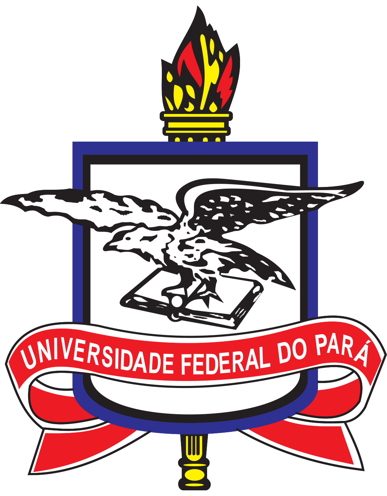
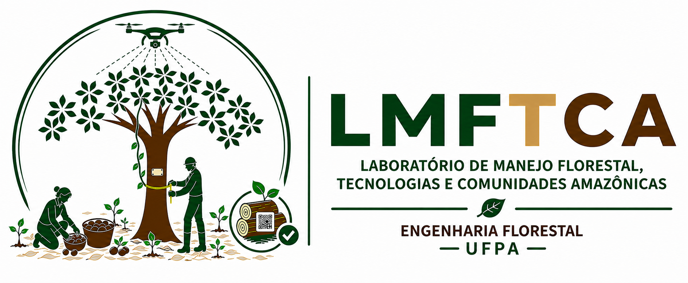

<!-- README.md is generated from README.Rmd.. Please edit that file.. -->

<!-- badges: start -->
<!-- badges: end -->

```{r, include = FALSE}
knitr::opts_chunk$set(
  collapse = TRUE,
  comment = "#>"
)

library(tidyverse)
repo <- "FL03034-Experimentacao-Florestal"
```

<!-- Emprestei a função list_github_files() da Curso-R. (https://github.com/curso-r). A ideia desse readme emprestei da Curso-R. Achei excelente!-->

```{r, include = FALSE}
list_github_files <- function(repo, dir = NULL, ext = NULL) {

  req <- httr::GET(
    paste0(
      "https://api.github.com/repos/DeivisonSouza/",
      repo,
      "/git/trees/master?recursive=1"
    )
  )

  httr::stop_for_status(req)

  arquivos <- unlist(
    lapply(httr::content(req)$tree, "[", "path"),
    use.names = FALSE
  )

  if (!is.null(dir)) {
    arquivos <- grep(dir, arquivos, value = TRUE, fixed = TRUE)
  }

  if (!is.null(ext)) {
    arquivos <- arquivos[grep(paste0(ext, "$"), arquivos)]
  }

  return(arquivos)
}
```

# Seja bem-vindo(a)! :deciduous_tree: :smiley: :grin:

:calendar: 30 (Setembro)

:calendar: 2, 6, 7, 9, 13, 14, 16, 20, 21, 23 e 27 (Outubro)


:alarm_clock: **13h30min - 18h50min**


<div>
  
  
<div>

<div itemscope itemtype="https://schema.org/Person"><a itemprop="sameAs" content="https://orcid.org/0000-0002-2975-0927" href="https://orcid.org/0000-0002-2975-0927" target="orcid.widget" rel="me noopener noreferrer" style="vertical-align:top;">https://orcid.org/0000-0002-2975-0927</a></div>

**Lattes**: [http://lattes.cnpq.br/9063094443073532](http://lattes.cnpq.br/9063094443073532)

**Researchgate**: [https://www.researchgate.net/profile/Deivison-Souza](https://www.researchgate.net/profile/Deivison-Souza)

**Siga o Instagram**: [@lmftca_ufpa](https://www.instagram.com/lmftca_ufpa/) (Laboratório de Manejo Florestal, Tecnologias e Comunidades Amazônicas)

**Site do LMFTCA**:
[https://www.lmftca.com.br/](https://www.lmftca.com.br/)
(Laboratório de Manejo Florestal, Tecnologias e Comunidades Amazônicas)

---------------------------------------------------

# Experimentação Florestal (FL03034-EF)

<div align="justify">
Este repositório guarda os slides em .html, códigos R, arquivos .Rmd, figuras, conjunto de dados (e outros) utilizados na disciplina de **Experimentação Florestal** (FL03034-EF) ministrada pelo **Prof. Deivison Venicio Souza** no curso de graduação em **Engenharia Florestal** da **Universidade Federal do Pará** (UFPA). O curso será ofertado na **modalidade presencial**, conforme dispõe a [Resolução  n. 5.453, de 14 de dezembro de 2021](https://sege.ufpa.br/boletim_interno/downloads/resolucoes/consepe/2021/5453%20Aprova%20a%20Resolu%C3%A7%C3%A3o%20sobre%20o%20retorno%20das%20Atividades%20Presenciais.pdf) e em consonância à [Resolução  n. 5.845, de 16 de dezembro de 2024](https://sege.ufpa.br/boletim_interno/downloads/resolucoes/consepe/2024/5845%20Aprova%20o%20Calend%C3%A1rio%20Acad%C3%AAmico%20da%20UFPA%20-%202025.pdf), que aprovou o Calendário Acadêmico da Universidade Federal do Pará para o ano de 2025.

**Acesse as normas gerais da UFPA:** 👇

- [Regimento Geral da UFPA](https://portal.ufpa.br/images/docs/regimento_geral.pdf)

- [Regulamento do Ensino de Graduação da Universidade Federal do Pará](http://www.proeg.ufpa.br/images/Artigos/Academico/Downloads/Regulamento_de_Graduacao.pdf)
</div>

# Programação da disciplina

A programação, o conteúdo e os slides da disciplina **Experimentação Florestal** (FL03034-EF) estão detalhados a seguir.

```{r, echo = FALSE}
knitr::kable(
  tibble::tibble(
    Slide = list_github_files(repo=repo, "Slides/", "html"),
    Link = paste0("https://deivisonsouza.github.io/", repo, "/", Slide)
  ) %>% 
    dplyr::filter(!stringr::str_detect(Slide,
                                       "_files/|_cache/|assets"))
)
```

# Facilitador :deciduous_tree:
<div>
  
<div>

<br>

<div align="justify">
Possui graduação em :deciduous_tree: **Engenharia Florestal** pela Universidade Federal Rural da Amazônia (2008), Mestrado em Ciências Florestais pela Universidade Federal Rural da Amazônia (2011) e Doutorado em Engenharia Florestal pela Universidade Federal do Paraná (2020). No período de 2009 a 2011 exerceu o cargo de Analista Ambiental da Secretaria Estadual de Meio Ambiente do Pará, na Gerência de Projetos Agrossilvipastoris (GEPAF), com atuação direta na etapa de análise técnica, para fins de licenciamento ambiental, de Planos de Manejo Florestal Sustentável (PMFS), Projetos de Desbastes e Reflorestamento e Supressão Florestal. Foi diretor na Curso de Graduação em Engenharia Florestal da UFPA/Altamira (2015 a 2016). É professor Associado 1 na Universidade Federal do Pará, Faculdade de Engenharia Florestal, Campus Universitário de Altamira, Pará. É coordenador do Laboratório de Manejo Florestal, Tecnológias e Comunidades Amazônicas (LMFTCA)/UFPA. É responsável por ministrar as disciplinas Estatística Básica, Dendrometria, Experimentação Florestal e Inventário Florestal, integrantes do desenho curricular do Curso de Graduação em Engenharia Florestal da UFPA. Também é docente permanente no Programa de Pós-Graduação em Biodiversidade e Conservação (PPGBC) da Universidade Federal do Pará (UFPA/Altamira) e Programa de Pós-Graduação em Ciência, Tecnologia e Inovação Florestal (PPGCTIF) da Universidade Federal do Oeste do Pará (UFOPA/Santarém), responsável pela disciplina Estatística Computacional com R. Atualmente, tem desenvolvido projetos de pesquisas, desenvolvimento e inovação florestal, com ênfase na aplicação de técnicas de inteligência artificial e visão computacional a serviço do Manejo Florestal Sustentável (MFS) e conservação da biodiversidade, em especial, direcionadas às espécies mais exploradas para fins madeireiros na Amazônica brasileira. Ademais, tem realizado pesquisas com uso de técnicas de aprendizado de máquina na modelagem preditiva de variáveis biométricas (volume, biomassa e carbono), com uso das linguagens de programação R e Python. Finalmente, tem contribuído em projetos sustentáveis em comunidades indígenas, com ênfase na execução de inventários e manejo florestal de produtos não madeireiros, estruturação e fortalecimento de cadeias produtivas da sociobiodiversidade. Finalmente, As aulas das diciplinas ministradas estão disponíveis para toda a comunidade científica/acadêmica no repositório GitHub (https://github.com/DeivisonSouza). No repositório, os interessados encontrarão os slides de aulas (.html), códigos R (.Rmd), tutoriais e bases de dados usados em cursos e disciplinas ministradas em nível de graduação e pós-graduação.
</div>
