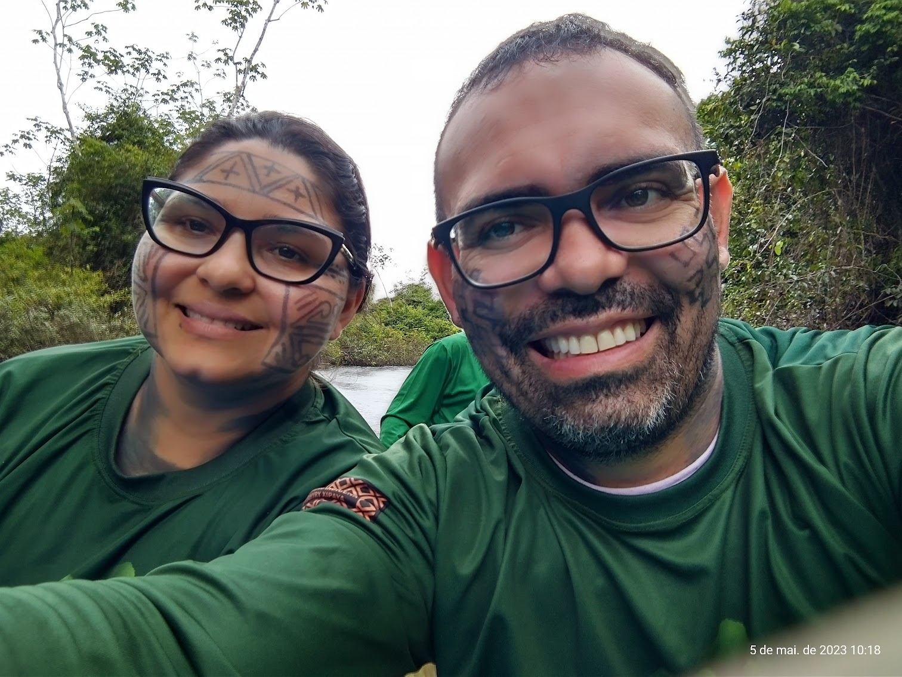

<!-- README.md is generated from README.Rmd.. Please edit that file.. -->
<!-- badges: start -->
<!-- badges: end -->
<!-- Emprestei a função list_github_files() da Curso-R. (https://github.com/curso-r). A ideia desse readme emprestei da Curso-R. Achei excelente!-->

# Seja bem vindo(a)! :deciduous_tree: :smiley: :grin:

:calendar: 24/02/2025 a 01/03/2025 (Semana 1)

:calendar: 10/03/2025 a 15/03/2025 (Semana 2)

:alarm_clock: **13h30min - 18h50min**

<a itemprop="sameAs" content="https://orcid.org/0000-0002-2975-0927" href="https://orcid.org/0000-0002-2975-0927" target="orcid.widget" rel="me noopener noreferrer" style="vertical-align:top;">https://orcid.org/0000-0002-2975-0927</a>

**Lattes**: <http://lattes.cnpq.br/9063094443073532>

**Researchgate**: <https://www.researchgate.net/profile/Deivison-Souza>

------------------------------------------------------------------------

# Experimentação Florestal (FL03034-EF)

Este repositório guarda os slides em .html, códigos R, arquivos .Rmd,
figuras, conjunto de dados (e outros) utilizados na disciplina de
**Experimentação Florestal** (FL03034-EF) ministrada pelo
**Prof. Deivison Venicio Souza** no curso de graduação em **Engenharia
Florestal** da **Universidade Federal do Pará** (UFPA). O curso será
ofertado na **modalidade presencial**, conforme dispõe a [Resolução
n. 5.453, de 14 de dezembro de
2021](https://sege.ufpa.br/boletim_interno/downloads/resolucoes/consepe/2021/5453%20Aprova%20a%20Resolu%C3%A7%C3%A3o%20sobre%20o%20retorno%20das%20Atividades%20Presenciais.pdf)
e em consonância à [Resolução n. 5.686, de 26 de outubro de
2023](https://sege.ufpa.br/boletim_interno/downloads/resolucoes/consepe/2023/5686%20Calend%C3%A1rio%20Acad%C3%AAmico%20da%20UFPA%20-%202024.pdf),
que aprovou o Calendário Acadêmico da Universidade Federal do Pará para
o ano de 2024.

**Acesse as normas gerais da UFPA:** 👇

- [Regimento Geral da
  UFPA](https://portal.ufpa.br/images/docs/regimento_geral.pdf)

- [Regulamento do Ensino de Graduação da Universidade Federal do
  Pará](http://www.proeg.ufpa.br/images/Artigos/Academico/Downloads/Regulamento_de_Graduacao.pdf)

# Programação da disciplina

A programação, o conteúdo e os slides da disciplina **Experimentação
Florestal** (FL03034-EF) estão detalhados a seguir.

| Slide | Link |
|:---|:---|
| Slides/Aula0-Cronograma.html | <https://deivisonsouza.github.io/FL03034-Experimentacao-Florestal/Slides/Aula0-Cronograma.html> |
| Slides/Aula1-Introducao-Experimentacao.html | <https://deivisonsouza.github.io/FL03034-Experimentacao-Florestal/Slides/Aula1-Introducao-Experimentacao.html> |
| Slides/Aula2-AED-Revisao.html | <https://deivisonsouza.github.io/FL03034-Experimentacao-Florestal/Slides/Aula2-AED-Revisao.html> |
| Slides/Aula3-DIC.html | <https://deivisonsouza.github.io/FL03034-Experimentacao-Florestal/Slides/Aula3-DIC.html> |
| Slides/Aula4-DBC.html | <https://deivisonsouza.github.io/FL03034-Experimentacao-Florestal/Slides/Aula4-DBC.html> |
| Slides/Aula5-Introducao-R.html | <https://deivisonsouza.github.io/FL03034-Experimentacao-Florestal/Slides/Aula5-Introducao-R.html> |
| Slides/Aula6-DQL.html | <https://deivisonsouza.github.io/FL03034-Experimentacao-Florestal/Slides/Aula6-DQL.html> |
| Slides/Aula7-Teste-Comparacao-Medias.html | <https://deivisonsouza.github.io/FL03034-Experimentacao-Florestal/Slides/Aula7-Teste-Comparacao-Medias.html> |
| Slides/Aula8-Analise-Experimentos-com-R.html | <https://deivisonsouza.github.io/FL03034-Experimentacao-Florestal/Slides/Aula8-Analise-Experimentos-com-R.html> |

# Facilitador :deciduous_tree:

 

Graduado em :deciduous_tree:**Engenharia Florestal** (ano 2008) e
Mestrado em Ciências Florestais (ano 2011) pela Universidade Federal
Rural da Amazônia (UFRA) e Doutorado em Engenharia Florestal pela
Universidade Federal do Paraná - UFPR (ano 2020). Também possui
Especialização em Data Science e Big Data pela UFPR (ano 2019).
Atualmente, é docente Associado I na Universidade Federal do Pará
(UFPA), atuando no curso de Graduação em Engenharia Florestal e no
Programa de Pós-Graduação em Biodiversidade e Conservação (PPGBC). É
responsável por ministrar as disciplinas de Estatística Básica,
Dendrometria, Experimentação Florestal e Inventário Florestal no Curso
de Graduação em Engenharia Florestal da UFPA, e a disciplina de
Estatística Computacional no PPGBC. Coordena projetos de pesquisas
orientados ao manejo e conservação da biodiversidade, com ênfase no
desenvolvimento de tecnologias baseadas em inteligência artificial e
visão computacional para o reconhecimento automático de espécies da
flora Amazônica. Também tem contribuído em projetos socioambientais
junto aos povos originários, em parceria com a Associação Indígena
Pyjahyry Xipaya - AIPHX, com ênfase na estruturação e fortalecimento de
cadeias de produtos da sociobiodiversidade e gestão territorial e
ambiental.

------------------------------------------------------------------------

**Este repositório está licenciado nos termos da licença MIT.**

