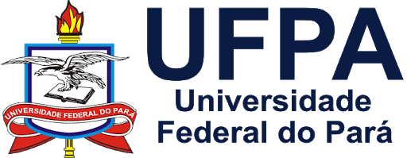

<!-- README.md is generated from README.Rmd. Please edit that file.. -->
<!-- badges: start -->
<!-- badges: end -->
<!-- Emprestei a função list_github_files() da Curso-R. (https://github.com/curso-r). A ideia desse readme emprestei da Curso-R. Achei excelente!-->

# Seja bem vindo(a)! :deciduous\_tree: :smiley: :grin:

:calendar: **Julho: 19 e 26**

:calendar: **Agosto: 2, 9, 16, 23 e 30**

:calendar: **Setembro: 6, 13, 20 e 27**

:calendar: **Outubro: 4**

:alarm\_clock: **13h30min - 18h50min**

<a itemprop="sameAs" content="https://orcid.org/0000-0002-2975-0927" href="https://orcid.org/0000-0002-2975-0927" target="orcid.widget" rel="me noopener noreferrer" style="vertical-align:top;">https://orcid.org/0000-0002-2975-0927</a>

**Lattes**: <http://lattes.cnpq.br/9063094443073532>

**Researchgate**: <https://www.researchgate.net/profile/Deivison-Souza>

**Este repositório está licenciado nos termos da licença MIT.**

# Experimentação Florestal (FL03034-EF)

Este repositório guarda os slides em .html, códigos R, arquivos .Rmd,
figuras, conjunto de dados (e outros) utilizados na disciplina de
**Experimentação Florestal** (FL03034-EF) ministrada pelo
**Prof. Deivison Venicio Souza** no curso de graduação em **Engenharia
Florestal** da **Universidade Federal do Pará** (UFPA). O curso será
ofertado na modalidade Ensino à Distância (EAD) no âmbito do **Ensino
Remoto Emergencial (ERE)** na [Universidade Federal do Pará
(UFPA)](https://portal.ufpa.br/index.php), conforme dispõe a [Resolução
n. 5.294, de 21 de agosto de
2020](http://sege.ufpa.br/boletim_interno/downloads/resolucoes/consepe/2020/Resolucao_5294_2020_CONSEPE.pdf)
e em consonância à [Resolução n. 5.332, de 22 de dezembro de
2020](http://sege.ufpa.br/boletim_interno/downloads/resolucoes/consepe/2020/5332%20Aprova%20o%20calendario%20academico%20para%20o%20ano%20letivo%20de%202021.pdf),
que aprovou o Calendário Acadêmico da Universidade Federal do Pará para
o ano de 2021. As aulas serão, predominantemente, síncronas e
desenvolvidas por meio da plataforma Google Meet.

# Programação da disciplina

A programação, o conteúdo e os slides da disciplina **Experimentação
Florestal** (FL03034-EF) estão detalhados a seguir.

| Slide                                       | Link                                                                                     |
|:--------------------------------------------|:-----------------------------------------------------------------------------------------|
| Slides/Aula0-Cronograma.html                | <https://deivisonsouza.github.io/FL03034-EF/Slides/Aula0-Cronograma.html>                |
| Slides/Aula1-Introducao-Experimentacao.html | <https://deivisonsouza.github.io/FL03034-EF/Slides/Aula1-Introducao-Experimentacao.html> |
| Slides/Aula2-AED-Revisao.html               | <https://deivisonsouza.github.io/FL03034-EF/Slides/Aula2-AED-Revisao.html>               |
| Slides/Aula3-IntroducaoR.html               | <https://deivisonsouza.github.io/FL03034-EF/Slides/Aula3-IntroducaoR.html>               |
| Slides/Aula3-Manipulacao-Dados-dplyr.html   | <https://deivisonsouza.github.io/FL03034-EF/Slides/Aula3-Manipulacao-Dados-dplyr.html>   |

# Facilitador :deciduous\_tree:

**Deivison Venicio Souza** possui graduação em :deciduous\_tree:
**Engenharia Florestal** :deciduous\_tree: pela Universidade Federal
Rural da Amazônia (2008), Mestrado em Ciências Florestais pela
Universidade Federal Rural da Amazônia (2011) e Doutorado em Engenharia
Florestal pela Universidade Federal do Paraná (2020). No período de 2009
a 2011 exerceu o cargo de Analista Ambiental da Secretaria Estadual de
Meio Ambiente do Pará, na Gerência de Projetos Agrossilvipastoris
(GEPAF), com atuação direta na etapa de análise técnica, para fins de
licenciamento ambiental, de Planos de Manejo Florestal Sustentável
(PMFS), Projetos de Desbastes e Reflorestamento e Supressão Florestal.
Desde 2011 é professor da Faculdade de Engenharia Florestal da
Universidade Federal do Pará, Campus Universitário de Altamira, Pará. É
responsável por ministrar as disciplinas Estatística Básica,
Dendrometria, Experimentação Florestal e Inventário Florestal,
integrantes do desenho curricular do Curso de Graduação em Engenharia
Florestal. Tem experiência na área de Gestão e Manejo dos Recursos
Florestais, com ênfase em Silvicultura de Florestas Naturais, Inventário
Florestal e Mensuração Florestal. Atualmente, seus interesses
científicos incluem o uso da inteligência artificial na conservação da
biodiversidade (com ênfase no uso de visão computacional) e emprego de
técnicas de aprendizado de máquina na modelagem preditiva de variáveis
biométricas, com uso das Linguagens R e Python.
