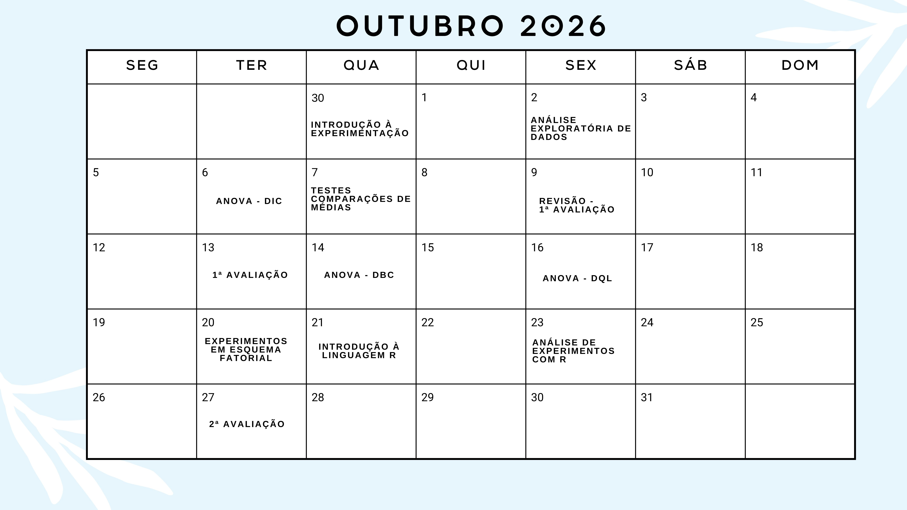
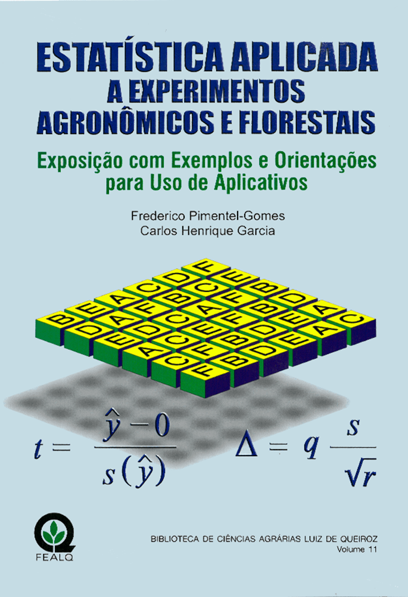
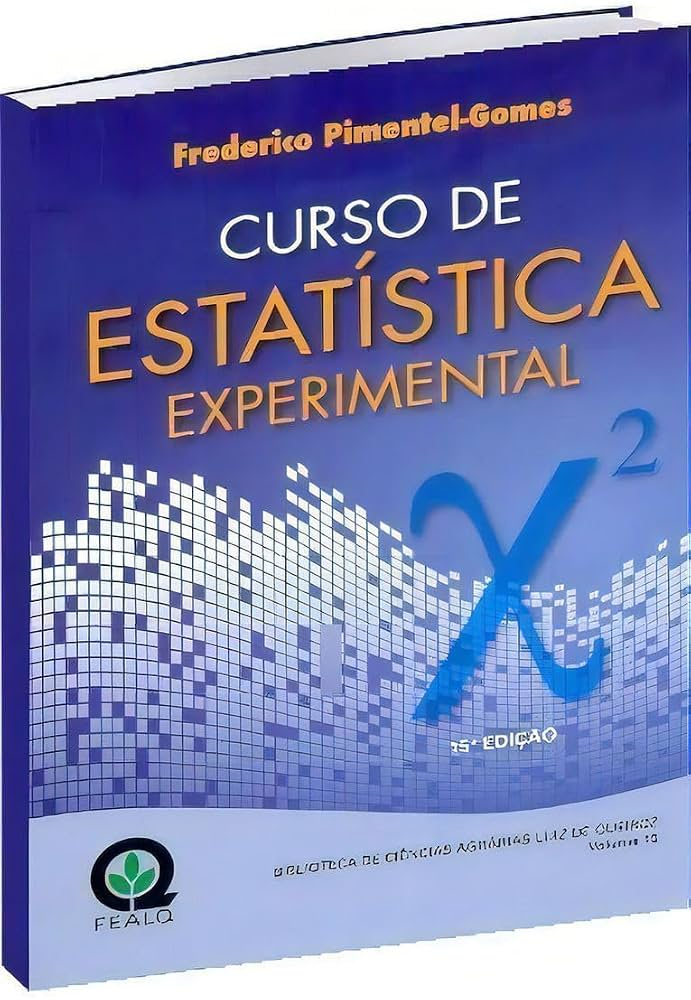

class: title-slide, center, middle
background-image: url(../assets/capa/capa.png)
background-position: center
background-size: cover
background-repeat: no-repeat

<div class="logo-lmftca"></div>
<div class="logo-ppgctif"></div>
<div class="logo-ppgbc"></div>

```{r setup, include=FALSE}
knitr::opts_chunk$set(
	error = FALSE,
	fig.align = "center",
	fig.showtext = TRUE,
	message = FALSE,
	warning = FALSE,
	cache = FALSE,
	collapse = TRUE,
	dpi = 600
)
```

```{r packages, include=FALSE}
# remotes::install_github("dill/emoGG")
# remotes::install_github("hadley/emo")
# remotes::install_github("emitanaka/anicon")
# remotes::install_github("mitchelloharawild/icons")
```

```{r xaringan-logo, echo=FALSE}
library(xaringanExtra)

use_scribble()
use_share_again()
use_progress_bar()

use_extra_styles(
  hover_code_line = TRUE,
  mute_unhighlighted_code = TRUE
)

use_editable(expires = 1)
use_clipboard()
```

<!-- title-slide -->
# Experimentação Florestal <br> (FL03034 - EF)

## ᨒ <br>   `r anicon::faa("pagelines", animate="horizontal", colour="green")` Programação da Disciplina `r anicon::faa("pagelines", animate="horizontal", colour="green")` <br> ᨒ

##### 〰〰〰〰〰〰🌱〰〰〰〰〰〰
##### ᨒ
##### .font120[**Prof. Dr. Deivison Venicio Souza**]
##### Universidade Federal do Pará (UFPA)
##### Faculdade de Engenharia Florestal
##### Laboratório de Manejo Florestal, Tecnologias e Comunidades Amazônicas
##### E-mail: deivisonvs@ufpa.br
<br>
##### 1ª versão: 10/agosto/2021 <br> (Atualizado em: `r format(Sys.Date(),"%d/%B/%Y")`) <br> Altamira, Pará

---
layout: true
class: with-logo logo-lmftca-fixed
<div class="my-header"></div>
<div class="my-footer"><span>Prof. Dr. Deivison Venicio Souza (E-mail: deivisonvs@ufpa.br)&emsp;&emsp;&emsp;&emsp;&emsp; <div3>Estatística Computacional com R</div3>/ <div2>Programação da disciplina</div2> </div>

---

## 👋 Olá, sejam bem-vindos!
<br>
### **Sobre o facilitador**

.pull-left[
.font60[
1. .green[Graduação (Titulação: ano 2008)]
    - Universidade Federal Rural da Amazônia (UFRA); e
    - Título: Bacharel em Engenharia Florestal.
    
2. .green[Mestrado (Titulação: ano 2011)]
    - Universidade Federal Rural da Amazônia (UFRA);
    - Programa de Pós-graduação em Ciências Florestais (PPGCF); e
    - Área de Concentração: Manejo de Ecossistemas Florestais.

3. .green[Especialização (Titulação: ano 2019)]
    - Universidade Federal do Paraná (UFPR);
    - Área: Big Data e Data Science
    
4. .green[Doutorado (Titulação: ano 2020)]
    - Universidade Federal do Paraná (UFPR);
    - Programa de Pós-graduação em Engenharia Florestal (PPGEF); e
    - Área de Concentração: Manejo Florestal.
]
]

.pull-right[
```{r echo = FALSE, out.width='70%', fig.align='center', fig.cap='', dpi=600}
knitr::include_graphics("fig/foto.jpg")
```
]

---

## 👋 Olá, sejam bem-vindos!

### **Interesses atuais**

.pull-left[
.font60[
1. .green[Linguagens de programação]
    - R
    - Python

2. .green[Modelagem preditiva aplicada às Ciências Florestais]
    - Métodos estatísticos e aprendizado de máquina

3. .green[Visão computacional e Inteligência Artificial]
    - Reconhecimento de espécies por imagens aéreas e terrestres
    - Aprendizado profundo e transferência de aprendizado
    - Estimativa de biomassa e carbono
    - Monitoramento da saúde da arborização urbana

4. .green[Sistemas de visualização e análise de dados]
    - Painéis interativos
    - Aplicações web para reconhecimento de espécies
    - Aplicativos móveis
]
]

.pull-right[
### **Websites e contatos**

.font80[
**GitHub:**  
[github.com/DeivisonSouza](https://github.com/DeivisonSouza)

**ORCID:**  
[0000-0002-2975-0927](https://orcid.org/0000-0002-2975-0927)

**E-mail:**  
[deivisonvs@ufpa.br](mailto:deivisonvs@ufpa.br)
]
]

---

## 👋 Olá, sejam bem-vindos!
<br>

### 🕵 **Projetos de Pesquisa/Extensão Finalizados** (com fomento)

.font90[
<br>
✔️ 1) Sistema de Visão Computacional para Reconhecer Espécies no Manejo Florestal Madeireiro na Amazônia Brasileira. (**Financiador**: Centro de Indústrias Produtoras e Exportadoras de Madeira do Estado de Mato Grosso - CIPEM) - ([https://cipem.org.br/](https://cipem.org.br/))
<br><br>

✔️ 2) Projeto Ipa’wã (Copaíba): Etnomapeamento e inventário de copaibais nativos na TI Xipaya (Aldeias Tukamã, Tukayá e Kaarimã). (**Financiador**: Fundo Brasileiro para a Biodiversidade - FUNBIO) - ([https://www.funbio.org.br/](https://www.funbio.org.br/)) (Parceria entre Associação Indígena Pyjahyry Xipaia – AIPHX e UFPA)
]

---

## 👋 Olá, sejam bem-vindos!
<br>

### 🕵 **Projetos de Pesquisa/Extensão em Andamento** (com/sem fomento)

.font90[
<br>
✔️ 1) DeepWood: Reconhecimento de Espécies Florestais Baseado em Imagens de Madeira e Aprendizado Profundo (Portaria/UFPA N. 130/2024). (**Sem Financiador**) - (**Parceria**: Laboratório de Anatomia e Qualidade da Madeira LANAQM/UFPR e LMFTCA/UFPA)
<br><br>

✔️ 2) Apoio ao Fortalecimento da Gestão Territorial e Ambiental da Terra Indígena Xipaya (TI Xipaya) - (Portaria/UFPA N. 95/2025). (**Financiador**: Indigenous Peoples Assistance Facility - IPAF) (**Parceria**: Associação Indígena Pyjahyry Xipaia e LMFTCA/UFPA) - **Proponente**: AIPHX
]

---

## 👋 Olá, sejam bem-vindos!
<br>

### 💻 **Siga nossas redes sociais e de parceiros...**
<br>

👉 **Laboratório de Manejo Florestal, Tecnologias e Comunidades Amazônicas - LMFTCA**

✔️ *Instagram LMFTCA*: [@lmftca_ufpa](https://www.instagram.com/lmftca_ufpa/)

✔️ *Site do LMFTCA*:
[https://www.lmftca.com.br/](https://www.lmftca.com.br/)
<br><br>

👉 **Instituto Juma**

✔️ *Instagram IJ*: [@instituto.juma](https://www.instagram.com/instituto.juma/)

✔️ *Site do IJ*:
[https://institutojuma.org/](https://institutojuma.org/)


<!-- Slide 3 -->
---

## 📚 Ementa da disciplina (FL03034 - EF)

.shadow4[
.font80[
<br>
1 - Introdução à experimentação florestal; 

2 - Análise exploratória de dados;

3 - Delineamento inteiramente casualizado - DIC; 

4 - Delineamento em blocos ao acaso - DBC;

5 - Delineamento em quadrado latino - DQL;

6 - Testes de comparação de médias; 

7 - Experimentos em esquema fatorial;

8 - Análise de correlação e regressão linear; e

9 - Análise de experimentos com linguagem R.

]
]

<!-- Slide 7 -->
---

## 🗓 Cronograma .black[.font80[(**Horário: 13h30min - 18h50min**)]]
<br>

```{r, echo = FALSE, out.width='75%', fig.align='center', fig.cap='', dpi=600}

```

<!-- Slide 7 -->
---

## 👨🏻‍🏫 Estratégias e Ferramentas de Ensino
<br>

.font70[

👉 **Aulas expositivas** (*Sala de Aula*)

Aulas teóricas e práticas presenciais, realização de atividades complementares e avaliações de aprendizado.

<br>

👉 **Aulas práticas (sala e/ou campo)**

Estudos de casos e análise de dados experimentais de forma manual, usando excel e linguagem R.

<br>

👉 **Turma virtual** (*SIGAA*)

Comunicação, envio de atividades complementares e de conteúdos digitas.

<br>

👉 **Repositório GitHub**

Repositório com os slides em .html, arquivos .R e .Rmd, figuras, conjunto de dados (e outros). O repositório pode ser acessado em: [FL03034-Experimentacao-Florestal](https://github.com/DeivisonSouza/FL03034-Experimentacao-Florestal)
]

<!-- Slide 8 -->
---

## ✍ Estratégias de avaliação da aprendizagem

.font80[

<br>

👉 **Atividades práticas**

Exercícios com dados reais (quando possível) para aprendizado da matemática e estatísticas inerentes aos conteúdos abordados.

Introdução ao uso da Linguagem de Programação R e bibliotecas para análise de experimentos.

<br>

👉 **Avaliações teóricas**

Avaliações teóricas presenciais.

<br>

👉 **Participação e Engajamento** 

O nível de participação e interação nas aulas presenciais poderá ser critério para definir uma pontuação extra nas avaliações teóricas.
]

<!-- Slide 9 -->
---

## 📝 Média Final
<br>

\begin{equation*}
\large
MF = \frac{(NA*2)+NPT}{3}
\end{equation*}

.font80[
**MF** = Média Final

**NA** = Nota das Atividade (Soma das atividades será 10 pts.)

**NP** = Nota das Provas Teóricas (Soma das provas será 10 pts.)

<br>

| Conceito     | Intervalo      |
|--------------|----------------|
| Excelente    | 9,0 ≤ MF ≤ 10    |
| Bom          | 7,0 ≤ MF ≤ 8,9   |
| Regular      | 5,0 ≤ MF ≤ 6,9 |
| Insuficiente | 0 ≤ MF ≤ 4,9   |
]


<!-- Slide 10 -->
---

## 📑 Plano de Ensino
<br><br>

O plano de ensino da disciplina pode ser acessado em:

[Plano de Ensino (FL03034-EF)](https://github.com/DeivisonSouza/FL03034-EF/blob/master/Slides/PE/EF-PE.pdf)


<!-- Slide 11 -->
---

## 🙌 Dos critérios de aprovação `r anicon::faa("exclamation-triangle", colour="red")`
<br>

.font80[
Conforme o **Regimento Geral da UFPA**, será considerado reprovado o discente que:

- Obtiver o conceito Insuficiente (INS), isto é, nota inferior a 5 (cinco); (.green[**Aplicável**])
- Sem Avaliação (SA); ou (.green[**Aplicável**])
- Não obtiver a frequência mínima de 75% na disciplina, isto é, Sem Frequência (SF). (.green[**Aplicável**])
]

---

## 📋 Controle de Frequência – Combinado da Turma
<br>

.font80[
🧑‍🏫 Para melhor organização e acompanhamento da presença, adotaremos o seguinte esquema de chamada de frequências:
]

--
<br>
.font80[
⏰ **1ª Chamada – Início da Aula**

🟡 Número de faltas atribuídas: **1** (Se chegar após a chamada)

📌 Objetivo: verificar presença inicial dos discentes (**Importante chegar no horário!**)
]
<br>

--

.font80[
☕ **2ª Chamada – Após o Intervalo**

🟡 Número de faltas atribuídas: **1** (Se chegar após a chamada)

📌 Objetivo: Não atrasar/atrapalhar o reinício da aula
]
<br>

--

.font80[
🏁 **3ª Chamada – Final da Aula**

🟡 Número de faltas atribuídas: **1** (Se não estiver presente no final da aula)

📌 Objetivo: confirmar participação até o final

<br>
 
🙌 **Organização, compromisso e participação fazem a diferença!**
]

<!-- Slide 12 -->
---

## 📜 Normativas
<br>

.font80[
- [Regimento geral da UFPA de 29/12/2006](chrome-extension://efaidnbmnnnibpcajpcglclefindmkaj/https://www.ufpa.br/images/docs/regimento_geral.pdf)

Disciplina os aspectos gerais e comuns da estruturação e do funcionamento dos órgãos e serviços da Universidade Federal do Pará (UFPA), cujo Estatuto regulamenta. 

- [Resolução n. 4.399, de 14 de maio de 2013](chrome-extension://efaidnbmnnnibpcajpcglclefindmkaj/http://www.proeg.ufpa.br/images/Artigos/Academico/Downloads/Regulamento_de_Graduacao.pdf)

Aprova o Regulamento do Ensino de Graduação da Universidade Federal do Pará.


- [Resolução n. 5.986, de 15 de outubro de 2025](chrome-extension://efaidnbmnnnibpcajpcglclefindmkaj/https://sege.ufpa.br/boletim_interno/downloads/resolucoes/consepe/2025/5986%20Aprova%20o%20Calend%C3%A1rio%20Acad%C3%AAmico%20da%20UFPA%20-%202026.pdf)

Aprova o Calendário Acadêmico da Universidade Federal do Pará (UFPA) para o ano de 2026.
]

---

## 📖 Bibliografia básica
<br>
.pull-left-4[
PIMENTEL-GOMES, F.; GARCIA, C. H. **Estatística aplicada a experimentos agronômicos e florestais: exposição com exemplos e orientações para uso de aplicativos**. Piracicaba: FEALQ, 2002. 309p.
<br><br>

**Link**: [www.editoraufv.com.br](https://www.editoraufv.com.br/produto/estatistica-aplicada-a-experimentos-agronomicos-e-florestais/1109193/)
]

.pull-right-4[
```{r, echo=FALSE, out.width='65%', fig.align='center', fig.cap='', dpi=600}

```
]

---

## 📖 Bibliografia básica
<br>
.pull-left-4[
PIMENTEL-GOMES, F. **Curso de estatística experimental**. Piracicaba: FEALQ, 2009. 451p.
<br><br>

**Link**: [www.editoraufv.com.br](https://www.editoraufv.com.br/produto/curso-de-estatistica-experimental/1110850)
]

.pull-right-4[
```{r, echo=FALSE, out.width='65%', fig.align='center', fig.cap='', dpi=600}

```
]

<!-- Slide 14 -->
---
## 📖 Bibliografia complementar

<br><br>
BANZATTO, D.A.; KRONKA, S. do N. **Experimentação agrícola**. 2 ed. Jaboticabal, SP, 1992. 247p.
<br><br>
CONAGIN, A.; NAGAI, V.; AMBRÓSIO, L.A. **Princípios de técnica experimental e análise estatística de experimentos**. Campinas: Instituto Agronômico, 2006.
<br><br>
DIAS, L. A. dos S.; BARROS, W. S. **Biometria experimental**. Viçosa, MG: Suprema, 2009. 408 p.
<br><br>
NOGUEIRA, M. C. S. **Experimentação agronômica I: conceitos, planejamento e análise estatística**. Piracicaba, 479 p. 2007.
<br><br>
ZIMMERMANN, F. J. P. **Estatística aplicada à pesquisa agrícola**. Santo Antônio de Goiás: Embrapa Arroz e Feijão, 2004. 402p.

---
layout: false
name: etim
class: inverse, middle, center
background-image: url(../assets/capa/sec.png)
background-size: cover

## .font200[Obrigado!]

```{r, echo=FALSE, out.width='20%', fig.align='center', fig.cap='', dpi=600}
knitr::include_graphics('../assets/logos/LMFTCA.png')
```

👨🏻‍👩🏻‍👦🏻‍👦🏻 [@lmftca_ufpa](https://www.instagram.com/lmftca_ufpa/)

🌎 [https://www.lmftca.com.br/](https://www.lmftca.com.br/)

