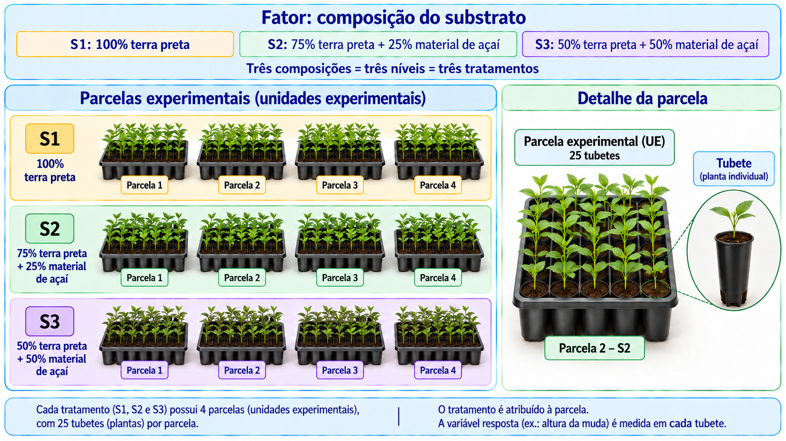
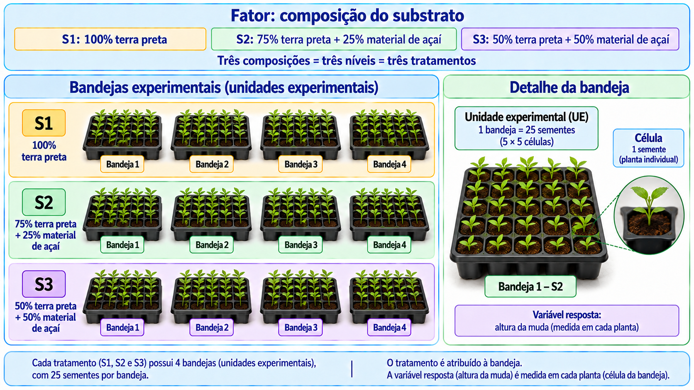
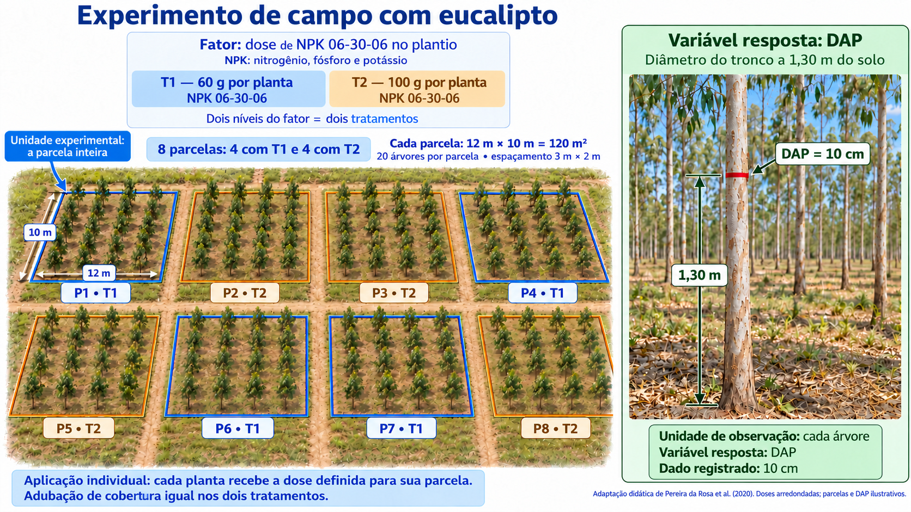
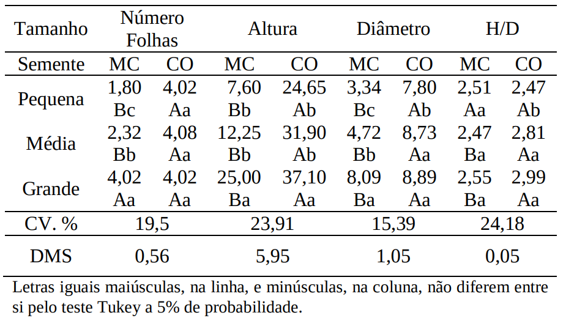
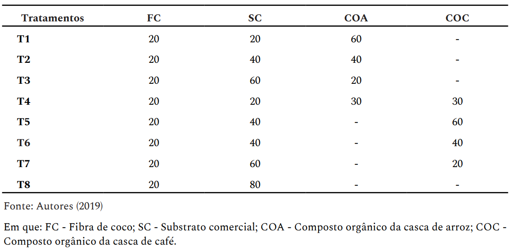
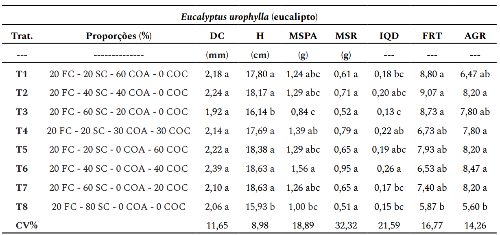
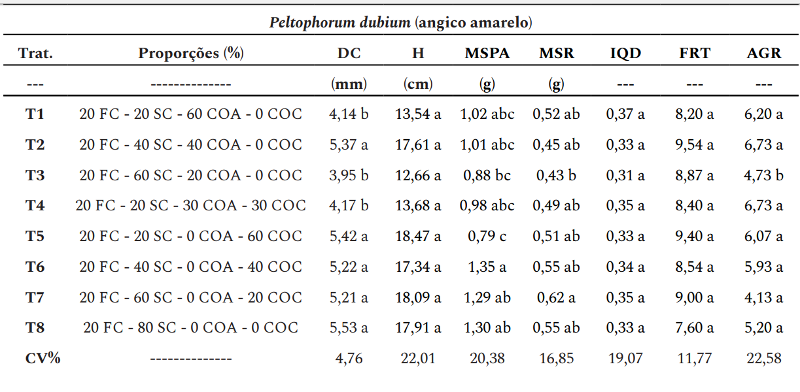
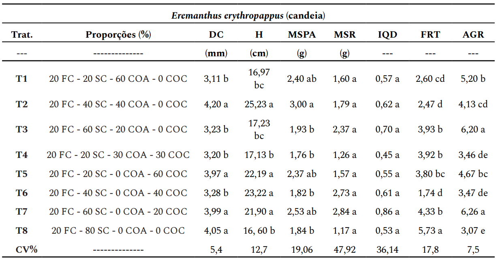
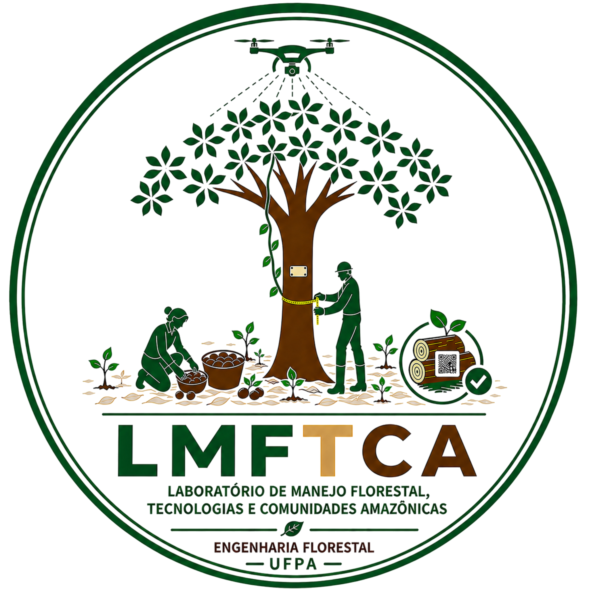

class: title-slide, center, middle
background-image: url(../assets/capa/capa.png)
background-position: center
background-size: cover
background-repeat: no-repeat

<div class="logo-lmftca"></div>
<div class="logo-ppgctif"></div>
<div class="logo-ppgbc"></div>

```{r setup, include=FALSE}
knitr::opts_chunk$set(
	error = FALSE,
	fig.align = "center",
	fig.showtext = TRUE,
	message = FALSE,
	warning = FALSE,
	cache = TRUE,
	collapse = TRUE,
	dpi = 600
)
```

```{r packages, include=FALSE}
# remotes::install_github("dill/emoGG")
# remotes::install_github("hadley/emo")
# remotes::install_github("emitanaka/anicon")
# remotes::install_github("mitchelloharawild/icons")
```

```{r xaringan-logo, echo=FALSE}
library(xaringanExtra)

use_scribble()
use_share_again()
use_progress_bar()

use_extra_styles(
  hover_code_line = TRUE,
  mute_unhighlighted_code = TRUE
)

use_editable(expires = 1)
use_clipboard()
```

<!-- title-slide -->
# Experimentação Florestal <br> (FL03034 - EF)

## ᨒ <br> `r anicon::faa("pagelines", animate="horizontal", colour="#244A6B")` Introdução à Experimentação `r anicon::faa("pagelines", animate="horizontal", colour="#244A6B")`
###### (Conceitos básicos e variação experimental)

##### 〰〰〰〰〰〰🌱〰〰〰〰〰〰
##### ᨒ
##### .font120[**Prof. Dr. Deivison Venicio Souza**]
##### Universidade Federal do Pará (UFPA)
##### Faculdade de Engenharia Florestal
##### Laboratório de Manejo Florestal, Tecnologias e Comunidades Amazônicas
##### E-mail: deivisonvs@ufpa.br
<br>
##### 1ª versão: 11/agosto/2021 <br> (Atualizado em: `r format(Sys.Date(),"%d/%B/%Y")`) <br> Altamira, Pará

---
layout: true
<div class="my-header"></div>
<div class="my-footer">
<span>
Prof. Dr. Deivison Venicio Souza (deivisonvs@ufpa.br)
&emsp;&emsp;
Experimentação Florestal (FL03034 - EF)
&bull;
Introdução à Experimentação
</span>
</div>

---

## 📚 Ementa da disciplina (FL03034 - EF)
<br>

.shadow4[
.font90[

**1 - Introdução à experimentação;**

2 - Análise exploratória de dados;

3 - Delineamento inteiramente casualizado (DIC);

4 - Delineamento em blocos ao acaso (DBC);

5 - Delineamento em quadrado latino (DQL);

6 - Testes de comparação de médias;

7 - Experimentos em esquema fatorial;

8 - Análise de correlação e regressão linear; e

9 - Análise de experimentos com linguagem R.

]
]

---

## 🎯 Objetivos
<br>

.font80[
Ao final desta aula, você deverá ser capaz de:

- **Compreender** o papel da experimentação na Engenharia Florestal;
- **Identificar e relacionar** fator, níveis, tratamentos, unidades experimentais,
variáveis resposta e dados experimentais;
- **Distinguir** a unidade experimental das plantas ou subunidades
observadas dentro dela;
- **Reconhecer** a variação entre plantas, parcelas e tratamentos; e
- **Interpretar** experimentos simples conduzidos em viveiro,
campo e laboratório.
]

---

## 📙 Conteúdo

<br>

.pull-left[
.font90[
### Parte 1 — Situações experimentais

1. Experimento em **viveiro**;

2. Experimento em **campo**;

3. Experimento em **laboratório**; e

4. Elementos comuns aos experimentos.
]
]

.pull-right[
.font90[
### Parte 2 — Conceitos básicos

1. Experimentação e experimento;

2. Tratamentos;

3. Unidade experimental;

4. Variável resposta e dado experimental;

5. Fator e níveis; e

6. Relação entre fator, níveis e tratamentos.
]
]

---

## 📙 Conteúdo

<br>

.font90[
### Parte 3 — Variação experimental

1. Conceito de variação experimental;

2. Variação **dentro da parcela**;

3. Variação **entre parcelas do mesmo tratamento**;

4. Variação **entre tratamentos**; e

5. Importância da variação experimental na interpretação
dos resultados.
]

<!-- Parte 1 -->
---
layout: false
name: parte1
class: top, right
background-image: url(../assets/capa/sec.png)
background-size: cover

<br>

.right[
.font100[
<span style="color: #244A6B;">**Experimentação Florestal**</span>
]
]

<br><br>

.right[
.font150[
<span style="color: #244A6B;">**Parte 1**</span>
]
]

<br><br>

.right[
.font180[
<span style="color: #0B1F3A;">**Como a experimentação ajuda a tomar decisões<br>na Engenharia Florestal?**</span>
]
]

---
layout: true
<div class="my-header"></div>
<div class="my-footer">
<span>
Prof. Dr. Deivison Venicio Souza (deivisonvs@ufpa.br)
&emsp;&emsp;
Experimentação Florestal (FL03034 - EF)
&bull;
Introdução à Experimentação
</span>
</div>

---
name: substrato-viveiro

## 🌱 Situação 1: qual substrato utilizar no viveiro?

<br>

.font80[
👉 **Imagine:** um viveiro adquire sementes de **paricá**
com informações sobre a germinação do lote e deseja produzir
mudas para **plantios comerciais destinados à produção
de madeira para lâminas e compensados**.
]

--

.font80[
### Uma decisão...

O viveiro dispõe de **três opções de substrato**.
Antes de ampliar a produção, precisa decidir **qual delas utilizar**.

Para isso, deseja comparar:

- **Emergência das plântulas**;
- **Sobrevivência e crescimento das mudas**; e
- **Custo de produção por muda apta ao plantio**.
]

--

.font80[
.alert[
❓ **Como planejar um experimento que permita avaliar o efeito dos substratos sobre a produção de mudas?**
]
]

---
name: planejamento-inicial

## 🔎 Como comparar os três substratos?

.font80[
.alert[
💡 **Realizando um experimento!**

❓ Mas, como planejá-lo para comparar os três substratos
e obter **evidências para orientar a escolha**?
]
]

--

.font80[
### Condições do experimento

- Há **1.200 sementes de paricá, provenientes de um mesmo lote**;
- Será semeada **uma semente por recipiente**, diretamente
no substrato;
- A **emergência**, a **sobrevivência** e o **crescimento**
serão acompanhados por **90 dias após a semeadura**; e
- Os **custos de produção** também serão registrados.
]

--

.font80[
### Como você faria?

- Como dividiria as **1.200 sementes** entre os três substratos?
- Como distribuiria os recipientes no viveiro?
- Como manteria padronizados outros fatores,
como irrigação e luminosidade?
]

---
name: substratos

## 🪴 Quais substratos serão comparados?

<br>

.pull-left[
.font80[
### Três composições hipotéticas
<br>

| Substrato | Terra preta | Material de açaí¹ |
|:--|:--:|:--:|
| **S1** | 100% | 0% |
| **S2** | 75% | 25% |
| **S3** | 50% | 50% |
]

.font70[
¹Caroço de açaí triturado e compostado.
]
]

.pull-right[
.font80[
### O que muda entre os substratos?
<br>

A **composição da mistura**, especialmente a
**proporção de material de açaí**.

Os materiais utilizados devem ter
**origem e preparo padronizados**.

.alert[
💡 **S1, S2 e S3 representam três composições
distintas de substrato.**
]
]
]

---
name: problema-planejamento

## 🌱 Como organizar essa comparação?

.font80[
### Portanto, você precisa montar um experimento...

O viveiro possui **1.200 sementes** e deseja comparar
os substratos **S1, S2 e S3**.
]

--

.font80[
### Como você faria?

- Como dividiria as **1.200 sementes** entre os três substratos?
- Plantaria todas as sementes de cada substrato
**juntas ou em grupos separados**?
- Como distribuiria os recipientes no viveiro?
- Quais características das mudas registraria?
- Como evitaria que diferenças, por exemplo, de **luz, água ou posição**
influenciem na comparação?
]

--

.alert[
.font80[
💡 **Questão central:** como planejar um experimento para distinguir
o **efeito dos substratos** das demais **fontes de variação**?
]
]

---
name: elementos-experimento

## 🧩 O que precisamos definir no experimento?

<br>

.font85[
Para organizar adequadamente a comparação entre os substratos,
precisamos identificar alguns **elementos fundamentais** do experimento.
]

--

.font80[
- O que será comparado?
- Onde os tratamentos serão aplicados?
- O que será observado ou medido?
- Quais fatores podem influenciar os resultados?
]

--

<br>

.alert[
.font80[
💡 Esses elementos ajudam a transformar uma **pergunta de pesquisa**
em um **experimento planejado**.
]
]

---
name: experimento-campo

## 🌳 Situação 2: qual espaçamento utilizar no plantio?

<br>

.font80[
👉 **Imagine:** uma empresa florestal deseja implantar um novo
plantio de **eucalipto**, mas precisa definir qual espaçamento
entre as árvores proporciona melhor desempenho inicial.
]

--

.pull-left[
.font80[
### Três opções de espaçamento

- **E1:** 3,0 × 1,5 m;
- **E2:** 3,0 × 2,0 m;
- **E3:** 3,0 × 2,5 m.

<br>

A empresa deseja comparar o desempenho das árvores
durante os primeiros anos após o plantio.
]
]

.pull-right[
.font80[
### O que poderia ser avaliado?

- **Sobrevivência** das árvores;
- **Crescimento** (altura e diâmetro à 1,30 m do solo);
- **Volume de madeira** por área.
]
]

--

.alert[
.font80[
❓ **Questão central**: Como planejar esse experimento de campo para avaliar
o efeito dos diferentes espaçamentos sobre o crescimento
do povoamento?
]
]

---
name: experimento-laboratorio

## 🔬 Situação 3: qual temperatura favorece a germinação?

<br>

.font80[
👉 **Imagine:** um pesquisador deseja avaliar como diferentes
**temperaturas** influenciam a germinação de sementes de uma
espécie florestal em condições controladas de laboratório.
]

--

.pull-left[
.font80[
### Três temperaturas

- **T1:** 20 °C;
- **T2:** 25 °C;
- **T3:** 30 °C.

<br>

As sementes são mantidas em condições padronizadas
de umidade, substrato e luminosidade.
]
]

.pull-right[
.font80[
### O que poderia ser avaliado?

- Porcentagem de germinação;
- Tempo médio de germinação;
- Velocidade de germinação; e
- Uniformidade da germinação.
]
]

--

.alert[
.font80[
❓ **Como planejar esse experimento de laboratório para avaliar
o efeito da temperatura sobre a germinação das sementes?**
]
]

---
name: comparacao-experimentos

## 🧩 O que esses experimentos têm em comum?

<br>

<div style="display: flex; gap: 25px;">

<div style="flex: 1;">

--

.font75[
### 🌱 Viveiro

👉 **O que deseja-se comparar?**  
Substratos

👉 **Onde?**  
Recipientes com mudas

👉 **O que é observado?**  
Emergência, sobrevivência e crescimento
]

</div>

<div style="flex: 1;">

.font75[
### 🌳 Campo

👉 **O que deseja-se comparar?**  
Espaçamentos

👉 **Onde?**  
Parcelas com árvores

👉 **O que é observado?**  
Sobrevivência, crescimento e volume
]

</div>

<div style="flex: 1;">

.font75[
### 🔬 Laboratório

👉 **O que deseja-se comparar?**  
Temperaturas

👉 **Onde?**  
câmaras de germinação com temperatura controlada

👉 **O que é observado?**  
Germinação das sementes
]

</div>

</div>

--

<br>

.alert[
.font80[
💡 Apesar de realizados em **ambientes diferentes**, os três experimentos
seguem uma lógica semelhante: **algo é comparado**, determinadas
condições são estabelecidas e seus **resultados são observados e medidos**.
]
]

<!-- Parte 2 -->
---
layout: false
name: parte2
class: top, right
background-image: url(../assets/capa/sec.png)
background-size: cover

<br>

.right[
.font100[
<span style="color: #244A6B;">**Experimentação Florestal**</span>
]
]

<br><br>

.right[
.font150[
<span style="color: #244A6B;">**Parte 2**</span>
]
]

<br><br>

.right[
.font180[
<span style="color: #0B1F3A;">**Conceitos básicos<br>da experimentação**</span>
]
]

---
layout: true
<div class="my-header"></div>
<div class="my-footer">
<span>
Prof. Dr. Deivison Venicio Souza (deivisonvs@ufpa.br)
&emsp;&emsp;
Experimentação Florestal (FL03034 - EF)
&bull;
Introdução à Experimentação
</span>
</div>

---
name: Exp

## 🔬 Experimentação e experimento

<div style="position:absolute; left:60px; top:140px; width:40%;">

```{r echo=FALSE, out.width='70%', fig.align='center', fig.cap='', dpi=600}
knitr::include_graphics("https://media.giphy.com/media/fUZHXuE94BN2wtSbUS/giphy-downsized-large.gif")
```

<div style="font-size:50%; text-align:center;">
Fonte: <a href="https://media.giphy.com">Giphy</a>, 19 jul. 2021.
</div>

</div>

<div style="margin-left:48%;">

.font80[
### Experimentação

É a área da estatística dedicada ao **planejamento**,
à **condução**, à **análise** e à **interpretação**
de experimentos.
]

</div>

--

<div style="margin-left:48%;">

.font80[
### Experimento (ou ensaio)

É uma experiência planejada no qual uma ou mais condições
são deliberadamente modificadas, enquanto seus
efeitos sobre alguma variável resposta são observados ou medidos.
]

</div>

--

<div style="margin-left:48%;">

.font80[
.alert[
💡 Nos exemplos anteriores, modificamos deliberadamente:
- 🌱 A composição do substrato;
- 🌳 O espaçamento de plantio; e
- 🔬 A temperatura de germinação.
]
]

</div>

---
name: Trat

## 🪴 Tratamento: o que será comparado?

<br>

.font80[
.alert[
### Tratamento

É cada **condição que se deseja avaliar ou comparar**
em um experimento.

Pode representar um material, um método, uma dose,
uma condição ambiental ou uma combinação de condições.
]
]

--

.font80[
### Nos exemplos anteriores...

- 🌱 **Viveiro:** os substratos **S1, S2 e S3** são os tratamentos;
- 🌳 **Campo:** os espaçamentos **E1, E2 e E3** são os tratamentos; e
- 🔬 **Laboratório:** as temperaturas de **20 °C, 25 °C e 30 °C**
são os tratamentos.
]

--

<br>

.alert[
.font80[
💡 Portanto, o tratamento representa **aquilo que é deliberadamente
modificado ou comparado** no experimento.
]
]

---
name: exemplos-tratamentos

## 🔍 Exemplos de tratamentos em diferentes contextos

<br>

.font60[
| Contexto | O que pode ser comparado? | Exemplos de tratamentos |
|:--|:--|:--|
| 🌱 **Viveiro** | Substratos | S1; S2; S3 |
| 🌱 **Viveiro** | Sombreamento | 0%; 30%; 50% |
| 🌱 **Viveiro** | Recipientes | Tubetes de 55; 110; 180 cm³ |
| 🌱 **Viveiro** | Irrigação | 1; 2; 3 irrigações dia⁻¹ |
| 🌳 **Campo** | Espaçamentos | 3,0 × 1,5; 3,0 × 2,0; 3,0 × 2,5 m |
| 🌳 **Campo** | Adubação | 0; 50; 100 kg ha⁻¹ |
| 🌳 **Campo** | Preparo do solo | Coveamento; escarificação; subsolagem |
| 🌳 **Campo** | Controle de plantas daninhas | Manual; mecânico; químico |
| 🔬 **Laboratório** | Temperatura | 20; 25; 30 °C |
| 🔬 **Laboratório** | Substrato de germinação | Papel; areia; vermiculita |
| 🔬 **Laboratório** | Tratamento pré-germinativo | Controle; escarificação; imersão em água |
| 🔬 **Laboratório** | Temperatura de secagem | 40 °C; 60 °C; 80 °C |
]

--

.alert[
.font70[
💡 Os **tratamentos** são as diferentes condições
estabelecidas para serem comparadas dentro de cada experimento.
]
]

---
name: UE

## 🌱 Unidade experimental (ou parcela)

<br>

.font80[
.alert[
### Unidade Experimental

É a **menor unidade do experimento à qual um tratamento
é atribuído de forma independente**.

Em experimentos de campo, é frequentemente chamada de
**parcela experimental**.
]
]

--

.font80[
### Exemplos...

- 🌳 **Campo:** uma parcela contendo várias árvores;
- 🌱 **Viveiro ou casa de vegetação:** um vaso, um tubete ou uma bandeja;
- 🔬 **Laboratório:** uma placa de Petri, uma caixa de germinação
(tipo Gerbox) ou outro recipiente experimental.
]

--

.font80[
.alert[
💡 **Atenção:** a unidade experimental depende de
**como o tratamento é aplicado**.

Se uma bandeja inteira recebe um único tratamento como conjunto,
a **bandeja é a unidade experimental**. As plantas dentro dela
não são, automaticamente, unidades experimentais independentes.
]
]

---
name: ue-tubete

## 🪴 Exemplo no viveiro: quando 1 tubete é uma UE

.font80[
### Como o experimento é organizado?

- Cada **tubete** recebe um dos substratos: S1, S2 ou S3;
- É semeada **uma semente de paricá por tubete**; e
- Cada tubete recebe seu tratamento **de forma independente**.
]

--

.font80[
.alert[
💡 **Nesta montagem:**

#### 1 tubete = 1 unidade experimental
]
]

--

<br>

.font80[
| Elemento | No exemplo do viveiro |
|:--|:--|
| **Tratamento** | Substrato aplicado: S1, S2 ou S3 |
| **Unidade experimental** | Tubete que recebe o substrato |
| **O que será observado?** | Emergência, sobrevivência e crescimento da muda |
]

---
name: ue-parcela-tubetes

## 🌱 Exemplo no viveiro: quando um grupo de tubetes é uma UE

<br>

.pull-left[
.font80[
### Como o experimento é organizado?

- Primeiro, os tubetes podem ser organizados, por exemplo,
em **parcelas com 25 tubetes**;
- Cada parcela recebe **um único substrato**: S1, S2 ou S3;
- Assim, todos os **25 tubetes da parcela recebem o mesmo tratamento**; e
- O conjunto de 25 tubetes funciona como
**uma única unidade experimental**.
]
]

.pull-right[
.font80[
.alert[
💡 **Nesta montagem:**

#### 1 parcela com 25 tubetes = 1 UE

Os 25 tubetes pertencem à **mesma unidade experimental**.
]
]

<br>

.font75[
| Elemento | Neste exemplo |
|:--|:--|
| **Tratamento** | S1, S2 ou S3 |
| **Unidade experimental** | Parcela com 25 tubetes |
| **O que será observado?** | Emergência, sobrevivência e crescimento das mudas |
]
]

<div style="clear: both;"></div>

---
name: ue-comparacao

## 🧩 Tubete ou parcela: qual é a unidade experimental?

.pull-left[
.font80[
#### 🪴 Situação A: tratamento por tubete

Cada **tubete** pode receber S1, S2 ou S3
**independentemente dos demais**.

<br>

**Exemplo:**

- Tubete 1 → S2
- Tubete 2 → S1
- Tubete 3 → S3
- Tubete 4 → S1

.alert[
💡 **1 tubete = 1 UE**
]
]
]

.pull-right[
.font80[
#### 🌱 Situação B: tratamento por parcela

Os tubetes são organizados em grupos de **25** e cada grupo
recebe **um único substrato**.

<br>

**Exemplo:**

- Parcela 1 → S2
- Parcela 2 → S1
- Parcela 3 → S3

.alert[
💡 **1 parcela com 25 tubetes = 1 UE**
]
]
]

<div style="clear: both;"></div>

--

<br>

.alert[
.font70[
❓ **Pergunta-chave:** qual é a menor unidade que pode receber
um tratamento **independentemente das demais**?
]
]


---
name: ue-bandeja

## 🌱 Exemplo do viveiro: uma UE pode ser uma bandeja

.font80[
### Como o experimento é organizado?

- Cada **bandeja inteira** recebe um dos substratos: S1, S2 ou S3;
- São semeadas **50 sementes de paricá por bandeja**; e
- Os tratamentos são sorteados entre as bandejas.
]

--

.font80[
.alert[
💡 **Nesta montagem:**

#### 1 bandeja = 1 unidade experimental.**

💡 As 50 sementes compartilham o substrato da mesma bandeja
e pertencem a **uma única UE**.
]
]

--

.font80[
<br>

| Elemento | No exemplo do viveiro |
|:--|:--|
| **Tratamento** | O substrato aplicado: S1, S2 ou S3. |
| **Unidade experimental** | A bandeja que recebe o substrato. |
| **O que será observado?** | A emergência, a sobrevivência e o crescimento das mudas na bandeja. |
]

---
name: variavel-dado

## 📏 Variável resposta e dado experimental

.pull-left[
.font80[
.alert[
### Variável resposta

É a **característica medida ou avaliada** para investigar
o efeito dos tratamentos.

**No viveiro, por exemplo:**

- Emergência;
- Sobrevivência;
- Altura; e
- Diâmetro do colo.
]

.alert[
### Dado experimental

É o **valor ou resultado registrado** para uma variável
resposta durante o experimento.
]
]
]

--

.pull-right[
.font80[
### Imagine uma muda…

<br>

| Variável resposta | Dado registrado |
|:--|:--|
| Emergência | **Sim** |
| Altura | **18,5 cm** |
| Diâmetro do colo | **3,2 mm** |

<br>

.alert[
💡 **Altura** é a variável resposta; **18,5 cm** é o dado registrado.
]
]
]

---
name: exemplos-variaveis-resposta

## 📏 Exemplos de variáveis resposta em diferentes contextos

<br>

.font60[
| Contexto | Experimento | Exemplos de variáveis resposta |
|:--|:--|:--|
| 🌱 **Viveiro** | Substratos | Emergência; sobrevivência; altura; diâmetro do colo |
| 🌱 **Viveiro** | Sombreamento | Altura; diâmetro do colo; massa seca; qualidade da muda |
| 🌱 **Viveiro** | Recipientes | Sobrevivência; altura; diâmetro do colo; biomassa |
| 🌱 **Viveiro** | Irrigação | Sobrevivência; altura; massa seca; teor de água |
| 🌳 **Campo** | Espaçamentos | Sobrevivência; altura; DAP; volume |
| 🌳 **Campo** | Adubação | Altura; DAP; área basal; volume |
| 🌳 **Campo** | Preparo do solo | Sobrevivência; altura; DAP; crescimento |
| 🌳 **Campo** | Controle de plantas daninhas | Sobrevivência; altura; DAP; crescimento |
| 🔬 **Laboratório** | Temperatura de germinação | Germinação; velocidade; tempo médio de germinação |
| 🔬 **Laboratório** | Substrato de germinação | Germinação; velocidade; comprimento de plântulas |
| 🔬 **Laboratório** | Tratamento pré-germinativo | Germinação; velocidade; tempo médio de germinação |
| 🔬 **Laboratório** | Temperatura de secagem da madeira | Teor de umidade; tempo de secagem; defeitos de secagem |
]

--

.alert[
.font80[
💡 A **variável resposta** é escolhida de acordo com a
**pergunta que o experimento pretende responder**.
]
]

---
name: fator-niveis

## 🎛️ Fator e níveis

.pull-left[
.font80[
.alert[
### Fator
É a característica ou condição que o pesquisador
**modifica ou controla** para avaliar seus efeitos
no experimento.
]

.alert[
### Níveis
São os diferentes **valores, categorias ou condições**
assumidos pelo fator.
]

<br>

💡 **Fator:** é **o que queremos estudar ou comparar**.

💡 **Níveis:** são as **diferentes formas ou valores**
que esse fator assume.
]
]

.pull-right[
.font75[
### Exemplos

| Contexto | Fator | Níveis |
|:--|:--|:--|
| 🌱 **Viveiro** | Composição do substrato | S1; S2; S3 |
| 🌳 **Campo** | Espaçamento de plantio | 3,0 × 1,5; 3,0 × 2,0; 3,0 × 2,5 m |
| 🔬 **Laboratório** | Temperatura | 20 °C; 25 °C; 30 °C |
]

<br>

.alert[
.font80[
**Exemplo:** se o fator é **temperatura**,
os níveis podem ser **20 °C, 25 °C e 30 °C**.
]
]
]

<div style="clear: both;"></div>

---
name: fator-niveis-tratamentos

## 🔗 Como fator, níveis e tratamentos se relacionam?

<br>

.font75[
| Contexto | Fator | Níveis do fator | Tratamentos |
|:--|:--|:--|:--|
| 🌱 **Viveiro** | Composição do substrato | S1; S2; S3 | S1; S2; S3 |
| 🌳 **Campo** | Espaçamento de plantio | 3,0 × 1,5 m; 3,0 × 2,0 m; 3,0 × 2,5 m | E1; E2; E3 |
| 🔬 **Laboratório** | Temperatura | 20 °C; 25 °C; 30 °C | 20 °C; 25 °C; 30 °C |
]

--

<br>

.alert[
.font80[
💡 Em experimentos com **apenas um fator**, cada **nível do fator**
corresponde a um **tratamento**.

💡 **Nos exemplos:** 1 fator → 3 níveis do fator → **3 tratamentos**.
]
]

---
name: dois-fatores

## 🔎 E se estudarmos dois fatores ao mesmo tempo?

<br>

.font80[
Agora, imagine que desejamos comparar em viveiro **três tipos de substratos**
em **duas condições de sombreamento**.
]

--

.pull-left[
.font70[
### Combinações

| Tratamento | Substrato | Sombreamento |
|:--:|:--|:--:|
| **T1** | **S1:** 100% terra preta | 0% |
| **T2** | **S1:** 100% terra preta | 50% |
| **T3** | **S2:** 75% terra preta + 25% material de açaí | 0% |
| **T4** | **S2:** 75% terra preta + 25% material de açaí | 50% |
| **T5** | **S3:** 50% terra preta + 50% material de açaí | 0% |
| **T6** | **S3:** 50% terra preta + 50% material de açaí | 50% |
]

.font70[
- **0%:** Pleno sol.
- **50%:** Sobreamento de 50%.
]
]

.pull-right[

<br>

.font80[
.alert[
💡 **Fatores:** composição do substrato e sombreamento.

💡 **Níveis dos fatores:** 3 substratos (S1, S2 e S3)
e 2 condições de sombreamento (0% e 50%).

💡 **Tratamentos:** 6 combinações de substrato
e sombreamento. 

💡 Cada combinação de níveis
corresponde a um tratamento: 3 × 2 = 6 tratamentos.
]
]
]

---
name: conceitos-viveiro
class: center

## Consolidando os conceitos...

```{r echo=FALSE, out.width='80%', fig.align='center', fig.cap=''}

```
.font70[
**Ilustração:** elaborada com auxílio do ChatGPT/OpenAI (2026).
]

---
name: conceitos-viveiro
class: center

## Consolidando os conceitos...

```{r echo=FALSE, out.width='80%', fig.align='center', fig.cap=''}

```
.font70[
**Ilustração:** elaborada com auxílio do ChatGPT/OpenAI (2026).
]

---
name: conceitos-viveiro
class: center

## Consolidando os conceitos...

```{r echo=FALSE, out.width='80%', fig.align='center', fig.cap=''}

```

.font70[
**Ilustração:** elaborada com auxílio do ChatGPT/OpenAI (2026).
]

---
name: consolidacao-conceitos

## ✏️ Vamos praticar...

.pull-left[
.font70[
### Uma situação no campo...

- Um pesquisador compara **três doses de fertilizante:
0, 100 e 200 g por planta** em um plantio de eucalipto.
- Cada **parcela de 120 m² (12 m × 10 m)** é implantada
com **20 mudas**, em espaçamento de **3 m × 2 m**.
- O tratamento é atribuído à parcela, e todas as suas
plantas recebem a mesma dose.
- Após **12 meses do plantio**, mede-se a **altura das árvores**.
Uma delas apresenta **4,2 m**.

### Pergunta-se:

- Qual é o **fator** e quais são seus **níveis**?
- Quais são os **tratamentos**?
- Qual é a **unidade experimental**?
- Qual é a **variável resposta** e o **dado registrado**?

]
]

--

.pull-right[

<br><br>

.font70[
.alert[
💡 **Respostas:**
- **Fator:** dose de fertilizante.
- **Níveis e tratamentos:** 0, 100 e 200 g por planta.
- **UE:** parcela de 120 m² com 20 plantas.
- **Variável resposta:** altura.
- **Dado registrado:** 4,2 m.
]
]
]

---
name: variacao-conceito

## 📊 O que é variação experimental?

.pull-left[
.font80[
.alert[
### Variação Experimental

São as **diferenças observadas nos resultados**
obtidos entre as **unidades experimentais**.
]
]

#### No exemplo do viveiro...
.font80[
- **Tratamentos:** S1, S2 e S3;
- **Unidade experimental:** parcela com **25 tubetes**;
- **Parcelas:** quatro por substrato; e
- **Variável resposta:** altura das mudas.
]
]

.pull-right[
.font80[
#### Como representar o resultado da parcela?

- A altura é medida nas mudas que compõem cada parcela.
- A partir dessas medições, pode-se obter, por exemplo,
a **altura média da parcela**, em centímetro.
- Assim, cada parcela fornece um resultado (média) que poderá
ser comparado com os resultados das demais parcelas.
]
]

---
name: variacao-onde

## 🔎 Onde podemos observar variação?

<br>

.pull-left[
.font80[
#### 1️⃣ Dentro da parcela

- As **25 mudas** de uma mesma parcela (que recebeu o mesmo substrato!)
podem apresentar **alturas diferentes**. 😲

<br>

#### 2️⃣ Entre parcelas do mesmo substrato

- As **quatro parcelas** que recebem o mesmo substrato
podem apresentar **alturas médias diferentes** entre si. 😲
]
]

.pull-right[
.font80[
#### 3️⃣ Entre substratos

As médias das parcelas dos tratamentos
**S1, S2 e S3** também podem ser diferentes. 😲

<br>

.alert[
💡 Portanto, a variação pode aparecer em diferentes níveis:

.center[**entre mudas → entre parcelas → entre tratamentos**]
]
]
]

--

<br>

.alert[
.font70[
❓ **Questão central:** as diferenças observadas entre os substratos
são realmente efeito dos **tratamentos** ou podem resultar de
**outras fontes de variação** que também influenciam
o crescimento das mudas?
]
]

---
layout: false
name: variacao-viveiro-ilustracao
background-image: url(fig/variacao.png)
background-size: contain
background-position: center
background-repeat: no-repeat

---

layout: true
<div class="my-header"></div>
<div class="my-footer">
<span>
Prof. Dr. Deivison Venicio Souza (deivisonvs@ufpa.br)
&emsp;&emsp;
Experimentação Florestal (FL03034 - EF)
&bull;
Introdução à Experimentação
</span>
</div>

---
layout: false
name: parte1
class: top, right
background-image: url(../assets/capa/sec.png)
background-size: cover

<br>

.right[
.font100[
<span style="color: #244A6B;">**Experimentação Florestal**</span>
]
]

<br><br>

.right[
.font150[
<span style="color: #244A6B;">**Parte 2**</span>
]
]

<br><br>

.right[
.font180[
<span style="color: #0B1F3A;">**Alguns experimentos...**</span>
]
]

---
layout: true
<div class="my-header"></div>
<div class="my-footer">
<span>
Prof. Dr. Deivison Venicio Souza (deivisonvs@ufpa.br)
&emsp;&emsp;
Experimentação Florestal (FL03034 - EF)
&bull;
Introdução à Experimentação
</span>
</div>

---

## Experimentos (Silva et al., 2017)
<br>

### Tamanho da semente e substratos na produção de mudas de açaí
<br>

.pull-left-4[
**1. Periódico**

Advances in Forestry Science

Link: [Silva et al., 2017](https://periodicoscientificos.ufmt.br/ojs/index.php/afor/article/view/4590)
<br><br>

**2. Objetivo**

Estudar o efeito de diferentes **tamanhos de sementes** e **substratos** no
desenvolvimento de mudas de *Euterpe oleracea* Mart. 
<br><br>
]

--

.pull-right-4[
**3. Delineamento Experimental**

DIC em esquema fatorial 3x2 (tamanho das sementes x substratos).

Repetições: 4 repetições (20 sementes)

Tamanhos das sementes: P, M e G

Tipos de substratos: Composto Orgânico (CO) e Monte Cristo (MC)

]

---

## Experimentos (Silva et al., 2017)
<br>

### Tamanho da semente e substratos na produção de mudas de açaí
<br>

**4. Variáveis de interesse**

.pull-left-4[
- Altura e diâmetro do colo

Medições: 30, 60, 90, 120, 150, 180 e 210 dias após plantio
]

--

.pull-right-4[
- Outras variáveis: (dia 210)

Matéria Seca da Parte Aérea (MSPA)

Matéria Seca do Sistema Radicular (MSSR)

Matéria Seca Total da Planta (MST)

**Método**: Secagem em estufa de circulação forçada por 72 horas a 60ºC até a obtenção da massa constante (em g).
]


---

## Experimentos (Silva et al., 2017)
<br>

### Tamanho da semente e substratos na produção de mudas de açaí
<br>

**5. Análises Estatísticas**
- Análise de variância (ANOVA)
- Regressão polinomial
- Teste de Tukey

---

## Experimentos (Silva et al., 2017)
<br>

### Tamanho da semente e substratos na produção de mudas de açaí
<br>

**6. Resultados**

```{r, echo=FALSE, out.width='55%', fig.align='center', fig.cap='', dpi=600}

```

---

## Experimentos (Silva et al., 2017)
<br>

### Tamanho da semente e substratos na produção de mudas de açaí
<br>

**7. Conclusão**

- Os parâmetros biométricos e a qualidade de mudas de *Euterpe oleracea* são influenciados pelo substrato e tamanho da semente.
- A utilização do **substrato orgânico** proporciona mudas de *Euterpe oleracea* com maior índice de qualidade.
- Sementes grandes produzem mudas vigorosas de *Euterpe oleracea*.
<br>

.center[.red[**Faça uma reflexão sobre a conclusão do experimento!**]]

---

## Experimentos (Silva et al., 2020)
<br>

### Potencial uso da casca de café como constituinte de substrato para produção de mudas de espécies florestais

.pull-left-4[
**1. Periódico**

Ciência Florestal

Link: [Silva et al., 2020](https://www.scielo.br/j/cflo/a/XSFdXrtQHS3gfZQg9V8K5zd/?lang=pt&format=html)
<br><br>

]

--

.pull-right-4[
**2. Objetivo**

Avaliar o crescimento inicial de mudas de *Eucalyptus urophylla*, *Peltophorum dubium* e *Eremanthus erythropappus*, produzidas em diferentes formulações de substratos.

]

--

.pull-down[
**3. Delineamento Experimental**

DIC (8 tratamentos) - Diferentes proporções de substratos

**Repetições**: 5 repetições (20 plantas)

**Tipos de substratos**: Casca de arroz compostada, Casca de café compostada, Fibra de coco, Substrato comercial.
]

---

## Experimentos (Silva et al., 2020)
<br>

### Potencial uso da casca de café como constituinte de substrato para produção de mudas de espécies florestais

```{r, echo=FALSE, out.width='70%', fig.align='center', fig.cap='', dpi=600}

```

---
 
## Experimentos (Silva et al., 2020)
<br>

#### Potencial uso da casca de café como constituinte de substrato para produção de mudas de espécies florestais
<br>

 **4. Variáveis de interesse**

.pull-left-4[
- Aos 120 dias mediu-se:

Altura

Diâmetro do coleto

Matéria Seca da Parte Aérea

Peso de Matéria Seca do Sistema Radicular

Índice de Qualidade de Dickson
]

---

## Experimentos (Silva et al., 2020)
<br>

#### Potencial uso da casca de café como constituinte de substrato para produção de mudas de espécies florestais

**6. Resultados**

```{r, echo=FALSE, out.width='65%', fig.align='center', fig.cap='', dpi=600}

```

---

## Experimentos (Silva et al., 2020)
<br>

#### Potencial uso da casca de café como constituinte de substrato para produção de mudas de espécies florestais

**6. Resultados**

```{r, echo=FALSE, out.width='65%', fig.align='center', fig.cap='', dpi=600}

```

---

## Experimentos (Silva et al., 2020)
<br>

#### Potencial uso da casca de café como constituinte de substrato para produção de mudas de espécies florestais

**6. Resultados**

```{r, echo=FALSE, out.width='60%', fig.align='center', fig.cap='', dpi=600}

```

---

## Experimentos (Silva et al., 2020)
<br>

#### Potencial uso da casca de café como constituinte de substrato para produção de mudas de espécies florestais

**7. Conclusão**

- Tratamentos com casca de café compostada apresentaram valores superiores para a maioria das variáveis analisadas.
- A casca de café compostada, combinada com proporções de fibra de coco e substrato comercial apresentou potencial para a produção de mudas das 3 espécies.
- Recomendação: 20% de fibra de coco, 40% de substrato comercial e 40% de
casca de café compostada.

---
## Referências
<br><br>

BRASIL. Ministério da Agricultura e Pecuária. **Regras para Análise de Sementes (RAS)**. 2025. Capítulo 4 — Teste de Germinação. Disponível em: [Acessar capítulo](https://wikisda.agricultura.gov.br/pt-br/Laborat%C3%B3rios/Metodologia/Sementes/RAS_2025/cap_4_Germinacao_rev_1). Acesso em: 29 set. 2026.

COSTA, J. R. (2003). **Técnicas experimentais aplicadas às ciências agrárias**. In: Embrapa Agrobiologia-Documentos (INFOTECA-E).

DIAS, L. D. S.; W., Barros (2009). **Biometria experimental** , p. 408p.

<!--Slide XX -->
---
layout: false
name: etim
class: inverse, middle, center
background-image: url(../assets/capa/sec.png)
background-size: cover

## .font200[Obrigado!]

```{r, echo=FALSE, out.width='20%', fig.align='center', fig.cap='', dpi=600}

```

👨🏻‍👩🏻‍👦🏻‍👦🏻 [@lmftca_ufpa](https://www.instagram.com/lmftca_ufpa/)

🌎 [https://www.lmftca.com.br/](https://www.lmftca.com.br/)
