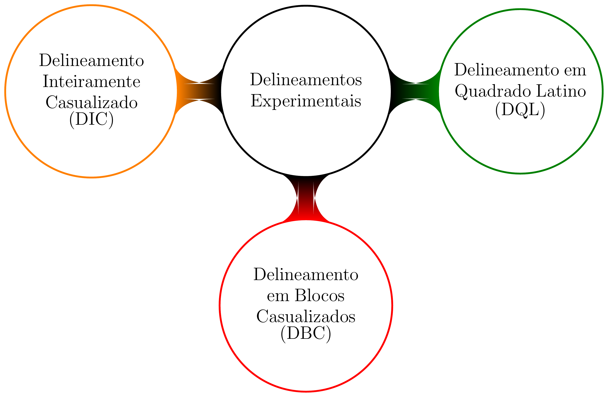
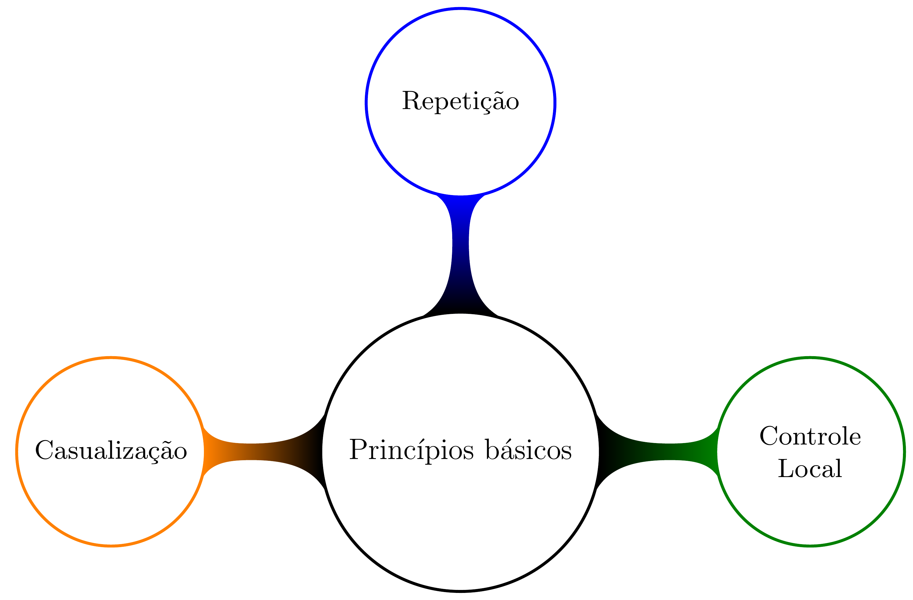
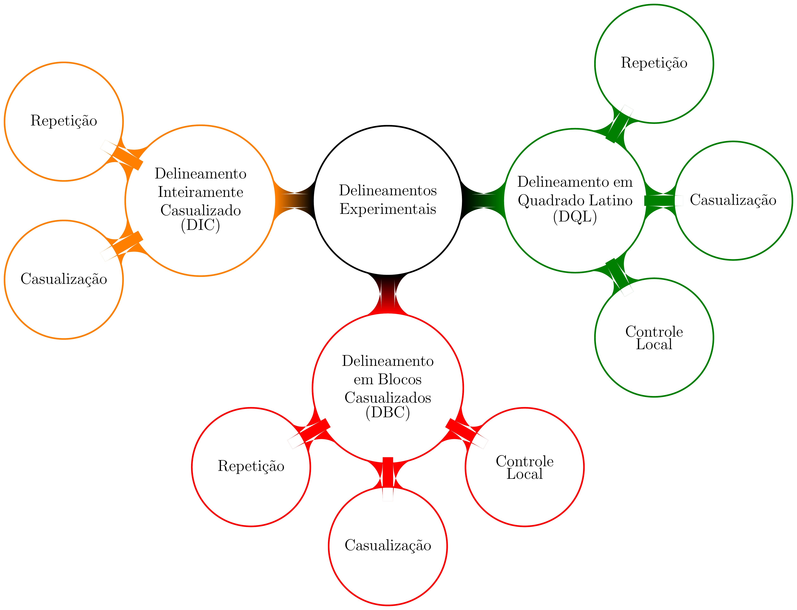
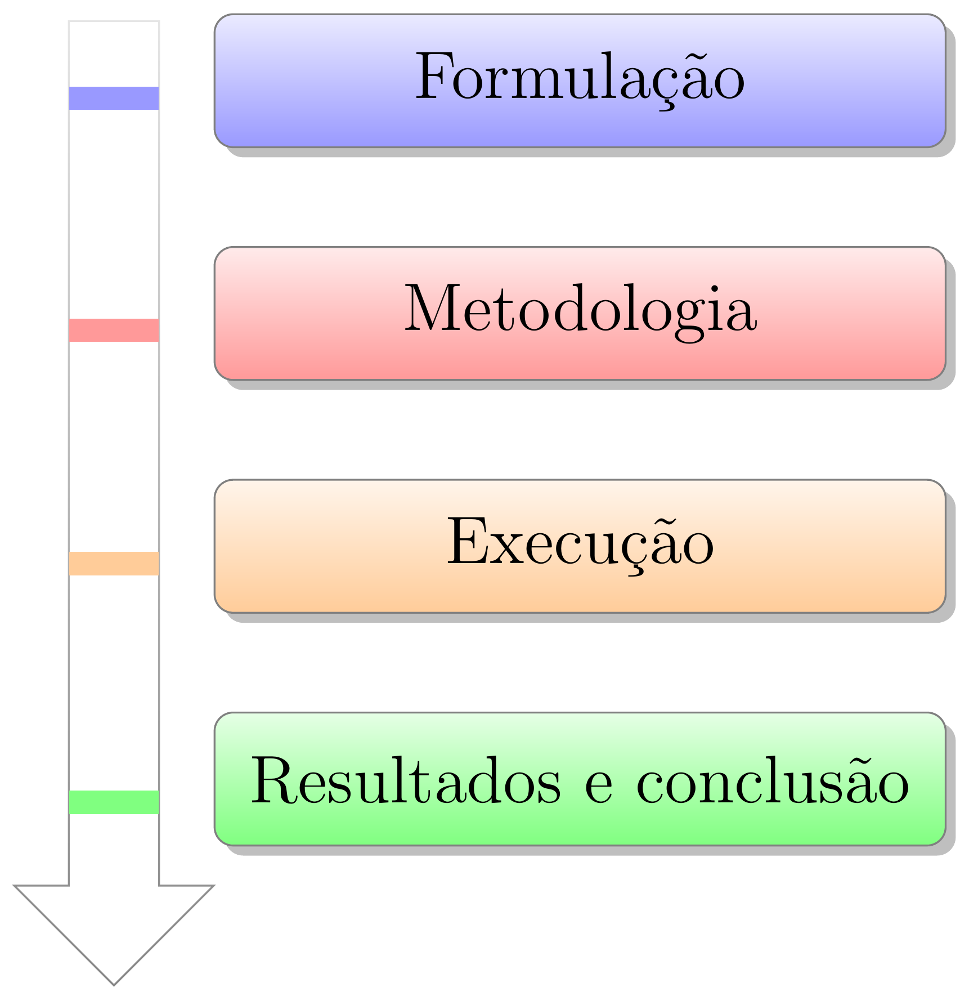
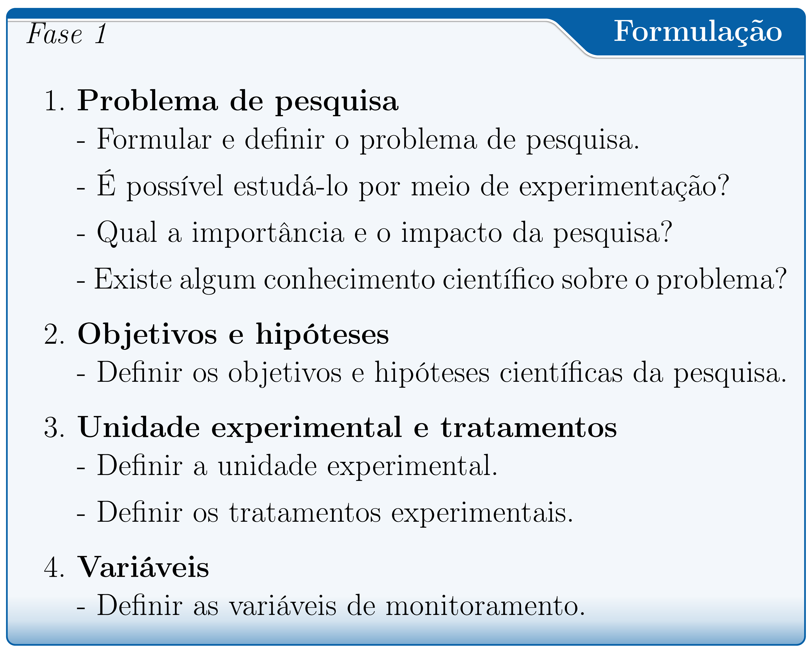
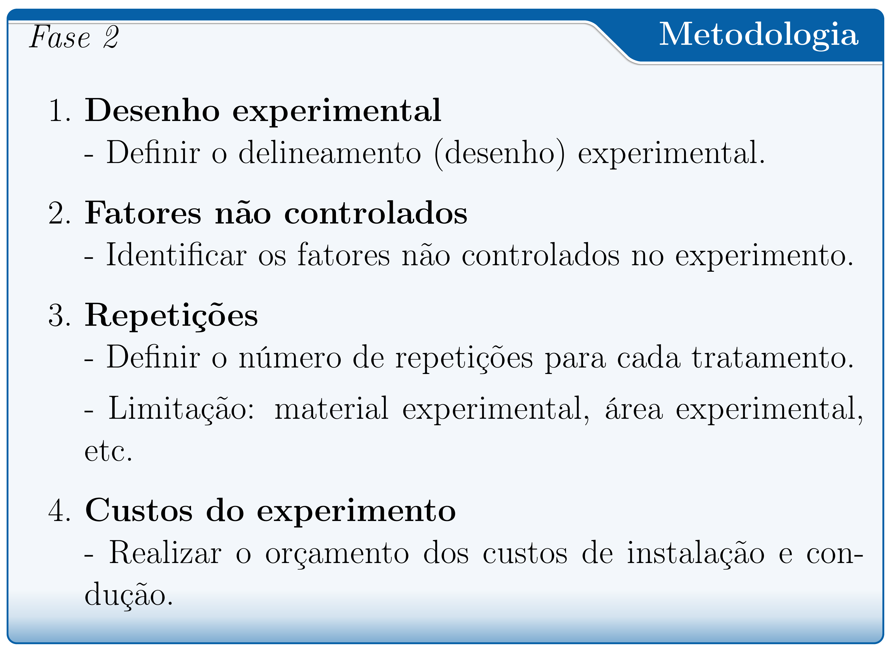
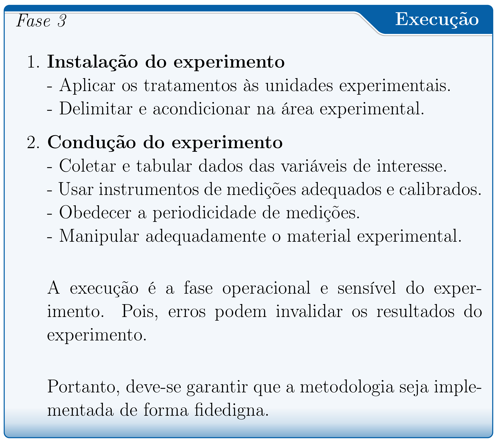
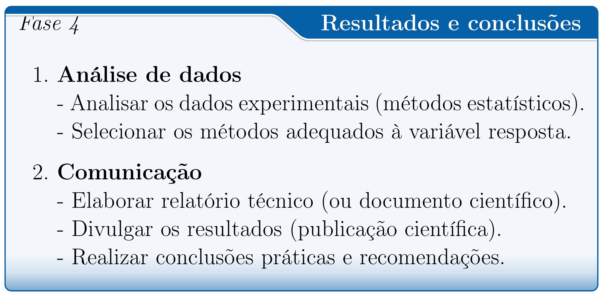

class: title-slide, center, middle
background-image: url(../assets/capa/capa.png)
background-position: center
background-size: cover
background-repeat: no-repeat

<div class="logo-lmftca"></div>
<div class="logo-ppgctif"></div>
<div class="logo-ppgbc"></div>

```{r setup, include=FALSE}
knitr::opts_chunk$set(
	error = FALSE,
	fig.align = "center",
	fig.showtext = TRUE,
	message = FALSE,
	warning = FALSE,
	cache = TRUE,
	collapse = TRUE,
	dpi = 600
)
```

```{r packages, include=FALSE}
# remotes::install_github("dill/emoGG")
# remotes::install_github("hadley/emo")
# remotes::install_github("emitanaka/anicon")
# remotes::install_github("mitchelloharawild/icons")
```

```{r xaringan-logo, echo=FALSE}
library(xaringanExtra)

use_scribble()
use_share_again()
use_progress_bar()

use_extra_styles(
  hover_code_line = TRUE,
  mute_unhighlighted_code = TRUE
)

use_editable(expires = 1)
use_clipboard()
```

<!-- title-slide -->
# Experimentação Florestal <br> (FL03034 - EF)

## ᨒ <br> `r anicon::faa("pagelines", animate="horizontal", colour="#244A6B")` Introdução à Experimentação `r anicon::faa("pagelines", animate="horizontal", colour="#244A6B")`
###### (Conceitos, Princípios e Planejamento)

##### 〰〰〰〰〰〰🌱〰〰〰〰〰〰
##### ᨒ
##### .font120[**Prof. Dr. Deivison Venicio Souza**]
##### Universidade Federal do Pará (UFPA)
##### Faculdade de Engenharia Florestal
##### Laboratório de Manejo Florestal, Tecnologias e Comunidades Amazônicas
##### E-mail: deivisonvs@ufpa.br
<br>
##### 1ª versão: 11/agosto/2021 <br> (Atualizado em: `r format(Sys.Date(),"%d/%B/%Y")`) <br> Altamira, Pará

---
layout: true
<div class="my-header"></div>
<div class="my-footer">
<span>
Prof. Dr. Deivison Venicio Souza (deivisonvs@ufpa.br)
&emsp;&emsp;
Experimentação Florestal (FL03034 - EF)
&bull;
Introdução à Experimentação
</span>
</div>

---

## 📚 Ementa da disciplina (FL03034 - EF)
<br>

.shadow4[
.font90[

**1 - Introdução à experimentação;**

2 - Análise exploratória de dados;

3 - Delineamento inteiramente casualizado (DIC);

4 - Delineamento em blocos ao acaso (DBC);

5 - Delineamento em quadrado latino (DQL);

6 - Testes de comparação de médias;

7 - Experimentos em esquema fatorial;

8 - Análise de correlação e regressão linear; e

9 - Análise de experimentos com linguagem R.

]
]

---

## 🎯 Objetivos
<br>

.font90[
Ao final desta aula, você deverá ser capaz de:

- **Identificar** tratamentos, unidades experimentais e variáveis resposta em experimentos florestais;
- **Explicar** a importância da repetição, da casualização e do controle local;
- **Avaliar criticamente** o planejamento de pesquisas experimentais no contexto florestal; e
- **Propor** um experimento florestal simples, relacionando a pergunta de pesquisa às decisões de planejamento.
]

---

## 📙 Conteúdo

.pull-left-4[
.font90[
**Parte 1 - Terminologias e conceitos básicos**

[1 - Experimentação e Experimento](#Exp)

[2 - Tratamento e Unidade Experimental](#Trat)

[3 - Delineamento Experimental](#DE)

[4 - Análise de Variância (ANOVA)](#Anova)

[5 - Erro Experimental ou Resíduo](#Res)
]
]

.pull-right-2[
.pull-down[
.font90[
**Parte 2 - Princípios básicos da experimentação**

[1 - Repetição: conceito, importância e limitações](#Rep)

[2 - Casualização ou aleatorização: conceito e importância](#Cas)

[3 - Controle local: conceito e importância](#Cas)
]
]
]

---

## 📙 Conteúdo

<br>

.font90[
**Parte 3 - Fases da pesquisa experimental**

[1 - Definição do problema de pesquisa](#Probl)

[2 - Conhecimento científico existente?](#Conh)

[3 - Enunciação do problema e formulação da hipótese científica](#Enun)

[4 - Definir a unidade experimental (UE)](#UE)

[5 - Definir os tratamentos a serem aplicados](#Trat)

[6 - Definir as variáveis a serem medidas nas UEs](#Var)

[7 - Definir o delineamento experimental](#del)

[8 - Instalar e conduzir o experimento](#Inst)

[9 - Analisar e interpretar dados experimentais](#int)

[10 - Realizar conclusões e fazer recomendações](#int)
]

<!-- Parte 1 -->
---
layout: false
name: parte1
class: top, right
background-image: url(../assets/capa/sec.png)
background-size: cover

<br>

.right[
.font100[
<span style="color: #244A6B;">**Experimentação Florestal**</span>
]
]

<br><br>

.right[
.font150[
<span style="color: #244A6B;">**Parte 1**</span>
]
]

<br><br>

.right[
.font180[
<span style="color: #0B1F3A;">**Como a experimentação ajuda a tomar decisões<br>na Engenharia Florestal?**</span>
]
]

---
layout: true
<div class="my-header"></div>
<div class="my-footer">
<span>
Prof. Dr. Deivison Venicio Souza (deivisonvs@ufpa.br)
&emsp;&emsp;
Experimentação Florestal (FL03034 - EF)
&bull;
Introdução à Experimentação
</span>
</div>

---

name: germinacao-lote

## 🌱 Situação 1: germinação de um lote de sementes

<br>

.font80[
👉 **Imagine:** uma empresa produtora/comercializadora de sementes florestais prepara
um lote de **paricá** (*Schizolobium parahyba* var. *amazonicum*)
para comercialização.
]

--

.font80[
### Antes da comercialização…

- Uma **amostra representativa do lote** é obtida;
- A amostra é encaminhada a um **laboratório de análise de sementes
credenciado no RENASEM**; e
- O **potencial germinativo** é avaliado pelo teste de germinação,
conforme as **Regras para Análise de Sementes (RAS)**.
]

--

<br>

.font80[
.alert[
❓ **Qual é a porcentagem estimada de germinação do lote
em condições de laboratório?**
]
]

.font70[
**RENASEM:** Registro Nacional de Sementes e Mudas, mantido pelo
**MAPA**. Abrange a inscrição e o credenciamento de pessoas físicas
e jurídicas para atividades relacionadas a sementes e mudas,
incluindo a análise laboratorial.
]

---

name: ras

## 📖 O que são as RAS?

<br>

.font80[
.alert[
As **Regras para Análise de Sementes (RAS)** reúnem
**métodos e procedimentos padronizados** para avaliar
a **qualidade das sementes**.

**Órgão responsável:** Ministério da Agricultura e Pecuária (**MAPA**).
]
]

--

.font80[
### Por que seguir essas regras?

- Orientam **como realizar os testes e avaliar os resultados**;
- Estabelecem condições de análise, como **temperatura,
substrato e duração do teste**; e
- Permitem **repetir os testes e comparar seus resultados**,
dentro dos limites de tolerância previstos nas RAS.
]

--

.font70[
### Onde consultar?

🌳 **Capítulo 14 — Análise de Sementes de Espécies Florestais**

🔎 **Seção 14.4 — Teste de germinação**

[📖 Acessar o Capítulo 14 das RAS](https://wikisda.agricultura.gov.br/pt-br/Laborat%C3%B3rios/Metodologia/Sementes/RAS_2025/cap_14_florestais_rev_1)
]

---

name: conceitos-germinacao

## 🌱 O que é germinação e como expressar seu resultado?

<br>

.font80[
.alert[
**GERMINAÇÃO EM LABORATÓRIO**

É a emergência e o desenvolvimento das **estruturas essenciais
do embrião**, demonstrando sua capacidade de originar uma planta
normal em **condições favoráveis** (Brasil, 2025).
]
]

--
<br>

.font80[
.alert[
**PORCENTAGEM DE GERMINAÇÃO**

É a **porcentagem de sementes que produziram plântulas normais**,
nas condições e no período definidos para o teste (Brasil, 2025).
]

<br>

💡 **A saída da raiz, sozinha, não basta:** é necessário avaliar
as estruturas essenciais da plântula.
]

---

name: plantulas-normais

## 🌱 Quais plântulas são consideradas normais?

<br>

.font80[
.alert[
**PLÂNTULAS NORMAIS**

São aquelas que apresentam potencial
para continuar seu desenvolvimento e dar origem a
**plantas satisfatórias**.
]
]

--

.font80[
### Categorias de plântulas normais

- **Intactas:** estruturas essenciais completas,
bem desenvolvidas, proporcionais e saudáveis;
- **Com defeitos aceitáveis:** pequenos defeitos que
**não comprometem o desenvolvimento**, mantendo crescimento
equilibrado e comparável ao das plântulas intactas; e
- **Com infecção secundária:** infecção por fungos ou bactérias
**proveniente de outras fontes, e não da própria semente**,
com todas as estruturas essenciais presentes e verificáveis.
]

--

<br>

.font80[
💡 **Plântula Normal não significa necessariamente perfeita:** determinados
defeitos e infecções são aceitos conforme os critérios das RAS.
]

---

name: ras-montagem

## 📋 Como montar o teste de germinação do paricá?

<br>

.font80[
O laboratório segue as **Regras para Análise de Sementes (RAS)**,
que estabelecem condições padronizadas para o teste.
]

--

.font80[
### Montagem do teste

- **Quantidade:** 400 sementes obtidas da amostra representativa do lote;
- **Organização:** 8 repetições de 50 sementes;
- **Substrato:** Entre Papel (**EP**), incluindo rolo de papel;
- **Temperatura:** 25 °C.
]

--

.font80[
.alert[
💡 **Entre papel:** as sementes ficam entre camadas de
**papel umedecido**.

💡 No **rolo de papel**, as folhas com as sementes são enroladas,
mantendo-as em contato com o papel úmido.
]
]

---

name: ras-avaliacao

## 🔎 Como avaliar o teste de germinação do paricá?

.font80[
### Quando avaliar?

- **Dia 7:** primeira contagem;
- **Dia 10:** contagem final indicada.
- **Prorrogação:** possível (seção 14.4.10 - Duração do teste)
]

.font70[
- Os dias são contados a partir da **instalação do teste**;
- Para cada espécie florestal, consultar os períodos indicados
no **Quadro 14.1 das RAS**.
]

--

.font80[
### Como proceder em cada repetição?

- **Identificar e contar as plântulas normais**;
- **Registrar e retirar** as plântulas normais já contabilizadas; e
- Nas contagens anteriores à final, manter em avaliação as sementes
e plântulas que ainda precisam de tempo para permitir sua classificação.
]

---

name: resultado-germinacao

## 🧮 Como calcular a porcentagem de germinação?

.pull-left[
.font80[
### Dados hipotéticos
<br>

| Repetição | Sementes | Plântulas normais |
|:--:|--:|--:|
| 1 | 50 | 40 |
| 2 | 50 | 42 |
| 3 | 50 | 39 |
| 4 | 50 | 41 |
| 5 | 50 | 38 |
| 6 | 50 | 40 |
| 7 | 50 | 41 |
| 8 | 50 | 39 |
| **Total** | **400** | **320** |

$$
G = \frac{320}{400}\times 100 = \mathbf{80\%}
$$
]
]

.pull-right[
.font80[
### Como calcular?
<br>
.alert[
Divida o total de **plântulas normais** pelo total de
**sementes testadas** e multiplique por 100.
]

$$
\text{Germinação} =
\frac{\text{Número de plântulas normais}}
{\text{Número de sementes testadas}}
\times 100
$$

### Interpretação

.alert[
Estima-se que **80 de cada 100 sementes do lote**
possam produzir **plântulas normais** nas condições
padronizadas do teste.
]

]
]

---
name: substrato-viveiro

## 🌱 Situação 2: qual substrato utilizar no viveiro?

<br>

.font80[
👉 **Imagine:** um viveiro adquire sementes de **paricá**
com informações sobre a germinação do lote e deseja produzir
mudas para **plantios comerciais destinados à produção
de madeira para lâminas e compensados**.
]

--

.font80[
### Uma nova decisão

O viveiro dispõe de **três opções de substrato**.
Antes de ampliar a produção, precisa decidir **qual delas utilizar**.

Para isso, deseja comparar:

- **Emergência:** porcentagem, rapidez e uniformidade;
- **Qualidade das mudas:** sobrevivência e crescimento
em altura e diâmetro do colo; e
- **Custo:** custo por muda apta ao plantio.
]

--

.font80[
.alert[
❓ **Como planejar uma comparação que permita avaliar
o efeito dos substratos sobre a produção de mudas?**
]
]

---
name: planejamento-inicial

## 🔎 Como comparar os três substratos?

.font80[
.alert[
💡 **Realizando um experimento!**

❓ Mas, como planejá-lo para comparar os três substratos e obter
**evidências para orientar a escolha**?
]
]

--

.font80[
### Condições do experimento

- Há **1.200 sementes de paricá, provenientes de um mesmo lote**;
- Será semeada **uma semente por recipiente**, diretamente
no substrato;
- A **emergência**, a **sobrevivência** e o **crescimento das mudas**
serão acompanhados durante **90 dias após a semeadura**; e
- Os **custos de produção** também serão registrados.
]

--

.font80[
### Como você faria?

- Quantas sementes destinaria para cada substrato?
- Como distribuiria os recipientes no viveiro?
- Como manteria padronizados outros fatores,
como irrigação e luminosidade?
]

---

name: substratos

## 🪴 Quais substratos serão comparados?

<br>

.pull-left[
.font80[
### Três misturas hipotéticas
<br>

| Substrato | Terra preta | Material de açaí¹ |
|:--|:--:|:--:|
| **S1** | 100% | 0% |
| **S2** | 75% | 25% |
| **S3** | 50% | 50% |
]

.font70[
¹ Caroço de açaí triturado e compostado.

Proporções medidas em **volume**.
]
]

.pull-right[
.font80[
### O que muda entre os substratos?
<br>

A **proporção de material de açaí na mistura**.

A terra preta e o material de açaí devem vir,
cada um, de uma **mesma origem** e receber
**preparo padronizado**.

.alert[
💡 **Exemplo — 10 litros de S2:**

**7,5 L de terra preta + 2,5 L de material de açaí.**
]
]
]

---
name: problema-planejamento

## 🌱 Como organizar essa comparação?

<br>

.pull-left[

### Substratos a comparar

- **S1:** 100% de terra preta;
- **S2:** 75% de terra preta + 25% de caroço de açaí triturado;
- **S3:** 50% de terra preta + 50% de caroço de açaí triturado.

]

--

.pull-right[

### Como você faria?

- Quantas sementes destinaria a cada substrato?
- Como organizaria as repetições?
- Como distribuiria os recipientes no viveiro?
- Quais medidas registraria?

]

--

.alert[
.font90[
💡 **Questão central:** como planejar o experimento para saber se
as diferenças observadas entre as mudas são causadas pelos
**substratos** ou por outros fatores, como **luz, água e diferenças
entre as próprias sementes**?
]
]

<!-- Parte 2 -->
---
layout: false
name: parte2
class: top, right
background-image: url(../assets/capa/sec.png)
background-size: cover

<br>

.right[
.font100[
<span style="color: #244A6B;">**Experimentação Florestal**</span>
]
]

<br><br>

.right[
.font150[
<span style="color: #244A6B;">**Parte 2**</span>
]
]

<br><br>

.right[
.font180[
<span style="color: #0B1F3A;">**Conceitos básicos<br>da experimentação**</span>
]
]

---
layout: true
<div class="my-header"></div>
<div class="my-footer">
<span>
Prof. Dr. Deivison Venicio Souza (deivisonvs@ufpa.br)
&emsp;&emsp;
Experimentação Florestal (FL03034 - EF)
&bull;
Introdução à Experimentação
</span>
</div>

---

## Terminologias e conceitos básicos


.pull-left-4[
```{r echo=FALSE, out.width='70%', fig.align='center', fig.cap='', dpi=600}
knitr::include_graphics("https://media.giphy.com/media/fUZHXuE94BN2wtSbUS/giphy-downsized-large.gif")
```
<br><br><div style='font-size:50%'>(Available at [https://media.giphy.com](https://media.giphy.com), jul 19, 2021)</div>

]


### Experimentação

--

É a parte da estatística que estuda o **planejamento** e a **execução** de experimentos, bem como a **coleta**, a **análise** e a **interpretação** de dados experimentais.

--

### Experimento (ou ensaio)

--

É uma experiência (ou ensaio) realizada em **condições previamente estabelecidas** e que opera com **causas controladas** (DIAS; BARROS, 2009).
 
---

## Terminologias e conceitos básicos

<br>
### Unidade Experimental (ou Parcela)

--
.font90[
É a menor unidade que recebe o tratamento. Em experimentos de campo, normalmente são chamadas de parcelas experimentais. Uma UE pode ser formada por um indivíduo (ou grupo). (.green[Recomendação: 20 UEs])
]

--
<br>

.font90[
**Experimento de campo**: parcela é uma área cujo tamanho depende, por exemplo, do porte e do espaçamento entre planta. 
Tamanhos: 200 e 250m² são bastante comuns.

**Casas de vegetação**: parcela pode ser: um vaso, tubetes, bandejas (5 a 10 sementes ou plantas)

**Laboratório**: parcela pode ser: placa de petri.
]


.pull-left-4[
```{r echo=FALSE, out.width='60%', fig.align='center', fig.cap='', dpi=600}
knitr::include_graphics("https://media2.giphy.com/media/mDBBU8K7Np2UQs9Dqy/giphy.gif")
```
]

.pull-right-4[
```{r echo=FALSE, out.width='60%', fig.align='center', fig.cap='', dpi=600}
knitr::include_graphics("https://media1.giphy.com/media/RCtKcMeeIlIFskmH7C/giphy-downsized.gif")
```
]


---

## Terminologias e conceitos básicos

<br>

### Tratamento

--
.font80[
É a condição (método, elemento, material) imposta à unidade experimental, cujo efeito deseja-se medir e comparar em um experimento. 
<br>
Somente o tratamento varia entre as UEs, as demais condições são mantidas constantes, exceto os fatores não-controláveis.
]

.pull-left-4[
```{r echo=FALSE, out.width='70%', fig.align='center', fig.cap='', dpi=600}
knitr::include_graphics("https://media.giphy.com/media/fjrLK07VbIcn7ZfX3f/giphy.gif")
```
<br><br><div style='font-size:50%'>(Available at [https://media.giphy.com](https://media.giphy.com), jul 19, 2021)</div>
]

--

.pull-right-4[
.font80[
**Experimentos de campo**

- Formas de preparo do solo
- Diferentes doses de adubação
- Diferentes espaçamentos

**Casa de vegetação**
- Diferentes tipos de substratos
- Diferentes níveis de sobreamento
- Diferentes tipos de recipientes
]
]


---

## Terminologias e conceitos básicos

<br>

### Delineamento experimental

--

É o modo como os tratamentos são designados às unidades experimentais (ou parcelas) (Dias; Barros, 2009).

--
<br>
Os principais delineamentos experimentais utilizados são:

```{r, echo=FALSE, out.width='50%', fig.align='center', fig.cap='', dpi=600}

```

---

## Terminologias e conceitos básicos

<br>
### Delineamento Inteiramente Casualizado - DIC

--

É quando os tratamentos são designados às unidades experimentais completamente ao acaso (por sorteio).

--
<br><br>

**Príncipios básicos**: Repetição e Casualização

**Situação**: Unidades experimentais homogêneas (casas de vegetação e laboratórios)

<br>
--

.font90[
**Exemplos**
- Avaliar diferentes níveis de sobreamento (pleno sol, 20%, 50% e 70%) no desenvolvimento de mudas.
- Avaliar diferentes técnicas de quebra de dormência de sementes (escarificação química e mecânica, imersão em água quente, imersão em $H_2SO_4$). (*Bertholletia excelsa*)
- Avaliar diferentes tipos de substratos no desenvolvimento de mudas de espécies florestais.
]

---

## Terminologias e conceitos básicos

<br>
### Delineamento em Blocos Casualizados - DBC

--
.font90[
- É usado quando existe **uma fonte de variação** (ex.: Fertilidade do Solo) que deseja-se controlar.
- Assim, as unidades experimentais são subdivididas em grupos menores e homogêneos para o fator de controle. 
]
--

.font90[
- Estes grupos homogêneos são denominados de blocos.
]

--

.font90[
- Os tratamentos são então sorteados às unidades experimentais dentro de cada bloco.
]

--

.font90[
**Príncipios básicos**: Repetição, Casualização e Controle Local

**Situação**: Existe um fator de variação para controlar (experimentos de campo)
]
<br>
--

.font65[
**Exemplos**

- Avaliar a dinâmica de uma comunidade florestal semidecídua secundária, sob influência de um gradiente ambiental de umidade, determinado pela proximidade a um córrego em um extremo e um cerrado em outro, nas partes mais altas do relevo ([Venturoli et al., 2008](https://repositorio.unb.br/handle/10482/2650)).
]

---

## Terminologias e conceitos básicos

<br>
### Delineamento em Quadrado Latino - DQL

--

.font90[
- É usado quando existe **duas fonte de variação** (ex.: Fertilidade do Solo e Gradiente de Umidade), perpendiculares, que deseja-se controlar.
]
--

.font90[
- Os tratamentos são então sorteados às unidades experimentais nos blocos verticais e horizontais.
- Cada tratamento deve aparecer uma única vez na linha e coluna.
]

--
O controle local é aplicado pela imposição de **dois fatores de restrição** na casualização, devido à presença de dois gradientes de heterogeneidade, perpendiculares, no ambiente ou material experimental.

---

## Terminologias e conceitos básicos

<br>
### Análise de variância - (**An**alysis **O**f **Va**riance - ANOVA)

--

É uma técnica estatísticas que permite **decompor a variação total** dos dados experimentais em **causas conhecidas** e **desconhecidas**.

--
<br><br>
`r anicon::faa("hand-point-right", animate="horizontal")` O quanto da variação no experimento é devido aos **fatores não-controlados (ou variação do acaso**) - ou erro experimental?

`r anicon::faa("hand-point-right", animate="horizontal")` O quanto da variação no experimento é devido às influências dos tratamentos experimentais aplicados às unidades experimentais (**fatores controlados**)?

---

## Terminologias e conceitos básicos

<br>
### Erro Experimental (ou Resíduo)

--

É a variação devida ao efeito dos fatores não-controlados no experimento (acaso/aleatório).

--

### Variável Resposta (ou Dependente)

--

Característica que é medida e/ou avaliada nas unidades experimentais. 

Comumente essa característica é chamada de variável resposta (ou dependente).

--

### Dados experimentais

--

São os valores assumidos pela variável resposta.

---
class: center, middle
.font300[
**Alguns experimentos...**
]

---

## Experimentos (Silva et al., 2017)
<br>

### Tamanho da semente e substratos na produção de mudas de açaí
<br>

.pull-left-4[
**1. Periódico**

Advances in Forestry Science

Link: [Silva et al., 2017](https://periodicoscientificos.ufmt.br/ojs/index.php/afor/article/view/4590)
<br><br>

**2. Objetivo**

Estudar o efeito de diferentes **tamanhos de sementes** e **substratos** no
desenvolvimento de mudas de *Euterpe oleracea* Mart. 
<br><br>
]

--

.pull-right-4[
**3. Delineamento Experimental**

DIC em esquema fatorial 3x2 (tamanho das sementes x substratos).

Repetições: 4 repetições (20 sementes)

Tamanhos das sementes: P, M e G

Tipos de substratos: Composto Orgânico (CO) e Monte Cristo (MC)

]

---

## Experimentos (Silva et al., 2017)
<br>

### Tamanho da semente e substratos na produção de mudas de açaí
<br>

**4. Variáveis de interesse**

.pull-left-4[
- Altura e diâmetro do colo

Medições: 30, 60, 90, 120, 150, 180 e 210 dias após plantio
]

--

.pull-right-4[
- Outras variáveis: (dia 210)

Matéria Seca da Parte Aérea (MSPA)

Matéria Seca do Sistema Radicular (MSSR)

Matéria Seca Total da Planta (MST)

**Método**: Secagem em estufa de circulação forçada por 72 horas a 60ºC até a obtenção da massa constante (em g).
]


---

## Experimentos (Silva et al., 2017)
<br>

### Tamanho da semente e substratos na produção de mudas de açaí
<br>

**5. Análises Estatísticas**
- Análise de variância (ANOVA)
- Regressão polinomial
- Teste de Tukey

---

## Experimentos (Silva et al., 2017)
<br>

### Tamanho da semente e substratos na produção de mudas de açaí
<br>

**6. Resultados**

```{r, echo=FALSE, out.width='55%', fig.align='center', fig.cap='', dpi=600}
knitr::include_graphics('fig/E1-T2.png')
```

---

## Experimentos (Silva et al., 2017)
<br>

### Tamanho da semente e substratos na produção de mudas de açaí
<br>

**7. Conclusão**

- Os parâmetros biométricos e a qualidade de mudas de *Euterpe oleracea* são influenciados pelo substrato e tamanho da semente.
- A utilização do **substrato orgânico** proporciona mudas de *Euterpe oleracea* com maior índice de qualidade.
- Sementes grandes produzem mudas vigorosas de *Euterpe oleracea*.
<br>

.center[.red[**Faça uma reflexão sobre a conclusão do experimento!**]]

---

## Experimentos (Silva et al., 2020)
<br>

### Potencial uso da casca de café como constituinte de substrato para produção de mudas de espécies florestais

.pull-left-4[
**1. Periódico**

Ciência Florestal

Link: [Silva et al., 2020](https://www.scielo.br/j/cflo/a/XSFdXrtQHS3gfZQg9V8K5zd/?lang=pt&format=html)
<br><br>

]

--

.pull-right-4[
**2. Objetivo**

Avaliar o crescimento inicial de mudas de *Eucalyptus urophylla*, *Peltophorum dubium* e *Eremanthus erythropappus*, produzidas em diferentes formulações de substratos.

]

--

.pull-down[
**3. Delineamento Experimental**

DIC (8 tratamentos) - Diferentes proporções de substratos

**Repetições**: 5 repetições (20 plantas)

**Tipos de substratos**: Casca de arroz compostada, Casca de café compostada, Fibra de coco, Substrato comercial.
]

---

## Experimentos (Silva et al., 2020)
<br>

### Potencial uso da casca de café como constituinte de substrato para produção de mudas de espécies florestais

```{r, echo=FALSE, out.width='70%', fig.align='center', fig.cap='', dpi=600}
knitr::include_graphics('fig/E2-T1.png')
```

---
 
## Experimentos (Silva et al., 2020)
<br>

### Potencial uso da casca de café como constituinte de substrato para produção de mudas de espécies florestais
<br>

 **4. Variáveis de interesse**

.pull-left-4[
- Aos 120 dias mediu-se:

Altura

Diâmetro do coleto

Matéria Seca da Parte Aérea

Peso de Matéria Seca do Sistema Radicular

Índice de Qualidade de Dickson
]

---

## Experimentos (Silva et al., 2020)
<br>

### Potencial uso da casca de café como constituinte de substrato para produção de mudas de espécies florestais

**6. Resultados**

```{r, echo=FALSE, out.width='65%', fig.align='center', fig.cap='', dpi=600}
knitr::include_graphics('fig/E2-T31.png')
```

---

## Experimentos (Silva et al., 2020)
<br>

### Potencial uso da casca de café como constituinte de substrato para produção de mudas de espécies florestais

**6. Resultados**

```{r, echo=FALSE, out.width='65%', fig.align='center', fig.cap='', dpi=600}
knitr::include_graphics('fig/E2-T32.png')
```

---

## Experimentos (Silva et al., 2020)
<br>

### Potencial uso da casca de café como constituinte de substrato para produção de mudas de espécies florestais

**6. Resultados**

```{r, echo=FALSE, out.width='60%', fig.align='center', fig.cap='', dpi=600}
knitr::include_graphics('fig/E2-T33.png')
```

---

## Experimentos (Silva et al., 2020)
<br>

### Potencial uso da casca de café como constituinte de substrato para produção de mudas de espécies florestais

**7. Conclusão**

- Tratamentos com casca de café compostada apresentaram valores superiores para a maioria das variáveis analisadas.
- A casca de café compostada, combinada com proporções de fibra de coco e substrato comercial apresentou potencial para a produção de mudas das 3 espécies.
- Recomendação: 20% de fibra de coco, 40% de substrato comercial e 40% de
casca de café compostada.


<!-- Slide XX -->
---
layout: false
name: parte1
class: middle, center
background-image: url(../assets/capa/sec.png)
background-size: cover

<span style="color: #244A6B; font-size: 40px;">Parte 2</span>

<br>

<span style="color: #0B1F3A; font-size: 48px; font-weight: bold;">
Princípios básicos<br>da experimentação
</span>

---
layout: true
<div class="my-header"></div>
<div class="my-footer"><span>Prof. Dr. Deivison Venicio Souza (E-mail: deivisonvs@ufpa.br)&emsp;&emsp;&emsp;&emsp;&emsp;Experimentação Florestal (FL03034 - EF) - Introdução à experimentação: conceitos, princípios e planejamento</div>

---
## Princípios básicos da experimentação
<br>

Os delineamentos experimentais clássicos são baseados em três princípios básicos:

```{r, echo=FALSE, out.width='60%', fig.align='center', fig.cap='', dpi=600}

```

---
## Princípios básicos da experimentação
<br>

### Repetição

Refere-se ao número de vezes que um determinado tratamento aparece em um experimento (Dias; Barros, 2009).

--
<br><br>

`r anicon::faa("hand-point-right", animate="horizontal")` **Repetição** = Número de unidades experimentais ou conjunto de unidades experimentais para um determinado tratamento.

--
<br><br>

**Tratamento 1** (pleno sol) – 4 repetições de 25 sementes

**Tratamento 2** (50% de sombreamento) – 4 repetições de 25 sementes

**Tratamento 3** (80% de sombreamento) – 4 repetições de 25 sementes

---

## Princípios básicos da experimentação
<br>

### Qual a importância da repetição?
* Estimar o erro experimental;


* Controlar a variância residual (erro experimental);


* Aumentar a precisão das estimativas das médias dos tratamentos;


* Aumentar o poder dos testes estatísticos; e


* Garantir maior confiabilidade nos resultados obtidos.

--
<br><br>
.shadow3[
“à medida que o número de repetições cresce tem-se um aumento da precisão das estimativas do experimento.”
]

---

## Princípios básicos da experimentação
<br>

### Limitações

`r anicon::faa("hand-point-right", animate="horizontal")` O uso de um número adequado de repetições, possibilita uma boa estimativa do erro experimental, melhorando as estimativas de interesse. 

`r anicon::faa("hand-point-right", animate="horizontal")` No entanto, o número de repetições pode ser limitado, sobretudo, pelo(a) (Costa, 2003): 

- Número de tratamentos que serão comparados;
- Disponibilidade de material experimental; e
- Disponibilidade de área experimental.

---

## Princípios básicos da experimentação
<br>

### Casualização ou Aleatorização

--

Consiste em dispor os tratamentos ao acaso no experimento. A ideia básica é que todas as unidades experimentais tenham iguais chances de receber quaisquer dos tratamentos (Dias; Barros, 2009).

--
<br><br>
.shadow3[
É a atribuição dos tratamentos às unidades experimentais de forma aleatória, sem nenhuma interferência por parte do pesquisador.
]

---

## Princípios básicos da experimentação
<br>

### Importância

A casualização é recomendada para se evitar fatores sistemáticos que venham a beneficiar algum tratamento em detrimento de outros (Dias; Barros, 2009).


---

## Princípios básicos da experimentação
<br>

### Controle Local

--
Destina-se a controlar a heterogeneidade ambiental e implica em restringir a casualização (Dias; Barros, 2009).

--
<br><br>
.shadow3[
A formação de blocos no DBC e a disposição de linhas e colunas no DQL, são estratégias de controle local, que possibilitam agrupar parcelas homogêneas e casualizar os tratamentos dentro destas.
]

---

## Princípios básicos da experimentação
<br>

### Importância


- Diminuir o erro experimental; e


- Dividir uma área experimental heterogênea em áreas menores e homogêneas, comumente chamadas de blocos.

--
<br><br>
.shadow3[
É fundamental o reconhecimento da variação ambiental por parte do pesquisador.
]

---

## Princípios básicos da experimentação
<br>

### Princípios básicos e delineamentos experimentais

```{r, echo=FALSE, out.width='53%', fig.align='center', fig.cap='', dpi=600}

```


<!-- Slide XX -->
---
layout: false
name: parte1
class: middle, center
background-image: url(../assets/capa/sec.png)
background-size: cover

<span style="color: #244A6B; font-size: 40px;">Parte 3</span>

<br>

<span style="color: #0B1F3A; font-size: 48px; font-weight: bold;">
Fases da pesquisa <br>experimental
</span>

---
layout: true
<div class="my-header"></div>
<div class="my-footer"><span>Prof. Dr. Deivison Venicio Souza (E-mail: deivisonvs@ufpa.br)&emsp;&emsp;&emsp;&emsp;&emsp;Experimentação Florestal (FL03034 - EF) - Introdução à experimentação: conceitos, princípios e planejamento</div>

---

## Fases da pesquisa experimental
<br>

```{r, echo=FALSE, out.width='40%', fig.align='center', fig.cap='', dpi=600}

```

---

## Fases da pesquisa experimental
<br>

.pull-left-4[
```{r, echo=FALSE, out.width='90%', fig.align='center', fig.cap='', dpi=600}

```
]

--

.font80[
**Problema**

-> Pergunta: Qual o melhor substrato para germinação de sementes de *Cordia glabrata* (Louro-preto)?

-> Importância: Ornamentação, prática apícola e medicina popular.
]

--

.font80[
**Objetivo**

-> Avaliar o melhor substrato para germinação de sementes de *Cordia glabrata* (Louro-preto)?
]

--

.font80[
**Unidade Experimental e Tratamentos**

-> UE: Sementes de *Cordia glabrata*.

-> Tratamentos: papel-filtro e solo arenoso + matéria orgânica.

]

--
.font80[
**Variáveis**

-> Taxa média de germinação e o Índice de Velocidade de Germinação (IVG).

]

---

## Fases da pesquisa experimental
<br>

.pull-left-4[
```{r, echo=FALSE, out.width='90%', fig.align='left', fig.cap='', dpi=600}

```
]


--

.font80[
**Desenho experimental**

-> DIC, DBC, DQL, Ensaio Fatorial, etc.

]

--

.font80[
**Fatores não controlados**

-> Ex.: Temperatura, Umidade relativa do ar


]

--

.font80[
**Repetições**

-> Ex.: 5 repetições de 200 sementes.

]

--

.font80[
**Custos do experimento**

-> Recurso financeiro é um fator limitante.

]


---

## Fases da pesquisa experimental
<br>

```{r, echo=FALSE, out.width='50%', fig.align='center', fig.cap='', dpi=600}

```


---

## Fases da pesquisa experimental
<br>

```{r, echo=FALSE, out.width='50%', fig.align='center', fig.cap='', dpi=600}

```

---
## Referências
<br><br>

BRASIL. Ministério da Agricultura e Pecuária. **Regras para Análise de Sementes (RAS)**. 2025. Capítulo 4 — Teste de Germinação. Disponível em: [Acessar capítulo](https://wikisda.agricultura.gov.br/pt-br/Laborat%C3%B3rios/Metodologia/Sementes/RAS_2025/cap_4_Germinacao_rev_1). Acesso em: 29 set. 2026.

COSTA, J. R. (2003). **Técnicas experimentais aplicadas às ciências agrárias**. In: Embrapa Agrobiologia-Documentos (INFOTECA-E).

DIAS, L. D. S.; W., Barros (2009). **Biometria experimental** , p. 408p.

<!--Slide XX -->
---
layout: false
name: etim
class: inverse, middle, center
background-image: url(../assets/capa/sec.png)
background-size: cover

## .font200[Obrigado!]

```{r, echo=FALSE, out.width='20%', fig.align='center', fig.cap='', dpi=600}
knitr::include_graphics('../assets/logos/LMFTCA.png')
```

👨🏻‍👩🏻‍👦🏻‍👦🏻 [@lmftca_ufpa](https://www.instagram.com/lmftca_ufpa/)

🌎 [https://www.lmftca.com.br/](https://www.lmftca.com.br/)
