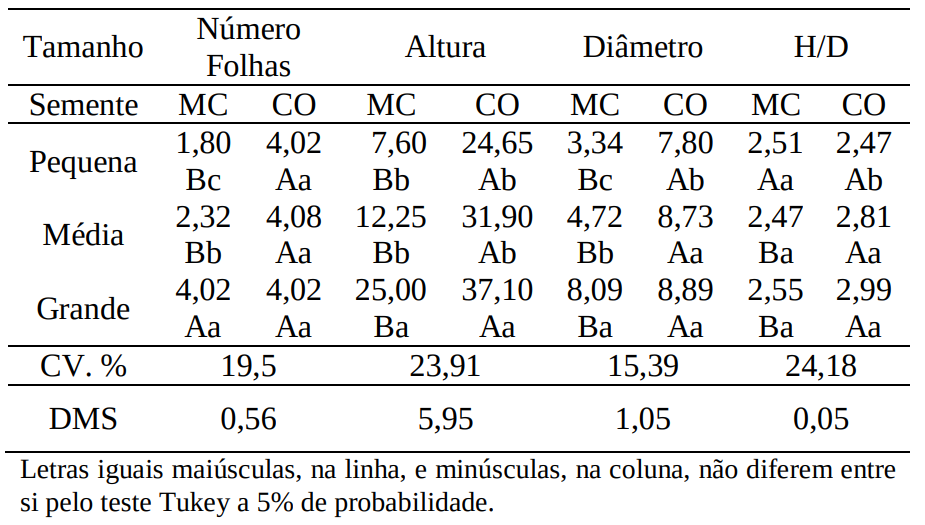
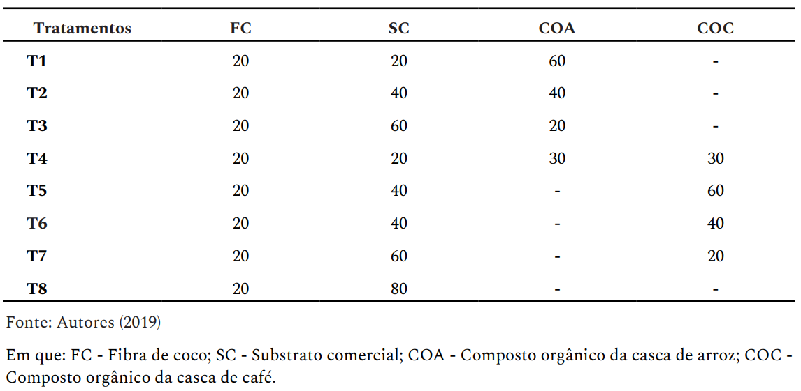
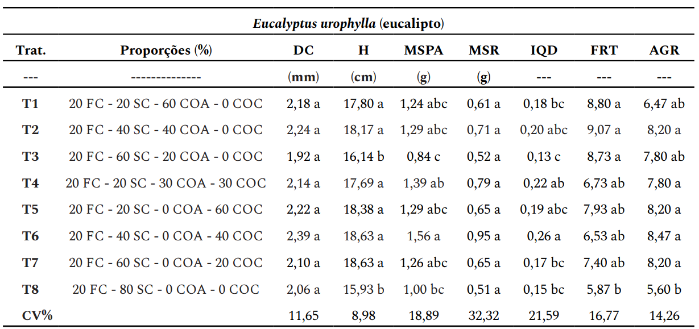
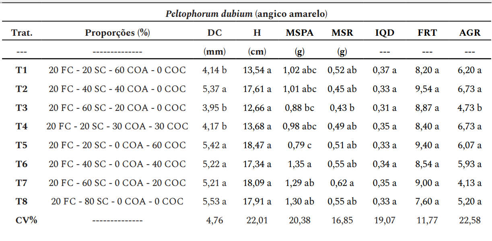
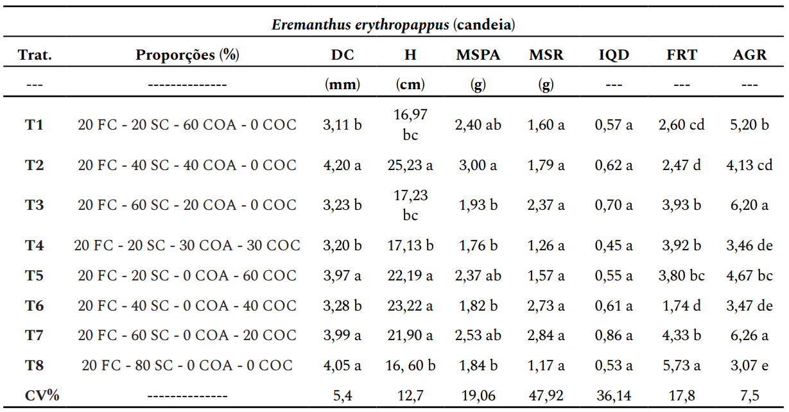

class: title-slide, center, middle
background-image: url(fig/slide-title/LMFTCA.png), url(fig/slide-title/ufpa.png), url(fig/slide-title/capa.png)
background-position: 90% 90%, 10% 90%
background-size: 150px, 150px, cover

```{r setup, include=FALSE}
knitr::opts_chunk$set(
	error = FALSE,
	fig.align = "center",
	fig.showtext = TRUE,
	message = FALSE,
	warning = FALSE,
	cache = FALSE,
	collapse = TRUE,
	dpi = 600
)
```

```{r packages, include=FALSE}
# remotes::install_github("dill/emoGG")
# remotes::install_github("hadley/emo")
library(ggplot2)
library(dplyr)
library(ggimage)
library(kableExtra)
library(readr)
#library(emo)
```

```{css, echo=FALSE}
.with-logo::before {
	content: '';
	width: 120px;
	height: 120px;
	position: absolute;
	bottom: 1.3em;
	right: -0.5em;
	background-size: contain;
	background-repeat: no-repeat;
}

.logo-ufpa::before {
	background-image: url(fig/slide-title/ufpa.png);
}
```

```{r xaringan-logo, echo=FALSE}
library(xaringanExtra)

use_logo(
  image_url = "fig/slide-title/LMFTCA.png",
  position = css_position(top = "1em", right = ".5em"),
  width = "130px",
  height = "130px")


use_scribble() # para escrever nos slides
use_share_again()
use_progress_bar()
#use_animate_all(style = c("slide_down"))

use_extra_styles(
  hover_code_line = TRUE,         #<<
  mute_unhighlighted_code = TRUE  #<<
)
xaringanExtra::use_editable(expires = 1)
#.can-edit[Você pode editar este título de slide]
#.can-edit.key-firstSlideTitle[Change this title and then reload the page]
use_clipboard()
```

```{r, load_refs, include=FALSE, cache=FALSE}
library(RefManageR)
BibOptions(check.entries = FALSE,
           bib.style = "authoryear",
           cite.style = "authoryear",
           style = "html",
           hyperlink = FALSE,
           dashed = FALSE)
(myBib <- ReadBib("./bib/ref.bib", check = FALSE))
```

<!-- title-slide -->
# .font120[Experimentação Florestal <br> (FL03034 - EF)]

## `r anicon::faa("pagelines", animate="horizontal", colour="green")` Introdução à Experimentação`r anicon::faa("pagelines", animate="horizontal", colour="green")` <br> ᨒ
###### Conceitos e princípios básicos 

##### 〰〰〰〰〰〰🌱〰〰〰〰〰〰
##### ᨒ
##### .font120[**Prof. Dr. Deivison Venicio Souza**]
##### Universidade Federal do Pará (UFPA)
##### Faculdade de Engenharia Florestal
##### Laboratório de Manejo Florestal, Tecnologias e Comunidades Amazônicas
##### E-mail: deivisonvs@ufpa.br
<br>
##### 1ª versão: 11/agosto/2021 <br> (Atualizado em: `r format(Sys.Date(),"%d/%B/%Y")`) <br> Altamira, Pará

---
layout: true
<div class="my-header"></div>
<div class="my-footer"><span>Prof. Dr. Deivison Venicio Souza (E-mail: deivisonvs@ufpa.br)&emsp;&emsp;&emsp;&emsp;&emsp;Experimentação Florestal (FL03034 - EF) - Introdução à experimentação: conceitos, princípios e planejamento</div>

---

## Ementa da disciplina (FL03034 - EF)

.shadow3[
<br>
**1 - Introdução à experimentação;**

2 - Análise exploratória de dados;

3 - Delineamento inteiramente casualizado - DIC; 

4 - Delineamento em blocos ao acaso - DBC;

5 - Delineamento em quadrado latino - DQL;

6 - Testes de comparação de médias; 

7 - Experimentos em esquema fatorial;

8 - Análise de correlação e regressão linear; e

9 - Análise de experimentos com linguagem R.

]

---

## Objetivos
<br><br>
Ao final desta aula espera-se que o discente seja capaz de...

* Conhecer as terminologias e os principais conceitos associados à experimentação;
* Avaliar algumas pesquisas experimentais no contexto florestal;
* Compreender os princípios básicos da experimentação; e
* Conhecer os principais aspectos relacionados ao planejamento e condução de experimentos.

---

## Conteúdo

.pull-left-4[
**Parte 1 - Terminologias e conceitos básicos**

[1 - Experimentação e Experimento](#Exp)

[2 - Tratamento e Unidade Experimental](#Trat)

[3 - Delineamento Experimental](#DE)

[4 - Análise de Variância (ANOVA)](#Anova)

[5 - Erro Experimental ou Resíduo](#Res)
]

.pull-right-2[
.pull-down[
**Parte 2 - Princípios básicos da experimentação**

[1 - Repetição: conceito, importância e limitações](#Rep)

[2 - Casualização ou aleatorização: conceito e importância](#Cas)

[3 - Controle local: conceito e importância](#Cas)
]
]

---
## Conteúdo

**Parte 3 - Fases da pesquisa experimental**

[1 - Definição do problema de pesquisa](#Probl)

[2 - Conhecimento científico existente?](#Conh)

[3 - Enunciação do problema e formulação da hipótese científica](#Enun)

[4 - Definir a unidade experimental (UE)](#UE)

[5 - Definir os tratamentos a serem aplicados](#Trat)

[6 - Definir as variáveis a serem medidas nas UEs](#Var)

[7 - Definir o delineamento experimental](#del)

[8 - Instalar e conduzir o experimento](#Inst)

[9 - Analisar e interpretar dados experimentais](#int)

[10 - Realizar conclusões e fazer recomendações](#int)

<!-- Slide XX -->
---
layout: false
name: conc
class: inverse, top, right
background-image: url(fig/class1/imgC.jpg)
background-size: cover

.font200[**Parte 1 <br> Terminologias e conceitos básicos**]

.left[.footnote[.white[Créditos: Imagem de Willas Lima].]]

---
layout: true
<div class="my-header"></div>
<div class="my-footer"><span>Prof. Dr. Deivison Venicio Souza (E-mail: deivisonvs@ufpa.br)&emsp;&emsp;&emsp;&emsp;&emsp;Experimentação Florestal (FL03034 - EF) - Introdução à experimentação: conceitos, princípios e planejamento</div>

---

## Terminologias e conceitos básicos


.pull-left-4[
```{r echo=FALSE, out.width='70%', fig.align='center', fig.cap='', dpi=600}
knitr::include_graphics("https://media.giphy.com/media/fUZHXuE94BN2wtSbUS/giphy-downsized-large.gif")
```
<br><br><div style='font-size:50%'>(Available at [https://media.giphy.com](https://media.giphy.com), jul 19, 2021)</div>

]


### Experimentação

--

É a parte da estatística que estuda o **planejamento** e a **execução** de experimentos, bem como a **coleta**, a **análise** e a **interpretação** de dados experimentais.

--

### Experimento (ou ensaio)

--

É uma experiência (ou ensaio) realizada em **condições previamente estabelecidas** e que opera com **causas controladas** `r Citep(myBib, "dias2009biometria", .opts = list(max.names = 2, longnamesfirst = F))`.
 
---

## Terminologias e conceitos básicos

<br>
### Unidade Experimental (ou Parcela)

--
.font90[
É a menor unidade que recebe o tratamento. Em experimentos de campo, normalmente são chamadas de parcelas experimentais. Uma UE pode ser formada por um indivíduo (ou grupo). (.green[Recomendação: 20 UEs])
]

--
<br>

.font90[
**Experimento de campo**: parcela é uma área cujo tamanho depende, por exemplo, do porte e do espaçamento entre planta. 
Tamanhos: 200 e 250m² são bastante comuns.

**Casas de vegetação**: parcela pode ser: um vaso, tubetes, bandejas (5 a 10 sementes ou plantas)

**Laboratório**: parcela pode ser: placa de petri.
]


.pull-left-4[
```{r echo=FALSE, out.width='60%', fig.align='center', fig.cap='', dpi=600}
knitr::include_graphics("https://media2.giphy.com/media/mDBBU8K7Np2UQs9Dqy/giphy.gif")
```
]

.pull-right-4[
```{r echo=FALSE, out.width='60%', fig.align='center', fig.cap='', dpi=600}
knitr::include_graphics("https://media1.giphy.com/media/RCtKcMeeIlIFskmH7C/giphy-downsized.gif")
```
]


---

## Terminologias e conceitos básicos

<br>

### Tratamento

--
.font80[
É a condição (método, elemento, material) imposta à unidade experimental, cujo efeito deseja-se medir e comparar em um experimento. 
<br>
Somente o tratamento varia entre as UEs, as demais condições são mantidas constantes, exceto os fatores não-controláveis.
]

.pull-left-4[
```{r echo=FALSE, out.width='70%', fig.align='center', fig.cap='', dpi=600}
knitr::include_graphics("https://media.giphy.com/media/fjrLK07VbIcn7ZfX3f/giphy.gif")
```
<br><br><div style='font-size:50%'>(Available at [https://media.giphy.com](https://media.giphy.com), jul 19, 2021)</div>
]

--

.pull-right-4[
.font80[
**Experimentos de campo**

- Formas de preparo do solo
- Diferentes doses de adubação
- Diferentes espaçamentos

**Casa de vegetação**
- Diferentes tipos de substratos
- Diferentes níveis de sobreamento
- Diferentes tipos de recipientes
]
]


---

## Terminologias e conceitos básicos

<br>

### Delineamento experimental

--

É o modo como os tratamentos são designados às unidades experimentais (ou parcelas) `r Citep(myBib, "dias2009biometria", .opts = list(max.names = 2, longnamesfirst = F))`.

--
<br>
Os principais delineamentos experimentais utilizados são:

```{r, echo=FALSE, out.width='50%', fig.align='center', fig.cap='', dpi=600}
knitr::include_graphics('fig/class1/img-PD.png')
```

---

## Terminologias e conceitos básicos

<br>
### Delineamento Inteiramente Casualizado - DIC

--

É quando os tratamentos são designados às unidades experimentais completamente ao acaso (por sorteio).

--
<br><br>

**Príncipios básicos**: Repetição e Casualização

**Situação**: Unidades experimentais homogêneas (casas de vegetação e laboratórios)

<br>
--

.font90[
**Exemplos**
- Avaliar diferentes níveis de sobreamento (pleno sol, 20%, 50% e 70%) no desenvolvimento de mudas.
- Avaliar diferentes técnicas de quebra de dormência de sementes (escarificação química e mecânica, imersão em água quente, imersão em $H_2SO_4$). (*Bertholletia excelsa*)
- Avaliar diferentes tipos de substratos no desenvolvimento de mudas de espécies florestais.
]

---

## Terminologias e conceitos básicos

<br>
### Delineamento em Blocos Casualizados - DBC

--
.font90[
- É usado quando existe **uma fonte de variação** (ex.: Fertilidade do Solo) que deseja-se controlar.
- Assim, as unidades experimentais são subdivididas em grupos menores e homogêneos para o fator de controle. 
]
--

.font90[
- Estes grupos homogêneos são denominados de blocos.
]

--

.font90[
- Os tratamentos são então sorteados às unidades experimentais dentro de cada bloco.
]

--

.font90[
**Príncipios básicos**: Repetição, Casualização e Controle Local

**Situação**: Existe um fator de variação para controlar (experimentos de campo)
]
<br>
--

.font65[
**Exemplos**

- Avaliar a dinâmica de uma comunidade florestal semidecídua secundária, sob influência de um gradiente ambiental de umidade, determinado pela proximidade a um córrego em um extremo e um cerrado em outro, nas partes mais altas do relevo ([Venturoli et al., 2008](https://repositorio.unb.br/handle/10482/2650)).
]

---

## Terminologias e conceitos básicos

<br>
### Delineamento em Quadrado Latino - DQL

--

.font90[
- É usado quando existe **duas fonte de variação** (ex.: Fertilidade do Solo e Gradiente de Umidade), perpendiculares, que deseja-se controlar.
]
--

.font90[
- Os tratamentos são então sorteados às unidades experimentais nos blocos verticais e horizontais.
- Cada tratamento deve aparecer uma única vez na linha e coluna.
]

--
O controle local é aplicado pela imposição de **dois fatores de restrição** na casualização, devido à presença de dois gradientes de heterogeneidade, perpendiculares, no ambiente ou material experimental.

---

## Terminologias e conceitos básicos

<br>
### Análise de variância - (**An**alysis **O**f **Va**riance - ANOVA)

--

É uma técnica estatísticas que permite **decompor a variação total** dos dados experimentais em **causas conhecidas** e **desconhecidas**.

--
<br><br>
`r anicon::faa("hand-point-right", animate="horizontal")` O quanto da variação no experimento é devido aos **fatores não-controlados (ou variação do acaso**) - ou erro experimental?

`r anicon::faa("hand-point-right", animate="horizontal")` O quanto da variação no experimento é devido às influências dos tratamentos experimentais aplicados às unidades experimentais (**fatores controlados**)?

---

## Terminologias e conceitos básicos

<br>
### Erro Experimental (ou Resíduo)

--

É a variação devida ao efeito dos fatores não-controlados no experimento (acaso/aleatório).

--

### Variável Resposta (ou Dependente)

--

Característica que é medida e/ou avaliada nas unidades experimentais. 

Comumente essa característica é chamada de variável resposta (ou dependente).

--

### Dados experimentais

--

São os valores assumidos pela variável resposta.

---
class: center, middle
.font300[
**Alguns experimentos...**
]

---

## Experimentos (Silva et al., 2017)
<br>

### Tamanho da semente e substratos na produção de mudas de açaí
<br>

.pull-left-4[
**1. Periódico**

Advances in Forestry Science

Link: [Silva et al., 2017](https://periodicoscientificos.ufmt.br/ojs/index.php/afor/article/view/4590)
<br><br>

**2. Objetivo**

Estudar o efeito de diferentes **tamanhos de sementes** e **substratos** no
desenvolvimento de mudas de *Euterpe oleracea* Mart. 
<br><br>
]

--

.pull-right-4[
**3. Delineamento Experimental**

DIC em esquema fatorial 3x2 (tamanho das sementes x substratos).

Repetições: 4 repetições (20 sementes)

Tamanhos das sementes: P, M e G

Tipos de substratos: Composto Orgânico (CO) e Monte Cristo (MC)

]

---

## Experimentos (Silva et al., 2017)
<br>

### Tamanho da semente e substratos na produção de mudas de açaí
<br>

**4. Variáveis de interesse**

.pull-left-4[
- Altura e diâmetro do colo

Medições: 30, 60, 90, 120, 150, 180 e 210 dias após plantio
]

--

.pull-right-4[
- Outras variáveis: (dia 210)

Matéria Seca da Parte Aérea (MSPA)

Matéria Seca do Sistema Radicular (MSSR)

Matéria Seca Total da Planta (MST)

**Método**: Secagem em estufa de circulação forçada por 72 horas a 60ºC até a obtenção da massa constante (em g).
]


---

## Experimentos (Silva et al., 2017)
<br>

### Tamanho da semente e substratos na produção de mudas de açaí
<br>

**5. Análises Estatísticas**
- Análise de variância (ANOVA)
- Regressão polinomial
- Teste de Tukey

---

## Experimentos (Silva et al., 2017)
<br>

### Tamanho da semente e substratos na produção de mudas de açaí
<br>

**6. Resultados**

```{r, echo=FALSE, out.width='55%', fig.align='center', fig.cap='', dpi=600}

```

---

## Experimentos (Silva et al., 2017)
<br>

### Tamanho da semente e substratos na produção de mudas de açaí
<br>

**7. Conclusão**

- Os parâmetros biométricos e a qualidade de mudas de *Euterpe oleracea* são influenciados pelo substrato e tamanho da semente.
- A utilização do **substrato orgânico** proporciona mudas de *Euterpe oleracea* com maior índice de qualidade.
- Sementes grandes produzem mudas vigorosas de *Euterpe oleracea*.
<br>

.center[.red[**Faça uma reflexão sobre a conclusão do experimento!**]]

---

## Experimentos (Silva et al., 2020)
<br>

### Potencial uso da casca de café como constituinte de substrato para produção de mudas de espécies florestais

.pull-left-4[
**1. Periódico**

Ciência Florestal

Link: [Silva et al., 2020](https://www.scielo.br/j/cflo/a/XSFdXrtQHS3gfZQg9V8K5zd/?lang=pt&format=html)
<br><br>

]

--

.pull-right-4[
**2. Objetivo**

Avaliar o crescimento inicial de mudas de *Eucalyptus urophylla*, *Peltophorum dubium* e *Eremanthus erythropappus*, produzidas em diferentes formulações de substratos.

]

--

.pull-down[
**3. Delineamento Experimental**

DIC (8 tratamentos) - Diferentes proporções de substratos

**Repetições**: 5 repetições (20 plantas)

**Tipos de substratos**: Casca de arroz compostada, Casca de café compostada, Fibra de coco, Substrato comercial.
]

---

## Experimentos (Silva et al., 2020)
<br>

### Potencial uso da casca de café como constituinte de substrato para produção de mudas de espécies florestais

```{r, echo=FALSE, out.width='70%', fig.align='center', fig.cap='', dpi=600}

```

---
 
## Experimentos (Silva et al., 2020)
<br>

### Potencial uso da casca de café como constituinte de substrato para produção de mudas de espécies florestais
<br>

 **4. Variáveis de interesse**

.pull-left-4[
- Aos 120 dias mediu-se:

Altura

Diâmetro do coleto

Matéria Seca da Parte Aérea

Peso de Matéria Seca do Sistema Radicular

Índice de Qualidade de Dickson
]

---

## Experimentos (Silva et al., 2020)
<br>

### Potencial uso da casca de café como constituinte de substrato para produção de mudas de espécies florestais

**6. Resultados**

```{r, echo=FALSE, out.width='65%', fig.align='center', fig.cap='', dpi=600}

```

---

## Experimentos (Silva et al., 2020)
<br>

### Potencial uso da casca de café como constituinte de substrato para produção de mudas de espécies florestais

**6. Resultados**

```{r, echo=FALSE, out.width='65%', fig.align='center', fig.cap='', dpi=600}

```

---

## Experimentos (Silva et al., 2020)
<br>

### Potencial uso da casca de café como constituinte de substrato para produção de mudas de espécies florestais

**6. Resultados**

```{r, echo=FALSE, out.width='60%', fig.align='center', fig.cap='', dpi=600}

```

---

## Experimentos (Silva et al., 2020)
<br>

### Potencial uso da casca de café como constituinte de substrato para produção de mudas de espécies florestais

**7. Conclusão**

- Tratamentos com casca de café compostada apresentaram valores superiores para a maioria das variáveis analisadas.
- A casca de café compostada, combinada com proporções de fibra de coco e substrato comercial apresentou potencial para a produção de mudas das 3 espécies.
- Recomendação: 20% de fibra de coco, 40% de substrato comercial e 40% de
casca de café compostada.


<!-- Slide XX -->
---
layout: false
name: conc
class: inverse, top, right
background-image: url(fig/class1/imgC.jpg)
background-size: cover

.font200[**Parte 2 <br> Princípios básicos da experimentação**]

.left[.footnote[.white[Créditos: Imagem de Willas Lima].]]


---
layout: true
<div class="my-header"></div>
<div class="my-footer"><span>Prof. Dr. Deivison Venicio Souza (E-mail: deivisonvs@ufpa.br)&emsp;&emsp;&emsp;&emsp;&emsp;Experimentação Florestal (FL03034 - EF) - Introdução à experimentação: conceitos, princípios e planejamento</div>

---
## Princípios básicos da experimentação
<br>

Os delineamentos experimentais clássicos são baseados em três princípios básicos:

```{r, echo=FALSE, out.width='60%', fig.align='center', fig.cap='', dpi=600}
knitr::include_graphics('fig/class1/PBE.png')
```

---
## Princípios básicos da experimentação
<br>

### Repetição

Refere-se ao número de vezes que um determinado tratamento aparece em um experimento `r Citep(myBib, "dias2009biometria", .opts = list(max.names = 2, longnamesfirst = F))`.

--
<br><br>

`r anicon::faa("hand-point-right", animate="horizontal")` **Repetição** = Número de unidades experimentais ou conjunto de unidades experimentais para um determinado tratamento.

--
<br><br>

**Tratamento 1** (pleno sol) – 4 repetições de 25 sementes

**Tratamento 2** (50% de sombreamento) – 4 repetições de 25 sementes

**Tratamento 3** (80% de sombreamento) – 4 repetições de 25 sementes

---

## Princípios básicos da experimentação
<br>

### Qual a importância da repetição?
* Estimar o erro experimental;


* Controlar a variância residual (erro experimental);


* Aumentar a precisão das estimativas das médias dos tratamentos;


* Aumentar o poder dos testes estatísticos; e


* Garantir maior confiabilidade nos resultados obtidos.

--
<br><br>
.shadow3[
“à medida que o número de repetições cresce tem-se um aumento da precisão das estimativas do experimento.”
]

---

## Princípios básicos da experimentação
<br>

### Limitações

`r anicon::faa("hand-point-right", animate="horizontal")` O uso de um número adequado de repetições, possibilita uma boa estimativa do erro experimental, melhorando as estimativas de interesse. 

`r anicon::faa("hand-point-right", animate="horizontal")` No entanto, o número de repetições pode ser limitado, sobretudo, pelo(a) `r Citep(myBib, "costa2003tecnicas", .opts = list(max.names = 2, longnamesfirst = F))`: 

- Número de tratamentos que serão comparados;
- Disponibilidade de material experimental; e
- Disponibilidade de área experimental.

---

## Princípios básicos da experimentação
<br>

### Casualização ou Aleatorização

--

Consiste em dispor os tratamentos ao acaso no experimento. A ideia básica é que todas as unidades experimentais tenham iguais chances de receber quaisquer dos tratamentos `r Citep(myBib, "dias2009biometria", .opts = list(max.names = 2, longnamesfirst = F))`.

--
<br><br>
.shadow3[
É a atribuição dos tratamentos às unidades experimentais de forma aleatória, sem nenhuma interferência por parte do pesquisador.
]

---

## Princípios básicos da experimentação
<br>

### Importância

A casualização é recomendada para se evitar fatores sistemáticos que venham a beneficiar algum tratamento em detrimento de outros `r Citep(myBib, "dias2009biometria", .opts = list(max.names = 2, longnamesfirst = F))`.


---

## Princípios básicos da experimentação
<br>

### Controle Local

--
Destina-se a controlar a heterogeneidade ambiental e implica em restringir a casualização `r Citep(myBib, "dias2009biometria", .opts = list(max.names = 2, longnamesfirst = F))`.

--
<br><br>
.shadow3[
A formação de blocos no DBC e a disposição de linhas e colunas no DQL, são estratégias de controle local, que possibilitam agrupar parcelas homogêneas e casualizar os tratamentos dentro destas.
]

---

## Princípios básicos da experimentação
<br>

### Importância


- Diminuir o erro experimental; e


- Dividir uma área experimental heterogênea em áreas menores e homogêneas, comumente chamadas de blocos.

--
<br><br>
.shadow3[
É fundamental o reconhecimento da variação ambiental por parte do pesquisador.
]

---

## Princípios básicos da experimentação
<br>

### Princípios básicos e delineamentos experimentais

```{r, echo=FALSE, out.width='53%', fig.align='center', fig.cap='', dpi=600}
knitr::include_graphics('fig/class1/img-PD2.png')
```


<!-- Slide XX -->
---
layout: false
name: conc
class: inverse, top, right
background-image: url(fig/class1/imgC.jpg)
background-size: cover

.font200[**Parte 3 <br> Fases da pesquisa experimental**]

.left[.footnote[.white[Créditos: Imagem de Willas Lima].]]


---
layout: true
<div class="my-header"></div>
<div class="my-footer"><span>Prof. Dr. Deivison Venicio Souza (E-mail: deivisonvs@ufpa.br)&emsp;&emsp;&emsp;&emsp;&emsp;Experimentação Florestal (FL03034 - EF) - Introdução à experimentação: conceitos, princípios e planejamento</div>

---

## Fases da pesquisa experimental
<br>

```{r, echo=FALSE, out.width='40%', fig.align='center', fig.cap='', dpi=600}
knitr::include_graphics('fig/class1/F0.png')
```

---

## Fases da pesquisa experimental
<br>

.pull-left-4[
```{r, echo=FALSE, out.width='90%', fig.align='center', fig.cap='', dpi=600}
knitr::include_graphics('fig/class1/F1.png')
```
]

--

.font80[
**Problema**

-> Pergunta: Qual o melhor substrato para germinação de sementes de *Cordia glabrata* (Louro-preto)?

-> Importância: Ornamentação, prática apícola e medicina popular.
]

--

.font80[
**Objetivo**

-> Avaliar o melhor substrato para germinação de sementes de *Cordia glabrata* (Louro-preto)?
]

--

.font80[
**Unidade Experimental e Tratamentos**

-> UE: Sementes de *Cordia glabrata*.

-> Tratamentos: papel-filtro e solo arenoso + matéria orgânica.

]

--
.font80[
**Variáveis**

-> Taxa média de germinação e o Índice de Velocidade de Germinação (IVG).

]

---

## Fases da pesquisa experimental
<br>

.pull-left-4[
```{r, echo=FALSE, out.width='90%', fig.align='left', fig.cap='', dpi=600}
knitr::include_graphics('fig/class1/F2.png')
```
]


--

.font80[
**Desenho experimental**

-> DIC, DBC, DQL, Ensaio Fatorial, etc.

]

--

.font80[
**Fatores não controlados**

-> Ex.: Temperatura, Umidade relativa do ar


]

--

.font80[
**Repetições**

-> Ex.: 5 repetições de 200 sementes.

]

--

.font80[
**Custos do experimento**

-> Recurso financeiro é um fator limitante.

]


---

## Fases da pesquisa experimental
<br>

```{r, echo=FALSE, out.width='50%', fig.align='center', fig.cap='', dpi=600}
knitr::include_graphics('fig/class1/F3.png')
```


---

## Fases da pesquisa experimental
<br>

```{r, echo=FALSE, out.width='50%', fig.align='center', fig.cap='', dpi=600}
knitr::include_graphics('fig/class1/F4.png')
```

---
## Referências
<br><br>

```{r ref1, echo=FALSE, results="asis"}
PrintBibliography(myBib, start = 1, end = 5)
```


<!--Slide XX -->
---
layout: false
class: inverse, top, right
background-image: url(fig/class1/imgC.jpg)
background-size: cover

.font300[
Obrigado!
]
<br><br><br><br><br><br>

**Email**: <a href="mailto:deivisonvs@ufpa.br">deivisonvs@ufpa.br</a>

**Github**: <a href="https://github.com/DeivisonSouza">@DeivisonSouza</a>
