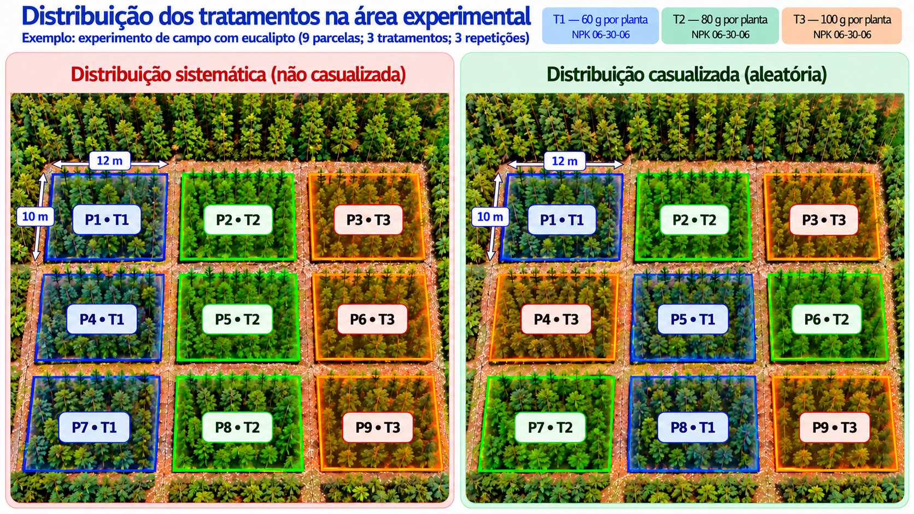
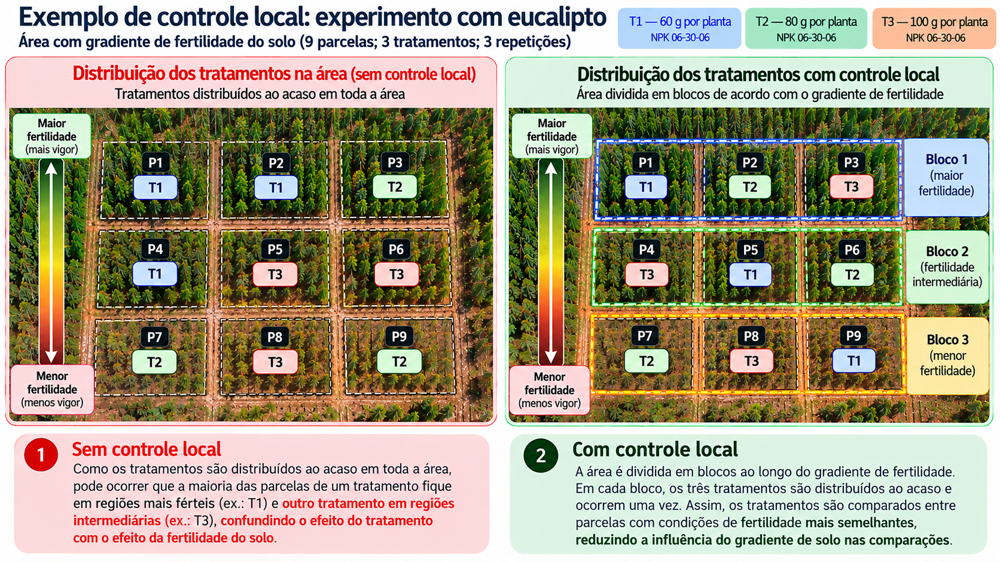

class: title-slide, center, middle
background-image: url(../assets/capa/capa.png)
background-position: center
background-size: cover
background-repeat: no-repeat

<div class="logo-lmftca"></div>
<div class="logo-ppgctif"></div>
<div class="logo-ppgbc"></div>

```{r setup, include=FALSE}
knitr::opts_chunk$set(
	error = FALSE,
	fig.align = "center",
	fig.showtext = TRUE,
	message = FALSE,
	warning = FALSE,
	cache = TRUE,
	collapse = TRUE,
	dpi = 600
)
```

```{r packages, include=FALSE}
# remotes::install_github("dill/emoGG")
# remotes::install_github("hadley/emo")
# remotes::install_github("emitanaka/anicon")
# remotes::install_github("mitchelloharawild/icons")
```

```{r xaringan-logo, echo=FALSE}
library(xaringanExtra)

use_scribble()
use_share_again()
use_progress_bar()

use_extra_styles(
  hover_code_line = TRUE,
  mute_unhighlighted_code = TRUE
)

use_editable(expires = 1)
use_clipboard()
```

<!-- title-slide -->
# Experimentação Florestal <br> (FL03034 - EF)

## ᨒ <br> `r anicon::faa("pagelines", animate="horizontal", colour="#244A6B")` Princípios Básicos da Experimentação `r anicon::faa("pagelines", animate="horizontal", colour="#244A6B")`

###### (Repetição, casualização e controle local)
<br>
##### .font140[**Prof. Dr. Deivison Venicio Souza**]
##### Universidade Federal do Pará (UFPA)
##### Faculdade de Engenharia Florestal
##### Laboratório de Manejo Florestal, Tecnologias e Comunidades Amazônicas
##### E-mail: deivisonvs@ufpa.br
<br>
##### 1ª versão: 11/agosto/2021 <br> (Atualizado em: `r format(Sys.Date(),"%d/%B/%Y")`) <br> Altamira, Pará

---
layout: true
<div class="my-header"></div>
<div class="my-footer">
<span>
Prof. Dr. Deivison Venicio Souza (deivisonvs@ufpa.br)
&emsp;&emsp;
Experimentação Florestal (FL03034 - EF)
&bull;
Princípios Básicos da Experimentação
</span>
</div>

---

## 📚 Ementa da disciplina (FL03034 - EF)
<br>

.shadow4[
.font90[

**1 - Introdução à experimentação;**  
.font75[→ *Princípios básicos: repetição, casualização e controle local*]

2 - Análise exploratória de dados;

3 - Delineamento inteiramente casualizado (DIC);

4 - Delineamento em blocos ao acaso (DBC);

5 - Delineamento em quadrado latino (DQL);

6 - Testes de comparação de médias;

7 - Experimentos em esquema fatorial;

8 - Análise de correlação e regressão linear; e

9 - Análise de experimentos com linguagem R.

]
]

---

## 🎯 Objetivos
<br>

.font80[
Ao final desta aula, você deverá ser capaz de:

- **Compreender** os princípios básicos da experimentação;
- **Distinguir** repetição, casualização e controle local;
- **Identificar** a função de cada princípio no controle da variação experimental;
- **Reconhecer** situações em que esses princípios devem ser aplicados; e
- **Aplicar** esses conceitos ao planejamento de experimentos florestais.
]

---

## 📙 Conteúdo

<br>

.pull-left[
.font90[
### Parte 1 — Da variação ao planejamento

1. Retomada do **experimento de campo**;

2. **Variação experimental** entre parcelas;

3. Unidade experimental, unidades de observação e **variável resposta**; e

4. Por que precisamos planejar a distribuição dos tratamentos.
]
]

.pull-right[
.font90[
### Parte 2 — Princípios básicos

1. **Repetição**;

2. **Casualização**;

3. **Controle local**; e

4. Integração dos três princípios.
]
]

---

## 📙 Conteúdo

<br>

.font90[
### Parte 3 — Aplicação no planejamento experimental

1. Como decidir a **organização do experimento**;

2. Aplicação em experimento de **campo com eucalipto**;

3. Aplicação em experimento de **viveiro com paricá**; e

4. Síntese para o **planejamento de experimentos florestais**.
]

<!-- Parte 1 -->
---
layout: false
name: parte1
class: top, right
background-image: url(../assets/capa/sec.png)
background-size: cover

<br>

.right[
.font100[
<span style="color: #244A6B;">**Experimentação Florestal**</span>
]
]

<br><br>

.right[
.font150[
<span style="color: #244A6B;">**Parte 1**</span>
]
]

<br><br>

.right[
.font180[
<span style="color: #0B1F3A;">**Da variação experimental<br>ao planejamento do experimento**</span>
]
]

---
layout: true
<div class="my-header"></div>
<div class="my-footer">
<span>
Prof. Dr. Deivison Venicio Souza (deivisonvs@ufpa.br)
&emsp;&emsp;
Experimentação Florestal (FL03034 - EF)
&bull;
Princípios Básicos da Experimentação
</span>
</div>

---
name: eucalipto-retomada

## 🌳 Retomando o experimento de campo

<br>

.pull-left[
.shadow4[
.font80[
### Exemplo

- Uma empresa florestal deseja avaliar o efeito de diferentes doses de
**NPK 06-30-06** sobre o crescimento de eucalipto.
- Serão comparados três tratamentos:
  - **T1:** 60 g de NPK por planta;
  - **T2:** 80 g de NPK por planta; e
  - **T3:** 100 g de NPK por planta.
]
]
]

--

.pull-right[
.shadow4[
.font80[
### Variáveis medidas/derivadas

- **DAP**;
- **Altura comercial (Hc)**; e
- **Volume individual das árvores**.

<br>

O volume individual é obtido a partir do **DAP** e da **altura comercial**.
]
]
]

<br>

.alert[
.font80[
❓ **Questão central:** Como organizar esse experimento para que as diferenças
observadas possam ser atribuídas às **doses de NPK**, e não a outras fontes de variação?
]
]

---
name: eucalipto-retomada-variacao

## 🌳 Retomando o experimento de campo

<br>
### Mesmo com a mesma dose de NPK, os resultados podem ser diferentes...

--

.pull-left[
.shadow4[
.font80[
### O que pode variar?

Imagine duas parcelas que receberam exatamente o **mesmo tratamento**.

Ainda assim, elas podem apresentar diferenças de:

- **DAP**;
- **altura comercial**;
- **volume das árvores**; e
- **volume da parcela**.
]
]
]

--

.pull-right[
.shadow4[
.font80[
### Por que isso pode acontecer?

- Diferenças nas características do **solo**;
- Variações na disponibilidade de **água**;
- Posição das parcelas no **terreno**;
- Diferenças de **sobrevivência e crescimento** das árvores; e
- Outras condições **ambientais**.
]
]
]

--

.alert[
.font80[
💡 Diferenças entre parcelas submetidas ao mesmo tratamento mostram que existe
**variação experimental**.

💡 Portanto, nem toda diferença observada entre parcelas é consequência direta
do **tratamento**.
]
]

---
layout: false
name: variacao-viveiro-ilustracao
background-image: url(fig/eucalipto-dap.png)
background-size: contain
background-position: center
background-repeat: no-repeat

---
layout: false
name: variacao-viveiro-ilustracao
background-image: url(fig/eucalipto-hc.png)
background-size: contain
background-position: center
background-repeat: no-repeat

---
layout: false
name: variacao-viveiro-ilustracao
background-image: url(fig/eucalipto-volume.png)
background-size: contain
background-position: center
background-repeat: no-repeat

---
name: arvore-parcela-volume

## 🌳 Qual variável resposta?

##### Medimos as árvores individualmente, mas comparamos os tratamentos entre parcelas...

.pull-left[
.font80[
### Dentro de cada parcela

Para cada uma das **20 árvores**:

- Mede-se o **DAP**;
- Mede-se a **altura comercial**; e
- Calcula-se o **volume individual**.

$$
V_i =
\frac{\pi \cdot DAP_i^2}{40.000}
\cdot Hc_i \cdot 0,45
$$
Depois, soma-se os volumes das árvores:

$$V_{\text{parcela}} = \sum_{i=1}^{20}V_i$$
]
]

--

.pull-right[
.font80[
### Entre as parcelas

Cada parcela recebe **um único tratamento**:

- **T1:** 60 g de NPK por planta;
- **T2:** 80 g de NPK por planta; e
- **T3:** 100 g de NPK por planta.

Cada tratamento foi aplicado a **3 parcelas diferentes**.

<br>

.alert[
.font80[
- **A parcela é a unidade experimental.**
- As 20 árvores são **unidades de observação** dentro da parcela.
]
]
]
]

---
layout: false
name: parte2
class: top, right
background-image: url(../assets/capa/sec.png)
background-size: cover

<br>

.right[
.font100[
<span style="color: #244A6B;">**Experimentação Florestal**</span>
]
]

<br><br>

.right[
.font150[
<span style="color: #244A6B;">**Parte 2**</span>
]
]

<br><br>

.right[
.font180[
<span style="color: #0B1F3A;">**Princípios básicos<br>da experimentação**</span>
]
]

<br><br>

.right[
.font100[
<span style="color: #3F6B5B;">
**Repetição • Casualização • Controle local**
</span>
]
]

---
layout: true
<div class="my-header"></div>
<div class="my-footer">
<span>
Prof. Dr. Deivison Venicio Souza (deivisonvs@ufpa.br)
&emsp;&emsp;
Experimentação Florestal (FL03034 - EF)
&bull;
Princípios Básicos da Experimentação
</span>
</div>

---
name: por-que-repetir

## 🔁 Por que repetir os tratamentos?

<br>

.pull-left[
.shadow4[
.font80[
### .font80[Mas, se usássemos apenas uma parcela por tratamento?]

- **T1** → 1 parcela;
- **T2** → 1 parcela; e
- **T3** → 1 parcela.

<br>

.alert[
.font80[
❓ Se T2 apresentasse maior volume, poderíamos afirmar que isso ocorreu
**por causa da dose de NPK**?
]
]
]
]
]

.pull-right[
.shadow4[
.font80[
### .font80[Não necessariamente...]

A diferença também poderia estar associada a:

- Pequenas diferenças de **solo**;
- Disponibilidade de **água**;
- Posição no terreno;
- Sobrevivência das árvores; e
- Outras fontes de **variação experimental**.

<br>

.alert2[
.font80[
💡 Por isso, cada tratamento deve ser aplicado a
**várias unidades experimentais independentes**.
]
]
]
]
]

---
name: repeticao-conceito

## 🔁 Repetição

.pull-left[
.shadow4[
.font80[
### .font80[Conceito]

A **repetição** consiste em aplicar o mesmo tratamento a
**mais de uma unidade experimental independente**.

No experimento com eucalipto:

- **T1** → 3 parcelas;
- **T2** → 3 parcelas; e
- **T3** → 3 parcelas.

Portanto, cada tratamento possui **3 repetições experimentais**.
]
]
]

.pull-right[
.shadow4[
.font80[
### .font80[No nosso experimento...]

Cada parcela contém **20 árvores**, porém:

- A **parcela** recebe o tratamento;
- As árvores são avaliadas dentro da parcela;
- As 20 árvores **não representam 20 repetições**; e
- Cada **parcela independente** representa uma repetição experimental.
]
]
]

<br>

.alert[
.font80[
💡 **3 parcelas × 20 árvores = 3 repetições experimentais e 60 unidades de observação por tratamento.**
]
]

---
name: repeticao-variacao

## 🔁 O que a repetição nos permite observar?

.pull-left[
.shadow4[
.font80[
### .font80[Mesmo tratamento...]

Considere as três parcelas que receberam o tratamento  
**T1 — 60 g de NPK por planta**:

- **P1** → volume total = **0,9650 m³**;
- **P5** → volume total = **0,9701 m³**; e
- **P8** → volume total = **0,9978 m³**.

Embora tenham recebido exatamente o **mesmo tratamento**, as parcelas apresentaram respostas diferentes.
]
]
]

.pull-right[
.shadow4[
.font80[
### .font80[O que isso mostra?]

Essas diferenças representam a **variação experimental** entre **unidades experimentais** submetidas ao **mesmo tratamento**.

A repetição permite:

- Observar a **variação entre parcelas**;
- Avaliar a consistência da resposta ao tratamento; e
- Obter uma estimativa mais confiável da resposta do tratamento.
]
]
]

<br>

.alert[
.font80[
💡 **Mesmo tratamento não significa resposta idêntica.**

💡 A repetição permite observar quanto as **unidades experimentais variam entre si**.
]
]

---
name: casualizacao-introducao

## 🎲 Por que casualizar os tratamentos?

.pull-left[
.shadow4[
.font80[
### .font80[Distribuição sistemática]

Imagine que a área experimental seja considerada
**suficientemente homogênea**.

Portanto, o pesquisador decide distribuir os tratamentos
de forma sistemática:

- **T1** sempre no lado esquerdo;
- **T2** sempre na região central; e
- **T3** sempre no lado direito.

Essa organização cria uma associação direta entre
**tratamento e posição na área experimental**.
]
]
]

.pull-right[
.shadow4[
.font80[
### .font80[Qual é o problema?]

Mesmo em uma área aparentemente homogênea, podem existir
**variações espaciais não identificadas**, relacionadas, por exemplo, a:

- Propriedades do solo;
- Disponibilidade de água;
- Microrelevo; e
- Outras condições ambientais.

Assim, diferenças entre tratamentos poderiam estar associadas
também às **posições ocupadas pelas parcelas**.
]
]
]

<br>

.alert[
.font80[
💡 A **casualização** evita que a escolha do pesquisador associe
sistematicamente determinado tratamento a uma posição da área experimental.
]
]

---
name: casualizacao-conceito

## 🎲 Casualização

.pull-left[
.shadow4[
.font80[
### .font80[Conceito]

- A **casualização** consiste em distribuir os tratamentos entre as unidades experimentais **ao acaso**.
- A escolha de qual tratamento será aplicado a cada unidade experimental é feita por um **procedimento aleatório**.
- Dessa forma, evita-se uma associação intencional entre **tratamento e posição**.
]
]
]

.pull-right[
.shadow4[
.font80[
### .font80[No nosso experimento...]

Temos **9 parcelas** e três tratamentos:

- **T1** → 3 parcelas;
- **T2** → 3 parcelas; e
- **T3** → 3 parcelas.

A definição de quais parcelas receberão T1, T2 ou T3 deve ser feita por um **procedimento aleatório**.
]
]
]

<br>

.alert[
.font85[
💡 A casualização dá aos tratamentos a **mesma probabilidade de ocupar as diferentes posições** da área experimental.

💡 A **casualização não elimina a variação espacial** existente na área experimental.

💡 Ela evita que um tratamento fique **sistematicamente associado a determinada posição**.
]
]

---
name: casualizacao-aplicacao

## 🎲 Distribuição sistemática × distribuição casualizada

.center[

]


---
name: controle-local-introducao

## 🧱 E quando a variação espacial é conhecida?

.pull-left[
.shadow4[
.font80[
### .font80[Uma nova situação...]

- Imagine que, antes da instalação do experimento, seja identificado um
**gradiente de fertilidade do solo** na área experimental.
- Nesse caso, sabemos previamente que diferentes regiões da área experimental apresentam 
**condições de fertilidade distintas**, capazes de influenciar o crescimento das árvores.

<br>

Por exemplo:

- Maior fertilidade em uma região;
- Fertilidade intermediária em outra; e
- Menor fertilidade em outra região.
]
]
]

.pull-right[
.shadow4[
.font80[
### .font80[Qual seria o problema?]

- Se os tratamentos fossem **distribuídos aleatoriamente** em toda a área, várias parcelas do mesmo tratamento poderiam 
ficar agrupadas em uma mesma região.
- Assim, as diferenças de fertilidade entre as regiões poderiam influenciar a comparação entre os tratamentos.

<br>

.alert2[
.font85[
💡 Quando uma fonte importante de variação é conhecida, podemos **organizar as parcelas para reduzir sua influência nas comparações entre os tratamentos**.
]
]
]
]
]

---
name: controle-local-aplicacao

## 🧱 Como aplicar o controle local?

.pull-left[
.shadow4[
.font80[
### .font80[Organizando a área]

- Como existe um **gradiente de fertilidade conhecido**, a área pode ser dividida em
**grupos de parcelas com condições mais semelhantes**.

Por exemplo:

- Região de **maior fertilidade**;
- Região de **fertilidade intermediária**; e
- Região de **menor fertilidade**.

<br>

- Assim, as comparações entre os tratamentos são feitas em parcelas com **condições ambientais mais semelhantes**.
]
]
]

.pull-right[
.shadow4[
.font80[
### .font80[E os tratamentos?]

Dentro de cada grupo de parcelas:

- Devem estar presentes **T1, T2 e T3**;
- Os tratamentos são distribuídos **ao acaso**; e
- Cada tratamento ocorre uma vez em cada grupo.

Dessa forma, os tratamentos são comparados sob condições de fertilidade mais semelhantes.

]
]

.alert[
💡 O **controle local** consiste em agrupar unidades experimentais semelhantes
e realizar a **casualização dos tratamentos dentro de cada grupo**.
]

]

---
name: controle-local-blocos

## 🧱 Organizando as parcelas em grupos homogêneos

.pull-left[
.shadow4[
.font80[
### .font80[Considerando o gradiente...]

Suponha que a fertilidade varie ao longo da área:

- **Região 1:** maior fertilidade;
- **Região 2:** fertilidade intermediária; e
- **Região 3:** menor fertilidade.

As parcelas de cada região apresentam condições de fertilidade mais semelhantes entre si.

<br>

Assim, cada região pode formar um **grupo de parcelas**.
]
]
]

.pull-right[
.shadow4[
.font80[
### .font80[Distribuição dos tratamentos]

Em cada grupo, devem estar presentes os três tratamentos:

- **Grupo 1:** P1 → T1 | P2 → T2 | P3 → T3;
- **Grupo 2:** P4 → T3 | P5 → T1 | P6 → T2;
- **Grupo 3:** P7 → T2 | P8 → T1 | P9 → T3.

Dentro de cada grupo, a posição dos tratamentos é definida **ao acaso**.
]
]
]

<br>

.alert[
.font80[
💡 Esses grupos de unidades experimentais com condições mais semelhantes são chamados de **blocos**.

💡 O **controle local** permite comparar os tratamentos em parcelas com condições de fertilidade mais semelhantes, reduzindo a influência do gradiente do solo.
]
]

---
name: controle-local-exemplo

## 🧱 Controle local no experimento com eucalipto

.center[

]

---
name: principios-integracao

## 🧩 Como os três princípios atuam no experimento?

.pull-left[
.shadow4[
.font80[
### .font80[🔁 Repetição]

- Cada tratamento é aplicado a **mais de uma unidade experimental**. Isso permite:
  - Observar a variação entre parcelas submetidas ao mesmo tratamento; e
  - Obter uma estimativa mais confiável da resposta do tratamento.
]
]
]

--

.pull-right[
.shadow4[
.font80[
### .font80[🎲 Casualização]

- Os tratamentos são distribuídos entre as unidades experimentais **ao acaso**.
- Isso evita que um tratamento fique associado sistematicamente a uma determinada **posição da área experimental**.
]
]
]

--

.shadow4[
.font80[
### .font80[🧱 Controle local]

- Quando existe uma fonte importante de variação **conhecida**, as parcelas são agrupadas de acordo com condições mais semelhantes. Na sequência, os tratamentos são distribuídos **ao acaso dentro de cada grupo**.
]
]

--

.alert[
.font80[
💡 **Repetição, casualização e controle local** ajudam a tornar mais confiável a comparação entre os tratamentos, reduzindo a influência de outras fontes de variação experimental.
]
]

---
layout: false
name: parte3
class: top, right
background-image: url(../assets/capa/sec.png)
background-size: cover

<br>

.right[
.font100[
<span style="color: #244A6B;">**Experimentação Florestal**</span>
]
]

<br><br>

.right[
.font150[
<span style="color: #244A6B;">**Parte 3**</span>
]
]

<br><br>

.right[
.font180[
<span style="color: #0B1F3A;">**Aplicação dos princípios<br>no planejamento experimental**</span>
]
]

<br><br>

.right[
.font100[
<span style="color: #3F6B5B;">
**Do conceito à organização do experimento**
</span>
]
]

---
layout: true
<div class="my-header"></div>
<div class="my-footer">
<span>
Prof. Dr. Deivison Venicio Souza (deivisonvs@ufpa.br)
&emsp;&emsp;
Experimentação Florestal (FL03034 - EF)
&bull;
Princípios Básicos da Experimentação
</span>
</div>

---
name: aplicacao-principios-eucalipto

## 🌳 Aplicando os princípios no experimento com eucalipto

.pull-left[
.shadow4[
.font80[
### .font80[O experimento]

Serão avaliadas três doses de **NPK 06-30-06**:

- **T1** → 60 g por planta;
- **T2** → 80 g por planta; e
- **T3** → 100 g por planta.

<br>

O experimento possui:

- **9 parcelas**;
- **3 tratamentos**; e
- **3 repetições por tratamento**.
]
]
]

.pull-right[
.shadow4[
.font80[
### .font80[Como organizar o experimento?]

No planejamento, devemos definir:

- Quantas vezes cada tratamento será **repetido**;
- Como os tratamentos serão distribuídos **ao acaso**;
- Se existe alguma fonte conhecida de variação que exija **controle local**; e
- Quais parcelas receberão cada tratamento.
]
]
]

<br>

.alert[
.font80[
💡 O planejamento experimental combina os princípios de **repetição, casualização e, quando necessário, controle local**.
]
]

---
name: necessidade-controle-local

## 🌳 O controle local é sempre necessário?

.pull-left[
.shadow4[
.font80[
### .font80[Área suficientemente homogênea]

Se não houver uma fonte importante de variação espacial conhecida:

- Os tratamentos podem ser distribuídos **ao acaso entre todas as parcelas**;
- Mantém-se a **repetição** de cada tratamento; e
- Não é necessário formar grupos de parcelas.

<br>

💡 Nesse caso, **repetição e casualização** são suficientes para organizar o experimento.
]
]
]

.pull-right[
.shadow4[
.font80[
### .font80[Área com heterogeneidade conhecida]

Se houver uma fonte importante de variação conhecida, como um
**gradiente de fertilidade do solo**:

- As parcelas devem ser agrupadas em condições mais semelhantes;
- Cada grupo deve conter **T1, T2 e T3**; e
- Os tratamentos são distribuídos **ao acaso dentro de cada grupo**.

<br>

💡 Nesse caso, além da repetição e da casualização, utilizamos o **controle local**.

]
]
]

<br>

.alert[
.font80[
🔎 A necessidade de **controle local** depende das características da área experimental e das fontes de variação que podem ser identificadas antes da instalação do experimento.
]
]

---
name: planejamento-sequencia

## 🌳 Como decidir a organização do experimento?

.shadow4[
.font80[
#### Passo 1: Avaliar a área experimental

- Antes de distribuir os tratamentos, devemos verificar se existe alguma
**fonte importante e conhecida de variação** entre as parcelas.
]
]

.pull-left[
.shadow4[
.font80[
#### Passo 2: Se a área for suficientemente homogênea

- Manter as **3 repetições** de cada tratamento;
- Considerar as 9 parcelas como um único conjunto; e
- Distribuir **T1, T2 e T3 ao acaso** entre as parcelas.

➡️ **Repetição + casualização**
]
]
]

.pull-right[
.shadow4[
.font80[
#### Passo 3: Se houver heterogeneidade conhecida

- Formar grupos de parcelas com condições mais semelhantes;
- Incluir **T1, T2 e T3 em cada grupo**; e
- Distribuir os tratamentos **ao acaso dentro de cada grupo**.

➡️ **Repetição + casualização + controle local**
]
]
]

.alert[
.font80[
💡 Primeiro identificamos as características da **área experimental**; depois definimos como os tratamentos serão distribuídos.
]
]

---
name: arranjos-finais

## 🌳 Duas formas de organizar o experimento

.pull-left[
.shadow4[
.font80[
### .font80[Área suficientemente homogênea]

Os tratamentos são distribuídos **ao acaso entre todas as 9 parcelas**.

- **3 tratamentos**;
- **3 repetições por tratamento**;
- **9 parcelas experimentais**; e
- nenhuma fonte conhecida de heterogeneidade exige agrupamento.

.alert2[
.font85[
➡️ **Repetição + casualização**
]
]
]
]
]

.pull-right[
.shadow4[
.font80[
### .font80[Área com gradiente conhecido]

As parcelas são primeiro organizadas em **3 grupos mais homogêneos**.

Em cada grupo:

- estão presentes **T1, T2 e T3**;
- cada tratamento ocorre uma vez; e
- a posição dos tratamentos é definida **ao acaso**.

.alert2[
.font85[
➡️ **Repetição + casualização + controle local**
]
]
]
]
]

<br>

.alert[
.font80[
💡 O princípio do **controle local** é utilizado quando existe uma fonte de variação conhecida que pode ser considerada no planejamento do experimento.
]
]

---
name: exemplo-viveiro

## 🌱 Exemplo de aplicação em viveiro

.pull-left[
.shadow4[
.font80[
### .font80[Situação experimental]

- Um viveiro deseja avaliar três substratos para produção de mudas de
**paricá** (*Schizolobium parahyba* var. *amazonicum*):
  - **T1:** 100% terra preta;
  - **T2:** 75% terra preta + 25% caroço de açaí triturado; e
  - **T3:** 50% terra preta + 50% caroço de açaí triturado.

<br>

- As mudas serão avaliadas durante **90 dias após a semeadura**.
]
]
]

.pull-right[
.shadow4[
.font80[
### .font80[Variáveis avaliadas]

Ao final do experimento, poderão ser avaliados:

- **Emergência** das plântulas;
- **Altura** das mudas;
- **Diâmetro do colo**; e
- **Sobrevivência**.

<br>

.alert2[
.font85[
❓ Como devemos organizar os tratamentos no viveiro para realizar comparações confiáveis?
]
]
]
]
]

---
name: exemplo-viveiro-planejamento

## 🌱 Como organizar o experimento no viveiro?

.pull-left[
.shadow4[
.font80[
### .font80[Uma característica do viveiro]

👉 Suponha que exista uma diferença conhecida entre as posições da bancada:
- Uma extremidade recebe **maior intensidade de luz**;
- A região central apresenta **condição intermediária**; e
- A outra extremidade recebe **menor intensidade de luz**.

👉 Essa diferença pode influenciar o crescimento das mudas,
independentemente do substrato utilizado.
]
]
]

.pull-right[
.shadow4[
.font80[
### .font80[Como planejar?]

Nesse caso, podemos:

- Dividir a bancada em **grupos de posições semelhantes**;
- Colocar **T1, T2 e T3 em cada grupo**;
- Distribuir os tratamentos **ao acaso dentro de cada grupo**; e
- Utilizar mais de uma unidade experimental para cada tratamento.
]
]
]

.alert[
.font80[
💡 Nesse experimento aparecem os três princípios:

👉 **Repetição** → várias unidades experimentais por tratamento;  
👉 **Casualização** → sorteio dos tratamentos;  
👉 **Controle local** → agrupamento de posições com condições semelhantes de luz.
]
]

---
name: sintese-planejamento

## ✅ Antes de instalar um experimento, pergunte...

.pull-left[
.shadow4[
.font80[
### .font80[🔁 Quantas unidades experimentais?]

- Cada tratamento deve ser aplicado a **mais de uma unidade experimental independente**.

➡️ Isso define a **repetição**.
]
]
]

.pull-right[
.shadow4[
.font80[
### .font80[🎲 Como distribuir os tratamentos?]

- A escolha de qual tratamento será aplicado a cada unidade experimental deve ser feita **ao acaso**.

➡️ Isso define a **casualização**.
]
]
]

.shadow4[
.font80[
### .font80[🧱 Existe uma fonte conhecida de variação?]

- Se houver uma fonte importante e conhecida de heterogeneidade, como um
**gradiente de fertilidade**, as parcelas podem ser organizadas em grupos com condições mais semelhantes.
- Em seguida, os tratamentos são distribuídos **ao acaso dentro de cada grupo**.

➡️ Isso caracteriza o **controle local**.
]
]

.alert[
.font80[
💡 Um bom planejamento experimental começa pela identificação das **unidades experimentais**, das **fontes de variação** e da forma como os **tratamentos serão distribuídos**.
]
]

---
## Referências
<br><br>

COSTA, J. R. (2003). **Técnicas experimentais aplicadas às ciências agrárias**. In: Embrapa Agrobiologia-Documentos (INFOTECA-E).

DIAS, L. D. S.; W., Barros (2009). **Biometria experimental** , p. 408p.

<!--Slide XX -->
---
layout: false
name: etim
class: inverse, middle, center
background-image: url(../assets/capa/sec.png)
background-size: cover

## .font200[Até a próxima!]

```{r, echo=FALSE, out.width='20%', fig.align='center', fig.cap='', dpi=600}
knitr::include_graphics('../assets/logos/LMFTCA.png')
```

👨🏻‍👩🏻‍👦🏻‍👦🏻 [@lmftca_ufpa](https://www.instagram.com/lmftca_ufpa/)

🌎 [https://www.lmftca.com.br/](https://www.lmftca.com.br/)
