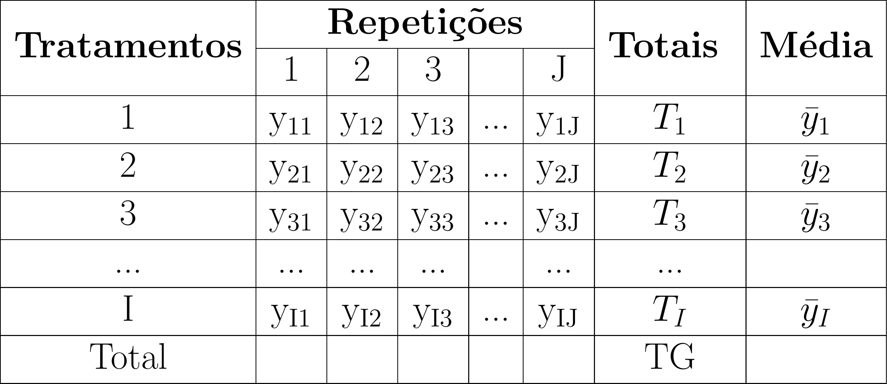

class: title-slide, center, middle
background-image: url(../assets/capa/capa.png)
background-position: center
background-size: cover
background-repeat: no-repeat

<div class="logo-lmftca"></div>
<div class="logo-ppgctif"></div>
<div class="logo-ppgbc"></div>

```{r setup, include=FALSE}
knitr::opts_chunk$set(
	error = FALSE,
	fig.align = "center",
	fig.showtext = TRUE,
	message = FALSE,
	warning = FALSE,
	cache = TRUE,
	collapse = TRUE,
	dpi = 600
)
```

```{r packages, include=FALSE}
# remotes::install_github("dill/emoGG")
# remotes::install_github("hadley/emo")
# remotes::install_github("emitanaka/anicon")
# remotes::install_github("mitchelloharawild/icons")
```

```{r xaringan-logo, echo=FALSE}
library(xaringanExtra)

use_scribble()
use_share_again()
use_progress_bar()

use_extra_styles(
  hover_code_line = TRUE,
  mute_unhighlighted_code = TRUE
)

use_editable(expires = 1)
use_clipboard()
```

```{r customDT, echo=F}
CustomDT <- function(data){
  data %>% DT::datatable(editable = 'cell', rownames = FALSE,
                         style = "default",
                         class = "display", width = '400px',
                         caption = '',
     options=list(pageLength = 12, dom = 'tip', autoWidth = F,
       initComplete = htmlwidgets::JS(
          "function(settings, json) {",
          paste0("$(this.api().table().container()).css({'font-size': '", "10pt", "'});"),
          "}")
       ) 
     )
}
```

```{r customkbl, echo=F}
Customkbl <- function(data){
  data %>%
    kbl() %>%
    kable_classic(full_width = F, html_font = "Cambria") %>% 
  kable_paper(bootstrap_options = "striped", full_width = F) %>% 
  kable_styling(bootstrap_options = "striped", font_size = 18, position = "center") %>% 
  row_spec(1:4, color = 'black', background = 'white') %>% 
  row_spec(0, color = 'white', background = 'black') %>% 
  column_spec(1, color = 'white', background = 'black')
}
```


<!-- title-slide -->
# Experimentação Florestal <br> (FL03034 - EF)

## ᨒ <br> `r anicon::faa("pagelines", animate="horizontal", colour="#244A6B")` Delineamento Inteiramente Casualizado`r anicon::faa("pagelines", animate="horizontal", colour="#244A6B")`

###### (Conceitos, características e fundamentos)
<br>
##### .font140[**Prof. Dr. Deivison Venicio Souza**]
##### Universidade Federal do Pará (UFPA)
##### Faculdade de Engenharia Florestal
##### Laboratório de Manejo Florestal, Tecnologias e Comunidades Amazônicas
##### E-mail: deivisonvs@ufpa.br
<br>
##### 1ª versão: 02/setembro/2021 <br> (Atualizado em: `r format(Sys.Date(),"%d/%B/%Y")`) <br> Altamira, Pará

---
layout: true
<div class="my-header"></div>
<div class="my-footer"><span>Prof. Dr. Deivison Venicio Souza (E-mail: deivisonvs@ufpa.br)&emsp;&emsp;&emsp;&emsp;&emsp;Experimentação Florestal (FL03034 - EF) - Delineamento Inteiramente Casualizado</div>

---

## Ementa da disciplina (FL03034 - EF)

.shadow3[
<br>
1 - Introdução à experimentação; 

2 - Análise exploratória de dados;

**3 - Delineamento inteiramente casualizado - DIC;**

4 - Delineamento em blocos ao acaso - DBC;

5 - Delineamento em quadrado latino - DQL;

6 - Testes de comparação de médias; 

7 - Experimentos em esquema fatorial;

8 - Análise de correlação e regressão linear; e

9 - Análise de experimentos com linguagem R.

]

---

## Objetivos
<br><br>
Ao final desta aula espera-se que o discente seja capaz de...

.font90[
* Conhecer e entender os princípios básicos de experimentos em DIC.
* Compreender o modelo estatístico de experimentos em DIC.
* Aprender a realizar a Análise de Variância (ANOVA) de experimentos em DIC, e entender seus pressupostos.
* Realizar análise de experimentos em DIC usando a linguagem de programação R.
]

---

## Conteúdo

.pull-left-4[
.font80[
**Parte 1 – Delineamento Inteiramente Casualizado (DIC)**

[1 – Delineamento experimental: conceito](#de)

[2 – Principais delineamentos experimentais](#pde)

[3 – DIC: conceito](#con)

[4 – DIC: principais características](#dicpc)

[5 – DIC: vantagens e limitações](#dicvl)

[6 – DIC: representação genérica](#rg)

[7 – DIC: modelo estatístico](#me)

[8 – DIC: análise de variância](#dicaov)

]
]

.pull-right-4[
.pull-down[
.font50[
⠀⠀⠀⠀⠀⠀⠀⠀⠀⠀⠀⠀⠀⠀⠀⠀⠀⢱⣸⠀⠀⠀⠀⠀⠀⠀⠀⡄⡄⢀⠀⠀⠀⠀⠀⠀⠀⠀⠀⠀⠀⠀⠀⠀⠀⠀⠀⢀⠀⠀⠀⠀⠀⠀⠀
⠀⠀⠀⠀⠀⠀⠀⠀⠀⠀⠀⠀⢀⡀⢶⢠⠀⢀⡸⡄⠒⢺⠀⣸⣀⡀⣦⠽⠑⠁⠀⠀⠀⠀⠀⠀⠀⣆⣀⠗⠂⠀⠀⡆⢠⠃⡠⠜⠒⠀⠀⠀⠀⠀⠀
⠀⠀⠀⠀⠀⠀⠀⠀⠀⡄⠀⢤⠞⢳⠊⠓⠣⢸⡸⣲⠇⣘⣦⠚⢗⣻⠉⠻⡴⠂⢀⣀⠀⠀⣠⠂⠀⡇⠀⠀⠀⠀⡚⡲⢃⡉⠀⠀⠀⠀⠀⠀⠀⠀⠀
⠀⠀⠀⠀⠀⠀⠀⠀⠐⠺⠤⢼⡀⡞⢶⠦⣤⡖⠯⠭⡽⠟⡲⠀⠀⣆⠴⠊⢀⠀⠈⠅⡜⠒⠁⠀⠀⠉⢱⠀⠀⠀⠈⣑⡼⠁⢀⢠⢠⠄⢠⠆⠀⠀⠀
⠀⠀⠀⠀⠀⠀⠢⢄⢳⣁⣀⠆⠃⣇⡇⠜⠍⢳⡄⢰⢃⡈⡩⣲⠾⡃⢀⠀⠘⠤⢁⣠⠃⢠⢼⣇⣰⢃⣼⠀⠀⠀⣩⡾⠦⣆⠷⣅⠜⠉⠁⠀⠀⠀⠀
⠀⠀⠀⢦⠀⠈⠒⡥⣽⢁⠌⢹⢶⡤⡧⣾⠀⠀⠙⣾⣤⠖⠿⡿⣄⡗⢴⢣⡌⢲⣩⠚⠸⣌⣍⠹⣸⣚⡙⢷⣤⠞⠡⢄⣀⡳⣎⠀⠀⠀⠀⠀⠀⠀⠀
⠀⢄⣣⡈⠦⡜⣸⡹⣰⠃⡀⢱⣛⣰⣑⢽⣧⠀⢰⣿⡇⠰⠋⠑⡜⡗⡞⠋⠂⠘⢦⠳⣠⠿⠦⣼⢩⣤⢊⡾⠋⠀⠀⠀⠋⠀⢨⠏⠀⠀⠀⠀⠀⠀⠀
⠀⠀⢁⠇⠀⡏⠀⠈⢾⡄⠙⣤⠃⣟⠀⠋⣿⣅⡾⢻⢀⡀⡆⣰⣥⣟⢱⣞⣀⠀⣨⠧⣯⡀⠀⢸⣈⣷⡟⠀⢀⢦⠀⠀⠀⢠⠏⠀⠀⡀⣷⠀⠀⠀⠀
⠤⢲⠚⢒⢻⠙⢶⣴⢺⠉⠒⡧⠔⠛⠲⢤⣸⣿⠁⣼⡶⠿⠿⣽⣓⣸⢿⣓⡶⣚⢧⡷⣿⢫⣦⣸⣿⠏⢹⡴⠋⠸⡄⠀⠀⡞⠀⢰⣰⢣⠊⠀⣰⡠⠀
⠀⠈⡄⠀⢭⡇⡀⠉⠻⣇⠀⡇⠀⠀⠀⣀⡝⢿⡆⣿⢁⢀⡴⠋⣏⣏⡼⠋⡷⣇⡝⣇⣿⡜⠋⣿⣿⡆⣼⡝⡄⣠⢹⠀⣸⠁⠀⠀⠀⠛⣄⣸⡖⠊⠀
⠐⠴⣅⡆⠘⡎⢢⠀⠀⢹⣎⣷⠀⠀⣀⡕⠻⢚⣿⣿⡉⠉⠳⣄⣰⠟⠑⢶⠁⠹⢴⠁⡇⣠⣴⠿⣏⣾⡇⢹⡃⡗⢸⣷⢃⣠⠔⠋⠀⢠⠃⠀⠑⠹⠀
⠀⢤⢎⣈⡲⠵⣈⠉⠓⣾⠙⣾⣇⠀⠀⠛⣆⡇⢻⣿⡇⠀⣠⡾⠛⢶⡆⠈⣇⣰⠏⢰⣿⢏⡏⢠⣏⣼⠞⠉⠉⠱⣿⢿⡭⣄⠀⠀⢠⠏⠀⠀⠀⠀⠀
⠐⠚⠒⠂⠼⣄⠀⠉⠢⣼⡀⠈⢻⣆⠠⡄⠳⡇⢸⣿⣧⣾⡟⠀⠀⢸⡇⠀⣸⠋⠀⣼⡏⢾⠛⣿⢹⡏⠀⠀⢀⡼⠃⢘⠂⢨⠀⢀⡞⠀⢀⠄⢀⠆⡀
⠀⠀⠀⠀⠀⠈⠳⣄⠀⠈⠳⣄⠀⣿⣆⠸⡠⠜⣆⣿⣿⠏⠀⠀⠀⢸⡇⢰⠇⠀⢀⣿⠁⣿⢰⡇⣼⠁⠀⢠⡞⠁⠀⠸⣚⣮⠵⠟⠓⠦⣸⠀⡤⠼⠓
⠀⠀⠀⠀⠀⠀⠀⠙⢦⣀⣀⣈⠳⣜⢿⣯⠀⠀⢈⣿⡿⠦⣤⣀⠀⢸⣷⡏⠀⠀⣸⣿⡾⠋⣿⢁⡟⠀⣰⣯⣤⠶⠞⣋⠽⢓⣒⡡⠤⠒⠛⠳⢧⡀⡄
⠀⠀⠀⠀⠀⠀⠀⠀⠀⠉⠉⠉⠉⠙⠳⣿⣷⡀⢸⣿⡇⠀⠀⠉⠛⢾⣿⠀⠀⠀⣿⡟⠁⣸⣿⣾⣿⣿⠟⢉⣠⣴⠞⠋⠉⠉⠉⠂⠀⠀⠀⠀⠈⠃⠀
⠀⠀⠀⠀⠀⠀⠀⠀⠀⠀⠀⠀⠀⠀⠀⠈⢻⣿⣾⣿⡇⠀⠀⠀⠀⢸⣿⠀⠀⢸⡟⢀⣼⡿⠋⣼⣿⣿⡿⠛⠉⠀⠀⠀⠀⠀⠀⠀⠀⠀⠀⠀⠀⠀⠀
⠀⠀⠀⠀⠀⠀⠀⠀⠀⠀⠀⠀⠀⠀⠀⠀⠀⠙⣿⣿⡇⠀⠀⠀⠀⠀⣿⡀⠀⣿⣷⡿⠋⠀⢠⣿⠟⠁⠀⠀⠀⠀⠀⠀⠀⠀⠀⠀⠀⠀⠀⠀⠀⠀⠀
⠀⠀⠀⠀⠀⠀⠀⠀⠀⠀⠀⠀⠀⠀⠀⠀⠀⠀⢸⣿⣿⣄⠀⠀⠀⠀⢿⡇⣸⣿⠟⠀⠀⢀⣾⡏⠀⠀⠀⠀⠀⠀⠀⠀⠀⠀⠀⠀⠀⠀⠀⠀⠀⠀⠀
⠀⠀⠀⠀⠀⠀⠀⠀⠀⠀⠀⠀⠀⠀⠀⠀⠀⠀⢸⣿⣿⣿⣆⠀⠀⠀⣸⣷⣿⡇⠀⠀⠀⣼⡟⠀⠀⠀⠀⠀⠀⠀⠀⠀⠀⠀⠀⠀⠀⠀⠀⠀⠀⠀⠀
⠀⠀⠀⠀⠀⠀⠀⠀⠀⠀⠀⠀⠀⠀⠀⠀⠀⠀⠸⣿⡏⢿⣿⣦⣀⣾⣿⢯⣿⠀⠀⠀⣼⡟⠀⠀⠀⠀⠀⠀⠀⠀⠀⠀⠀⠀⠀⠀⠀⠀⠀⠀⠀⠀⠀
⠀⠀⠀⠀⠀⠀⠀⠀⠀⠀⠀⠀⠀⠀⠀⠀⠀⠀⢠⣿⣿⣮⣿⣿⣿⡿⠁⣸⡟⠀⠀⣼⡟⠀⠀⠀⠀⠀⠀⠀⠀⠀⠀⠀⠀⠀⠀⠀⠀⠀⠀⠀⠀⠀⠀
⠀⠀⠀⠀⠀⠀⠀⠀⠀⠀⠀⠀⠀⠀⠀⠀⠀⠀⠘⢿⣿⣿⣿⣿⡟⠀⢠⣿⠃⠀⣼⡿⠁⠀⠀⠀⠀⠀⠀⠀⠀⠀⠀⠀⠀⠀⠀⠀⠀⠀⠀⠀⠀⠀⠀
⠀⠀⠀⠀⠀⠀⠀⠀⠀⠀⠀⠀⠀⠀⠀⠀⠀⠀⠀⠀⠹⣿⣿⣿⣷⣠⣾⣿⣤⣾⣿⡇⠀⠀⠀⠀⠀⠀⠀⠀⠀⠀⠀⠀⠀⠀⠀⠀⠀⠀⠀⠀⠀⠀⠀
⠀⠀⠀⠀⠀⠀⠀⠀⠀⠀⠀⠀⠀⠀⠀⠀⠀⠀⠀⠀⠀⠸⣿⣿⣿⣿⣿⣿⠟⠋⠁⠀⠀⠀⠀⠀⠀⠀⠀⠀⠀⠀⠀⠀⠀⠀⠀⠀⠀⠀⠀⠀⠀⠀⠀
⠀⠀⠀⠀⠀⠀⠀⠀⠀⠀⠀⠀⠀⠀⠀⠀⠀⠀⠀⠀⠀⠀⣿⣿⣿⣿⣿⡟⠀⠀⠀⠀⠀⠀⠀⠀⠀⠀⠀⠀⠀⠀⠀⠀⠀⠀⠀⠀⠀⠀⠀⠀⠀⠀⠀
⠀⠀⠀⠀⠀⠀⠀⠀⠀⠀⠀⠀⠀⠀⠀⠀⠀⠀⠀⠀⠀⠀⣿⣿⣿⣿⣿⡇⠀⠀⠀⠀⠀⠀⠀⠀⠀⠀⠀⠀⠀⠀⠀⠀⠀⠀⠀⠀⠀⠀⠀⠀⠀⠀⠀
⠀⠀⠀⠀⠀⠀⠀⠀⠀⠀⠀⠀⠀⠀⠀⠀⠀⠀⠀⠀⠀⠀⣿⣿⣿⣿⣿⡇⠀⠀⠀⠀⠀⠀⠀⠀⠀⠀⠀⠀⠀⠀⠀⠀⠀⠀⠀⠀⠀⠀⠀⠀⠀⠀⠀
⠀⠀⠀⠀⠀⠀⠀⠀⠀⠀⠀⠀⠀⠀⠀⠀⠀⠀⠀⠀⠀⠀⣿⣿⣿⣿⣿⡇⠀⠀⠀⠀⠀⠀⠀⠀⠀⠀⠀⠀⠀⠀⠀⠀⠀⠀⠀⠀⠀⠀⠀⠀⠀⠀⠀
⠀⠀⠀⠀⠀⠀⠀⠀⠀⠀⠀⠀⠀⠀⠀⠀⠀⠀⠀⠀⠀⠀⣿⣿⣿⣿⣿⡇⠀⠀⠀⠀⠀⠀⠀⠀⠀⠀⠀⠀⠀⠀⠀⠀⠀⠀⠀⠀⠀⠀⠀⠀⠀⠀⠀
⠀⠀⠀⠀⠀⠀⠀⠀⠀⠀⠀⠀⠀⠀⠀⠀⠀⠀⠀⠀⠀⠀⣿⣿⣿⣿⣿⡇⠀⠀⠀⠀⠀⠀⠀⠀⠀⠀⠀⠀⠀⠀⠀⠀⠀⠀⠀⠀⠀⠀⠀⠀⠀⠀⠀
⠀⠀⠀⠀⠀⠀⠀⠀⠀⠀⠀⠀⠀⠀⠀⠀⠀⠀⠀⠀⠀⠀⣿⣿⣿⣿⣿⣷⠀⠀⠀⠀⠀⠀⠀⠀⠀⠀⠀⠀⠀⠀⠀⠀⠀⠀⠀⠀⠀⠀⠀⠀⠀⠀⠀
⠀⠀⠀⠀⠀⠀⠀⠀⠀⠀⠀⠀⠀⠀⠀⠀⠀⠀⠀⠀⠀⢰⣿⣿⣿⣿⣿⣿⠀⠀⠀⠀⠀⠀⠀⠀⠀⠀⠀⠀⠀⠀⠀⠀⠀⠀⠀⠀⠀⠀⠀⠀⠀⠀⠀
⠀⠀⠀⠀⠀⠀⠀⠀⠀⠀⠀⠀⠀⠀⠀⠀⠀⠀⠀⠀⠀⢸⣿⣿⣿⣿⣿⣿⡆⠀⠀⠀⠀⠀⠀⠀⠀⠀⠀⠀⠀⠀⠀⠀⠀⠀⠀⠀⠀⠀⠀⠀⠀⠀⠀
⠀⠀⠀⠀⠀⠀⠀⠀⠀⠀⠀⠀⠀⠀⠀⠀⠀⠀⠀⠀⠀⣿⣿⣿⣿⣿⣿⣿⣇⠀⠀⠀⠀⠀⠀⠀⠀⠀⠀⠀⠀⠀⠀⠀⠀⠀⠀⠀⠀⠀⠀⠀⠀⠀⠀
⠀⠀⠀⠀⠀⠀⠀⠀⠀⠀⠀⠀⠀⠀⠀⠀⠀⠀⠀⠀⣸⣿⣿⣿⣿⣿⣿⣿⣿⡄⠀⠀⠀⠀⠀⠀⠀⠀⠀⠀⠀⠀⠀⠀⠀⠀⠀⠀⠀⠀⠀⠀⠀⠀⠀
⠀⠀⠀⠀⠀⠀⠀⠀⠀⠀⠀⠀⠀⠀⠀⠀⠀⠀⠀⣰⡿⠿⠛⠻⣿⣿⠿⠿⠿⢿⣄⠀⠀⠀⠀⠀⠀⠀⠀⠀⠀⠀⠀⠀⠀⠀⠀⠀⠀⠀⠀⠀⠀⠀⠀
⠀⠀⠀⠀⠀⠀⠀⠀⠀⠀⠀⠀⠀⠀⠀⠀⠀⠀⠀⠁⠀⠀⠀⠀⠈⠡⠀⠀⠀⠀⠁⠀⠀⠀⠀⠀⠀⠀⠀⠀⠀⠀⠀⠀⠀⠀⠀⠀⠀⠀⠀⠀⠀⠀⠀

]
]
]

---
layout: false
name: parte1
class: top, right
background-image: url(../assets/capa/sec.png)
background-size: cover

<br>

.right[
.font100[
<span style="color: #244A6B;">**Experimentação Florestal**</span>
]
]

<br><br>

.right[
.font150[
<span style="color: #244A6B;">**Parte 1**</span>
]
]

<br><br>

.right[
.font180[
<span style="color: #0B1F3A;">**Delineamento Inteiramente <br> Casualizado**</span>
]
]

---
layout: true
<div class="my-header"></div>
<div class="my-footer"><span>Prof. Dr. Deivison Venicio Souza (E-mail: deivisonvs@ufpa.br)&emsp;&emsp;&emsp;&emsp;&emsp;Experimentação Florestal (FL03034 - EF) - Delineamento Inteiramente Casualizado</div>

---
name: de
## 🧩 Delineamento Experimental

--

<br><br>
.shadow1[
<br>
.center[**Conceito**]

É o modo como os tratamentos são distribuídos às unidade (ou parcelas) experimentais (DIAS; BARROS, 2009).

(...) o modo de dispor as parcelas no ensaio (PIMENTEL-GOMES; GARCIA, 2009).
]

<br>

.alert[
.font85[
💡 O delineamento determina **como o experimento será organizado** para que os tratamentos possam ser comparados de forma adequada.
]
]

---
name: pde
## 🧩 Delineamento Experimental
<br>

Os principais delineamentos experimentais utilizados são:
<br><br>

.pull-left[
```{r, echo=FALSE, out.width='100%', fig.align='center', fig.cap='', dpi=600}
knitr::include_graphics('fig/img-PD.png')
```
]

--

.pull-right[

.shadow4[
.font80[
### .font80[Como escolher o delineamento?]

A escolha depende das **condições experimentais** e da **existência de
fontes conhecidas de variação entre as unidades experimentais**.

<br>

- **Condições suficientemente homogêneas**  
  → **DIC**
- **Uma fonte conhecida de heterogeneidade**  
  → **DBC**
- **Duas fontes conhecidas de heterogeneidade**  
  → **DQL**
]
]
]

---
name: con

## 🧩 Delineamento Inteiramente Casualizado

.shadow4[
.font90[
### .font80[Conceito]

- No **Delineamento Inteiramente Casualizado (DIC)** os tratamentos são
**distribuídos completamente ao acaso** entre as unidades experimentais.
- Isso significa que cada unidade experimental tem a **mesma possibilidade**
de receber qualquer um dos tratamentos.
]
]

--

.pull-left[
.font80[
### 🌱 Exemplos

- Diferentes **substratos** na produção de mudas;
- Diferentes níveis de **sombreamento** em viveiro; e
- Diferentes métodos de **quebra de dormência** de sementes.
]
]

<br>

.pull-right[
.alert[
.font85[
💡 O DIC é especialmente adequado quando as **unidades experimentais** apresentam
**condições suficientemente homogêneas** e não existe uma fonte conhecida de
heterogeneidade que precise ser controlada.
]
]
]

---
name: dic-casualizacao

## 🎲 Como funciona a casualização no DIC?

.pull-left[

.shadow4[
.font80[
### .font80[Unidades experimentais]

- Temos **9 parcelas** consideradas **suficientemente homogêneas**.

<br>

<div style="
display:grid;
grid-template-columns:repeat(3, 78px);
gap:10px;
justify-content:center;
">

<div style="border:2px solid #7A8793; padding:12px; text-align:center; border-radius:5px;">P1</div>
<div style="border:2px solid #7A8793; padding:12px; text-align:center; border-radius:5px;">P2</div>
<div style="border:2px solid #7A8793; padding:12px; text-align:center; border-radius:5px;">P3</div>

<div style="border:2px solid #7A8793; padding:12px; text-align:center; border-radius:5px;">P4</div>
<div style="border:2px solid #7A8793; padding:12px; text-align:center; border-radius:5px;">P5</div>
<div style="border:2px solid #7A8793; padding:12px; text-align:center; border-radius:5px;">P6</div>

<div style="border:2px solid #7A8793; padding:12px; text-align:center; border-radius:5px;">P7</div>
<div style="border:2px solid #7A8793; padding:12px; text-align:center; border-radius:5px;">P8</div>
<div style="border:2px solid #7A8793; padding:12px; text-align:center; border-radius:5px;">P9</div>

</div>

<br>

.center[
Considere que serão avaliados três tratamentos:

**T1**, **T2** e **T3**

com **3 repetições** cada.
]
]
]

]

.pull-right[

.shadow4[
.font80[
### .font80[Após o sorteio...]

Um possível resultado da casualização seria:

<br>

<div style="
display:grid;
grid-template-columns:repeat(3, 78px);
gap:10px;
justify-content:center;
">

<div style="background:#244A6B; color:white; padding:12px; text-align:center; border-radius:5px;">T1<br><span style="font-size:70%;">P1</span></div>

<div style="background:#3F6B5B; color:white; padding:12px; text-align:center; border-radius:5px;">T3<br><span style="font-size:70%;">P2</span></div>

<div style="background:#D97706; color:white; padding:12px; text-align:center; border-radius:5px;">T2<br><span style="font-size:70%;">P3</span></div>

<div style="background:#D97706; color:white; padding:12px; text-align:center; border-radius:5px;">T2<br><span style="font-size:70%;">P4</span></div>

<div style="background:#244A6B; color:white; padding:12px; text-align:center; border-radius:5px;">T1<br><span style="font-size:70%;">P5</span></div>

<div style="background:#3F6B5B; color:white; padding:12px; text-align:center; border-radius:5px;">T3<br><span style="font-size:70%;">P6</span></div>

<div style="background:#3F6B5B; color:white; padding:12px; text-align:center; border-radius:5px;">T3<br><span style="font-size:70%;">P7</span></div>

<div style="background:#D97706; color:white; padding:12px; text-align:center; border-radius:5px;">T2<br><span style="font-size:70%;">P8</span></div>

<div style="background:#244A6B; color:white; padding:12px; text-align:center; border-radius:5px;">T1<br><span style="font-size:70%;">P9</span></div>

</div>

<br>

.center[
A **atribuição dos tratamentos às parcelas** foi definida ao acaso.
]
]
]
]

---
name: dicpc

## 🧩 Delineamento Inteiramente Casualizado

### Principais características

.pull-left[
.shadow4[
.font80[
### .font80[Quando o DIC é adequado?]

- Quando as **unidades experimentais** apresentam
condições **suficientemente homogêneas** para permitir comparações confiáveis
entre os tratamentos.


.center[
**Unidades semelhantes** → **Sem heterogeneidade conhecida** → **DIC**
]
]
]

]

.pull-right[

.shadow4[
.font80[
### .font80[Homogêneas em relação a quê?]

- Busca-se reduzir diferenças sistemáticas entre as **unidades experimentais** quanto a:
  - **Material experimental**;
  - **Condições ambientais**;
  - **Tratos culturais**; e
  - **Operações realizadas no experimento**.


- Essas condições devem ser **semelhantes entre as unidades experimentais**.
]
]

]

.alert[
.font80[
💡 **Homogêneo não significa idêntico.**  
💡 Sempre haverá alguma variação entre as unidades experimentais. No DIC,
assumimos que não existe uma **fonte conhecida e importante de heterogeneidade**
que necessite ser controlada por blocos.
]
]

---
name: dicvl

## 🧩 Delineamento Inteiramente Casualizado

### Vantagens e limitações

<br>

.pull-left[

.shadow4[
.font80[
### .font80[✅ Vantagens]

- **Planejamento e análise simples**;
- Grande **flexibilidade** quanto ao número de tratamentos e repetições;
- Permite número **diferente de repetições** entre tratamentos; e
- Aproveita maior número de graus de liberdade para estimar o **erro experimental**.
]
]

]

.pull-right[

.shadow4[
.font80[
### .font80[⚠️ Limitações]

- Depende de unidades experimentais **suficientemente homogêneas**;
- Não controla fontes conhecidas de **heterogeneidade**; e
- Diferenças entre as unidades aumentam a **variação residual**;
]
]

]

<br>

.alert[
.font80[
💡 Embora o DIC permita números diferentes de repetições, é preferível trabalhar,
sempre que possível, com um experimento **balanceado** — mesmo número de repetições
por tratamento.
]
]


---
name: rg

## 🧩 Delineamento Inteiramente Casualizado

### Representação genérica dos dados

.pull-left-2[
.font80[
Considere um experimento em DIC com:

- I =  **tratamentos** \(i = 1, 2, ..., I\); e
- J = **repetições** por tratamento \(j = 1, 2, ..., J\).
- Cada valor observado é representado por: $Y_{ij}$

]

```{r, echo=FALSE, out.width='92%', fig.align='center', fig.cap='', dpi=600}

```
]

.pull-right-1[
.shadow4[
.font80[
### .font80[Notação]

- $Y_{ij}$ → observação da repetição \(j\) no tratamento \(i\);
- $T_i$ → **total** das observações do tratamento \(i\);
- $\bar{Y}_{i}$ → **média** do tratamento \(i\);
- $TG$ → **total geral** das observações;
- $I$ → número de tratamentos; e
- $J$ → número de repetições.
]
]

.alert[
.font80[
💡 As observações $Y_{ij}$ formam a base para representar o
**modelo estatístico do DIC** e decompor a variação dos dados na **ANOVA**.
]
]

]

---
name: me

## 🧩 Delineamento Inteiramente Casualizado

### Modelo estatístico do DIC

.font85[
A **análise de variância (ANOVA)** é fundamentada em um **modelo estatístico** que descreve a resposta observada em função dos efeitos dos tratamentos e da variação associada ao erro experimental (PIMENTEL-GOMES, 2009).
]

--

.center[
.font150[

$Y_{ij} = \mu + \tau_i + \varepsilon_{ij}$

]
]

--

.center[
.font90[
**Valor observado** = **Média geral** + **Efeito do tratamento** + **Erro experimental**
]
]

--

.shadow4[
.font85[
### .font80[Componentes do modelo]

- $Y_{ij}$ → valor observado na repetição $j$ do tratamento $i$;
- $\mu$ → **média geral** do experimento;
- $\tau_i$ → **efeito do tratamento $i$**; e
- $\varepsilon_{ij}$ → **erro experimental** associado à observação $Y_{ij}$.
]
]

---
name: me-interpretacao

## 🧩 Delineamento Inteiramente Casualizado

### Modelo estatístico do DIC — Interpretação

<br>

.center[
.font140[

$Y_{ij} = \mu + \tau_i + \varepsilon_{ij}$

]
]

--

.shadow4[
.font85[
### .font80[Como interpretar o modelo?]

O valor observado $Y_{ij}$ em uma unidade experimental é composto por:

- Uma parte **comum a todas as observações** → $\mu$;
- Uma parte associada ao **tratamento aplicado** → $\tau_i$; e
- Uma parte associada à **variação não controlada** → $\varepsilon_{ij}$.

]
]

.alert[
.font85[
💡 Assim, o modelo permite separar a variação observada em uma parte associada aos **tratamentos** e outra associada ao **erro experimental** — ideia fundamental para a construção da **ANOVA**.
]
]

---
---
name: dicaov

## 🧩 Delineamento Inteiramente Casualizado

### Análise de Variância (ANOVA) — Conceito

.font85[
A **Análise de Variância (ANOVA)** é uma técnica estatística que permite
**decompor a variação total** observada no experimento em diferentes fontes de variação.
]

<br><br>

.center[
.font120[
**Variação Total** = **Variação entre Tratamentos** + **Variação Residual**
]
]

<br>

.shadow4[
.font85[
### .font80[Ideia central]

No DIC, buscamos separar:

- a variação associada às **diferenças entre os tratamentos**; e
- a variação que permanece **dentro dos tratamentos**, associada ao erro experimental.
]
]

<br>

.alert[
.font80[
💡 A ANOVA permite avaliar se a variação observada entre os tratamentos é maior
do que seria esperado apenas pela **variação experimental**.
]
]

---
name: dicaov-objetivo

## 🧩 Delineamento Inteiramente Casualizado

### Análise de Variância (ANOVA) — Objetivo

.pull-left[

.shadow4[
.font80[
### .font80[O que queremos testar?]

- Verificar se existem evidências de diferenças entre as
**médias dos tratamentos**.

<br>

A ANOVA compara:

- A variação **entre tratamentos**; e
- A variação **dentro dos tratamentos**.
]
]

]

.pull-right[

.shadow4[
.font80[
### .font80[Como essa comparação é feita?]

- A comparação é realizada por meio da **estatística F**:

<br>

.center[
.font120[
$F = \dfrac{QM_{Trat}}{QM_{Res}}$
]
]

- Quanto **maior a variação entre tratamentos em relação à variação residual**,
maior tende a ser o valor de F.
]
]

]

<br>

.alert[
.font85[
💡 A ANOVA testa se há evidências de que **pelo menos uma média de tratamento difere das demais**.
]
]

---
name: dicaov-perguntas

## 🧩 Delineamento Inteiramente Casualizado

### Análise de Variância (ANOVA) — Perguntas fundamentais

<br>

--

Ao observar diferenças na **variável resposta**, precisamos entender de onde vem essa variação.

.pull-left[

.shadow4[
.font85[
### .font80[Entre os tratamentos]

- Quanto da variação observada está associado aos **efeitos do tratamentos aplicados às unidades experimentais**?


.center[
.font110[
👉 **Variação entre tratamentos**
]
]
]
]

]

--

.pull-right[

.shadow4[
.font85[
### .font80[Dentro dos tratamentos]

- Quanto da variação permanece **dentro dos tratamentos** e está associado ao **erro experimental**?

.center[
.font110[
👉 **Variação residual**
]
]
]
]

]

<br>

--

.alert[
.font85[
💡 A ANOVA compara a **variação entre tratamentos** com a **variação residual**
para avaliar se as diferenças observadas entre as médias podem ser atribuídas aos tratamentos.
]
]

---
name: dicaov-quadro

## 🧩 Delineamento Inteiramente Casualizado

### Análise de Variância (ANOVA) — Quadro da ANOVA

```{r, echo=FALSE, out.width='80%', fig.align='center', fig.cap='', dpi=600}
knitr::include_graphics('fig/DIC-ANOVA1.png')
```

.pull-left[
.font70[
### .font80[Somas de Quadrados]

- **SQ<sub>Trat.</sub>** → Soma de Quadrados de Tratamentos;
- **SQ<sub>R.</sub>** → Soma de Quadrados dos Resíduos; e
- **SQ<sub>Total</sub>** → Soma de Quadrados Total.
]

]

.pull-right[
.font70[
### .font80[Quadrados Médios]

- **QM<sub>Trat.</sub>** → Quadrado Médio de Tratamentos;
- **QM<sub>R.</sub>** → Quadrado Médio dos Resíduos;
- I → número de tratamentos; e
- J → número de repetições por tratamento.
]

]

---
name: dicaov-sqtotal

## 🧩 Delineamento Inteiramente Casualizado

### ANOVA — Soma de Quadrados Total

.pull-left[

.shadow4[
.font85[
### .font80[O que representa?]

- A **Soma de Quadrados Total (SQ<sub>Total</sub>)** quantifica a
**variação total** observada na variável resposta.
- Ela é obtida a partir dos desvios de cada observação em relação à
**média geral do experimento**:

$$SQ_{Total} =\sum_{i=1}^{I}\sum_{j=1}^{J}(Y_{ij}-\bar{Y})^2$$

]
]
]

--

.pull-right[

.shadow4[
.font85[
### .font80[Como essa variação é decomposta?]

- No DIC, a variação total pode ser separada em:

$$SQ_{Total}=SQ_{Trat}+SQ_{Res}$$
- **SQ<sub>Trat</sub>** → variação associada aos **tratamentos**;
- **SQ<sub>Res</sub>** → variação **residual**, não explicada pelos tratamentos.
]
]

]

--

.alert[
.font80[
💡 A **SQ<sub>Total</sub>** responde à pergunta: **quanto os valores observados variam em torno da média geral do experimento?**
]
]

---

---
name: dicaov-sqtrat

## 🧩 Delineamento Inteiramente Casualizado

### ANOVA — Soma de Quadrados de Tratamentos

.pull-left[

.shadow4[
.font85[
### .font80[O que representa?]

- A **Soma de Quadrados de Tratamentos (SQ<sub>Trat</sub>)** quantifica a
variação associada às **diferenças entre as médias dos tratamentos**.

Para um DIC balanceado:


$$SQ_{Trat} = J\sum_{i=1}^{I} (\bar{Y}_{i}-\bar{Y})^2$$

]
]

]

.pull-right[

.shadow4[
.font85[
### .font80[Como interpretar?]

- A fórmula compara a **média de cada tratamento** com a
**média geral do experimento**.
  - $\bar{Y}_{i}$ → média do tratamento $i$;
  - $\bar{Y}$ → média geral;
  - $J$ → número de repetições por tratamento; e
  - $I$ → número de tratamentos.
]
]
]

---
name: dicaov-sqres

## 🧩 Delineamento Inteiramente Casualizado

### ANOVA — Soma de Quadrados dos Resíduos

--

.pull-left[

.shadow4[
.font85[
### .font80[O que representa?]

- A **Soma de Quadrados dos Resíduos (SQ<sub>Res</sub>)** quantifica a
variação existente **dentro dos tratamentos**.
- Ela é obtida a partir dos desvios de cada observação em relação à
**média do seu respectivo tratamento**:

$$SQ_{Res} =\sum_{i=1}^{I}\sum_{j=1}^{J}(Y_{ij}-\bar{Y}_{i})^2$$

]
]

]

--

.pull-right[

.shadow4[
.font85[
### .font80[Relação com a variação total]

Sabemos que:

$$SQ_{Total}=SQ_{Trat}+SQ_{Res}$$

Logo:

$$SQ_{Res}=SQ_{Total}-SQ_{Trat}$$

A SQ<sub>Res</sub> representa a parcela da variação que **não é explicada pelos tratamentos**.
]
]

]

--

.alert[
.font80[
💡 Quanto maior a diferença entre as **repetições de um mesmo tratamento**,
maior será a **SQ<sub>Res</sub>** e, consequentemente, maior será a variação experimental.
]
]

---
name: dicaov-sintese-sq

## 🧩 Delineamento Inteiramente Casualizado

### ANOVA — Síntese das Somas de Quadrados

.font85[
As somas de quadrados diferem pela **referência utilizada para medir a variação**.
]

.pull-left[

.shadow4[
.font85[

### 👉 SQ<sub>Total</sub> — Variação total

.center[
.font120[
$$Y_{ij}-\bar{Y}$$
]
]

.center[
**Cada observação** → **Média geral**
]

]
]

]

.pull-right[

.shadow4[
.font85[

### 👉 SQ<sub>Trat</sub> — Entre tratamentos

.center[
.font110[
$$\bar{Y}_{i}-\bar{Y}$$
]
]

.center[
**Média do tratamento** → **Média geral**
]

]
]
]

.shadow4[
.font85[

### 👉 SQ<sub>Res</sub> — Dentro dos tratamentos

.center[
.font110[
$$Y_{ij}-\bar{Y}_{i}$$
]
]

.center[
**Cada observação** → **Média do seu tratamento**
]

]
]


---
name: dicaov-f

## 🧩 Delineamento Inteiramente Casualizado

### ANOVA — Estatística F

.font85[
A **estatística F** compara a variação associada aos **tratamentos**
com a variação **residual** do experimento.
]

--

.pull-left[

.shadow4[
.font80[
### .font80[Como é calculada?]

No DIC:

.center[
.font140[
$$F = \frac{QM_{Trat}}{QM_{Res}}$$
]
]

- **QM<sub>Trat</sub>** → representa a variação associada aos tratamentos;
- **QM<sub>Res</sub>** → estima a **variância do erro experimental**.
]
]

.alert[
.font80[
💡 O teste F verifica se a **variação entre tratamentos é suficientemente grande
em relação à variação residual** para indicar diferenças entre as médias.
]
]


]

--

.pull-right[

.shadow4[
.font80[
### .font80[Como interpretar?]

Se os tratamentos **não diferem**, espera-se que:

.center[
**QM<sub>Trat</sub> ≈ QM<sub>Res</sub>** → $F \approx 1$
]

<br>

Se o efeito dos tratamentos aumenta:

.center[
**QM<sub>Trat</sub> > QM<sub>Res</sub>** → $F > 1$
]

<br>

Quanto maior \(F\), maior a evidência de que a variação entre tratamentos
não se deve apenas ao **erro experimental**.
]
]

]

---
name: dicaov-hipoteses

## 🧩 Delineamento Inteiramente Casualizado

### ANOVA — Hipóteses do teste F

.pull-left[

.shadow4[
.font85[
### .font80[Hipótese nula — H<sub>0</sub>]

- Não existem diferenças entre as **médias dos tratamentos**.


.center[
.font120[
$$H_0:\ \mu_1=\mu_2=\mu_3=...=\mu_I$$
]
]

.center[
As diferenças observadas entre as médias ocorrem apenas devido à
**variação experimental**, sem evidência de **efeito dos tratamentos**.
]
]
]

]

.pull-right[

.shadow4[
.font85[
### .font80[Hipótese alternativa — H<sub>1</sub>]

- **Pelo menos uma média** de tratamento difere das demais.

.center[
.font120[
$$H_1:\ \text{pelo menos uma } \mu_i \text{ é diferente}$$
]
]

.center[
Há evidência de que os **tratamentos não apresentam todos a mesma média**.
]
]
]

]

.alert[
.font85[
💡 Se o teste F for significativo, concluímos que **nem todas as médias são iguais**.
Entretanto, a ANOVA, sozinha, **não identifica quais tratamentos diferem entre si**.
]
]

---
name: dicaov-teste-f-1

## 🧩 Delineamento Inteiramente Casualizado

### ANOVA — Teste das hipóteses da estatística F

<br>

.pull-left[

.shadow4[
.font85[
### 👉 1º passo — Formular as hipóteses


$$H_0:\mu_1=\mu_2=...=\mu_I$$

.center[
**Todas as médias são iguais**
]

<br>

$$H_1:\text{pelo menos uma média difere}$$

.center[
**Nem todas as médias são iguais**
]
]
]

]

.pull-right[

.shadow4[
.font85[
### 👉 2º passo — Calcular a estatística F

<br>

.center[
.font130[
$$F_{calc}=\frac{QM_{Trat}}{QM_{Res}}$$
]
]

<br>

Quanto maior essa razão, maior a evidência de **efeito dos tratamentos**.
]
]
]

---

name: dicaov-teste-f-2

## 🧩 Delineamento Inteiramente Casualizado

### ANOVA — Teste das hipóteses da estatística F

.pull-left[

.shadow4[
.font85[
### 👉 3º passo — Estabelecer o critério de decisão

Adota-se um nível de significância $\alpha$ e determina-se o valor crítico da distribuição F:

.center[
.font120[
$$F_{crit}=F_{\alpha;\,(I-1),\,I(J-1)}$$
]
]

- $I-1$ → GL dos **tratamentos**;
- $I(J-1)$ → GL dos **resíduos**.
]
]

]

.pull-right[

.shadow4[
.font85[
### 👉 4º passo — Tomar a decisão

Pelo valor de $F$:

- $F_{calc} > F_{crit}$ → **rejeitar $H_0$**;
- $F_{calc} \leq F_{crit}$→ **não rejeitar $H_0$**.


Ou, pelo **p-valor**:

- $p < \alpha$ → **rejeitar $H_0$**;
- $p \geq \alpha$ → **não rejeitar $H_0$**.
]
]

]

.alert[
.font80[
💡 **Rejeitar $H_0$** indica evidência de que **nem todas as médias dos tratamentos são iguais**.  
💡 O teste F, entretanto, não informa **quais médias diferem entre si**.
]
]

---
name: dicaov-decisao-f

## 🧩 Delineamento Inteiramente Casualizado

### ANOVA — Regras de decisão do teste F

.pull-left[

.shadow4[
.font85[
### 👉 Rejeição de H<sub>0</sub>

Se: $F_{calc} > F_{crit}$


- Há evidências para **rejeitar $H_0$**.
- Isso indica que **nem todas as médias dos tratamentos são iguais**
- Ou seja, existe evidência de **efeito dos tratamentos**, ao nível de significância adotado.
]
]

]

.pull-right[

.shadow4[
.font85[
### 👉 Não rejeição de H<sub>0</sub>

Se: $F_{calc} \leq F_{crit}$

- Não há evidências suficientes para **rejeitar $H_0$**.
- Isso indica que **não há evidência estatística suficiente de diferença entre as médias**
ao nível de significância adotado.
]
]

]

--

.alert[
.font80[
💡 **Não rejeitar $H_0$** não significa provar que as médias são iguais. Significa apenas que o experimento não forneceu evidência suficiente para concluir que elas diferem.
]
]

---
name: dicaov-pressupostos-1

## 🧩 Delineamento Inteiramente Casualizado

### ANOVA — Pressupostos

.font85[
Para que as inferências do **teste F** sejam válidas, o modelo da ANOVA pressupõe algumas condições.
]

--

.pull-left[

.shadow4[
.font85[
### 👉 1. Aditividade dos efeitos

- Os efeitos considerados no modelo devem combinar-se de forma **aditiva**:

$$Y_{ij}=\mu+\tau_i+\varepsilon_{ij}$$

- Ou seja, a resposta é representada pela soma da **média geral**, do
**efeito do tratamento** e do **erro experimental**.
]
]

]

--

.pull-right[

.shadow4[
.font85[
### 👉 2. Normalidade dos erros

- Os **erros experimentais** devem apresentar distribuição aproximadamente normal:

$$\varepsilon_{ij}\sim N(0,\sigma^2)$$

- A normalidade é avaliada a partir dos **resíduos do modelo**.
]
]
]

.alert[
.font85[
💡 Esses pressupostos estão associados ao **modelo estatístico** utilizado na ANOVA.
]
]

---

name: dicaov-pressupostos-2

## 🧩 Delineamento Inteiramente Casualizado

### ANOVA — Pressupostos

.pull-left[

.shadow4[
.font85[
### 👉 3. Independência dos erros

- Os erros associados às diferentes unidades experimentais devem ser
**independentes entre si**.
- A **casualização** contribui para reduzir associações sistemáticas entre
os tratamentos e fontes não controladas de variação.
]
]
]

.pull-right[

.shadow4[
.font85[
### 👉 4. Homogeneidade de variâncias

- Os erros devem apresentar **variância constante** entre os tratamentos:

$$Var(\varepsilon_{ij})=\sigma^2$$
- Essa condição é denominada **homocedasticidade**.
]
]
]

.alert[
.font85[
💡 Os pressupostos de **normalidade** e **homogeneidade de variâncias** devem ser
verificados nos **resíduos do modelo**, e não apenas nos valores brutos da variável resposta.
]
]

---

## Referências
<br><br>

DIAS, L. A. dos S.; BARROS, W. S. Biometria experimental. Viçosa, MG: Suprema, 2009. 408 p.
<br><br>
NOGUEIRA, M. C. S. Experimentação agronômica I: conceitos, planejamento e análise estatística. Piracicaba, 479 p. 2007.
<br><br>
PIMENTEL-GOMES, F.; GARCIA, C. H. Estatística aplicada a experimentos agronômicos e florestais: exposição com exemplos e orientações para uso de aplicativos. Piracicaba: FEALQ, 2002. 309 p.

<!--Slide XX -->
---
layout: false
name: etim
class: inverse, middle, center
background-image: url(../assets/capa/sec.png)
background-size: cover

## .font200[Até a Próxima!]

```{r, echo=FALSE, out.width='20%', fig.align='center', fig.cap='', dpi=600}
knitr::include_graphics('../assets/logos/LMFTCA.png')
```

👨🏻‍👩🏻‍👦🏻‍👦🏻 [@lmftca_ufpa](https://www.instagram.com/lmftca_ufpa/)

🌎 [https://www.lmftca.com.br/](https://www.lmftca.com.br/)

