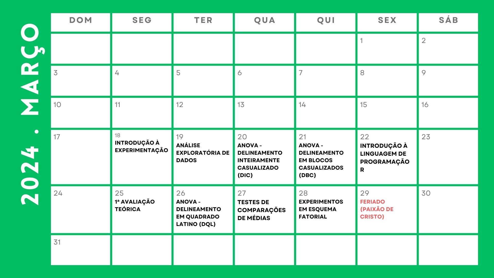
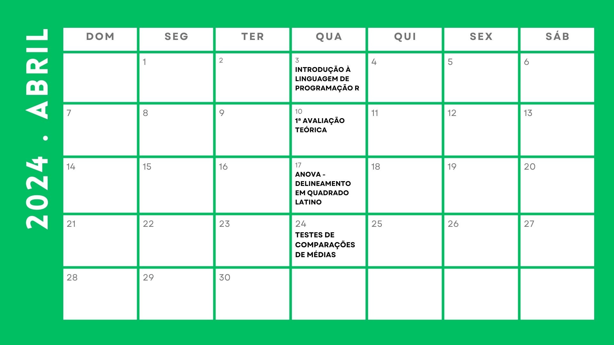

class: title-slide, center, middle
background-image: url(fig/slide-title/LMFTCA.png), url(fig/slide-title/ufpa.png), url(fig/slide-title/capa.png)
background-position: 90% 90%, 10% 90%
background-size: 150px, 150px, cover

```{r setup, include=FALSE}
knitr::opts_chunk$set(
	error = FALSE,
	fig.align = "center",
	fig.showtext = TRUE,
	message = FALSE,
	warning = FALSE,
	cache = FALSE,
	collapse = TRUE,
	dpi = 600
)
```

```{r packages, include=FALSE}
# remotes::install_github("dill/emoGG")
# remotes::install_github("hadley/emo")
library(ggplot2)
library(dplyr)
library(ggimage)
library(kableExtra)
library(readr)
#library(emo)
```

```{css, echo=FALSE}
.with-logo::before {
	content: '';
	width: 120px;
	height: 120px;
	position: absolute;
	bottom: 1.3em;
	right: -0.5em;
	background-size: contain;
	background-repeat: no-repeat;
}

.logo-ufpa::before {
	background-image: url(fig/slide-title/ufpa.png);
}
```

```{r xaringan-logo, echo=FALSE}
library(xaringanExtra)

use_logo(
  image_url = "fig/slide-title/LMFTCA.png",
  position = css_position(top = "1em", right = ".5em"),
  width = "130px",
  height = "130px")


use_scribble() # para escrever nos slides
use_share_again()
use_progress_bar()
#use_animate_all(style = c("slide_down"))

use_extra_styles(
  hover_code_line = TRUE,         #<<
  mute_unhighlighted_code = TRUE  #<<
)
xaringanExtra::use_editable(expires = 1)
#.can-edit[Você pode editar este título de slide]
#.can-edit.key-firstSlideTitle[Change this title and then reload the page]
use_clipboard()
```

<!-- title-slide -->
# .font120[Experimentação Florestal <br> (FL03034 - EF)]

## `r anicon::faa("pagelines", animate="horizontal", colour="green")` .font90[Programação e Orientações] `r anicon::faa("pagelines", animate="horizontal", colour="green")`
<br>

#### **Prof. Dr. Deivison Venicio Souza**
##### Universidade Federal do Pará (UFPA) 
##### Faculdade de Engenharia Florestal
##### E-mail: deivisonvs@ufpa.br
<br>
##### 1ª versão: 10/agosto/2021 <br> (Atualizado em: `r format(Sys.Date(),"%d/%B/%Y")`)

---

layout: true
<div class="my-header"></div>
<div class="my-footer"><span>Prof. Dr. Deivison Venicio Souza (E-mail: deivisonvs@ufpa.br)&emsp;&emsp;&emsp;&emsp;&emsp;Experimentação Florestal (FL03034 - EF) - Cronograma da disciplina</div>

---

## 👋 Olá, sejam bem vindos!
<br>

### **Sobre o facilitador**
.pull-left[
.font90[
1. .green[Graduação (Titulação: ano 2008)]
    - Universidade Federal Rural da Amazônia (UFRA); e
    - Título: Bacharel em Engenharia Florestal.

2. .green[Mestrado (Titulação: ano 2011)]
    - Universidade Federal Rural da Amazônia (UFRA);
    - Programa de Pós-graduação em Ciências Florestais (PPGCF); e
    - Área de Concentração: Manejo de ecossistemas florestais.
]
]

.pull-right[
```{r echo = FALSE, out.width='90%', fig.align='center', fig.cap='', dpi=600}
knitr::include_graphics("fig/slide-title/Foto.jpeg")
```
]

---

## 👋 Olá, sejam bem vindos!
<br>

### **Sobre o facilitador**

.pull-left[
.font90[
3. .green[Doutorado (Titulação: ano 2020)]
    - Universidade Federal do Paraná (UFPR);
    - Programa de Pós-graduação em Engenharia Florestal (PPGEF); e
    - Área de Concentração: Manejo Florestal.
    
4. .green[Especialização (Defesa: ano 2019)]
    - Universidade Federal do Paraná (UFPR);
    - Área: Big Data e Data Science
]
]

.pull-right[
```{r echo = FALSE, out.width='90%', fig.align='center', fig.cap='', dpi=600}
knitr::include_graphics("fig/slide-title/Foto.jpeg")
```
]

---

## 👋 Olá, sejam bem vindos!

.pull-left[
.font90[
### **Interesses atuais**
1. .green[Linguagem de programação]
    - R
    - Python

2. .green[Modelagem preditiva aplicada à ciência florestal]
    - Aprendizado de máquina
    
3. .green[Visão computacional]
    - reconhecimento de espécies baseado em imagens
    
4. .green[Criação de Dashboard - Shiny]
]
]

.pull-right[
.font90[
### **Websites e contatos**

<span class="iconify" data-icon="fa-brands:orcid" data-inline="false"></span>


<div itemscope itemtype="https://schema.org/Person"><a itemprop="sameAs" content="https://orcid.org/0000-0002-2975-0927" href="https://orcid.org/0000-0002-2975-0927" target="orcid.widget" rel="me noopener noreferrer" style="vertical-align:top;">https://orcid.org/0000-0002-2975-0927</a></div>

```{r, echo=FALSE, out.width='50%', fig.align='center', fig.cap=''}
knitr::include_graphics('fig/slide-title/ORCID.png')
```
]
]

<!-- Slide 2 -->
---

## Cronograma .black[.font80[(**Horário: 07h30min - 12h50min**)]]
<br>

```{r, echo = FALSE, out.width='80%', fig.align='center', fig.cap='', dpi=600}

```

---

## Cronograma .black[.font80[(**Horário: 07h30min - 12h50min**)]]
<br>

```{r, echo = FALSE, out.width='80%', fig.align='center', fig.cap='', dpi=600}

```


<!-- ```{r echo=FALSE, eval=TRUE, warning=FALSE, dpi=600, fig.width = 35, fig.height = 17} -->
<!-- library(calendR) -->
<!-- #dates <- seq(as.Date("2023-06-01"), as.Date("2023-06-31"), by = "day") -->
<!-- #events <- ifelse(format(dates, "%w") %in% c(6,7), "Final de semana", NA) -->
<!-- #events[c(8)] <- "Dia da Mulher" -->

<!-- p <- calendR::calendR(year = 2023, -->
<!--         month = 6, -->
<!--         start = "M", -->
<!--         title = "Junho (Ano 2023)", -->
<!--         title.size = 50, -->
<!--         subtitle.size = 20, -->
<!--         title.col = 2, -->
<!--         subtitle = "", -->
<!--         subtitle.col = 3, -->
<!--         weeknames.size = 15, -->
<!--         #special.days = events, -->
<!--         legend.pos = "bottom", -->
<!--         special.col = c("lightgreen", rgb(1, 0, 0, 0.1)), -->
<!--         col = "black", -->
<!--         lwd = 1, -->
<!--         lty = 1, -->
<!--         font.family = "mono", -->
<!--         font.style = "bold", -->
<!--         weeknames.col = "gray30", -->
<!--         months.col = "gray30", -->
<!--         days.col = 4, -->
<!--         day.size = 18, -->
<!--         bg.img = "", -->
<!--         text = c( -->
<!--           "Introdução à\n experimentação", -->
<!--           "Análise \nExploratória\n de Dados", -->
<!--           # "ANOVA - DIC", -->
<!--           # "ANOVA - DBC", -->
<!--           # "Introdução ao R", -->
<!--           # "Avaliação 1", -->
<!--           # "ANOVA - DQL", -->
<!--           # "Testes de\n comparação\n de médias", -->
<!--           # "Experimentos em \nEsquema Fatorial", -->
<!--           # "Correlação e\n Regressão Linear", -->
<!--           # "Revisão\n (Avaliação 2)", -->
<!--           "Avaliação 2"), -->
<!--         text.pos = c(1,2,3), -->
<!--         text.size = 12, -->
<!--         text.col = 1) -->

<!-- p + theme(legend.key.size = unit(2, 'cm'), -->
<!--           legend.text = element_text(size=30)) -->

<!-- ``` -->

<!-- Slide 3 -->
---

## Ementa da disciplina (FL03034 - EF)

.shadow2[
<br>
1 - Introdução à experimentação; 

2 - Análise exploratória de dados;

3 - Delineamento inteiramente casualizado - DIC; 

4 - Delineamento em blocos ao acaso - DBC;

5 - Delineamento em quadrado latino - DQL;

6 - Testes de comparação de médias; 

7 - Experimentos em esquema fatorial;

8 - Análise de correlação e regressão linear; e

9 - Análise de experimentos com linguagem R.

]

<!-- Slide 7 -->
---

## Estratégias e Ferramentas de Ensino
<br>

- **Aula Presencial** (*Sala a definir*)

Aulas teóricas e práticas presenciais, realização de atividades complementares e avaliações de desempenho.

--

- **Sala de aula virtual** (*Google Classroom*)

Comunicação, envio de atividades complementares e de conteúdos digitas.

--
<br><br>

- **Repositório GitHub**

Repositório com os slides em .html, arquivos .R e .Rmd, figuras, conjunto de dados (e outros). O repositório pode ser acessado em: [FL03034-Experimentacao-Florestal](https://github.com/DeivisonSouza/FL03034-Experimentacao-Florestal)

<!-- Slide 8 -->
---
## Estratégias de avaliação da aprendizagem
<br>

- **Atividades práticas**

Exercícios com dados reais (quando possível) para aprendizado da matemática e estatísticas inerentes aos conteúdos abordados;
<br><br>

Introdução ao uso da Linguagem de Programação R e bibliotecas para análise de experimentos.

---
## Estratégias de avaliação da aprendizagem
<br>

- **Avaliação teórica**

Avaliações teóricas presenciais.

--
<br><br>

- **Participação** 

.red[**Atenção**]`r anicon::faa("exclamation-triangle", colour="red")`: O nível de participação e interação nas aulas presenciais poderá ser critério para definir uma pontuação extra nas avaliações teóricas.

<!-- Slide 9 -->
---
## Média Final e Conceito

$$
\Large
MF = \frac{(NA*2)+NPT}{3}
$$

**MF** = Média Final

**NA** = Nota das Atividade (Soma das atividades será 10 pts.)

**NPT** = Nota das Provas Teóricas (Soma das provas será 10 pts.)

<br>

| Conceito     | Intervalo      |
|--------------|----------------|
| Excelente    | 9,0 ≤ MF ≤ 10    |
| Bom          | 7,0 ≤ MF ≤ 8,9   |
| Regular      | 5,0 ≤ MF ≤ 6,9 |
| Insuficiente | 0 ≤ MF ≤ 4,9   |


<!-- Slide 10 -->
---
## Plano de Ensino
<br><br>

O plano de ensino da disciplina pode ser acessado em:

[Plano de Ensino (FL03034-EF)](https://github.com/DeivisonSouza/FL03034-EF/blob/master/Slides/PE/EF-PE.pdf)


<!-- Slide 11 -->
---
## Reprovação `r anicon::faa("exclamation-triangle", colour="red")`
<br>
Conforme o Regimento Geral da UFPA, será considerado reprovado o discente que:

- Obtiver o conceito Insuficiente (INS), isto é, nota inferior a 5 (cinco); (.green[**Aplicável**])
- Sem Avaliação (SA); ou (.green[**Aplicável**])
- Não obtiver a frequência mínima de 75% na disciplina, isto é, Sem Frequência (SF). (.green[**Aplicável**])

<!-- Slide 12 -->
---
## Normativas da UFPA

- [Regimento geral da UFPA de 29/12/2006](chrome-extension://efaidnbmnnnibpcajpcglclefindmkaj/https://www.ufpa.br/images/docs/regimento_geral.pdf)

Disciplina os aspectos gerais e comuns da estruturação e do funcionamento dos órgãos e serviços da Universidade Federal do Pará (UFPA), cujo Estatuto regulamenta. 

- [Resolução n. 4.399, de 14 de maio de 2013](chrome-extension://efaidnbmnnnibpcajpcglclefindmkaj/http://www.proeg.ufpa.br/images/Artigos/Academico/Downloads/Regulamento_de_Graduacao.pdf)

Aprova o Regulamento do Ensino de Graduação da Universidade Federal do Pará.


- [Resolução n. 5.686, de 26 de outubro de 2023](https://sege.ufpa.br/boletim_interno/downloads/resolucoes/consepe/2023/5686%20Calend%C3%A1rio%20Acad%C3%AAmico%20da%20UFPA%20-%202024.pdf)

Aprova o Calendário Acadêmico da Universidade Federal do Pará (UFPA), para o ano de 2024.

<!-- Slide 13 -->
---

## Bibliografia básica
<br>
.pull-left-4[
PIMENTEL-GOMES, F.; GARCIA, C. H. **Estatística aplicada a experimentos agronômicos e florestais: exposição com exemplos e orientações para uso de aplicativos**. Piracicaba: FEALQ, 2002. 309p.
<br><br>

**Link**: [www.editoraufv.com.br](https://www.editoraufv.com.br/produto/estatistica-aplicada-a-experimentos-agronomicos-e-florestais/1109193/?gclid=EAIaIQobChMIqJOG5dLA9gIVTW1vBB1esA_EEAQYASABEgJ2xvD_BwE)
]

.pull-right-4[
```{r, echo=FALSE, out.width='65%', fig.align='center', fig.cap='', dpi=600}
knitr::include_graphics('https://editoraufv.cdn.plataformaneo.com.br/produto/1098901630_estatistica-aplicada-fealq.jpg')
```

]

---

## Bibliografia básica
<br>
.pull-left-4[
PIMENTEL-GOMES, F. **Curso de estatística experimental**. Piracicaba: FEALQ, 2009. 451p.
<br><br>

**Link**: [www.editoraufv.com.br](https://www.editoraufv.com.br/produto/curso-de-estatistica-experimental/1110850)
]

.pull-right-4[
```{r, echo=FALSE, out.width='65%', fig.align='center', fig.cap='', dpi=600}
knitr::include_graphics('https://editoraufv.cdn.plataformaneo.com.br/produto/20221019094459_2660997340_D.jpg')
```

]

<!-- Slide 14 -->
---
## Bibliografia complementar

<br><br>
BANZATTO, D.A.; KRONKA, S. do N. **Experimentação agrícola**. 2 ed. Jaboticabal, SP, 1992. 247p.
<br><br>
CONAGIN, A.; NAGAI, V.; AMBRÓSIO, L.A. **Princípios de técnica experimental e análise estatística de experimentos**. Campinas: Instituto Agronômico, 2006.
<br><br>
DIAS, L. A. dos S.; BARROS, W. S. **Biometria experimental**. Viçosa, MG: Suprema, 2009. 408 p.
<br><br>
NOGUEIRA, M. C. S. **Experimentação agronômica I: conceitos, planejamento e análise estatística**. Piracicaba, 479 p. 2007.
<br><br>
ZIMMERMANN, F. J. P. **Estatística aplicada à pesquisa agrícola**. Santo Antônio de Goiás: Embrapa Arroz e Feijão, 2004. 402p.
