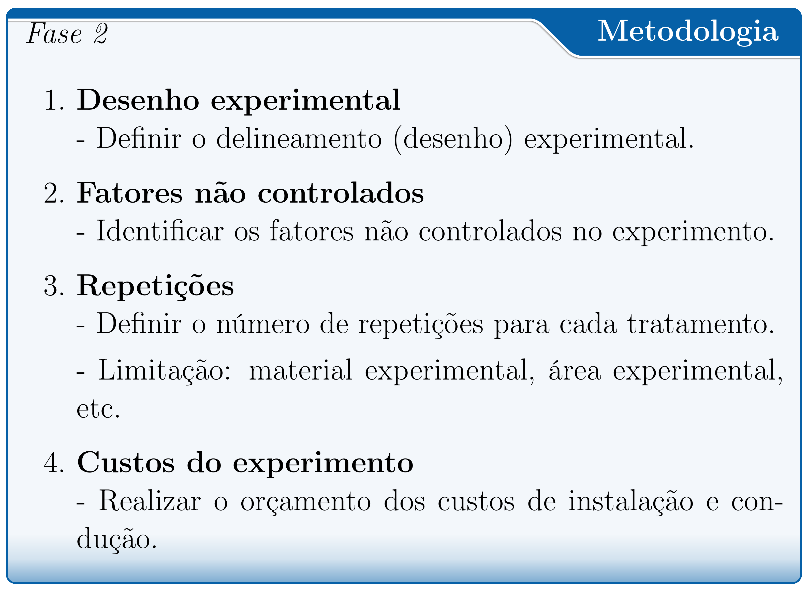
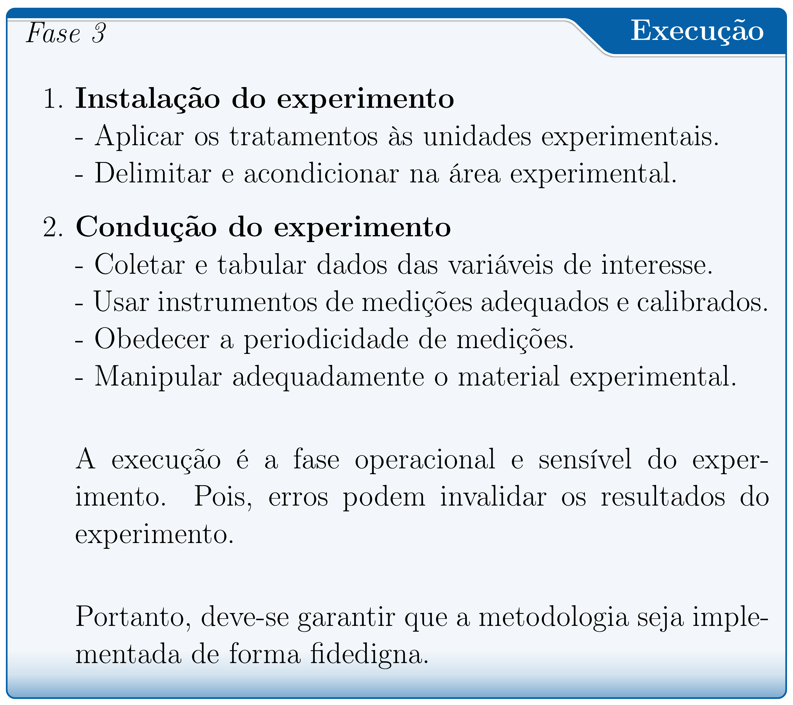

class: title-slide, center, middle
background-image: url(fig/slide-title/ufpa2.png), url(fig/slide-title/forest.png), url(fig/slide-title/img3.png)
background-position: 84% 90%, 95% 90%
background-size: 220px, 90px, cover

```{r setup, include=FALSE}
knitr::opts_chunk$set(
  fig.showtext = TRUE,
  fig.align = "center", 
  cache = TRUE,
  error = FALSE,
  message = FALSE, 
  warning = FALSE, 
  collapse = TRUE ,
  dpi = 600)
```

```{r xaringan-logo, echo=FALSE}
library(xaringanExtra)
use_logo(
  image_url = "fig/slide-title/ufpa.png",
  position = css_position(top = ".8em", right = "-.5em"),
  width = "140px",
  height = "140px"
)
```

```{r, load_refs, include=FALSE, cache=FALSE}
library(RefManageR)
BibOptions(check.entries = FALSE,
           bib.style = "authoryear",
           cite.style = "authoryear",
           style = "html",
           hyperlink = FALSE,
           dashed = FALSE)
(myBib <- ReadBib("./bib/ref.bib", check = FALSE))
```

```{r icon, echo=FALSE}
#remotes::install_github("mitchelloharawild/icons")
#remotes::install_github('emitanaka/anicon')
#library(icons)
#download_fontawesome()
#download_simple_icons()
```

<!-- title-slide -->
# Experimentação Florestal <br> (FL03034 - EF)

## Introdução à Experimentação `r anicon::faa("pagelines", animate="horizontal", colour="green")`
<br>
#### **Prof. Dr. Deivison Venicio Souza**
#### Universidade Federal do Pará (UFPA) 
#### Faculdade de Engenharia Florestal
#### E-mail: deivisonvs@ufpa.br
<br>
##### `r format(Sys.Date(),"%d/%B/%Y")`
##### Altamira, Pará

---
layout: true
<div class="my-header"></div>
<div class="my-footer"><span>Prof. Dr. Deivison Venicio Souza (E-mail: deivisonvs@ufpa.br)&emsp;&emsp;&emsp;&emsp;&emsp;Experimentação Florestal (FL03034 - EF) - Introdução à experimentação: conceitos, princípios e planejamento</div>

---

## Ementa da disciplina (FL03034 - EF)

.shadow3[
<br>
1 - Introdução à experimentação; 

2 - Princípios básicos da experimentação; 

3 - Fases da pesquisa experimental; 

4 - Delineamento inteiramente casualizado - DIC; 

5 - Delineamento em blocos ao acaso - DBC;

6 - Delineamento em quadrado latino - DQL;

7 - Testes de comparação de médias; 

8 - Ensaios Fatoriais;

9 - Análise de correlação linear simples;

10 - Análise de regressão linear simples e múltipla; e

11 - Introdução à linguagem R para análise de experimentos.

]

---

## Objetivos
<br><br>
Ao final desta aula espera-se que o discente seja capaz de...

* Conhecer as terminologias e os principais conceitos associados à experimentação;
* Compreender os princípios básicos da experimentação; e
* Conhecer os principais aspectos relacionados ao planejamento e condução de experimentos.

---

## Conteúdo

.pull-left-4[
**Parte 1 - Terminologias e conceitos básicos**

[1 - Experimentação e Experimento](#Exp)

[2 - Tratamento e Unidade Experimental](#Trat)

[3 - Delineamento Experimental](#DE)

[4 - Análise de Variância (ANOVA)](#Anova)

[5 - Erro Experimental ou Resíduo](#Res)
]

.pull-right-2[
.pull-down[
**Parte 2 - Princípios básicos da experimentação**

[1 - Repetição: conceito, importância e limitações](#Rep)

[2 - Casualização ou aleatorização: conceito e importância](#Cas)

[3 - Controle local: conceito e importância](#Cas)
]
]

---
## Conteúdo

**Parte 3 - Fases da pesquisa experimental**

[1 - Definição do problema de pesquisa](#Probl)

[2 - Conhecimento científico existente?](#Conh)

[3 - Enunciação do problema e formulação da hipótese científica](#Enun)

[4 - Definir a unidade experimental (UE)](#UE)

[5 - Definir os tratamentos a serem aplicados](#Trat)

[6 - Definir as variáveis a serem medidas nas UEs](#Var)

[7 - Definir o delineamento experimental](#del)

[8 - Instalar e conduzir o experimento](#Inst)

[9 - Analisar e interpretar dados experimentais](#int)

[10 - Realizar conclusões e fazer recomendações](#int)

<!-- Slide XX -->
---
layout: false
name: conc
class: inverse, top, right
background-image: url(fig/class1/imgC.jpg)
background-size: cover

.font200[**Parte 1 <br> Terminologias e conceitos básicos**]

.left[.footnote[.white[Créditos: Imagem de Willas Lima].]]

---
layout: true
<div class="my-header"></div>
<div class="my-footer"><span>Prof. Dr. Deivison Venicio Souza (E-mail: deivisonvs@ufpa.br)&emsp;&emsp;&emsp;&emsp;&emsp;Experimentação Florestal (FL03034 - EF) - Introdução à experimentação: conceitos, princípios e planejamento</div>

---

## Terminologias e conceitos básicos

<br>
### Experimentação

--

A experimentação é uma atividade que consiste no **planejamento**, **instalação** e **condução** de experimentos, bem como da coleta e análise de dados experimentais.

--

### Experimento

--

É uma experiência realizada em condições previamente estabelecidas e que opera com causas controladas `r Citep(myBib, "dias2009biometria", .opts = list(max.names = 2, longnamesfirst = F))`.

Um experimento pode ser definido como um conjunto de procedimentos destinados a coletar evidência contra uma hipótese formulada.

---

## Terminologias e conceitos básicos

<br>
### Tratamento

--
É a condição imposta à unidade experimental, cujo efeito deseja-se medir e comparar em um experimento.

--

### Unidade Experimental (ou Parcela)

--

É a menor unidade material de um experimento em que se aplica o tratamento.

---

## Terminologias e conceitos básicos

<br>

### Delineamento experimental

--

É o modo como os tratamentos são designados às unidades experimentais `r Citep(myBib, "dias2009biometria", .opts = list(max.names = 2, longnamesfirst = F))`.

--
<br>
Os principais delineamentos experimentais utilizados são:

```{r, echo=FALSE, out.width='50%', fig.align='center', fig.cap='', dpi=600}
knitr::include_graphics('fig/class1/img-PD.png')
```

---

## Terminologias e conceitos básicos

<br>
### Delineamento Inteiramente Casualizado - DIC

--

Quando os tratamentos são designados às unidades experimentais completamente ao acaso (por sorteio).

.red[Adicionar um exemplo...]


---

## Terminologias e conceitos básicos

<br>
### Delineamento em Blocos Casualizados - DBC

--

É um delineamento no qual as unidades experimentais são subdivididas em grupos homogêneos, denominados de blocos. Os tratamentos são então sorteados às unidades experimentais dentro de cada bloco.

.red[Adicionar um exemplo...]

---

## Terminologias e conceitos básicos

<br>
### Delineamento em Quadrado Latino - DQL

--

O controle local é aplicado pela imposição de **dois fatores de restrição** na casualização, devido à presença de dois gradientes de heterogeneidade, perpendiculares, no ambiente ou material experimental.

.red[Adicionar um exemplo...]

---

## Terminologias e conceitos básicos

<br>
### Análise de variância - (**An**alysis **O**f **Va**riance - ANOVA)

--

É uma técnica estatísticas que permite **decompor a variação total** dos dados experimentais em **causas conhecidas** e **desconhecidas**.

--
<br><br>
`r anicon::faa("hand-point-right", animate="horizontal")` O quanto da variação no experimento é devido aos **fatores não-controlados (ou variação do acaso**) - ou erro experimental?

`r anicon::faa("hand-point-right", animate="horizontal")` O quanto da variação no experimento é devido às influências dos tratamentos experimentais aplicados às unidades experimentais (**fatores controlados**)?

---

## Terminologias e conceitos básicos

<br>
### Erro Experimental (ou Resíduo)

--

É a variação devida ao efeito dos fatores não-controlados no experimento (acaso/aleatório).

--

### Variável Resposta (ou Dependente)

--

Característica que é medida e/ou avaliada nas unidades experimentais. 

Comumente essa característica é chamada de variável resposta (ou dependente).

--

### Dados experimentais

--

São os valores assumidos pela variável resposta.

---
class: center, middle
.font300[
**Estudos de casos...**
]

---

## Estudos de casos (Silva et al., 2017)
<br>

### Tamanho da semente e substratos na produção de mudas de açaí.
<br>
#### Informações gerais

.pull-left-4[
**1. Periódico**

Advances in Forestry Science

Link: [Silva et al., 2017](https://periodicoscientificos.ufmt.br/ojs/index.php/afor/article/view/4590)
<br><br>

**2. Objetivo**

Estudar o efeito de diferentes **tamanhos de sementes** e **substratos** no
desenvolvimento de mudas de *Euterpe oleracea* Mart. 
<br><br>
]

--

.pull-right-4[
**3. Delineamento Experimental**

DIC em esquema fatorial 3x2 (tamanho das sementes x substratos).

Repetições: 4 repetições (20 sementes)
<br><br>

**4. Variáveis de interesse**

Crescimento das plantas (30, 60, 90, 120, 150, 180 e 210 dias )
]


<!-- Slide XX -->
---
layout: false
name: conc
class: inverse, top, right
background-image: url(fig/class1/imgC.jpg)
background-size: cover

.font200[**Parte 2 <br> Princípios básicos da experimentação**]

.left[.footnote[.white[Créditos: Imagem de Willas Lima].]]


---
layout: true
<div class="my-header"></div>
<div class="my-footer"><span>Prof. Dr. Deivison Venicio Souza (E-mail: deivisonvs@ufpa.br)&emsp;&emsp;&emsp;&emsp;&emsp;Experimentação Florestal (FL03034 - EF) - Introdução à experimentação: conceitos, princípios e planejamento</div>

---
## Princípios básicos da experimentação
<br>

Os delineamentos experimentais clássicos são baseados em três princípios básicos:

```{r, echo=FALSE, out.width='60%', fig.align='center', fig.cap='', dpi=600}
knitr::include_graphics('fig/class1/PBE.png')
```

---
## Princípios básicos da experimentação
<br>

### Repetição

Refere-se ao número de vezes que um determinado tratamento aparece em um experimento `r Citep(myBib, "dias2009biometria", .opts = list(max.names = 2, longnamesfirst = F))`.

--
<br><br>

`r anicon::faa("hand-point-right", animate="horizontal")` **Repetição** = Número de unidades experimentais ou conjunto de unidades experimentais para um determinado tratamento.

--
<br><br>

**Tratamento 1** (pleno sol) – 4 repetições de 25 sementes

**Tratamento 2** (50% de sombreamento) – 4 repetições de 25 sementes

**Tratamento 3** (80% de sombreamento) – 4 repetições de 25 sementes

---

## Princípios básicos da experimentação
<br>

### Qual a importância da repetição?
* Estimar o erro experimental;


* Controlar a variância residual (erro experimental);


* Aumentar a precisão das estimativas das médias dos tratamentos;


* Aumentar o poder dos testes estatísticos; e


* Garantir maior confiabilidade nos resultados obtidos.

--
<br><br>
.shadow3[
“à medida que o número de repetições cresce tem-se um aumento da precisão das estimativas do experimento.”
]

---

## Princípios básicos da experimentação
<br>

### Limitações

`r anicon::faa("hand-point-right", animate="horizontal")` O uso de um número adequado de repetições, possibilita uma boa estimativa do erro experimental, melhorando as estimativas de interesse. 

`r anicon::faa("hand-point-right", animate="horizontal")` No entanto, o número de repetições pode ser limitado, sobretudo, pelo(a) `r Citep(myBib, "costa2003tecnicas", .opts = list(max.names = 2, longnamesfirst = F))`: 

- Número de tratamentos que serão comparados;
- Disponibilidade de material experimental; e
- Disponibilidade de área experimental.

---

## Princípios básicos da experimentação
<br>

### Casualização ou Aleatorização

--

Consiste em dispor os tratamentos ao acaso no experimento. A ideia básica é que todas as unidades experimentais tenham iguais chances de receber quaisquer dos tratamentos `r Citep(myBib, "dias2009biometria", .opts = list(max.names = 2, longnamesfirst = F))`.

--
<br><br>
.shadow3[
É a atribuição dos tratamentos às unidades experimentais de forma aleatória, sem nenhuma interferência por parte do pesquisador.
]

---

## Princípios básicos da experimentação
<br>

### Importância

A casualização é recomendada para se evitar fatores sistemáticos que venham a beneficiar algum tratamento em detrimento de outros `r Citep(myBib, "dias2009biometria", .opts = list(max.names = 2, longnamesfirst = F))`.


---

## Princípios básicos da experimentação
<br>

### Controle Local

--
Destina-se a controlar a heterogeneidade ambiental e implica em restringir a casualização `r Citep(myBib, "dias2009biometria", .opts = list(max.names = 2, longnamesfirst = F))`.

--
<br><br>
.shadow3[
A formação de blocos no DBC e a disposição de linhas e colunas no DQL, são estratégias de controle local, que possibilitam agrupar parcelas homogêneas e casualizar os tratamentos dentro destas.
]

---

## Princípios básicos da experimentação
<br>

### Importância


- Diminuir o erro experimental; e


- Dividir uma área experimental heterogênea em áreas menores e homogêneas, comumente chamadas de blocos.

--
<br><br>
.shadow3[
É fundamental o reconhecimento da variação ambiental por parte do pesquisador.
]

---

## Princípios básicos da experimentação
<br>

### Princípios básicos e delineamentos experimentais

```{r, echo=FALSE, out.width='53%', fig.align='center', fig.cap='', dpi=600}
knitr::include_graphics('fig/class1/img-PD2.png')
```


<!-- Slide XX -->
---
layout: false
name: conc
class: inverse, top, right
background-image: url(fig/class1/imgC.jpg)
background-size: cover

.font200[**Parte 3 <br> Fases da pesquisa experimental**]

.left[.footnote[.white[Créditos: Imagem de Willas Lima].]]


---
layout: true
<div class="my-header"></div>
<div class="my-footer"><span>Prof. Dr. Deivison Venicio Souza (E-mail: deivisonvs@ufpa.br)&emsp;&emsp;&emsp;&emsp;&emsp;Experimentação Florestal (FL03034 - EF) - Introdução à experimentação: conceitos, princípios e planejamento</div>

---

## Fases da pesquisa experimental
<br>

```{r, echo=FALSE, out.width='40%', fig.align='center', fig.cap='', dpi=600}
knitr::include_graphics('fig/class1/F0.png')
```

---

## Fases da pesquisa experimental
<br>

.pull-left-4[
```{r, echo=FALSE, out.width='90%', fig.align='center', fig.cap='', dpi=600}

```
]

--

.font80[
**Problema**

-> Pergunta: Qual o melhor substrato para germinação de sementes de *Cordia glabrata* (Louro-preto)?

-> Importância: Ornamentação, prática apícola e medicina popular.
]

--

.font80[
**Objetivo**

-> Avaliar o melhor substrato para germinação de sementes de *Cordia glabrata* (Louro-preto)?
]

--

.font80[
**Unidade Experimental e Tratamentos**

-> UE: Sementes de *Cordia glabrata*.

-> Tratamentos: papel-filtro e solo arenoso + matéria orgânica.

]

--
.font80[
**Variáveis**

-> Taxa média de germinação e o Índice de Velocidade de Germinação (IVG).

]

---

## Fases da pesquisa experimental
<br>

.pull-left-4[
```{r, echo=FALSE, out.width='90%', fig.align='left', fig.cap='', dpi=600}

```
]


--

.font80[
**Desenho experimental**

-> DIC, DBC, DQL, Ensaio Fatorial, etc.

]

--

.font80[
**Fatores não controlados**

-> Ex.: Temperatura, Umidade relativa do ar


]

--

.font80[
**Repetições**

-> Ex.: 5 repetições de 200 sementes.

]

--

.font80[
**Custos do experimento**

-> Recurso financeiro é um fator limitante.

]


---

## Fases da pesquisa experimental
<br>

```{r, echo=FALSE, out.width='50%', fig.align='center', fig.cap='', dpi=600}

```


---

## Fases da pesquisa experimental
<br>

```{r, echo=FALSE, out.width='50%', fig.align='center', fig.cap='', dpi=600}

```

---
## Referências
<br><br>

```{r ref1, echo=FALSE, results="asis"}
PrintBibliography(myBib, start = 1, end = 5)
```


<!--Slide XX -->
---
layout: false
class: inverse, top, right
background-image: url(fig/class1/imgC.jpg)
background-size: cover

.font300[
Obrigado!
]
<br><br><br><br><br><br>

**Email**: <a href="mailto:deivisonvs@ufpa.br">deivisonvs@ufpa.br</a>

**Github**: <a href="https://github.com/DeivisonSouza">@DeivisonSouza</a>
