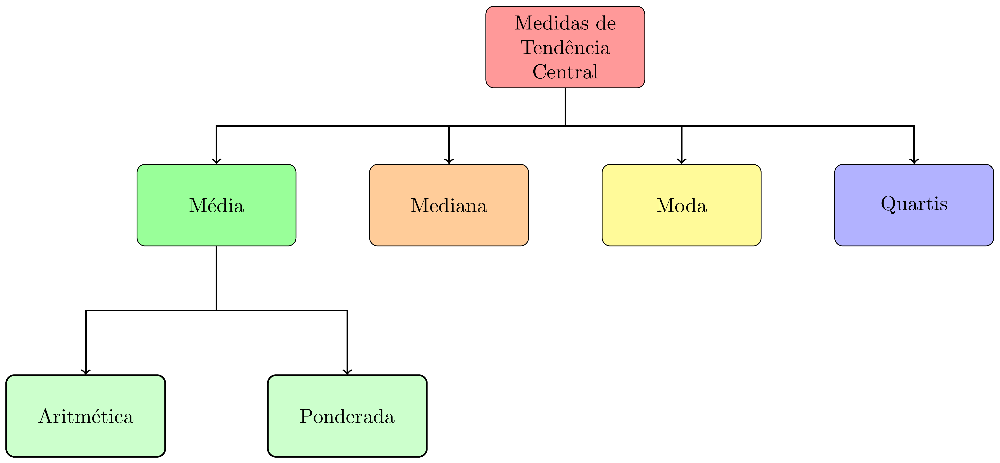

class: title-slide, center, middle
background-image: url(fig/slide-title/ufpa2.png), url(fig/slide-title/forest.png), url(fig/slide-title/img3.png)
background-position: 84% 90%, 95% 90%
background-size: 220px, 90px, cover

```{r setup, include=FALSE}
knitr::opts_chunk$set(
  fig.showtext = TRUE,
  fig.align = "center", 
  cache = FALSE,
  error = FALSE,
  message = FALSE, 
  warning = FALSE, 
  collapse = TRUE ,
  dpi = 600)
```

```{r packages, include=FALSE}
# remotes::install_github("dill/emoGG")
library(ggplot2)
library(dplyr)
library(ggimage)
```

```{r xaringan-logo, echo=FALSE}
library(xaringanExtra)
use_logo(
  image_url = "fig/slide-title/ufpa.png",
  position = css_position(top = ".8em", right = "-.5em"),
  width = "140px",
  height = "140px"
)
```

```{r, load_refs, include=FALSE, cache=FALSE}
library(RefManageR)
BibOptions(check.entries = FALSE,
           bib.style = "authoryear",
           cite.style = "authoryear",
           style = "html",
           hyperlink = FALSE,
           dashed = FALSE)
(myBib <- ReadBib("./bib/ref.bib", check = FALSE))
```

```{r icon, echo=FALSE}
#remotes::install_github("mitchelloharawild/icons")
#remotes::install_github('emitanaka/anicon')
#library(icons)
#download_fontawesome()
#download_simple_icons()
```

<!-- title-slide -->
# Experimentação Florestal <br> (FL03034 - EF)

## Análise Exploratória de Dados: <br> uma breve revisão `r anicon::faa("pagelines", animate="horizontal", colour="green")`

#### **Prof. Dr. Deivison Venicio Souza**
#### Universidade Federal do Pará (UFPA) 
#### Faculdade de Engenharia Florestal
#### E-mail: deivisonvs@ufpa.br
<br>
##### `r format(Sys.Date(),"%d/%B/%Y")`
##### Altamira, Pará

---
layout: true
<div class="my-header"></div>
<div class="my-footer"><span>Prof. Dr. Deivison Venicio Souza (E-mail: deivisonvs@ufpa.br)&emsp;&emsp;&emsp;&emsp;&emsp;Experimentação Florestal (FL03034 - EF) - Análise Exploratória de Dados: uma breve revisão</div>

---

## Ementa da disciplina (FL03034 - EF)

.shadow3[
<br>
1 - Introdução à experimentação; 

2 - Princípios básicos da experimentação; 

3 - Fases da pesquisa experimental; 

4 - Delineamento inteiramente casualizado - DIC; 

5 - Delineamento em blocos ao acaso - DBC;

6 - Delineamento em quadrado latino - DQL;

7 - Testes de comparação de médias; 

8 - Ensaios Fatoriais;

9 - Análise de correlação linear simples;

10 - Análise de regressão linear simples e múltipla; e

11 - Introdução à linguagem R para análise de experimentos.

]

---

## Objetivos
<br><br>
Ao final desta aula espera-se que o discente seja capaz de...

* Recordar terminologias e conceitos básicos de estatística descritiva;
* Recordar e calcular as principais medidas de tendência central (ou posição); e
* Recordar e calcular as principais medidas de dispersão (ou variabilidade).

---

## Conteúdo

.pull-left-4[
**Parte 1 - Terminologias e conceitos básicos**

[1 - O que é estatística?](#Est)

[2 - Estatística descritiva e Estatística inferêncial](#DI)

[3 - População e Amostra](#PA)

[4 - Variável e Parâmetro](#VP)

[5 - Tipos de Variáveis](#TV)
]

.pull-right-2[
.pull-down[
**Parte 2 - Medidas de tendência central (ou posição)**

[1 - Conceito e importância](#CI)

[2 - Moda](#Mo)

[3 - Mediana](#Md)

[4 - Média Aritmética](#Me)
]
]

---
## Conteúdo

**Parte 3 - Medidas de dispersão (ou variabilidade)**

[1 - Conceito e importância](#CId)

[2 - Amplitude Total](#AT)

[3 - Desvio Médio](#DM)

[4 - Variância](#Var)

[5 - Desvio Padrão](#Dp)

[6 - Coeficiente de Variação](#CV)


<!-- Slide XX -->
---
layout: false
name: conc
class: inverse, top, right
background-image: url(fig/class1/imgC.jpg)
background-size: cover

.font200[**Parte 1 <br> Terminologias e conceitos básicos**]

.left[.footnote[.white[Créditos: Imagem de Willas Lima].]]

---
layout: true
<div class="my-header"></div>
<div class="my-footer"><span>Prof. Dr. Deivison Venicio Souza (E-mail: deivisonvs@ufpa.br)&emsp;&emsp;&emsp;&emsp;&emsp;Experimentação Florestal (FL03034 - EF) - Análise Exploratória de Dados: uma breve revisão</div>

---

## Terminologias e conceitos básicos

<br>

.shadow3[
### Conceito

A estatística serve para ajudar na **descrição de fenômenos** e na **tomada de decisões**.
]

<br>

### Divisões da estatística

A estatística é, em geral, dividida em dois grandes grupos:

1. Estatística Descritiva
2. Estatística Inferencial

---

## Terminologias e conceitos básicos

<br>

### Estatística Descritiva

É a parte da estatística que lida com a **organização**, **resumo** e **apresentação** de dados `r Citep(myBib, "ferreira2009", .opts = list(max.names = 2, longnamesfirst = F))`.

<br>

`r anicon::faa("hand-point-right", animate="horizontal")` .blue[**Os dados podem ser resumidos de forma numérica ou gráfica.**]

---

## Terminologias e conceitos básicos
<br>

.left-column[

```{r , echo=FALSE, eval=TRUE}
library(dplyr)

data <- data.table::fread("data/Cedrela.csv")

# data %>%
#   knitr::kable(format= "html")

data %>% 
   DT::datatable(editable = 'cell', rownames = FALSE, style = "default",
                 class = "display", width = '350px',
                 caption = 'Dados de Cedrela odorata.',
     options=list(pageLength = 10, dom = 'tip', autoWidth = F,
       initComplete = htmlwidgets::JS(
          "function(settings, json) {",
          paste0("$(this.api().table().container()).css({'font-size': '", "12pt", "'});"),
          "}")
       ) 
     )
```
]

.right-column[

### Como extrair informações descritivas?

* Calcular medidas descritivas quantitativas.

```{r}
# Usando funções da linguagem R
mean(data$D)
sd(data$V)
var(data$H)
table(data$QF)
```

]

---

## Terminologias e conceitos básicos
<br>

.left-column[

### Como extrair informações descritivas?

* Usar representações gráficas

```{r g1, echo=TRUE, eval=FALSE}
# Criando um BoxPlot Univariado

g1 <- data %>% 
  ggplot(aes(x = 1, y = D)) + 
  geom_boxplot() + 
  xlab(NULL) + 
  theme_bw() +
  theme(axis.text.x = element_blank(),
        axis.ticks.x = element_blank())

plotly::ggplotly(g1)

```

]

.right-column[

```{r ref.label="g1", echo=FALSE, eval=TRUE, collapse=T, fig.width=.8, fig.height=.8, fig.align='center', fig.cap='', dpi=600}
```

]

---

## Terminologias e conceitos básicos
<br>

.left-column[

### Como extrair informações descritivas?

* Usar representações gráficas

```{r g2, echo=TRUE, eval=FALSE}
# Criando um Hitograma Univariado

g2 <- data %>%
  ggplot(aes(x = H)) + 
  geom_histogram(bins = 5, fill="#69b3a2", 
                 color="#e9ecef", alpha=0.9) +
  theme_bw()

plotly::ggplotly(g2)

```

]

.right-column[

```{r ref.label="g2", echo=FALSE, eval=TRUE, collapse=T, fig.width=.8, fig.height=.8, fig.align='center', fig.cap='', dpi=600}
```

]

---

## Terminologias e conceitos básicos
<br>

.left-column[

### Como extrair informações descritivas?

* Usar representações gráficas

```{r g3, echo=TRUE, eval=FALSE}
# Criando um Scatterplot

g3 <- data %>%
  ggplot(aes(x=D, y=V, color=QF)) +
      geom_point(size = 3) +
      theme(legend.position="none") 

plotly::ggplotly(g3)
  
```

]

.right-column[

```{r ref.label="g3", echo=FALSE, eval=TRUE, collapse=T, fig.width=.8, fig.height=.8, fig.align='center', fig.cap='', dpi=600}
```

]

---

## Terminologias e conceitos básicos

<br>

### Estatística Inferencial (ou Indutiva)

É a parte da estatítica que objetiva inferir sobre uma **população** a partir da observação de uma parte dela (**amostra**).

---

## Terminologias e conceitos básicos

.left-column[
### População

```{r eval = T, echo = F, fig.width=.8, fig.height=.8}

grid <- expand.grid(
  x = seq(0, 20, length = 15),
  y = seq(0, 3, length = 15)
  )

img <- "fig/class2/pinus1.png"

grid %>% 
  ggplot(aes(x, y)) + 
  geom_image(image=img, size=.1) +
  theme_bw() +
  theme(axis.text = element_blank(),
        axis.ticks = element_blank(),
        axis.title=element_blank())

```
]

.right-column[
### Amostra

```{r eval = T, echo = F, fig.width=.8, fig.height=.8}

grid <- expand.grid(
  x = seq(0, 20, length = 15),
  y = seq(0, 3, length = 15)
  ) %>%
  mutate(image = sample(c("fig/class2/pinus1.png",
                          "fig/class2/pinus2.png"),
                        size = length(y), replace = TRUE))
grid %>%
  ggplot(aes(x, y)) + 
  geom_image(aes(image=image), size=.1) +
  theme_bw() +
  theme(axis.text = element_blank(),
        axis.ticks = element_blank(),
        axis.title=element_blank())

```

]


---

## Terminologias e conceitos básicos
<br>

### Tipos de Variáveis

```{r, echo=FALSE, out.width='60%', fig.align='center', fig.cap='', dpi=600}
knitr::include_graphics('fig/class2/TV.png')
```

---

## Terminologias e conceitos básicos
<br>

### Variáveis Qualitativas (ou Categóricas)

A variável é qualitativa (ou categórica) quando seus valores são distribuídos em categorias mutuamente exclusivas (Vieira, 2010).

--
<br><br>

Estas podem ser classificadas em dois tipos: 

`r anicon::faa("hand-point-right", animate="horizontal")` 1 - Variável nominal

`r anicon::faa("hand-point-right", animate="horizontal")` 2 - Variável ordinal


---

## Terminologias e conceitos básicos
<br>

### Variáveis Qualitativas (ou Categóricas)
<br>

#### Variável Nominal

A variável é nominal quando seus valores se distribuem em categorias mutuamente exclusivas, indicadas em qualquer ordem (Vieira, 2010).

--
<br><br>
#### Variável Ordinal

A variável é ordinal quando os dados são distribuídos em categorias mutuamente exclusivas que possuem ordem (Vieira, 2010).


---

## Terminologias e conceitos básicos
<br>

### Variáveis Quantitativas (ou Numéricas)

Uma variável quantitativa (ou numérica) é expressa por números que têm significado em uma escala numérica (Vieira, 2010).

--
<br><br>
Estas podem ser classificadas em dois tipos: 

`r anicon::faa("hand-point-right", animate="horizontal")` 1 - Variável discreta

`r anicon::faa("hand-point-right", animate="horizontal")` 2 - Variável contínua

---

## Terminologias e conceitos básicos
<br>

### Variáveis Quantitativas (ou Contínuas)
<br>

#### Variável Discreta

A variável é discreta quando só pode assumir alguns valores em um dado intervalo (Vieira, 2010).

--
<br><br>
#### Variável Contínua

A variável é contínua quando pode assumir qualquer valor em um dado intervalo (Vieira, 2010).

---

## Terminologias e conceitos básicos
<br>

### Vamos praticar...

1 - Dada a tabela abaixo preencha a coluna "Tipo":

.left-column[

```{r echo=FALSE, eval=T}
df <- data.frame(
  Variável = c("Nº de Rebrotos",
        "Peso de fruto",
        "Altura da árvore",
        "Volume de madeira",
        "Grau de iluminação de copas",
        "Forma de copas",
        "Qualidade de fuste"
        ), Tipo = c(NA), Subtipo = c(NA))

df %>% 
   DT::datatable(editable = 'cell', rownames = FALSE, style = "default",
                 class = "display", width = '450px',
                 caption = '',
     options=list(pageLength = 10, dom = 'tip', autoWidth = F,
       initComplete = htmlwidgets::JS(
          "function(settings, json) {",
          paste0("$(this.api().table().container()).css({'font-size': '", "12pt", "'});"),
          "}")
       ) 
     )
```
]

--

.right-column[

```{r echo=FALSE, eval=T}
df <- data.frame(
  Variável = c(
    "Danos da exploração florestal",
    "Mês de observação",
    "Diâmetro do coleto",
    "Nome botânico",
    "Tipos de frutos (Qto à deiscência)",
    "Diâmetro da árvore",
    "Nº de sementes germinadas"
        ), Tipo = c(NA), Subtipo = c(NA))

df %>% 
   DT::datatable(editable = 'cell', rownames = FALSE, style = "default",
                 class = "display", width = '450px',
                 caption = '',
     options=list(pageLength = 10, dom = 'tip', autoWidth = F,
       initComplete = htmlwidgets::JS(
          "function(settings, json) {",
          paste0("$(this.api().table().container()).css({'font-size': '", "12pt", "'});"),
          "}")
       ) 
     )
```

]

<!-- Slide XX -->
---
layout: false
name: conc
class: inverse, top, right
background-image: url(fig/class1/imgC.jpg)
background-size: cover

.font200[**Parte 2 <br> Medidas de tendência central (ou posição)**]

.left[.footnote[.white[Créditos: Imagem de Willas Lima].]]

---
layout: true
<div class="my-header"></div>
<div class="my-footer"><span>Prof. Dr. Deivison Venicio Souza (E-mail: deivisonvs@ufpa.br)&emsp;&emsp;&emsp;&emsp;&emsp;Experimentação Florestal (FL03034 - EF) - Análise Exploratória de Dados: uma breve revisão</div>

---

## Medidas de tendência central (ou posição)
<br>

### Conceito

São medidas que objetivam representar o ponto central (ou de equilíbrio) de uma distribuição de dados.

--
<br>
### Principais medidas de posição
```{r, echo=FALSE, out.width='60%', fig.align='center', fig.cap='', dpi=600}

```

---

## Medidas de tendência central (ou posição)
<br>

### Moda (Mo) - Conceito

É o valor que aparece mais frequentemente em um conjunto de dados.

--
<br><br>

Qual a moda para a série de dados abaixo?

**{1, 3, 0, 0, 2, 4, 1, 2, 5, 6, 8, 1, 2, 2, 0}**

--
<br><br>

`r anicon::faa("hand-point-right", animate="horizontal")` **Como determinar a moda de um conjunto de dados?**

---

## Medidas de tendência central (ou posição)
<br>

### Moda (Mo) - Como determinar?

.left-column[
- Calcular a frequência de cada valor.
- A moda é o valor mais frequente.
<br><br>

.center[**{1, 3, 0, 0, 2, 4, 1, 2, 5, 6, 8, 1, 2, 2, 0}**]

]

--

.right-column[
```{r echo=F, eval=T}
df <- data.frame(Valor = c(0, 1, 2, 3, 4, 5, 6, 8),
                 "Frequência" = c(NA)
)

df %>% 
   DT::datatable(editable = 'cell', rownames = FALSE, style = "default",
                 class = "display", width = '450px',
                 caption = '',
     options=list(pageLength = 10, dom = 'tip', autoWidth = F,
       initComplete = htmlwidgets::JS(
          "function(settings, json) {",
          paste0("$(this.api().table().container()).css({'font-size': '", "12pt", "'});"),
          "}")
       ) 
     )
```

]

---

## Medidas de tendência central (ou posição)
<br>

### Moda (Mo) - Usando a linguagem R
<br>

`r anicon::faa("hand-point-right", animate="horizontal")` **A linguagem R não possui uma função nativa para calcular a moda.**

`r anicon::faa("hand-point-right", animate="horizontal")` **Mas, pode-se usar a função** `table()` **para gerar uma tabela de frequências absolutas. Assim, a moda pode ser facilmente identificada.**

```{r echo=T, eval=T}
# Cria um vetor
x <- c(1, 3, 0, 0, 2, 4, 1, 2, 5, 6, 8, 1, 2, 2, 0)

# Usar a função "table"
table(x)

```

---

## Medidas de tendência central (ou posição)
<br>

### Moda (Mo) - Usando a linguagem R

.left-column[
- A função `table()`: gera uma tabela de frequências simples. 
- Mas, pode-se criar uma função para retornar o valor modal.
]

.right-column[
```{r echo=T, eval=T}
# Cria um vetor
x <- c(1, 3, 0, 0, 2, 4, 1, 2, 5, 6, 8, 1, 2, 2, 0)

# Uma função para obter a moda
mod <- function(v) {
   uniq <- unique(v)
   uniq[which.max(tabulate(match(v, uniq)))]
}

# Aplicando a função "mod" ao vetor "x"
mod(x)
```
]

---

## Medidas de tendência central (ou posição)
<br>

### Moda (Mo) - Usando a linguagem R

.left-column[
`r anicon::faa("hand-point-right", animate="horizontal")` Podem existir séries de dados em que nenhum valor aparece mais vezes que outros. Nestes casos, diz-se que o conjunto de dados **não possui moda** ou é **amodal**.

<br>

Qual a moda para a série de dados abaixo?

.center[**{1, 8, 6, 5, 4, 3, 0, 3, 0, 4, 5, 6, 8, 2, 1,2}**]
]

.right-column[

```{r echo=T, eval=T}
# Cria um vetor
y <- c(1, 8, 6, 5, 4, 3, 0, 3, 0, 4, 5, 6, 8, 2, 1, 2)

# Usar a função "table"
table(y)

```
]

---

## Medidas de tendência central (ou posição)
<br>

### Moda (Mo) - Variáveis qualitativas

.left-column[
`r anicon::faa("hand-point-right", animate="horizontal")` A moda pode ser determinada para variáveis qualitativas, ao contrário da média e mediana, por exemplo.

Seja o vetor de nomes de espécies de árvores:

**{Marupa, Angelim, Tauari, Marupa, 
  Angelim, Tauari, Marupa, Angelim,
  Angelim, Angelim, Cedro, Cedro, 
  Cedro, Tauari, Tauari, Marupa}**

]

.right-column[
```{r echo=T, eval=T}
# Cria um vetor
esp <- c(
  "Marupa", "Angelim", "Tauari", "Marupa", 
  "Angelim", "Tauari", "Marupa", "Angelim",
  "Angelim", "Angelim", "Cedro", "Cedro", 
  "Cedro", "Tauari", "Tauari", "Marupa")

# Usar a função "table"
table(esp)
```

]

---

## Medidas de tendência central (ou posição)
<br>

### Moda (Mo) - Classificação

Um conjunto de dados pode ser classificado em função da ocorrência (ou não) de **Moda**:

<br>

```{r, echo=FALSE, out.width='60%', fig.align='center', fig.cap='', dpi=600}
knitr::include_graphics('fig/class2/Mo.png')
```

---

## Medidas de tendência central (ou posição)
<br>

### Moda (Mo) - Classificação

- **Amodal**: Conjunto de dados que **não apresenta moda**. Isto é, nenhum dos valores contidos no conjunto predomina sobre os demais.

--
<br><br>
- **Unimodal**: Conjunto de dados que **apresenta uma única moda**. Isto é, apenas um dos elementos do conjunto de dados predomina sobre os demais.

--
<br><br>
- **Bimodal**: Conjunto de dados que **apresenta duas modas**. Isto é, dois dos valores contidos no conjunto de dados predominam sobre os demais;

--
<br><br>
- **Multimodal**: Conjunto de dados que **apresenta mais de duas modas**. Isto é, mais de dois dos elementos do conjunto de dados predominam sobre os demais.

---

## Medidas de tendência central (ou posição)
<br>

### Moda (Mo) - Vamos praticar...

.left-column[
Série I: {1, 3, 0, 0, 2, 4, 1, 2, 5, 6, 8, 1, 2, 0}

Série II: {1,1, 3, 0, 0, 2, 4, 1, 2, 5, 6, 8, 1, 2, 2, 0}

Série III: {1, 6, 8, 6, 5, 4, 3, 0, 3, 3, 0, 4, 4, 5, 6, 8, 2, 1, 1}

Série IV: {1, 6, 8, 8, 8, 6, 5, 5, 5, 4, 3, 0, 3, 3, 0, 4}

]

--

.right-column[
```{r echo=T, eval=T}
# Criar os vetores
S1 <- c(1, 3, 0, 0, 2, 4, 1, 2, 5, 6, 8, 1, 2, 0)
S2 <- c(1,1, 3, 0, 0, 2, 4, 1, 2, 5, 6, 8, 1, 2, 2, 0)
S3 <- c(1,6, 8, 6, 5, 4, 3, 0, 3, 3, 0, 4, 4, 5, 6, 8, 2, 1,1)

table(S1)
table(S2)
table(S3)
```

]

---

## Medidas de tendência central (ou posição)
<br>

### Moda (Mo) 
<br>

#### Vantagens

- Fácil de ser calculada;
- É a única medida de tendência central que pode ser usada para variáveis qualitativas;e
- Não é influenciada por valores extremos (*outliers*).

#### Limitações

- Pode não ser representativa; e
- Pode mudar se inserirmos novas observações.

---

## Medidas de tendência central (ou posição)
<br>

### Mediana (Md) - Conceito `r Citep(myBib, "favero2009", .opts = list(max.names = 1, longnamesfirst = F))`

<br>

É o valor que ocupa a posição central de uma série de dados ordenados de forma crescente. Ou seja, em que 50% dos elementos devem estar abaixo da mediana e 50% devem estar acima da mediana.

--
<br><br>

**É o valor que divide a série de dados ordenados em duas partes iguais.**

---

## Medidas de tendência central (ou posição)
<br>

### Mediana (Md) - Como determinar?
<br>

`r anicon::faa("hand-point-right", animate="horizontal")` A determinação da Mediana (Md) requer encontrar o(s) elemento(s) que divide(m) os dados ordenados em duas partes iguais.

`r anicon::faa("hand-point-right", animate="horizontal")` Em geral, existem duas fórmulas para encontrar esse(s) elemento(s). 

`r anicon::faa("hand-point-right", animate="horizontal")` O uso de cada uma é função do número de observações no conjunto de dados.

--

.left-column[

- **Número ímpar de observações**

$$
\Large
E = \frac{n + 1}{2}
$$
]

.right-column[

- **Número par de observações**

$$
\Large
E = \frac{\left [ \frac{n}{2} + \left ( \frac{n}{2} + 1 \right ) \right ]}{2}
$$
]

---

## Medidas de tendência central (ou posição)
<br>

### Mediana (Md) - Número ímpar de observações

.left-column[
Seja a série de dados S1:

**S1 = {1, 3, 0, 0, 2, 4, 1, 2, 5, 6, 8, 1, 2, 2, 0}**
<br><br>

**Qual a mediana (Md)?**

]

.right-column[
**Procedimentos:**

**Passo 1**: Ordenar o conjunto de dados:

.green[S1 = {0, 0, 0,1, 1, 1, 2, 2, 2, 2, 3, 4, 5, 6, 8}]

**Passo 2**: Encontrar o elemento central (E):

$$
\normalsize
E = \frac{n + 1}{2} = \frac{15 + 1}{2} = 8
$$
**Interpretação**: O 8º elemento da série ordenada de dados é a mediana. $Md = 2$

.green[S1 = {0, 0, 0, 1, 1, 1, 2, .red[2], 2, 2, 3, 4, 5, 6, 8}]

]

---

## Medidas de tendência central (ou posição)
<br>

### Mediana (Md) - Número par de observações

.left-column[
Seja a série de dados S2:

**S2 = {1, 3, 0, 0, 2, 4, 1, 5, 6, 8, 1, 0}**
<br><br>

**Qual a mediana (Md)?**

]

.right-column[
**Procedimentos:**

**Passo 1**: Ordenar o conjunto de dados:

.green[S2 = {0, 0, 0, 1, 1, 1, 2, 3, 4, 5, 6, 8}]

**Passo 2**: Encontrar o elemento central (E):

$$
\small
E = \frac{\left [ \frac{n}{2} + \left ( \frac{n}{2} + 1 \right ) \right ]}{2} = \frac{\left [ \frac{12}{2} + \left ( \frac{12}{2} + 1 \right ) \right ]}{2} = \frac{\left (6 + 7 \right )}{2}=6,5
$$
**Interpretação**: A mediana é a média aritmética entre o 6º e 7º elementos da série ordenada. $Md = 1,5$

.green[S2 = {0, 0, 0, 1, 1, .red[1, 2], 3, 4, 5, 6, 8}]

]


---

## Medidas de tendência central (ou posição)
<br>

### Mediana (Md) - Usando a linguagem R

.left-column[

`r anicon::faa("hand-point-right", animate="horizontal")` O R-base possui uma função para calcular a mediana: `median()`.

`r anicon::faa("hand-point-right", animate="horizontal")` Esta função pertence ao pacote "stats".
<br><br>

Então, sejam as series:

**S1 = {1, 3, 0, 0, 2, 4, 1, 2, 5, 6, 8, 1, 2, 2, 0}**

**S2 = {1, 3, 0, 0, 2, 4, 1, 5, 6, 8, 1, 0}**

]

.right-column[

```{r echo=T, eval=T}
# Criar os vetores
S1 <- c(1, 3, 0, 0, 2, 4, 1, 2, 5, 6, 8, 1, 2, 2, 0)
S2 <- c(1, 3, 0, 0, 2, 4, 1, 5, 6, 8, 1, 0)

# Calcula a mediana
median(S1)
median(S2)
```

]

---

## Medidas de tendência central (ou posição)
<br>

### Mediana (Md) - Propriedades
<br>
- **Estável**: Não sofre influência de valores discrepantes (*outliers*). Devido a isso, quando a distribuição amostral é assimétrica, a utilização da mediana torna-se mais interessante.

--
<br><br>
- **Número par de observações**: Nestes casos, a mediana será sempre a média aritmética dos dois elementos centrais dos dados ordenados;

--
<br><br>
- **Número ímpar de observações**: Nestes casos, haverá coincidência da mediana com um dos elementos dos dados ordenados.

---

## Medidas de tendência central (ou posição)
<br>

### Média Aritmética - Conceito
<br>

**Matemático**: É a razão entre a soma de todos os valores assumidos pela variável e o número de observações.

É a medida de tendência central mais comum, intensa e extensivamente utilizada (Ferreira, 2009).

--
<br><br>
`r anicon::faa("hand-point-right", animate="horizontal")` A média amostral é representada por $\Large\bar{x}$ (lê-se "X-barra").

`r anicon::faa("hand-point-right", animate="horizontal")` A média populacional é representada por $\Large\mu$ (lê-se "mi").

---

## Medidas de tendência central (ou posição)
<br>

### Média Aritmética - Expressão matemática

A expressão matemática para média aritmética (amostral e populacional) é dada:
<br> <br>

.left-column[

- **Média aritmética amostral**
$$
\Large
\bar{x} = \frac{x_1 + x_2 +...+x_n}{n}
$$
]

.right-column[

- **Média aritmética populacional**
$$
\Large
\mu = \frac{x_1 + x_2 +...+x_N}{N}
$$
]


---

## Medidas de tendência central (ou posição)
<br>

### Média Aritmética - Expressão matemática

Uma forma simplificada da expressão matemática é:

.left-column[
- **Média aritmética amostral**
$$
\Large
\bar{x} = \frac{\sum_{i = 1}^{n}x_i}{n}
$$
- **Média aritmética populacional**
$$
\Large
\mu = \frac{\sum_{i = 1}^{N}x_i}{N}
$$
]


.right-column[
Em que:

$\sum$ (lê-se sigma) = Símbolo de somatório.

$i$ = índice de variação dos elementos que deverão ser somados.

$N$ = Número total de elementos da população.

$n$ = Número total de elementos da amostra.

$x$ = Variável quantitativa objeto de estudo.
]

---

## Medidas de tendência central (ou posição)
<br>

### Vamos praticar...

.left-column[
```{r echo=F, eval=T}
#df <- read.table("clipboard", sep="\t", header=T)

df <- data.frame(
  QF = c("I", "II", "III", "III", "I", 
         "II", "I", "III", "II", "I"), 
    H = c(17.5, 16.2, 15.2, 18.0, 17.0, 
        18.4, 13.0, 18.0, 17.0, 17.3),
  D = c(16.07, 13.24, 17.89, 13.11, 14.36, 
        11.27, 8.50, 14.87, 14.93, 15.47),
  V = c(0.2445, 0.1634, 0.2956, 0.1734, 0.1967, 
        0.1256, 0.0659, 0.2345, 0.2346, 0.2298))

df %>% 
   DT::datatable(editable = 'cell', rownames = FALSE, style = "default",
                 class = "display", width = '450px',
                 caption = '',
     options=list(pageLength = 10, dom = 'tip', autoWidth = F,
       initComplete = htmlwidgets::JS(
          "function(settings, json) {",
          paste0("$(this.api().table().container()).css({'font-size': '", "12pt", "'});"),
          "}")
       ) 
     )

```

]

.right-column[
**Questão proposta**

Suponha que foram medidas 10 árvores em um povoamento de *Tectona grandis*, cujos dados estão abaixo. Assim, pede-se:

a) Determinar a mediana e a média aritmética para as variáveis contínuas.

b) Determinar a moda para a variável qualidade de fuste.

Obs.: Faça os cálculos manuais e usando a linguagem R.

]

---

## Medidas de tendência central (ou posição)
<br>

### Vamos praticar...

.left-column[
```{r echo=F, eval=T}
#df <- read.table("clipboard", sep="\t", header=T)

df <- data.frame(
  QF = c("I", "II", "III", "III", "I", 
         "II", "I", "III", "II", "I"), 
    H = c(17.5, 16.2, 15.2, 18.0, 17.0, 
        18.4, 13.0, 18.0, 17.0, 17.3),
  D = c(16.07, 13.24, 17.89, 13.11, 14.36, 
        11.27, 8.50, 14.87, 14.93, 15.47),
  V = c(0.2445, 0.1634, 0.2956, 0.1734, 0.1967, 
        0.1256, 0.0659, 0.2345, 0.2346, 0.2298))

df %>% 
   DT::datatable(editable = 'cell', rownames = FALSE, style = "default",
                 class = "display", width = '450px',
                 caption = '',
     options=list(pageLength = 10, dom = 'tip', autoWidth = F,
       initComplete = htmlwidgets::JS(
          "function(settings, json) {",
          paste0("$(this.api().table().container()).css({'font-size': '", "12pt", "'});"),
          "}")
       ) 
     )
```

]

.right-column[
**Cálculos manuais - Mediana**

$$
\small
\small
E = \frac{\left [ \frac{10}{2} + \left ( \frac{10}{2} + 1 \right ) \right ]}{2} = \frac{\left (5 + 6 \right )}{2}=5,5
$$

- Ordenar os vetores
.font65[
D = {8.50, 11.27, 13.11, 13.24, .green[14.36, 14.87], 14.93, 15.47, 16.07, 17.89}

H = {13.0, 15.2, 16.2, 17.0, .green[17.0, 17.3], 17.5, 18.0, 18.0, 18.4} 

V = {0.0659, 0.1256, 0.1634, 0.1734, .green[0.1967, 0.2298], 0.2345, 0.2346, 0.2445, 0.2956}

]
- Mediana?

$Md_D$ = **14.615**; $Md_H$ = **17.15**; $Md_V$ = **0.21325**
]

---

## Medidas de tendência central (ou posição)
<br>

### Vamos praticar...

.left-column[
```{r echo=F, eval=T}
#df <- read.table("clipboard", sep="\t", header=T)

df <- data.frame(
  QF = c("I", "II", "III", "III", "I", 
         "II", "I", "III", "II", "I"), 
    H = c(17.5, 16.2, 15.2, 18.0, 17.0, 
        18.4, 13.0, 18.0, 17.0, 17.3),
  D = c(16.07, 13.24, 17.89, 13.11, 14.36, 
        11.27, 8.50, 14.87, 14.93, 15.47),
  V = c(0.2445, 0.1634, 0.2956, 0.1734, 0.1967, 
        0.1256, 0.0659, 0.2345, 0.2346, 0.2298))

df %>% 
   DT::datatable(editable = 'cell', rownames = FALSE, style = "default",
                 class = "display", width = '450px',
                 caption = '',
     options=list(pageLength = 10, dom = 'tip', autoWidth = F,
       initComplete = htmlwidgets::JS(
          "function(settings, json) {",
          paste0("$(this.api().table().container()).css({'font-size': '", "12pt", "'});"),
          "}")
       ) 
     )
```

]

.right-column[
**Cálculos manuais - Média Aritmética**

$$
\normalsize
\bar{D} = \frac{139,71}{10} = 13,971~cm
$$

$$
\normalsize
\bar{H} = \frac{167,60}{10} = 16,760~m
$$

$$
\normalsize
\bar{V} = \frac{1,964}{10} = 0,1964~m³
$$

]

---

## Medidas de tendência central (ou posição)
<br>

### Vamos praticar...

.left-column[
```{r echo=F, eval=T}
#df <- read.table("clipboard", sep="\t", header=T)

df <- data.frame(
  QF = c("I", "II", "III", "III", "I", 
         "II", "I", "III", "II", "I"), 
    H = c(17.5, 16.2, 15.2, 18.0, 17.0, 
        18.4, 13.0, 18.0, 17.0, 17.3),
  D = c(16.07, 13.24, 17.89, 13.11, 14.36, 
        11.27, 8.50, 14.87, 14.93, 15.47),
  V = c(0.2445, 0.1634, 0.2956, 0.1734, 0.1967, 
        0.1256, 0.0659, 0.2345, 0.2346, 0.2298))

df %>% 
   DT::datatable(editable = 'cell', rownames = FALSE, style = "default",
                 class = "display", width = '450px',
                 caption = '',
     options=list(pageLength = 10, dom = 'tip', autoWidth = F,
       initComplete = htmlwidgets::JS(
          "function(settings, json) {",
          paste0("$(this.api().table().container()).css({'font-size': '", "12pt", "'});"),
          "}")
       ) 
     )
```

]

.right-column[
**Cálculos manuais - Moda**


]


---
## Referências
<br><br>

```{r ref5, echo=FALSE, results="asis"}
PrintBibliography(myBib, start = 1, end = 5)
```

<!--Slide XX -->
---
layout: false
class: inverse, top, right
background-image: url(fig/class1/imgC.jpg)
background-size: cover

Obrigado!
<br><br><br><br><br><br><br><br>

**Email**: <a href="mailto:deivisonvs@ufpa.br">deivisonvs@ufpa.br</a>

**Github**: <a href="https://github.com/DeivisonSouza">@DeivisonSouza</a>
