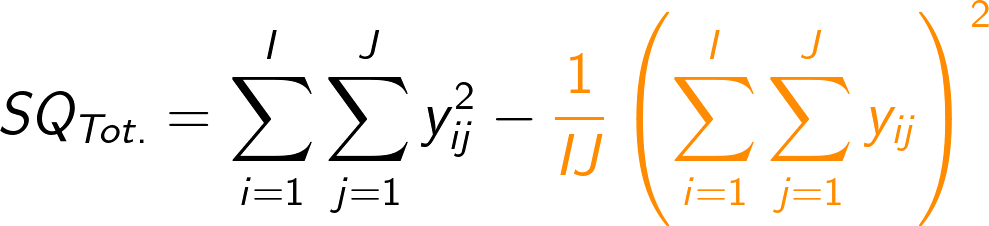
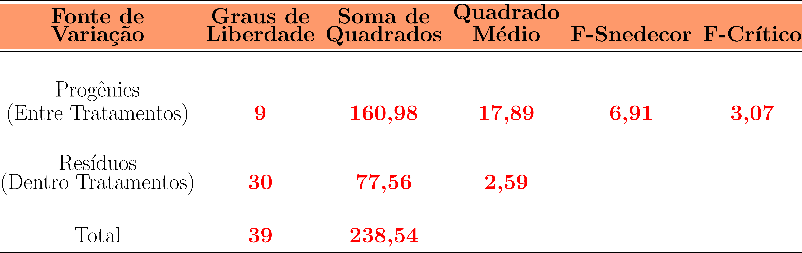

class: title-slide, center, middle
background-image: url(fig/slide-title/LMFTCA.png), url(fig/slide-title/ufpa.png), url(fig/slide-title/capa.png)
background-position: 90% 90%, 10% 90%
background-size: 150px, 150px, cover

```{r setup, include=FALSE}
knitr::opts_chunk$set(
	error = FALSE,
	fig.align = "center",
	fig.showtext = TRUE,
	message = FALSE,
	warning = FALSE,
	cache = FALSE,
	collapse = TRUE,
	dpi = 600
)
```

```{r packages, include=FALSE}
# remotes::install_github("dill/emoGG")
library(ggplot2)
library(dplyr)
library(ggimage)
library(kableExtra)
library(readr)
```

```{css, echo=FALSE}
.with-logo::before {
	content: '';
	width: 120px;
	height: 120px;
	position: absolute;
	bottom: 1.3em;
	right: -0.5em;
	background-size: contain;
	background-repeat: no-repeat;
}

.logo-ufpa::before {
	background-image: url(fig/slide-title/ufpa.png);
}
```

```{r xaringan-logo, echo=FALSE}
library(xaringanExtra)

use_logo(
  image_url = "fig/slide-title/LMFTCA.png",
  position = css_position(top = "1em", right = ".5em"),
  width = "130px",
  height = "130px")


use_scribble() # para escrever nos slides
use_share_again()
use_progress_bar()
#use_animate_all(style = c("slide_down"))

use_extra_styles(
  hover_code_line = TRUE,         #<<
  mute_unhighlighted_code = TRUE  #<<
)
xaringanExtra::use_editable(expires = 1)
#.can-edit[Você pode editar este título de slide]
#.can-edit.key-firstSlideTitle[Change this title and then reload the page]
use_clipboard()
```

```{r, load_refs, include=FALSE, cache=FALSE}
library(RefManageR)
BibOptions(check.entries = FALSE,
           bib.style = "authoryear",
           cite.style = "authoryear",
           style = "html",
           hyperlink = FALSE,
           dashed = FALSE)
(myBib <- ReadBib("./bib/ref.bib", check = FALSE))
```

```{r icon, echo=FALSE}
#remotes::install_github("mitchelloharawild/icons")
#remotes::install_github('emitanaka/anicon')
#library(icons)
#download_fontawesome()
#download_simple_icons()
```

```{r customDT, echo=F}
CustomDT <- function(data){
  data %>% DT::datatable(editable = 'cell', rownames = FALSE,
                         style = "default",
                         class = "display", width = '400px',
                         caption = '',
     options=list(pageLength = 12, dom = 'tip', autoWidth = F,
       initComplete = htmlwidgets::JS(
          "function(settings, json) {",
          paste0("$(this.api().table().container()).css({'font-size': '", "10pt", "'});"),
          "}")
       ) 
     )
}
```

```{r customkbl, echo=F}
Customkbl <- function(data){
  data %>%
    kbl() %>%
    kable_classic(full_width = F, html_font = "Cambria") %>% 
  kable_paper(bootstrap_options = "striped", full_width = F) %>% 
  kable_styling(bootstrap_options = "striped", font_size = 18, position = "center") %>% 
  row_spec(1:4, color = 'black', background = 'white') %>% 
  row_spec(0, color = 'white', background = 'black') %>% 
  column_spec(1, color = 'white', background = 'black')
}
```


<!-- title-slide -->
# .font120[Experimentação Florestal <br> (FL03034 - EF)]

## `r anicon::faa("pagelines", animate="horizontal", colour="green")` Delineamento Inteiramente `r anicon::faa("pagelines", animate="horizontal", colour="green")` <br> Casualizado (ANOVA)

##### .font120[**Prof. Dr. Deivison Venicio Souza**]
##### Universidade Federal do Pará (UFPA)
##### Faculdade de Engenharia Florestal
##### E-mail: deivisonvs@ufpa.br
<br>
##### 1ª versão: 02/setembro/2021 <br> (Atualizado em: `r format(Sys.Date(),"%d/%B/%Y")`) <br> Altamira, Pará

---
layout: true
<div class="my-header"></div>
<div class="my-footer"><span>Prof. Dr. Deivison Venicio Souza (E-mail: deivisonvs@ufpa.br)&emsp;&emsp;&emsp;&emsp;&emsp;Experimentação Florestal (FL03034 - EF) - Delineamento Inteiramente Casualizado (ANOVA) - 1ª Solução </div>

---

## Ementa da disciplina (FL03034 - EF)

.shadow3[
<br>
1 - Introdução à experimentação; 

2 - Análise exploratória de dados;

**3 - Delineamento inteiramente casualizado - DIC;**

4 - Delineamento em blocos ao acaso - DBC;

5 - Delineamento em quadrado latino - DQL;

6 - Testes de comparação de médias; 

7 - Experimentos em esquema fatorial;

8 - Análise de correlação e regressão linear; e

9 - Análise de experimentos com linguagem R.

]

---

## Objetivos
<br><br>
Ao final desta aula espera-se que o discente seja capaz de...

.font90[
* Conhecer e entender os princípios básicos de experimentos em DIC.
* Compreender o modelo estatístico de experimentos em DIC.
* Aprender a realizar a Análise de Variância (ANOVA) de experimentos em DIC, e entender seus pressupostos.
* Realizar análise de experimentos em DIC usando a linguagem de programação R.
]

---

## Conteúdo

.pull-left-4[
.font80[
**Parte 1 - Delineamento Inteiramente Casualizado**

[1 - Delineamento experimental - Conceito](#de)

[2 - Principais delineamentos experimentais](#pde)

[3 - DIC - Conceito](#con)

[4 - DIC - Principais características](#dicpc)

[5 - DIC - Vantagens e Limitações](#dicvl)

[6 - DIC - Representação Genérica](#rg)

[7 - DIC - Modelo Estatístico](#me)

[8 - DIC - Análise de Variância](#dicaov)

]
]

.pull-right-4[
.pull-down[
.font80[
**Parte 2 - Estudo de caso de experimentos em DIC**

[1 - Competição de progênies (Pimentel-Gomes; Garcia, 2002)](#prog)

&nbsp;&nbsp;[1.1 - ANOVA experimento em DIC - Fator único](#anvdic)

&nbsp;&nbsp;&nbsp;&nbsp;[1.1.1 - Graus de liberdade](#gl)

&nbsp;&nbsp;&nbsp;&nbsp;[1.1.2 - Somas de Quadrados](#sq)

&nbsp;&nbsp;&nbsp;&nbsp;[1.1.3 - Quadradados Médios](#qm)

&nbsp;&nbsp;&nbsp;&nbsp;[1.1.4 - Estatística F](#estF)

&nbsp;&nbsp;&nbsp;&nbsp;[1.1.5 - F crítico da distribuição F](#fcrit)

[2 - Anova no R](#anvR)


<!-- [3 - Pacote ExpDes.pt](#expdes) -->

]
]
]


---

layout: false
name: prog
class: inverse, top, right
background-image: url(fig/class3/arara.jpg)
background-size: cover

.font200[**.yellow[Parte 2] <br> .white[Estudo de caso de <br> experimentos DIC]**] 

.left[.footnote[.white[Créditos: Imagem de IvaCastro por Pixabay].]]

---
layout: true
<div class="my-header"></div>
<div class="my-footer"><span>Prof. Dr. Deivison Venicio Souza (E-mail: deivisonvs@ufpa.br)&emsp;&emsp;&emsp;&emsp;&emsp;Experimentação Florestal (FL03034 - EF) - Delineamento Inteiramente Casualizado</div>

---
name: anvdic
## Delineamento Inteiramente Casualizado
<br>

### .font90[Estudo de Caso I - Competição de progênies (Pimentel-Gomes; Garcia, 2002)]
<br>

.font90[
Um experimento de competição de 10 progênies de *Eucalyptus saligna* foi conduzido sob o delineamento inteiramente casualizado (DIC), com 4 repetições. Os dados apresentados na tabela a seguir correspondem aos valores médios de diâmetro a 1,30m do solo, em centímetros, nas parcelas experimentais. Assim, pede-se:
<br><br>

a) Faça um diagnóstico visual (elabore gráficos!) dos dados experimentais.

b) Elaborar as hipóteses da estatística F da ANOVA.

c) Realizar a ANOVA do experimento em DIC e concluir sobre a estatística F.
]

---

## Delineamento Inteiramente Casualizado
<br>

### .font90[Estudo de Caso I - Competição de progênies (Pimentel-Gomes; Garcia, 2002)]
<br>

```{r tibble, echo=F, eval=T}
data <- readr::read_csv("data/DIC-Pimentel-Gomes-2002.csv")
data %>% Customkbl
```

---

## Delineamento Inteiramente Casualizado
<br>

.font80[
### Estudo de Caso I - Competição de progênies (Pimentel-Gomes; Garcia, 2002)
]

.font80[
- **Gráfico Dot Plot**: Ajuda a visualizar como a média dos diâmetros variou entre repetições de cada Progênie.
]

```{r echo=F, eval=T, collapse=T, out.width="35%", fig.align='center', fig.cap='', dpi=600}

df <- data %>%
  tidyr::pivot_longer(
        cols = starts_with("P"),
        names_to = "Progenie",
        values_to = "Valor",
        names_transform = list(Progenie = as.factor),
        values_drop_na = TRUE
    ) %>%
  rename(Repeticao = `Rep./Prog.`) %>% 
  mutate(Progenie = forcats::fct_reorder(
    Progenie, 
    desc(Valor), 
    .fun='mean')
    )

df %>%
  ggplot(aes(x=Progenie, y=Valor, fill=Progenie)) + 
  geom_dotplot(binaxis='y', stackdir='center') +
  stat_summary(fun.y=mean, geom="point", shape=18,
                 size=6, color="red") +
  theme_bw(base_size = 18) +
  theme(panel.grid = element_blank(),
        legend.position="none"
        )
```

---

## Delineamento Inteiramente Casualizado
<br>

.font80[
### Estudo de Caso I - Competição de progênies (Pimentel-Gomes; Garcia, 2002)

- **Gráfico BoxPlot**: Fornece um indicativo da distribuição dos dados e medidas de posição.
]

```{r echo=F, eval=T, collapse=T, fig.align='center', fig.cap='', dpi=600, fig.width=1, fig.height=.6}

bp <- df %>%
  ggplot(aes(x=Progenie, y=Valor, color=Progenie)) +
  geom_boxplot() +
  stat_summary(fun.y=mean, geom="point", shape=4,
                 size=2, color="red") +
  theme_bw(base_size = 16) +
  theme(panel.grid = element_blank(),
        legend.position="none"
        )

plotly::ggplotly(bp)
```

---

## Delineamento Inteiramente Casualizado
<br>

### .font90[Estudo de Caso I - Competição de progênies (Pimentel-Gomes; Garcia, 2002)]
<br>

**Hipóteses da estatística F da ANOVA**
<br>

.pull-left-11[
.font90[
- Hipótese de nulidade (H<sub>0</sub>)
<br>

**Não existe diferença** significativa entre as **médias** de diâmetro a 1,30m do solo das 10 progênies de *Eucalyptus saligna*.
]
]

.pull-right-11[
.font90[
- Hipótese de alternativa (H<sub>1</sub>)
<br>

**Existe diferença** significativa entre **pelo menos duas médias** de diâmetro a 1,30m do solo das 10 progênies de *Eucalyptus saligna*.
]
]

---

## Delineamento Inteiramente Casualizado
<br>

### .font90[Estudo de Caso I - Competição de progênies (Pimentel-Gomes; Garcia, 2002)]
<br>

.font90[
**Retornemos ao quadro de dados do experimento!**

**Vamos inspecionar os valores médios observados de DAP para as diferentes progênies!**

Pode-se constatar que os valores observados para DAP não são idênticos entre diferentes progênies e mesmo dentro de progênies (entre repetições da progênie).
]
<br>

.pull-left-2[
```{r t, echo=F, eval=T}
data %>% Customkbl
```
]

.pull-right-1[
.font80[
- Quais são as possíveis causas que explicam as variações nos valores observados?
- Alguma progênie apresentou desenvolvimento em diâmetro significativamente superior?
]
]

---

## Delineamento Inteiramente Casualizado
<br>

### .font90[Estudo de Caso I - Competição de progênies (Pimentel-Gomes; Garcia, 2002)]
<br>
.font90[

Do quadro de dados pode-se obter medidas como .blue[somatórios] e .blue[médias aritméticas] dos diâmetros para cada progênie.
]

```{r tb1, echo=F, eval=T}
library(dplyr)
data <- readr::read_csv("data/DIC-Pimentel-Gomes-2002.csv")

df1 <- data %>% 
  bind_rows(data %>%
            summarise_if(is.numeric, sum)) %>% 
  mutate(`Rep./Prog.` = ifelse(is.na(`Rep./Prog.`), "Total", `Rep./Prog.`)) %>% 
  mutate_if(is.numeric, round, 1)

df2 <- df1 %>% 
  bind_rows(df1[-5,]%>%
            summarise_if(is.numeric, mean)) %>% 
  mutate(`Rep./Prog.` = ifelse(is.na(`Rep./Prog.`), "Média", `Rep./Prog.`)) %>% 
  mutate_if(is.numeric, round, 1)

df2 %>% 
  Customkbl %>% 
  row_spec(5:6, color = 'white', background = 'orange')
```

---

## Delineamento Inteiramente Casualizado
<br>

### .font90[Estudo de Caso I - Competição de progênies (Pimentel-Gomes; Garcia, 2002)]

.font80[
- Alguma progênie apresentou desenvolvimento em diâmetro significativamente superior?
- A resposta para esta pergunta será alcançada realizando-se a ANOVA-DIC e, por conseguinte, a interpretação do teste F-Snedecor.
<br>

**Então, vamos construir o quadro da ANOVA.** 
]
(.font80[**Modelo Estatístico**:] $\normalsize Y_{ij} = m + t{_i} + e_{ij}$)
<br>

```{r, echo=FALSE, out.width='75%', fig.align='center', fig.cap='', dpi=600}
knitr::include_graphics('fig/class4/DIC-ANOVA.png')
```

---
name: gl
## Delineamento Inteiramente Casualizado
<br>

### .font90[Estudo de Caso I - Competição de progênies (Pimentel-Gomes; Garcia, 2002)]
<br>

.font90[**1º Passo**: determinar os valores de graus de liberdade de todas as fontes de variação do experimento.]
<br><br>

```{r, echo=FALSE, out.width='85%', fig.align='center', fig.cap='', dpi=600}
knitr::include_graphics('fig/class4/ANOVA-GL.png')
```

---

## Delineamento Inteiramente Casualizado
<br>

### .font90[Estudo de Caso I - Competição de progênies (Pimentel-Gomes; Garcia, 2002)]
<br>

**2º Passo**: Determinar as Somas de Quadrados.
<br><br>

.pull-left-10[
- **Soma de Quadrados Total (SQ<sub>Tot.</sub>)**
<br><br>

```{r, echo=FALSE, out.width='65%', fig.align='center', fig.cap='', dpi=600}

```
<br>

.font80[
As equações de SQ<sub>Tot.</sub> e SQ<sub>Trat.</sub> possuem uma parte em comum denominada **Fator em Comum** (C). Inicialmente, é razoável calcular este fator.
]

]

.pull-right-10[
- **Soma de Quadrados de Tratamentos (SQ<sub>Trat.</sub>)**
<br><br>

```{r, echo=FALSE, out.width='70%', fig.align='center', fig.cap='', dpi=600}
knitr::include_graphics('fig/class4/SQTrat-cor.png')
```

- **Soma de Quadrados de Resíduos (SQR)**

.pull-right-5[
$\large SQR = SQ_{Tot.} - SQ_{Trat.}$
]
]

---

## Delineamento Inteiramente Casualizado
<br>

### .font90[Estudo de Caso I - Competição de progênies (Pimentel-Gomes; Garcia, 2002)]
<br>

**2º Passo**: Determinar as Somas de Quadrados - .blue[Fator em Comum]
<br><br>

.pull-left-9[
```{r tb2, echo=F, eval=T}
df1 %>% 
  Customkbl %>% 
  row_spec(5, color = 'white', background = 'orange')
```

$$
\begin{equation*}
\sum_{i=1}^{I}\sum_{j=1}^{J}Y_{ij} = 58,2 + 57,2 + 56,9 + ... + 35,1 = 496,5
\end{equation*}
$$

]

.pull-right-9[

```{r, echo=FALSE, out.width='50%', fig.align='center', fig.cap='', dpi=600}
knitr::include_graphics('fig/class4/Fator.png')
```
<br>

$$
C = \dfrac{\left( 496.5\right)^2}{10*4} = \dfrac{246.512,25}{40} = 6.162,81
$$

]

---

## Delineamento Inteiramente Casualizado
<br>

### .font90[Estudo de Caso I - Competição de progênies (Pimentel-Gomes; Garcia, 2002)]
<br>

**2º Passo**: Determinar as Somas de Quadrados - .blue[Soma de Quadrados Totais - SQ<sub>Tot.</sub>]
<br><br>

.pull-left-9[
```{r tb3, echo=F, eval=T}
data %>% 
  Customkbl
```

$$
\begin{equation*}
\sum_{i=1}^{I}\sum_{j=1}^{J}Y_{ij}^2 = 16^2 + 16,4^2 + 14,1^2 + ... + 9,2^2 = 6.401,35
\end{equation*}
$$
]

.pull-right-9[
```{r, echo=FALSE, out.width='95%', fig.align='center', fig.cap='', dpi=600}

```

$$
SQ_{Tot.} = 6.401,35 - 6.162,81 = 238,54
$$

]

---

## Delineamento Inteiramente Casualizado
<br>

### .font90[Estudo de Caso I - Competição de progênies (Pimentel-Gomes; Garcia, 2002)]
<br>

**2º Passo**: Determinar as Somas de Quadrados - .blue[Soma de Quadrados de Tratamentos - SQ<sub>Trat.</sub>]
<br><br>

.pull-left-9[
```{r tb4, echo=F, eval=T}
df1 %>% 
  Customkbl %>% 
  row_spec(5, color = 'white', background = 'orange')
```

$$
\begin{equation*}
\small
\sum_{i=1}^{I}\left ( \sum_{j=1}^{J}Y_{ij} \right )^2 = 58,2^2 + 57,2^2 + 56,9^2 + ... + 35,1^2 = 25.295,17
\end{equation*}
$$
]


.pull-right-9[

```{r, echo=FALSE, out.width='95%', fig.align='center', fig.cap='', dpi=600}
knitr::include_graphics('fig/class4/SQTrat-cor.png')
```

$$
SQ_{trat.} = \dfrac{25.295,17}{4} - 6.162,81 = 160,98
$$

]

---

## Delineamento Inteiramente Casualizado
<br>

### .font90[Estudo de Caso I - Competição de progênies (Pimentel-Gomes; Garcia, 2002)]
<br>

**2º Passo**: Determinar as Somas de Quadrados - .blue[Soma de Quadrados de Resíduos - SQR]
<br><br>

$\large SQR = SQ_{Tot.} - SQ_{Trat.}$

$\large SQR = 238,54 - 160,98$

$\large SQR = 77,56$

---

## Delineamento Inteiramente Casualizado
<br>

### .font90[Estudo de Caso I - Competição de progênies (Pimentel-Gomes; Garcia, 2002)]
<br>

**2º Passo**: Determinar as Somas de Quadrados - .blue[Adicionar no quadro da ANOVA]
<br><br>

```{r, echo=FALSE, out.width='85%', fig.align='center', fig.cap='', dpi=600}
knitr::include_graphics('fig/class4/ANOVA-SQ.png')
```

---
name: qm
## Delineamento Inteiramente Casualizado
<br>

### .font90[Estudo de Caso I - Competição de progênies (Pimentel-Gomes; Garcia, 2002)]
<br>

**3º Passo**: Determinar os Quadrados Médios - .blue[Tratamento e Resíduo]
<br><br>

.pull-left-9[
**Quadrado Médio de Tratamentos (Progênies) - Variância entre tratamentos**
<br><br>
$\normalsize QM_{Trat.} = \dfrac{SQ_{Trat.}}{I-1} = \dfrac{160,98}{10-1} = 17,89$
]

.pull-right-9[
**Quadrado Médio de Resíduos - Variância dentro de tratamentos**
<br><br>
$\normalsize QMR = \dfrac{SQR}{I(J-1)} = \dfrac{77,56}{10(4-1)} = 2,59$
]

---

## Delineamento Inteiramente Casualizado
<br>

### .font90[Estudo de Caso I - Competição de progênies (Pimentel-Gomes; Garcia, 2002)]
<br>

**3º Passo**: Determinar os Quadrados Médios - .blue[Adicionar no quadro da ANOVA]
<br><br>

```{r, echo=FALSE, out.width='85%', fig.align='center', fig.cap='', dpi=600}
knitr::include_graphics('fig/class4/ANOVA-QM.png')
```

---
name: estF
## Delineamento Inteiramente Casualizado
<br>

### .font90[Estudo de Caso I - Competição de progênies (Pimentel-Gomes; Garcia, 2002)]
<br>

**4º Passo**: Determinar a estatística F
<br><br>


$\normalsize F = \dfrac{QM_{Trat.}}{QMR} = \dfrac{17,89}{2,59} = 6,91$

---
name: fcrit
## Delineamento Inteiramente Casualizado
<br>
.font90[
### Estudo de Caso I - Competição de progênies (Pimentel-Gomes; Garcia, 2002)
<br>

**5º Passo**: Encontrar o valor crítico da distribuição F para o nível de significância $\alpha$
<br><br>

- O valor de F-crítico pode ser encontrado nas tabelas de distribuição F teóricas.
- Para isso, são necessárias 3 informações: 1) GL de tratamentos; 2) GL de resíduos; e 3) nível de significância $\alpha$.
- Os níveis de significância ( $\alpha$ ) mais usuais são: 0,01 (1%) e 0,05 (5%).
- Neste exemplo, admitir-se-á $\alpha = 0,01$ (ou 1%), conforme Pimentel-Gomes e Garcia (2002).
]

---

## Delineamento Inteiramente Casualizado
<br>

.font90[
### Estudo de Caso I - Competição de progênies (Pimentel-Gomes; Garcia, 2002)
<br>

**5º Passo**: Encontrar o valor crítico da distribuição F para o nível de significância $\alpha$
<br><br>

.pull-left-9[
.blue[**Vamos aprender a usar a tabela de distribuição F!**]
- Acesse o site: [F-Distribution-Tables-UCLA](http://socr.ucla.edu/Applets.dir/F_Table.html)
- O F-crítico para o experimento é: $F_{[9,~30;~0,01]} = 3,07$
<br><br>

**No R use a função qf() para encontrar o F-crítico**
```{r, echo=T, eval=T}
qf(0.01, 9, 30, lower.tail=FALSE)
```

]

.pull-right-9[
.blue[**Bônus: Explore mais aplicativos...**]
- [Distribuição-F-Prof-Bertolo](http://www.bertolo.pro.br/FinEst/Estatistica/DistribuicaoProbabilidades2/f/index.html)
- [Stat-Kingdom](https://www.statskingdom.com/180Anova1way.html)
- [Illinois-Department-of-Statistics](http://courses.atlas.illinois.edu/spring2016/STAT/STAT200/pf.html)
]
]

---

## Delineamento Inteiramente Casualizado
<br>

.font90[
### Estudo de Caso I - Competição de progênies (Pimentel-Gomes; Garcia, 2002)
<br>

**Finalmente, têm-se o quadro final da ANOVA de experimentos em DIC!**
<br><br>

```{r, echo=FALSE, out.width='70%', fig.align='center', fig.cap='', dpi=600}

```

]

---

## Delineamento Inteiramente Casualizado
<br>

.font90[
### Estudo de Caso I - Competição de progênies (Pimentel-Gomes; Garcia, 2002)
<br>

**Teste de Hipótese da ANOVA DIC - Conclusão**
<br>
]

--

.pull-top[
.pull-left-11[
.font80[
- Hipótese de nulidade (H<sub>0</sub>)
<br>

**Não existe diferença** significativa entre as **médias** de diâmetro a 1,30m do solo das 10 progênies de *Eucalyptus saligna*.
]
]

.pull-right-11[
.font80[
- Hipótese de alternativa (H<sub>1</sub>)
<br>

**Existe diferença** significativa entre as **médias** de diâmetro a 1,30m do solo (DAP) para pelo menos duas progênies de *Eucalyptus saligna*.

]
]
]

--

.pull-down[
.pull-left-10[
<br><br>
$\large F_{Calculado}~>~F_{Crítico}~=~6,91~>~3,07$

**Conclusão**: .blue[**Rejeita-se H<sub>0</sub>**]
]

.pull-right-10[

.shadow3[
.center[**Interpretação**]

.font80[
- Como $\large F_{Calculado}~>~F_{Crítico}~(~6,91~>~3,07)$ rejeita-se a hipótese de nulidade (H<sub>0</sub>). Portanto, existem evidências de que as médias de pelo menos dois tratamentos (Progênies) diferem estatísticamente, ao nível de 5% de probabilidade.
]
]
]
]

---

## Delineamento Inteiramente Casualizado
<br>

.font90[
### Estudo de Caso I - Competição de progênies (Pimentel-Gomes; Garcia, 2002)
<br>

**O que fazer quando rejeita-se a hipótese de nulidade?**
<br>

- Deve-se realizar pós-testes de comparações múltiplas de médias.
- Os testes paramétricos mais famosos são: Tukey, Duncan, Dunnett, etc.
- Esses testes realizam comparações par-a-par entre as médias dos tratamentos.
]
<br><br>


.center[.blue[**Mas, isso é tema para as próximas aulas!**]]

---

## Delineamento Inteiramente Casualizado

.font80[
### Estudo de Caso I - Competição de progênies (Pimentel-Gomes; Garcia, 2002)

.pull-left-9[
**ANOVA fator único usando a linguagem R**
<br>

.blue[**1- Ordenar dados no formato longo**]
<br>

```{r echo=T, eval=F}
data <- readr::read_csv("data/DIC-Pimentel-Gomes-2002.csv")

data_pivot <- data %>%
  tidyr::pivot_longer(
        cols = starts_with("P"),
        names_to = "Progenie",
        values_to = "Valor",
        names_transform = list(Progenie = as.factor),
        values_drop_na = TRUE
    ) %>% 
  rename(Repeticao = `Rep./Prog.`) %>% 
  arrange(Progenie, Repeticao)
```


```{r dt, echo=F, eval=F}
data %>%
    tidyr::pivot_longer(
        cols = starts_with("P"),
        names_to = "Progenie",
        values_to = "Valor",
        names_transform = list(Progenie = as.factor),
        values_drop_na = TRUE
    ) %>% 
  rename(Repeticao = `Rep./Prog.`) %>% 
  arrange(Progenie, Repeticao) %>% 
  CustomDT
```

]

.pull-right-9[
```{r ref.label="dt", echo=FALSE, eval=TRUE, collapse=T}
```
]

]

---

## Delineamento Inteiramente Casualizado

.font80[
### Estudo de Caso I - Competição de progênies (Pimentel-Gomes; Garcia, 2002)
<br>

.pull-left-9[
**ANOVA fator único usando a linguagem R**
<br><br>

.blue[**2 - Ajustar modelo DIC e obter a ANOVA**]
<br>

```{r, echo=F,eval=TRUE}
data_pivot <- data %>%
  tidyr::pivot_longer(
        cols = starts_with("P"),
        names_to = "Progenie",
        values_to = "d",
        names_transform = list(Progenie = as.factor),
        values_drop_na = TRUE
    ) %>% 
  rename(Repeticao = `Rep./Prog.`) %>% 
  arrange(Progenie, Repeticao)
```

```{r lm, echo=T, eval=T}
# Ajuste do modelo
m0 <- lm(d ~ Progenie, data = data_pivot)
```

```{r aov2, echo=T, eval=T, collapse=F}
# Quadro de ANOVA
anova(m0)
```

]
]

--

.pull-right-9[
.shadow3[
.font80[
.center[**Interpretação**]
- A função lm() é usada para ajustar o modelo DIC. A função anova() mostra o quadro da ANOVA. A coluna Pr(>F) é o p-valor da estatística F. Portanto, como o p-valor é menor que o nível de significância 0,01, existem
evidências de diferenças significativas entre as médias de DAP das progênies.
- Rejeita-se a hipótese de nulidade para $\alpha$ < 0,001 (altamente significativo).
- Deve-se realizar pós-testes de comparações de médias.
]
]
]

---

## Referências
<br><br>
DIAS, L. A. dos S.; BARROS, W. S. Biometria experimental. Viçosa, MG: Suprema, 2009. 408 p.
<br><br>
NOGUEIRA, M. C. S. Experimentação agronômica I: conceitos, planejamento e análise estatística. Piracicaba, 479 p. 2007.
<br><br>
PIMENTEL-GOMES, F.; GARCIA, C. H. Estatística aplicada a experimentos agronômicos e florestais: exposição com exemplos e orientações para uso de aplicativos. Piracicaba: FEALQ, 2002. 309 p.

<!--Slide XX -->
---
layout: false
class: inverse, top, right
background-image: url(fig/class1/imgC.jpg)
background-size: cover

.font300[
Obrigado!
]
<br><br><br><br><br><br>

**Email**: <a href="mailto:deivisonvs@ufpa.br">deivisonvs@ufpa.br</a>

**Github**: <a href="https://github.com/DeivisonSouza">@DeivisonSouza</a>

