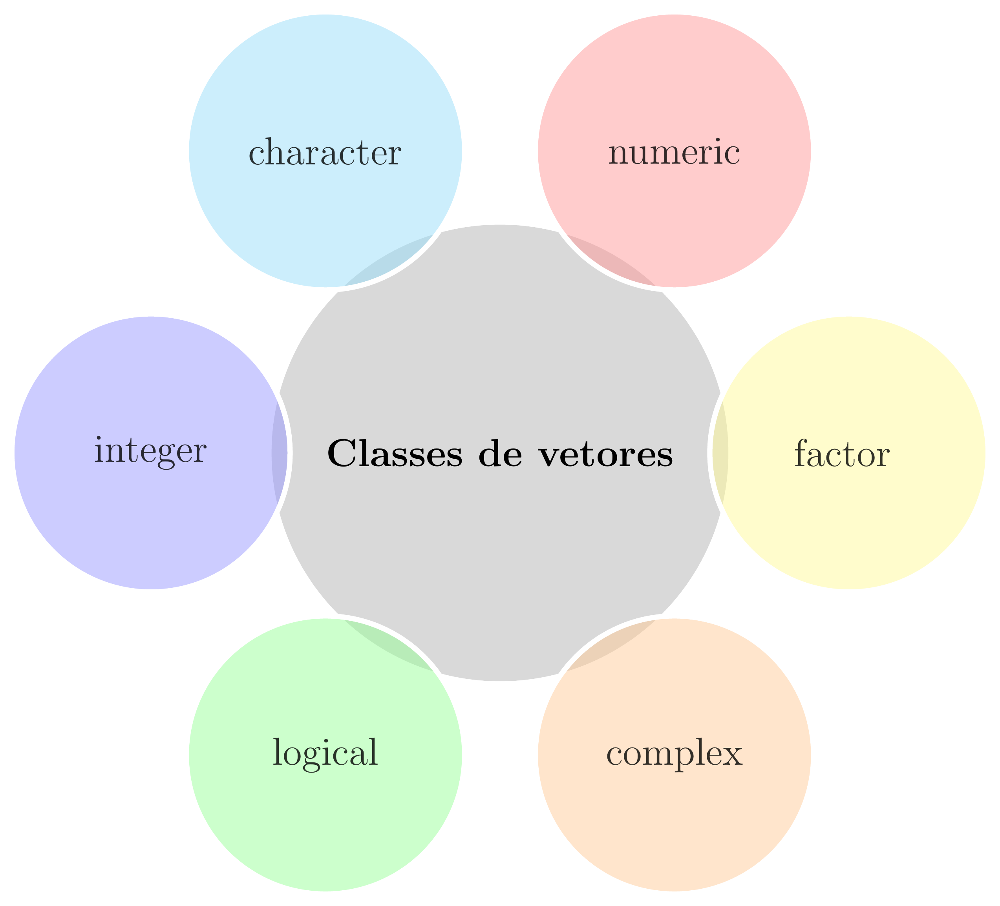

class: title-slide, center, middle
background-image: url(fig/slide-title/ufpa2.png), url(fig/slide-title/forest.png), url(fig/slide-title/img3.png)
background-position: 84% 90%, 95% 90%
background-size: 220px, 90px, cover

```{r setup, include=FALSE}
knitr::opts_chunk$set(
  fig.showtext = TRUE,
  fig.align = "center", 
  cache = FALSE,
  error = FALSE,
  message = FALSE, 
  warning = FALSE, 
  collapse = TRUE ,
  dpi = 600)
```

```{r packages, include=FALSE}
# remotes::install_github("dill/emoGG")
library(ggplot2)
library(dplyr)
library(ggimage)
library(kableExtra)
```

```{r xaringan-logo, echo=FALSE}
library(xaringanExtra)
use_logo(
  image_url = "fig/slide-title/ufpa.png",
  position = css_position(top = ".8em", right = "-.5em"),
  width = "140px",
  height = "140px"
)

use_extra_styles(
  hover_code_line = TRUE,         #<<
  mute_unhighlighted_code = TRUE  #<<
)
xaringanExtra::use_editable(expires = 1)
#.can-edit[Você pode editar este título de slide]
#.can-edit.key-firstSlideTitle[Change this title and then reload the page]
use_clipboard()
```

```{r, load_refs, include=FALSE, cache=FALSE}
library(RefManageR)
BibOptions(check.entries = FALSE,
           bib.style = "authoryear",
           cite.style = "authoryear",
           style = "html",
           hyperlink = FALSE,
           dashed = FALSE)
(myBib <- ReadBib("./bib/ref.bib", check = FALSE))
```

```{r icon, echo=FALSE}
#remotes::install_github("mitchelloharawild/icons")
#remotes::install_github('emitanaka/anicon')
#library(icons)
#download_fontawesome()
#download_simple_icons()
```

<!-- title-slide -->
# Experimentação Florestal <br> (FL03034 - EF)

## Introdução à Linguagem <br> de Programação R `r anicon::faa("pagelines", animate="horizontal", colour="green")`

#### **Prof. Dr. Deivison Venicio Souza**
#### Universidade Federal do Pará (UFPA) 
#### Faculdade de Engenharia Florestal
#### E-mail: deivisonvs@ufpa.br
<br>
##### `r format(Sys.Date(),"%d/%B/%Y")`
##### Altamira, Pará

---
layout: true
<div class="my-header"></div>
<div class="my-footer"><span>Prof. Dr. Deivison Venicio Souza (E-mail: deivisonvs@ufpa.br)&emsp;&emsp;&emsp;&emsp;&emsp;Experimentação Florestal (FL03034 - EF) - Introdução à Linguagem de Programação R</div>

---

## Objetivos
<br><br>
Ao final desta aula espera-se que o discente seja capaz de...

* Entender a importância e reconhecer a praticidade de uso da linguagem de programação;
* Realizar o download e instalação o RGui e Rstudio;
* Compreender as principais estruturas de dados na linguagem R;
* Realizar indexação de diferentes estruturas de dados no R;
* Compreender e desenvolver suas próprias funções no R;
* Compreender e aprender a usar estruturas de controle no R;
* Criar gráficos usando funções de pacotes do R-base; e
* Realizar uma análise exploratória de dados.
---

## Conteúdo

.pull-left-4[
**Parte 1 - Conhecendo o R e o IDE Rstudio**

[1- A linguagem R](#R)

[2 - Por que usar a linguagem R?](#pqR)

[3 - RGui - Download, instalação e interface](#RGui)

[4 - IDE RStudio - Download, instalação e interface](#Rstudio)

]

.pull-right-4[
.pull-down[
**Parte 2 - Estrutura de dados na linguagem R**

[1 - Vetores](#vet)

[2 - Matrizes](#mat)

[3 - Data Frames](#df)

[4 - Listas](#list)

]
]

---

## Conteúdo


.pull-left-4[
**Parte 3 - Iniciando na linguagem R**

[1 - Sintaxe da linguagem R](#Sintaxe)

[2 - Operadores no R](#Operadores)

&nbsp;&nbsp;&nbsp;&nbsp;[2.1 - Aritméticos](#arit)

&nbsp;&nbsp;&nbsp;&nbsp;[2.2 - Relacionais](#relac)

&nbsp;&nbsp;&nbsp;&nbsp;[2.3 - Lógicos](#log)

[3 - Funções matemáticas usuais](#FunsMat)

]


---

layout: false
name: conc
class: inverse, top, right
background-image: url(fig/class3/inv1.jpg)
background-size: cover

.font200[**Parte 1 <br> .red[Conhecendo o R e <br> o IDE Rstudio]**]

---
layout: true
<div class="my-header"></div>
<div class="my-footer"><span>Prof. Dr. Deivison Venicio Souza (E-mail: deivisonvs@ufpa.br)&emsp;&emsp;&emsp;&emsp;&emsp;Experimentação Florestal (FL03034 - EF) - Introdução à Linguagem de Programação R</div>

---

## Linguagem R

.pull-left-4[
.font90[
- É uma linguagem de programação de computadores de código aberto e gratuita;
- Criada em 1993: Ross Ihaka e por Robert Gentleman;
- Departamento de Estatística da Universidade de Auckland, Nova Zelândia;
- O R foi desenvolvido a partir da Linguagem S.
]
]

.pull-right-4[
.font90[
**Possui múltiplas facetas:**

- Pacotes para implementação de métodos estatisticos;
- Pacotes para visualização gráfica elegantes;
- Pacotes para criação de aplicações web, Dashboard;
- Pacote para geração de relatórios dinâmicos;
- Pacotes para criação de apresentações elegantes.
]
]

.pull-left-7[
```{r echo=FALSE, out.width='30%', fig.align='center', fig.cap='', dpi=600}
knitr::include_graphics("https://petsistemas.ufms.br/wp-content/uploads/2017/02/main-qimg-7012cde5b60209165cdc281d888b33ac.png")

```
]

.pull-left-7[
```{r echo=FALSE, out.width='30%', fig.align='center', fig.cap='', dpi=600}
knitr::include_graphics("https://blog.efpsa.org/wp-content/uploads/2019/04/pic1.png")

```

]

.pull-left-7[
```{r echo=FALSE, out.width='30%', fig.align='center', fig.cap='', dpi=600}
knitr::include_graphics("https://ggplot2.tidyverse.org/logo.png")
```
]

.pull-left-7[
```{r echo=FALSE, out.width='30%', fig.align='center', fig.cap='', dpi=600}
knitr::include_graphics("https://pkgs.rstudio.com/rmarkdown/reference/figures/logo.png")
```
]

.pull-left-7[
```{r echo=FALSE, out.width='30%', fig.align='center', fig.cap='', dpi=600}
knitr::include_graphics("https://tidyverse.tidyverse.org/articles/tidyverse-logo.png")
```
]

---

## Por que usar a linguagem R?

```{r, echo=FALSE, out.width='50%', fig.align='center', fig.cap='', dpi=600}
knitr::include_graphics('fig/class3/WhyR.png')
```

---

## RGui - Download e instalação
<br>

**1⁰ Passo**: Acessar a página do projeto R em: https://www.r-project.org/;

**2⁰ Passo**: Do lado esquerdo da página clique sobre o menu .green[CRAN];

**3⁰ Passo**: Será aberta uma página com diversos links de .green[CRAN Mirrors], isto é, espelhos CRAN. 
<br>
Veja na tabela a seguir os principais espelhos disponíveis no Brasil.
<br><br>

.center2[
```{r echo=FALSE}
df <- data.frame(Link = 
                   c("http://cran-r.c3sl.ufpr.br/",
                     "http://nbcgib.uesc.br/mirrors/cran/", 
                     "https://cran.fiocruz.br/",
                     "https://vps.fmvz.usp.br/CRAN/",
                     "http://brieger.esalq.usp.br/CRAN/"),
                 Instituição = 
                   c("Universidade Federal do Paraná - UFPR",
                     "Center for Comp Biol at Universidade Estadual de Santa Cruz",
                     "Oswaldo Cruz Foundation, Rio de Janeiro",
                     "University of São Paulo, São Paulo",
                     "University of São Paulo, Piracicaba")
                 )

df %>% 
   DT::datatable(editable = 'cell', rownames = FALSE, style = "default",
                 class = "display", width = '750px',
                 caption = '',
     options=list(pageLength = 10, dom = 'tip', autoWidth = F,
       initComplete = htmlwidgets::JS(
          "function(settings, json) {",
          paste0("$(this.api().table().container()).css({'font-size': '", "12pt", "'});"),
          "}")
       ) 
     )
```
]

---

## RGui - Download e instalação
<br>

**4⁰ Passo**: Na página http://cran-r.c3sl.ufpr.br/, na seção .green[Download and Install R], clicar em um dos três links, conforme o Sistema Operacional do usuário:

1. Download R for Windows;
2. Download R for Linux; ou
3. Download R for MacOS.
<br>

**5⁰ Passo**: Clicar no link do .green[subdiretório base] ou em o .green[install R for the first time] para instalar o R pela primeira vez;
<br>

**6⁰ Passo**: Clicar, por exemplo, em .green[Download R-4.1.0. for Windows] (.red[escolha seu SO]). Assim, será iniciado o download do R Development Core Team para o respectivo sistema; e
<br>

**7⁰ Passo**: Por fim, basta usar o setup baixado para instalar o programa.

---

## RGui - Interface
<br>

Ao inicializar o **R Development Core Team** pela primeira vez aparecerá a seguinte imagem:

```{r, echo=FALSE, out.width='50%', fig.align='center', fig.cap='R Console'}
knitr::include_graphics('fig/class3/Rgui.png')
```

---

## RGui - Interface

- No contato inicial do usuário com o RGui tem-se a visão do .green[R Console].
- O sinal .red[>] é o prompt de comando.
- Execute as funções .green[demo(), help(), help.start(), q()].

```{r, echo=FALSE, out.width='50%', fig.align='center', fig.cap='R Console'}
knitr::include_graphics('fig/class3/Rgui.png')
```

---

## RGui - R editor

O RGui possui um .green[R editor] $\rightarrow$ Abrir script.

```{r, echo=FALSE, out.width='50%', fig.align='center', fig.cap='R editor'}
knitr::include_graphics('fig/class3/Reditor.png')
```

---

## IDE RStudio - download e instalação
<br>

O .green[RStudio] é um ambiente de desenvolvimento integrado (*Integrated Development Environment - IDE*) de códigos em R mais comumente usado por usuários da linguagem.

**1⁰ Passo**: Acessar a página do projeto RStudio: https://www.rstudio.com;

**2⁰ Passo**: Products $\rightarrow$ RStudio;

**3⁰ Passo**: Selecionar a versão do RStudio para Desktop;

**4⁰ Passo**: Na edição Open source $\rightarrow$ Download Rstudio Desktop;

**5⁰ Passo**: Por fim, basta usar o setup baixado para instalar o programa.
<br><br>

```{r, echo=FALSE, out.width='30%', fig.align='center', fig.cap=''}
knitr::include_graphics('fig/class3/RStudio.png')
```

---

## IDE RStudio - Interface

```{r, echo=FALSE, out.width='80%', fig.align='center', fig.cap=''}
knitr::include_graphics('fig/class3/RstudioIG.svg')
```
<!-- http://material.curso-r.com/rbase/ -->

---

## IDE RStudio - Interface (Painéis)
<br>

**Editor**: Painel de desenvolvimento dos códigos R.

**Environment**: Painel onde aparecerão todos os objetos criados no R.

**Console**: Painel para rodar os códigos R e receber outputs.

**Plots**: Painel de saída gráfica.

**History**: Painel que mostra um histórico dos comandos executados na sessão corrente.

**Help**: Painel que mostra a documentação de funções de pacotes, quando solicitada.

**Files**: Painel para identificar arquivos no diretório de trabalho.

**Packages**: Painel que mostra os pacotes instalados. É possível identificar os pacotes carregados na sessão corrente.

---
layout: false
name: conc
class: inverse, top, right
background-image: url(fig/class3/inv1.jpg)
background-size: cover

.font200[**Parte 2 <br> .red[Estrutura de dados <br> na linguagem R]**]

---
layout: true
<div class="my-header"></div>
<div class="my-footer"><span>Prof. Dr. Deivison Venicio Souza (E-mail: deivisonvs@ufpa.br)&emsp;&emsp;&emsp;&emsp;&emsp;Experimentação Florestal (FL03034 - EF) - Introdução à Linguagem de Programação R</div>

---

## Estrutura de dados na linguagem R
<br>

### Vetores

.pull-left-4[
- É a forma mais simples de armazenar dados no R;
- São caracterizados por possuírem somente uma dimensão;
- Todos os seus elementos constituintes devem ter, obrigatoriamente, a mesma natureza (classe).
]


.pull-right-4[
.center[**Principais classes de vetores**]
<br>

```{r echo=FALSE, out.width='75%', fig.align='center', fig.cap='', dpi=600}

```
]

---

## Estrutura de dados na linguagem R
<br>

### Vetores - Principais funções para criar vetores...
<br>

.pull-left-4[
**1. Função .blue[c()] (concatenate)**

Função genérica que permite concatenar (combinar) argumentos para formar um vetor.
<br><br>

**2. Função .blue[seq()] (sequence)**

Função genérica usada para gerar sequências de números em intervalos pré-definidos.
]


.pull-right-4[
**3. Função .blue[rep()] (replicate)**

Função genérica usada para replicar um elemento “x”.
<br><br>

**4. Função .blue[scan()]**

Usada para criar vetores diretamente no R Console.
]

---

## Estrutura de dados na linguagem R
<br>

### Vetores - Função .blue[c()] (concatenate)

.pull-top[
.pull-left-4[
**Classe "character"**
```{r, echo=T, eval=F}
# Cria um vetor
c("Acapu", "Araucaria", "Mogno", "Cedro")
```

```{r, echo=T, eval=F}
# Cria um vetor e faz atribuição
especie <- c("Acapu", "Mogno", "Cedro", "Ipe")
#class(especie)
```
]

.pull-right-4[
**Classe "numeric"**
```{r, echo=T, eval=F}
# Cria um vetor
c(23.0, 27.0, 33.6, 42.6, 52.1)
```

```{r, echo=T, eval=F}
# Cria um vetor e faz atribuição
diametro <- c(23.0, 27.0, 33.6, 42.6, 52.1)
#class(diametro)
```
]
]

---

## Estrutura de dados na linguagem R
<br>

### Vetores - Função .blue[c()] (concatenate)

.pull-left-10[
**Classe "factor"**
.font90[
- Por padrão, ao concatenar **strings** cria-se um vetor de classe **character**.
- Se desejável, pode-se codificar um vetor de classe **character** para a classe **factor**.
- Existem duas funções: .green[factor()] e .green[as.factor()].
- Motivos: modelos estatísticos e gráficos
]
]

.pull-right-10[
```{r, echo=T, eval=T}
# Cria um vetor - Fitofisionomia
(Fito <- c("FOM", "FOA", "FOM", "FOM", "FOM", "FOA"))
class(Fito)
```

```{r, echo=T, eval=T}
# Codifica para "factor"
Fito <- c("FOM", "FOA", "FOM", "FOM", "FOM", "FOA")
(Fito <- factor(Fito))
class(Fito)
```
]

---

## Estrutura de dados na linguagem R
<br>

### Vetores - Função .blue[c()] (concatenate)

.pull-left-10[
**Classe "factor" - declarando hierarquia**
.font90[
- Por padrão, os níveis (levels) de um vetor de classe **factor** ficam dispostos em ordem alfabética.
- Em algumas situações, pode ser desejável estabelecer uma hierarquia entre esses níveis.
- Por exemplo, imagine a variável mês de coleta. É evidente que existe hierarquia entre os meses.
]
]

.pull-right-10[
.font90[
**Níveis do mês não ordenados**
```{r}
(mes <- factor(
  c("Janeiro", "Abril", "Julho", "Outubro")
  ))
```

**Níveis do mês ordenados**

```{r size=3}
(mes <- 
   factor(x = mes,
          levels = c("Janeiro", "Abril", 
                     "Julho", "Outubro"),
               ordered = TRUE))
```

]
]


---
layout: false
name: conc
class: inverse, top, right
background-image: url(fig/class3/inv1.jpg)
background-size: cover

.font200[**Parte 3 <br> Iniciando na linguagem R**]

---
layout: true
<div class="my-header"></div>
<div class="my-footer"><span>Prof. Dr. Deivison Venicio Souza (E-mail: deivisonvs@ufpa.br)&emsp;&emsp;&emsp;&emsp;&emsp;Experimentação Florestal (FL03034 - EF) - Introdução à Linguagem de Programação R</div>

---

## Sintaxe da linguagem R
<br>

- **Linguagem de expressão**: Tecnicamente, R é uma linguagem de expressão com uma sintaxe muito simples.
- **Case sensitive**: A linguagem R é *case sensitive*. Isto é, diferencia .green[maiúscula] e .green[minúscula].

.pull-left[
```{r r1, echo=TRUE, eval=FALSE}
"a" == "A"
"mogno" == "Mogno"

# Cria um vetor de nomes
esp <- c("Cedro", "Ipe", "Ipe", "Ipe", "Cedro",
         "Ipe", "Ipe", "Cedro", "Ipe", "ipe")
table(esp) # tabela de frequências
```
]

.pull-right[
```{r ref.label="r1", echo=FALSE, eval=TRUE, collapse=TRUE}
```
]

<br><br>

Fonte: [An Introduction to R](https://cran.r-project.org/doc/manuals/r-release/R-intro.html#:~:text=Contents%5D%5BIndex%5D-,1.8%20R%20commands%2C%20case%20sensitivity%2C%20etc.,would%20refer%20to%20different%20variables.)

---

## Sintaxe da linguagem R
<br>

- **Comandos elementares no R**: consistem em .green[expressões] ou .green[atribuições].
<br>

Se uma expressão é um comando, então o R: .blue[avalia], .blue[imprime] (a menos que seja especificado ao contrário) e o resultado é ".blue[perdido]".

Se uma atribuições é um comando, então o R: .blue[avalia], .blue[atribui] o resultado para uma variável e .blue[suprime] a impressão automática do resultado".

.pull-left[
```{r r2, echo=TRUE, eval=FALSE}
# Atribuição: Avalia, atribui e suprime
DAP <- c(49, 56, 44, 46, 56, 
         87, 45, 98, 100, 120)

# Expressão: Avalia, imprime e perde o resultado
mean(DAP)
```
]

.pull-right[
```{r ref.label="r2", echo=FALSE, eval=TRUE, collapse=TRUE}
```
]

<br>

Fonte: [An Introduction to R](https://cran.r-project.org/doc/manuals/r-release/R-intro.html#:~:text=Contents%5D%5BIndex%5D-,1.8%20R%20commands%2C%20case%20sensitivity%2C%20etc.,would%20refer%20to%20different%20variables.)

---

## Sintaxe da linguagem R
<br>

- **Separação de comandos**: ponto e vírgula (.red[;]) ou por uma nova linha;
- **Comentários**: precedidos pelo símbolo .red[\#] (tudo após .red[\#] não é executado);
- **Comando incompleto**: se o comando R não estiver sintaticamente completo (em uma linha de código), o prompt aparecerá com o símbolo: .red[+]. Esse símbolo indica continuação do comando inicial.
<br><br><br><br><br><br><br><br>

Fonte: [An Introduction to R](https://cran.r-project.org/doc/manuals/r-release/R-intro.html#:~:text=Contents%5D%5BIndex%5D-,1.8%20R%20commands%2C%20case%20sensitivity%2C%20etc.,would%20refer%20to%20different%20variables.)

---

## Operadores no R
<br>

### Tipos de operadores

- Na linguagem R existe três tipos de operadores
- Os operadores lógicos e relacionais operam com duas respostas possíveis: `TRUE` (verdadeiro) ou `FALSE` (falso).

```{r echo=FALSE, out.width='60%', fig.align='center', fig.cap='', dpi=600}
knitr::include_graphics("fig/class3/OpR.png")
```

---

## Operadores no R
<br>

### Tipos de operadores

.font80[
.pull-left-8[
.center[**Operadores Aritméticos**]

| Símbolo | Descrição                |
|---------|--------------------------|
| +       | Adição                   |
| -       | Subtração                |
| *       | Multiplicação            |
| /       | Divisão                  |
| ^ ou ** | Potenciação              |
| %%      | Resto da divisão         |
| %/%     | Parte inteira da divisão |
]


.pull-left-8[
.center[**Operadores Lógicos**]

| Símbolo | Descrição                       |
|---------|---------------------------------|
| &       | E (and) - versão vetorizada     |
| &&      | E (and) - versão não-vetorizada |
| ⎮       | Ou (or) - versão vetorizada     |
| ⎮⎮      | Ou (or) - versão não-vetorizada |
| !       | Não...                          |
| xor     | Ou exclusivo...                 |

]

.pull-left-8[
.center[**Operadores Relacionais**]

| Símbolo | Descrição                |
|---------|--------------------------|
| <       | Menor do que...          |
| >       | Maior do que...          |
| <=      | Menor ou igual do que... |
| >=      | Maior ou igual do que... |
| ==      | Igual a...               |
| !=      | Diferente de...          |
| %in%    | Contém                   |

]
]

---

## Operadores aritméticos - Expressões básicas

- Operadores usuais para realizar operações matemáticas.

.pull-left[
```{r refname, echo=TRUE, eval=FALSE}
2+3             # adição
4*9             # multiplicação
20/5            # divisão
32-10           # subtração
5^3             # potenciação (exponenciação)
10%%3           # resto da divisão
10%/%3          # Parte inteira da divisão
```

```{r refname3, echo=TRUE, eval=FALSE}
(x <- c(2,4,6,8))
(y <- c(1,5,9,0))
```

```{r refname4, echo=TRUE, eval=FALSE}
x + y
y/x+2
```
]

.pull-right[
```{r ref.label="refname", echo=FALSE, eval=TRUE, collapse=TRUE}
```

```{r ref.label="refname3", echo=FALSE, eval=TRUE, collapse=TRUE}
```

```{r ref.label="refname4", echo=FALSE, eval=TRUE, collapse=TRUE}
```
]

Acesse o script: [01-R-Operadores](https://deivisonsouza.github.io/FL03034-EF/Slides/R/01-R-Operadores.R)

---

## Operadores aritméticos - Expressões mais complexas

- Regra **PEMDAS** (**P**arênteses, **E**xponenciação, **M**ultiplicação, **D**ivisão, **A**dição e **S**ubtração).

.pull-left[
```{r refname2, echo=TRUE, eval=FALSE}
(2+3)*10
4*3**3
5+8-4*9/3
5+(8-4)*9/3
2^3*4+6/2
2^3*(4+6)/2
```
]

.pull-right[
```{r ref.label="refname2", echo=FALSE, eval=TRUE, collapse=TRUE}
```
]

---

## Operadores relacionais (ou comparação)

- Operadores relacionais são usados para realizar comparações de valores.

.pull-left-9[
```{r logVar, echo=TRUE, eval=FALSE}
# vetor com um elemento
(x <- 20)
(y <- 10)
(v <- 1)

# vetor com mais de um elemento
(z <- c(1:5))
(w <- c(5:1))
```

```{r logname, echo=TRUE, eval=FALSE}
x > y        # x é maior do que y?
x < y        # x é menor do que y?
x != y       # x é diferente de y?
y <= x       # y é menor ou igual a x?
y >= x       # y é maior ou igual a x?
z == w       # elementos de z são iguais aos de w?
z != w       # elementos de z são dif. aos de w?
x >= w       # x é >= aos elementos de w?
w %in% v     # w contém v?
```
]

.pull-right-9[
```{r ref.label="logVar", echo=FALSE, eval=TRUE, collapse=T}
```
<br>

```{r ref.label="logname", echo=FALSE, eval=TRUE, collapse=T}
```
]

---

## Operadores relacionais (ou comparação)
<br>

### Um pouco mais sobre o operador **%in%**

.font90[
É um operador binário que retorna um vetor booleano (TRUE ou FALSE) de tamanho sempre igual ao vetor esquerdo.

Considere um vetor de nomes de espécies florestais...
]

.pull-left-9[
```{r IN, echo=TRUE, eval=FALSE}
especie <- 
   c("Vouacapoua-americana", "Cedrela-odorata",
     "Bertholletia-excelsa", "Dinizia-excelsa Ducke",
     "Bertholletia-excelsa", "Manilkara-huberi",
     "Couratari-guianensis")

"Bertholletia-excelsa" %in% especie
"Swietenia-macrophylla" %in% especie
```
]

.pull-right-9[
.font90[
Agora, você deseja descobrir se esse vetor contém *Bertholletia excelsa* e *Swietenia macrophylla*?
<br><br>

Essas espécies estão classificadas na categoria Vulnerável (VU), conforme a [Portaria MMA 443, de 17 de dezembro de 2014](http://dados.gov.br/dataset/portaria_443). Portanto, sofrem as restrições estabelecidas no art. 2º, incluindo a proibição de manejo.
]
]

.pull-left[
```{r ref.label="IN", echo=FALSE, eval=TRUE, collapse=T}
"Bertholletia-excelsa" %in% especie
"Swietenia-macrophylla" %in% especie
```
]

---

## Operadores relacionais (ou comparação)
<br>

### Um pouco mais sobre o operador `%in%`

.pull-left-9[
```{r IN2, echo=TRUE, eval=FALSE}
especie <- 
   c("Vouacapoua-americana", "Cedrela-odorata",
     "Bertholletia-excelsa", "Dinizia-excelsa Ducke",
     "Bertholletia-excelsa", "Manilkara-huberi",
     "Couratari-guianensis")

ameacadas <- 
  c("Vouacapoua-americana", "Bertholletia-excelsa",
    "Cedrela-odorata", "Swietenia-macrophylla")

especie %in% ameacadas
#unique(especie[which(especie %in% ameacadas)])
```
]

.pull-right-9[
**A pergunta feita é:**

.font90[
- As espécies do vetor "ameacadas" estão contidas no vetor "especie"?
- O comando .green[**%in%**] avalia cada elemento do vetor "especie" e retorna uma resposta booleana (TRUE ou FALSE) de comprimento igual ao vetor esquerdo ("especie").
]
]

.pull-down[
```{r ref.label="IN2", echo=FALSE, eval=TRUE, collapse=T}
```
]

---

## Operadores lógicos

.pull-left-5[
.font90[
- Em programação, estes operadores são usados para realizar **operações lógicas**, cuja saída é uma **resposta booleana**.
- Uma resposta booleana indica se algo é Verdadeiro (`TRUE`) ou Falso (`FALSE`).
<br><br>

**Mogno brasileiro** = *Swietenia macrophylla*

**Angelim pedra** = *Hymenolobium petraeum*
]
]

.pull-right-5[
```{r , echo=FALSE, eval=TRUE}

data <- data.frame(
  Especie = c("Swietenia macrophylla", "Swietenia macrophylla", "Swietenia macrophylla", "Hymenolobium petraeum","Hymenolobium petraeum", "Hymenolobium petraeum", "Hymenolobium petraeum","Hymenolobium petraeum", "Swietenia macrophylla", "Swietenia macrophylla"),
              DAP = c(33.6, 42.6, 52.1, 80.3, 90.8,
                      49.4, 70.5, 100.5, 60.7, 27.1),
              H = c(9.1, 13.2, 15.4, 18.6, 19.5,
                    16.8, 17.9, 22.4, 15.3, 8.7),
              Cipo = c("Sim", "Não", "Sim", "Não", "Sim",
                         "Não", "Sim", "Não", "Sim", "Sim"),
              QF = c(2, 1, 3, 1, 2, 1, 2, 3, 1, 3),
              Selecao = c("Protegida", "Protegida", "Protegida", "Explorar", "Explorar",
                          "Remanescente", "Explorar", "Remanescente","Protegida", "Protegida"),
  stringsAsFactors = T)

data %>% 
   DT::datatable(editable = 'cell', 
                 rownames = FALSE, style = "default",
                 class = "display", width = '800px',
                 caption = 'Dados fictícios para 10 árvores de duas espécies florestais.',
     options=list(pageLength = 10, dom = 'tip',
                  autoWidth = T,
       initComplete = htmlwidgets::JS(
          "function(settings, json) {",
          paste0("$(this.api().table().container()).css({'font-size': '", "12pt", "'});"),
          "}")
       ) 
     )
```

]

---

## Operadores lógicos
<br>

### Operador `&` - versão vetorizada

Use o operador lógico `&` para responder as questões a seguir:

`r anicon::faa("hand-point-right", animate="horizontal")` Quais árvores possuem **DAP maior ou igual a 50cm** .red[e] **Qualidade de Fuste (QF) igual a 1**❓

--

```{r operE, echo=TRUE, eval=FALSE}
data$DAP >= 50 & data$QF == 1
#data[data$DAP >= 50 & data$QF == 1, ]
```

--

```{r ref.label="operE", echo=FALSE, eval=TRUE, collapse=T}
```

--
<br><br>
🌳**Legislação florestal!**🌳

.font80[
A [Resolução CONAMA nº 406 de 02/02/2009](http://www2.mma.gov.br/port/conama/legiabre.cfm?codlegi=597) (Publicada no DOU nº 26, de 06/02/2009, pág. 100) estabelece em seu art. 6º um <bdi style="font-weight:bold">Diâmetro Mínimo de Corte (DMC) de 50 cm</bdi> para todas as espécies, para as quais ainda não se estabeleceu o DMC específico.
]

---

## Operadores lógicos
<br>

### Operador `&` - versão vetorizada (cont.)

`r anicon::faa("hand-point-right", animate="horizontal")` Quais árvores possuem **cipós ausentes**, **QF igual a 1** .red[e] **DAP maior ou igual a 50cm**❓

--

```{r operE2, echo=TRUE, eval=FALSE}
data$Cipo == "Não" & data$QF == 1 & data$DAP >= 50
#data[data$Cipo == "Não" & data$QF == 1 & data$DAP >= 50,]
```

--

```{r ref.label="operE2", echo=FALSE, eval=TRUE, collapse=T}
```

--
`r anicon::faa("hand-point-right", animate="horizontal")` Quais árvores estão selecionadas para **explorar** .red[e] **QF igual a 1**❓

--
```{r operE3, echo=TRUE, eval=FALSE}
data$Selecao == "Explorar" & data$QF == 1
#data[data$Selecao == "Explorar" & data$QF == 1, ]
```

--
```{r ref.label="operE3", echo=FALSE, eval=TRUE, collapse=T}
```

---

## Funções matemáticas usuais
<br><br>

A linguagem R dispõe de funções matemáticas usualmente encontradas em calculadoras científicas.
<br><br>


| Função                 | Descrição                        |
|------------------------|----------------------------------|
| sqrt()                 | Raiz quadrada                    |
| abs()                  | Valor absoluto                   |
| sin(); cos(); tan()    | Funções trigonométricas          |
| asin(); acos(); atan() | Funções trigonométricas inversas |
| exp()                  | Exponencial                      |
| log10()                | Logarítmo na base 10             |
| log()                  | Logarítmo natural                |
| factorial              | Fatorial                         |

---

## Alguns comandos básicos
<br>

| **Comando**                             | **Ação**                                      |
| :-------------------------------------: | :-------------------------------------------: |
| q()                                     | Fechar o programa                             |
| rm(nome do objeto)                      | Remover um objeto qualquer                    |
| ls()                                    | Listar os objetos na janela de trabalho atual |
| help(nome da função) ou ?nome da função | Solicitar ajuda sobre o uso de uma função     |
| save.image()                            | Salvar                                        |
| Ctrl + L                                | Limpar a tela do R console                    |
| history(max.show, nrow = 3)             | Listar os últimos 3 comandos executados       |
| getwd()                                 | Mostrar o diretório de trabalho               |
| setwd("diretório desejado")             | Mudar o diretório de trabalho                 |
| install.packages("nome do pacote")      | Instalar um pacote específico                 |

---

## Alguns comandos básicos (cont.)
<br>

| **Comando**               | **Ação**                                       |
| :-----------------------: | :--------------------------------------------: |
| library("nome do pacote") | Carregar um pacote específico                  |
| dir()                     | Lista os arquivos existentes no diretório      |
| getOption("OutDec")       | Verificar o separador decimal definido         |
| options("OutDec=")        | Mudar o separador decimal para vírgula         |
| round(5.9845, digits=2)  | Função para arredondamento de casas decimais   |
| data()                    | Lista de conjuntos de dados disponíveis no R             |
| ?nomedodataset            | Obter informações detalhadas sobre um conjunto de dado |
| class(nome do objeto)     | Verifica a classe de um objeto específico      |
| search()                  | Lista todos os pacotes carregados              |

---


---
<!--Slide XX -->
---
layout: false
class: inverse, top, right
background-image: url(fig/class1/imgC.jpg)
background-size: cover

.font300[
Obrigado!
]
<br><br><br><br><br><br>

**Email**: <a href="mailto:deivisonvs@ufpa.br">deivisonvs@ufpa.br</a>

**Github**: <a href="https://github.com/DeivisonSouza">@DeivisonSouza</a>
