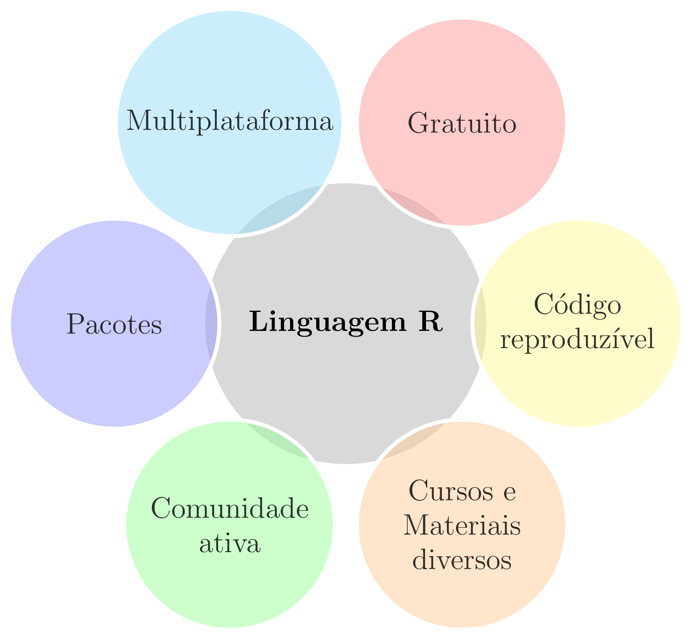
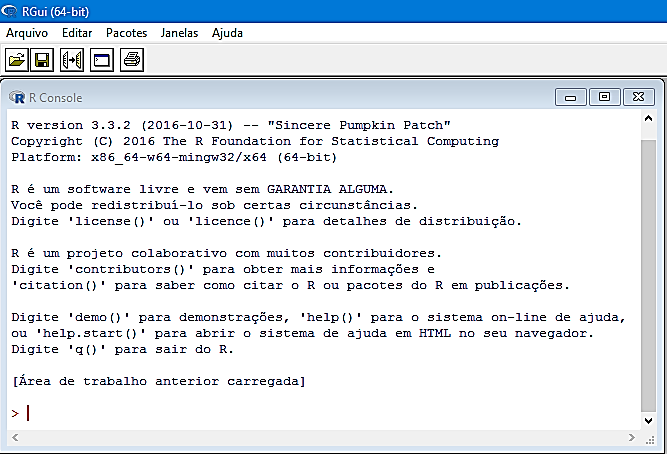
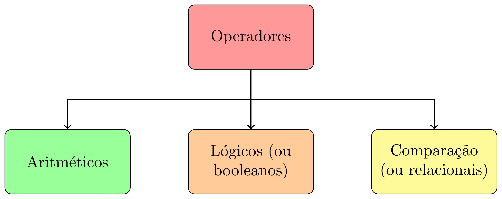

class: title-slide, center, middle
background-image: url(fig/slide-title/ufpa2.png), url(fig/slide-title/forest.png), url(fig/slide-title/img3.png)
background-position: 84% 90%, 95% 90%
background-size: 220px, 90px, cover

```{r setup, include=FALSE}
knitr::opts_chunk$set(
  fig.showtext = TRUE,
  fig.align = "center", 
  cache = FALSE,
  error = FALSE,
  message = FALSE, 
  warning = FALSE, 
  collapse = TRUE ,
  dpi = 600)
```

```{r packages, include=FALSE}
# remotes::install_github("dill/emoGG")
library(ggplot2)
library(dplyr)
library(ggimage)
```

```{r xaringan-logo, echo=FALSE}
library(xaringanExtra)
use_logo(
  image_url = "fig/slide-title/ufpa.png",
  position = css_position(top = ".8em", right = "-.5em"),
  width = "140px",
  height = "140px"
)

use_extra_styles(
  hover_code_line = TRUE,         #<<
  mute_unhighlighted_code = TRUE  #<<
)
xaringanExtra::use_editable(expires = 1)
#.can-edit[Você pode editar este título de slide]
#.can-edit.key-firstSlideTitle[Change this title and then reload the page]
use_clipboard()
```

```{r, load_refs, include=FALSE, cache=FALSE}
library(RefManageR)
BibOptions(check.entries = FALSE,
           bib.style = "authoryear",
           cite.style = "authoryear",
           style = "html",
           hyperlink = FALSE,
           dashed = FALSE)
(myBib <- ReadBib("./bib/ref.bib", check = FALSE))
```

```{r icon, echo=FALSE}
#remotes::install_github("mitchelloharawild/icons")
#remotes::install_github('emitanaka/anicon')
#library(icons)
#download_fontawesome()
#download_simple_icons()
```

<!-- title-slide -->
# Experimentação Florestal <br> (FL03034 - EF)

## Introdução à Linguagem <br> de Programação R `r anicon::faa("pagelines", animate="horizontal", colour="green")`

#### **Prof. Dr. Deivison Venicio Souza**
#### Universidade Federal do Pará (UFPA) 
#### Faculdade de Engenharia Florestal
#### E-mail: deivisonvs@ufpa.br
<br>
##### `r format(Sys.Date(),"%d/%B/%Y")`
##### Altamira, Pará

---
layout: true
<div class="my-header"></div>
<div class="my-footer"><span>Prof. Dr. Deivison Venicio Souza (E-mail: deivisonvs@ufpa.br)&emsp;&emsp;&emsp;&emsp;&emsp;Experimentação Florestal (FL03034 - EF) - Introdução à Linguagem de Programação R</div>

---

## Objetivos
<br><br>
Ao final desta aula espera-se que o discente seja capaz de...

* Entender a importância e reconhecer a praticidade de uso da linguagem de programação;
* Realizar o download e instalação o RGui e Rstudio;
* Compreender as principais estruturas de dados na linguagem R;
* Realizar indexação de diferentes estruturas de dados no R;
* Compreender e desenvolver suas próprias funções no R;
* Compreender e aprender a usar estruturas de controle no R;
* Criar gráficos usando funções de pacotes do R-base; e
* Realizar uma análise exploratória de dados.
---

## Conteúdo

.pull-left-4[
**Parte 1 - Conhecendo o R e Rstudio**

[1- A linguagem R](#R)

[2 - Por que usar a linguagem R?](#pqR)

[3 - RGui - Download, instalação e interface](#RGui)

[4 - IDE RStudio - Download, instalação e interface](#Rstudio)

]

.pull-right-4[
.pull-down[
**Parte 2 - Iniciando na linguagem R**

[1 - Sintaxe da linguagem R](#Sintaxe)

[2 - Operadores no R](#Operadores)

&nbsp;&nbsp;&nbsp;&nbsp;[2.1 - Aritméticos](#arit)

&nbsp;&nbsp;&nbsp;&nbsp;[2.2 - Relacionais](#relac)

&nbsp;&nbsp;&nbsp;&nbsp;[2.3 - Lógicos](#log)

[3 - Funções matemáticas usuais](#FunsMat)
]
]

---

layout: false
name: conc
class: inverse, top, right
background-image: url(fig/class3/inv1.jpg)
background-size: cover

.font200[**Parte 1 <br> Conhecendo o R e Rstudio**]

---
layout: true
<div class="my-header"></div>
<div class="my-footer"><span>Prof. Dr. Deivison Venicio Souza (E-mail: deivisonvs@ufpa.br)&emsp;&emsp;&emsp;&emsp;&emsp;Experimentação Florestal (FL03034 - EF) - Introdução à Linguagem de Programação R</div>

---

## Linguagem R

.pull-left-4[
.font90[
- É uma linguagem de programação de computadores de código aberto e gratuita;
- Criada em 1993: Ross Ihaka e por Robert Gentleman;
- Departamento de Estatística da Universidade de Auckland, Nova Zelândia;
- O R foi desenvolvido a partir da Linguagem S.
]
]

.pull-right-4[
.font90[
**Possui múltiplas facetas:**

- Pacotes para implementação de métodos estatisticos;
- Pacotes para visualização gráfica elegantes;
- Pacotes para criação de aplicações web, Dashboard;
- Pacote para geração de relatórios dinâmicos;
- Pacotes para criação de apresentações elegantes.
]
]

.pull-left-7[
```{r echo=FALSE, out.width='30%', fig.align='center', fig.cap='', dpi=600}
knitr::include_graphics("https://petsistemas.ufms.br/wp-content/uploads/2017/02/main-qimg-7012cde5b60209165cdc281d888b33ac.png")

```
]

.pull-left-7[
```{r echo=FALSE, out.width='30%', fig.align='center', fig.cap='', dpi=600}
knitr::include_graphics("https://blog.efpsa.org/wp-content/uploads/2019/04/pic1.png")

```

]

.pull-left-7[
```{r echo=FALSE, out.width='30%', fig.align='center', fig.cap='', dpi=600}
knitr::include_graphics("https://ggplot2.tidyverse.org/logo.png")
```
]

.pull-left-7[
```{r echo=FALSE, out.width='30%', fig.align='center', fig.cap='', dpi=600}
knitr::include_graphics("https://pkgs.rstudio.com/rmarkdown/reference/figures/logo.png")
```
]

.pull-left-7[
```{r echo=FALSE, out.width='30%', fig.align='center', fig.cap='', dpi=600}
knitr::include_graphics("https://tidyverse.tidyverse.org/articles/tidyverse-logo.png")
```
]

---

## Por que usar a linguagem R?

```{r, echo=FALSE, out.width='50%', fig.align='center', fig.cap='', dpi=600}

```

---

## RGui - Download e instalação
<br>

**1⁰ Passo**: Acessar a página do projeto R em: https://www.r-project.org/;

**2⁰ Passo**: Do lado esquerdo da página clique sobre o menu .green[CRAN];

**3⁰ Passo**: Será aberta uma página com diversos links de .green[CRAN Mirrors], isto é, espelhos CRAN. 
<br>
Veja na tabela a seguir os principais espelhos disponíveis no Brasil.
<br><br>

.center2[
```{r echo=FALSE}
df <- data.frame(Link = 
                   c("http://cran-r.c3sl.ufpr.br/",
                     "http://nbcgib.uesc.br/mirrors/cran/", 
                     "https://cran.fiocruz.br/",
                     "https://vps.fmvz.usp.br/CRAN/",
                     "http://brieger.esalq.usp.br/CRAN/"),
                 Instituição = 
                   c("Universidade Federal do Paraná - UFPR",
                     "Center for Comp Biol at Universidade Estadual de Santa Cruz",
                     "Oswaldo Cruz Foundation, Rio de Janeiro",
                     "University of São Paulo, São Paulo",
                     "University of São Paulo, Piracicaba")
                 )

df %>% 
   DT::datatable(editable = 'cell', rownames = FALSE, style = "default",
                 class = "display", width = '750px',
                 caption = '',
     options=list(pageLength = 10, dom = 'tip', autoWidth = F,
       initComplete = htmlwidgets::JS(
          "function(settings, json) {",
          paste0("$(this.api().table().container()).css({'font-size': '", "12pt", "'});"),
          "}")
       ) 
     )
```
]

---

## RGui - Download e instalação
<br>

**4⁰ Passo**: Na página http://cran-r.c3sl.ufpr.br/, na seção .green[Download and Install R], clicar em um dos três links, conforme o Sistema Operacional do usuário:

1. Download R for Windows;
2. Download R for Linux; ou
3. Download R for MacOS.
<br>

**5⁰ Passo**: Clicar no link do .green[subdiretório base] ou em o .green[install R for the first time] para instalar o R pela primeira vez;
<br>

**6⁰ Passo**: Clicar, por exemplo, em .green[Download R-4.1.0. for Windows] (.red[escolha seu SO]). Assim, será iniciado o download do R Development Core Team para o respectivo sistema; e
<br>

**7⁰ Passo**: Por fim, basta usar o setup baixado para instalar o programa.

---

## RGui - Interface
<br>

Ao inicializar o **R Development Core Team** pela primeira vez aparecerá a seguinte imagem:

```{r, echo=FALSE, out.width='50%', fig.align='center', fig.cap='R Console'}

```

---

## RGui - Interface

- No contato inicial do usuário com o RGui tem-se a visão do .green[R Console].
- O sinal .red[>] é o prompt de comando.
- Execute as funções .green[demo(), help(), help.start(), q()].

```{r, echo=FALSE, out.width='50%', fig.align='center', fig.cap='R Console'}

```

---

## RGui - R editor

O RGui possui um .green[R editor] $\rightarrow$ Abrir script.

```{r, echo=FALSE, out.width='50%', fig.align='center', fig.cap='R editor'}
knitr::include_graphics('fig/class3/Reditor.png')
```

---

## IDE RStudio - download e instalação
<br>

O .green[RStudio] é um ambiente de desenvolvimento integrado (*Integrated Development Environment - IDE*) de códigos em R mais comumente usado por usuários da linguagem.

**1⁰ Passo**: Acessar a página do projeto RStudio: https://www.rstudio.com;

**2⁰ Passo**: Products $\rightarrow$ RStudio;

**3⁰ Passo**: Selecionar a versão do RStudio para Desktop;

**4⁰ Passo**: Na edição Open source $\rightarrow$ Download Rstudio Desktop;

**5⁰ Passo**: Por fim, basta usar o setup baixado para instalar o programa.
<br><br>

```{r, echo=FALSE, out.width='30%', fig.align='center', fig.cap=''}
knitr::include_graphics('fig/class3/RStudio.png')
```

---

## IDE RStudio - Interface

```{r, echo=FALSE, out.width='80%', fig.align='center', fig.cap=''}
knitr::include_graphics('fig/class3/RstudioIG.svg')
```
<!-- http://material.curso-r.com/rbase/ -->

---

## IDE RStudio - Interface (Painéis)
<br>

**Editor**: Painel de desenvolvimento dos códigos R.

**Environment**: Painel onde aparecerão todos os objetos criados no R.

**Console**: Painel para rodar os códigos R e receber outputs.

**Plots**: Painel de saída gráfica.

**History**: Painel que mostra um histórico dos comandos executados na sessão corrente.

**Help**: Painel que mostra a documentação de funções de pacotes, quando solicitada.

**Files**: Painel para identificar arquivos no diretório de trabalho.

**Packages**: Painel que mostra os pacotes instalados. É possível identificar os pacotes carregados na sessão corrente.

---
layout: false
name: conc
class: inverse, top, right
background-image: url(fig/class3/inv1.jpg)
background-size: cover

.font200[**Parte 2 <br> Iniciando na linguagem R**]

---
layout: true
<div class="my-header"></div>
<div class="my-footer"><span>Prof. Dr. Deivison Venicio Souza (E-mail: deivisonvs@ufpa.br)&emsp;&emsp;&emsp;&emsp;&emsp;Experimentação Florestal (FL03034 - EF) - Introdução à Linguagem de Programação R</div>

---

## Sintaxe da linguagem R
<br>

- **Linguagem de expressão**: Tecnicamente, R é uma linguagem de expressão com uma sintaxe muito simples.
- **Case sensitive**: A linguagem R é *case sensitive*. Isto é, diferencia .green[maiúscula] e .green[minúscula].

.pull-left[
```{r r1, echo=TRUE, eval=FALSE}
"a" == "A"
"mogno" == "Mogno"

# Cria um vetor de nomes
esp <- c("Cedro", "Ipe", "Ipe", "Ipe", "Cedro",
         "Ipe", "Ipe", "Cedro", "Ipe", "ipe")
table(esp) # tabela de frequências
```
]

.pull-right[
```{r ref.label="r1", echo=FALSE, eval=TRUE, collapse=TRUE}
```
]

<br><br>

Fonte: [An Introduction to R](https://cran.r-project.org/doc/manuals/r-release/R-intro.html#:~:text=Contents%5D%5BIndex%5D-,1.8%20R%20commands%2C%20case%20sensitivity%2C%20etc.,would%20refer%20to%20different%20variables.)

---

## Sintaxe da linguagem R
<br>

- **Comandos elementares no R**: consistem em .green[expressões] ou .green[atribuições].
<br>

Se uma expressão é um comando, então o R: .blue[avalia], .blue[imprime] (a menos que seja especificado ao contrário) e o resultado é ".blue[perdido]".

Se uma atribuições é um comando, então o R: .blue[avalia], .blue[atribui] o resultado para uma variável e .blue[suprime] a impressão automática do resultado".

.pull-left[
```{r r2, echo=TRUE, eval=FALSE}
# Atribuição: Avalia, atribui e suprime
DAP <- c(49, 56, 44, 46, 56, 
         87, 45, 98, 100, 120)

# Expressão: Avalia, imprime e perde o resultado
mean(DAP)
```
]

.pull-right[
```{r ref.label="r2", echo=FALSE, eval=TRUE, collapse=TRUE}
```
]

<br>

Fonte: [An Introduction to R](https://cran.r-project.org/doc/manuals/r-release/R-intro.html#:~:text=Contents%5D%5BIndex%5D-,1.8%20R%20commands%2C%20case%20sensitivity%2C%20etc.,would%20refer%20to%20different%20variables.)

---

## Sintaxe da linguagem R
<br>

- **Separação de comandos**: ponto e vírgula (.red[;]) ou por uma nova linha;
- **Comentários**: precedidos pelo símbolo .red[\#] (tudo após .red[\#] não é executado);
- **Comando incompleto**: se o comando R não estiver sintaticamente completo (em uma linha de código), o prompt aparecerá com o símbolo: .red[+]. Esse símbolo indica continuação do comando inicial.
<br><br><br><br><br><br><br><br>

Fonte: [An Introduction to R](https://cran.r-project.org/doc/manuals/r-release/R-intro.html#:~:text=Contents%5D%5BIndex%5D-,1.8%20R%20commands%2C%20case%20sensitivity%2C%20etc.,would%20refer%20to%20different%20variables.)

---

## Operadores no R
<br>

### Tipos de operadores

- Na linguagem R existe três tipos de operadores
- Os operadores lógicos e relacionais operam com duas respostas possíveis: `TRUE` (verdadeiro) ou `FALSE` (falso).

```{r echo=FALSE, out.width='60%', fig.align='center', fig.cap='', dpi=600}

```


<!--Slide XX -->
---
layout: false
class: inverse, top, right
background-image: url(fig/class1/imgC.jpg)
background-size: cover

.font300[
Obrigado!
]
<br><br><br><br><br><br>

**Email**: <a href="mailto:deivisonvs@ufpa.br">deivisonvs@ufpa.br</a>

**Github**: <a href="https://github.com/DeivisonSouza">@DeivisonSouza</a>
