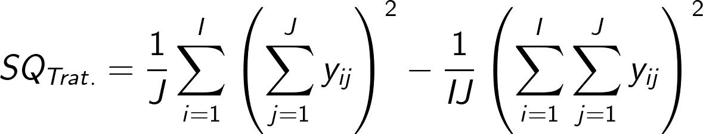

class: title-slide, center, middle
background-image: url(fig/slide-title/ufpa2.png), url(fig/slide-title/forest.png), url(fig/slide-title/img3.png)
background-position: 84% 90%, 95% 90%
background-size: 220px, 90px, cover

```{r setup, include=FALSE}
knitr::opts_chunk$set(
	error = FALSE,
	fig.align = "center",
	fig.showtext = TRUE,
	message = FALSE,
	warning = FALSE,
	cache = FALSE,
	collapse = TRUE,
	dpi = 600
)
```

```{r packages, include=FALSE}
# remotes::install_github("dill/emoGG")
library(ggplot2)
library(dplyr)
library(ggimage)
library(kableExtra)
library(readr)
```

```{r xaringan-logo, echo=FALSE}
library(xaringanExtra)
use_logo(
  image_url = "fig/slide-title/ufpa.png",
  position = css_position(top = ".8em", right = "-.5em"),
  width = "140px",
  height = "140px"
)

use_extra_styles(
  hover_code_line = TRUE,         #<<
  mute_unhighlighted_code = TRUE  #<<
)
xaringanExtra::use_editable(expires = 1)
#.can-edit[Você pode editar este título de slide]
#.can-edit.key-firstSlideTitle[Change this title and then reload the page]
use_clipboard()
```

```{r, load_refs, include=FALSE, cache=FALSE}
library(RefManageR)
BibOptions(check.entries = FALSE,
           bib.style = "authoryear",
           cite.style = "authoryear",
           style = "html",
           hyperlink = FALSE,
           dashed = FALSE)
(myBib <- ReadBib("./bib/ref.bib", check = FALSE))
```

```{r icon, echo=FALSE}
#remotes::install_github("mitchelloharawild/icons")
#remotes::install_github('emitanaka/anicon')
#library(icons)
#download_fontawesome()
#download_simple_icons()
```

```{r customDT, echo=F}
CustomDT <- function(data){
  data %>% DT::datatable(editable = 'cell', rownames = FALSE,
                         style = "default",
                         class = "display", width = '180px',
                         caption = '',
     options=list(pageLength = 20, dom = 't', autoWidth = F,
       initComplete = htmlwidgets::JS(
          "function(settings, json) {",
          paste0("$(this.api().table().container()).css({'font-size': '", "9pt", "'});"),
          "}")
       ) 
     )
}
```


<!-- title-slide -->
# Experimentação Florestal <br> (FL03034 - EF)

## Delineamento Inteiramente <br> Casualizado `r anicon::faa("pagelines", animate="horizontal", colour="green")`

#### **Prof. Dr. Deivison Venicio Souza**
#### Universidade Federal do Pará (UFPA) 
#### Faculdade de Engenharia Florestal
#### E-mail: deivisonvs@ufpa.br
<br>
##### `r format(Sys.Date(),"%d/%B/%Y")`
##### Altamira, Pará

---
layout: true
<div class="my-header"></div>
<div class="my-footer"><span>Prof. Dr. Deivison Venicio Souza (E-mail: deivisonvs@ufpa.br)&emsp;&emsp;&emsp;&emsp;&emsp;Experimentação Florestal (FL03034 - EF) - Delineamento Inteiramente Casualizado</div>

---

## Ementa da disciplina (FL03034 - EF)

.shadow3[
<br>
1 - Introdução à experimentação; 

2 - Princípios básicos da experimentação; 

3 - Fases da pesquisa experimental; 

.orange[4 - Delineamento inteiramente casualizado - DIC]; 

5 - Delineamento em blocos ao acaso - DBC;

6 - Delineamento em quadrado latino - DQL;

7 - Testes de comparação de médias; 

8 - Ensaios Fatoriais;

9 - Análise de correlação linear simples;

10 - Análise de regressão linear simples e múltipla; e

11 - Introdução à linguagem R para análise de experimentos.

]

---

## Objetivos
<br><br>
Ao final desta aula espera-se que o discente seja capaz de...

.font90[
* Conhecer e entender os princípios básicos de experimentos em DIC.
* Compreender o modelo estatístico de experimentos em DIC.
* Aprender a realizar a Análise de Variância (ANOVA) de experimentos em DIC, e entender seus pressupostos.
* Aprender a construir o quadro de Análise de Variância de experimentos em DIC.
* Realizar análise de experimentos em DIC usando a linguagem de programação R.
]

---

## Conteúdo

.pull-left-4[
.font80[
**Parte 1 - Delineamento Inteiramente Casualizado**

[1 - Delineamento experimental - Conceito](#de)

[2 - Principais delineamentos experimentais](#pde)

[3 - DIC - Conceito](#pde)

[4 - DIC - Principais características](#dicpc)

[5 - DIC - Vantagens e Desvantagens](#dicvl)

[6 - DIC - Análise de Variância](#dicanova)

]
]

.pull-right-4[
.pull-down[
.font80[
**Parte 2 - Estudo de caso de experimentos DIC**

[1 - Pacote ExpDes.pt](#expdes)

]
]
]

---

layout: false
name: conc
class: inverse, top, right
background-image: url(fig/class3/arara.jpg)
background-size: cover

.font200[**.yellow[Parte 1] <br> .white[Delineamento Inteiramente <br> Casualizado]**] 

.left[.footnote[.white[Créditos: Imagem de IvaCastro por Pixabay].]]

---
layout: true
<div class="my-header"></div>
<div class="my-footer"><span>Prof. Dr. Deivison Venicio Souza (E-mail: deivisonvs@ufpa.br)&emsp;&emsp;&emsp;&emsp;&emsp;Experimentação Florestal (FL03034 - EF) - Delineamento Inteiramente Casualizado</div>


---

## Delineamento Experimental

--

<br><br>
.shadow1[
<br>
.center[**Conceito**]

É o modo como os tratamentos são designados às unidade (ou parcelas) experimentais (DIAS; BARROS, 2009).

(...) o modo de dispor as parcelas no ensaio (PIMENTEL-GOMES; GARCIA, 2009).
]

---

## Delineamento Experimental
<br>

Os principais delineamentos experimentais utilizados são:
<br><br>

.pull-left-3[
```{r, echo=FALSE, out.width='80%', fig.align='center', fig.cap='', dpi=600}
knitr::include_graphics('fig/class1/img-PD.png')
```
]

--

.pull-right-3[

.font90[
A homogeneidade (ou não) das condições experimentais (ambientais ou biológicas) direciona para a escolha do delinemento experimental mais adequado.

]
]

---

## Delineamento Inteiramente Casualizado

<br><br>
.shadow1[
<br>
.center[**Conceito**]
É quando os .orange[tratamentos] são designados às .orange[unidades experimentais] (ou parcelas) completamente ao acaso (por sorteio).
]

--
<br>

.font90[
**Exemplos**
- Avaliar diferentes níveis de sobreamento (pleno sol, 20%, 50% e 70%) no desenvolvimento de mudas.
- Avaliar diferentes técnicas de quebra de dormência de sementes (escarificação química e mecânica, imersão em água quente, imersão em $H_2SO_4$). (*Bertholletia excelsa*)
- Avaliar diferentes tipos de substratos no desenvolvimento de mudas de espécies florestais.
]

---

## Delineamento Inteiramente Casualizado

<br>
### Unidade Experimental (ou Parcela)

--
.font90[
É a menor unidade que recebe o tratamento. Em experimentos de campo, normalmente são chamadas de parcelas experimentais. Uma UE pode ser formada por um indivíduo (ou grupo). (.green[Recomendação: 20 UEs])
<br><br>

**Experimento de campo**: parcela é uma área cujo tamanho depende, por exemplo, do porte e do espaçamento entre planta. 
Tamanhos: 200 e 250m² são bastante comuns.

**Casas de vegetação**: parcela pode ser: um vaso, tubetes, bandejas (5 a 10 sementes ou plantas)

**Laboratório**: parcela pode ser: placa de petri.
]


.pull-left-4[
```{r echo=FALSE, out.width='60%', fig.align='center', fig.cap='', dpi=600}
knitr::include_graphics("https://media2.giphy.com/media/mDBBU8K7Np2UQs9Dqy/giphy.gif")
```
]

.pull-right-4[
```{r echo=FALSE, out.width='60%', fig.align='center', fig.cap='', dpi=600}
knitr::include_graphics("https://media1.giphy.com/media/RCtKcMeeIlIFskmH7C/giphy-downsized.gif")
```
]


---

## Delineamento Inteiramente Casualizado

<br>

### Tratamento

--
.font80[
É a condição (método, elemento, material) imposta à unidade experimental, cujo efeito deseja-se medir e comparar em um experimento. 
<br>
Somente o tratamento varia entre as UEs, as demais condições são mantidas constantes, exceto os fatores não-controláveis.
]

.pull-left-4[
```{r echo=FALSE, out.width='70%', fig.align='center', fig.cap='', dpi=600}
knitr::include_graphics("https://media.giphy.com/media/fjrLK07VbIcn7ZfX3f/giphy.gif")
```
<br><br><div style='font-size:50%'>(Available at [https://media.giphy.com](https://media.giphy.com), jul 19, 2021)</div>
]

--

.pull-right-4[
.font80[
**Experimentos de campo**

- Formas de preparo do solo
- Diferentes doses de adubação
- Diferentes espaçamentos

**Casa de vegetação**
- Diferentes tipos de substratos
- Diferentes níveis de sobreamento
- Diferentes tipos de recipientes
]
]

---

## Delineamento Inteiramente Casualizado
<br>

### Principais características

.pull-left-2[
```{r, echo=FALSE, out.width='110%', fig.align='center', fig.cap='', dpi=600}
knitr::include_graphics('fig/class4/DIC-C.png')
```
]

--

.pull-right-1[
.font80[
O DIC é recomendado quando pode ser dada **condições homogêneas (ou uniformes)** para todas as unidades experimentais.
<br><br>

**Quais condições?**
<br>
Por exemplo, deve haver condições homogêneas para:

- Material experimental
- Condições ambientais
- Tratos culturais
- Qualquer operação realizada no experimento

]
]

---

## Delineamento Inteiramente Casualizado
<br>

### Vantagens e Desvantagens

.pull-left-2[
```{r, echo=FALSE, out.width='85%', fig.align='center', fig.cap='', dpi=600}
knitr::include_graphics('fig/class4/DIC-V.png')
```
]

--

.pull-right-1[
.font80[
.blue[**Sobre as repetições...**]
<br><br>

- O número de repetições pode variar de um tratamento para outro, seja intencionalmente (pela falta de UEs ou de material) ou por acidente/causa natural (ex.: morte da planta).
- É desejável, sempre que possível, ter o mesmo número de repetições por tratamento.

]
]

---

## Delineamento Inteiramente Casualizado
<br>

### Representação genérica de valores

.pull-left-9[
.font90[
Para um experimento em DIC com **I** tratamentos (i = 1, 2, 3..., I) e **J** repetições (j = 1, 2, 3..., J), tem-se a seguinte representação genérica para os dados obtidos:
]
<br><br>

```{r, echo=FALSE, out.width='80%', fig.align='center', fig.cap='', dpi=600}
knitr::include_graphics('fig/class4/DIC-Table.png')
```
]

.pull-right-9[
.font90[
$T_1$, $T_2$, $T_3$,..., $T_I$ = Soma dos valores da variável y<sub>ij</sub> dentro do *i*-ésimo tratamento.
<br>

$y_1$, $y_2$, $y_3$,..., $y_I$ = Média aritmética dos valores da variável y<sub>ij</sub> dentro do *i*-ésimo tratamento.
<br><br>

*I* = Número de tratamentos

*J* = Número de repetições
]
]

---

## Delineamento Inteiramente Casualizado
<br>

### Análise de Variância (ANOVA) - Conceito
<br>
.font90[
É uma técnica estatísticas que permite **decompor a variação total** de dados experimentais em **causas conhecidas e independentes** e **desconhecidas**.
<br><br>

**Objetivo principal**: 
- Determinar para uma variável se as médias de três ou mais grupos (tratamentos) são diferentes. 
- Para tanto, as variâncias entre grupos e dentro de grupos é estimada.
- A estatística F é usada para testar, estatisticamente, a igualdade entre as médias de grupos.
<br><br>

**Variação Total** = É a variação da variável resposta entre as unidades experimentais (ou parcelas). É representada pela Soma de Quadrados Totais (SQ<sub>Tot.</sub>) (NOGUEIRA, 2007).
]

---

## Delineamento Inteiramente Casualizado
<br>

### Análise de variância - Perguntas

<br><br>
`r anicon::faa("hand-point-right", animate="horizontal")` O quanto da variação na variável resposta (ou dependente) do experimento é devido aos **fatores não-controlados (ou variação do acaso**) - ou erro experimental?
<br><br>

`r anicon::faa("hand-point-right", animate="horizontal")` O quanto da variação na variável resposta (ou dependente) do experimento é devido às influências dos tratamentos experimentais aplicados às unidades experimentais (**fatores controlados**)?

---

## Delineamento Inteiramente Casualizado
<br>

### Análise de Variância - Quadro de experimentos em DIC
<br>

O quadro a seguir resume as estimativas geradas na ANOVA de experimentos em DIC.
<br><br>

```{r, echo=FALSE, out.width='65%', fig.align='center', fig.cap='', dpi=600}
knitr::include_graphics('fig/class4/DIC-ANOVA.png')
```

.pull-left-8[
.font70[
**SQ<sub>Trat.</sub>** = Soma de Quadrados de Tratamentos

**SQR** = Soma de Quadrados de Resíduos

**SQ<sub>Tot.</sub>** = Soma de Quadrados de Totais
]
]

.pull-left-8[
.font70[
**QMT** = Quadrado Médio de Tratamentos

**QMR** = Quadrado Médio de Resíduos
]
]

.pull-left-8[
.font70[
*I* = número de tratamentos

*J* = número de repetições
<br>

.orange[**Quadrado Médio = Variância**]
]
]

---

## Delineamento Inteiramente Casualizado
<br>

### Modelo Estatístico - DIC

Toda análise de variância pressupõe um modelo estatístico e a aceitação de algumas hipóteses básicas (PIMENTEL-GOMES, 2009).​
<br><br>

.pull-left-9[
$\Large Y_{ij} = m + t{_i} + e_{ij}$
<br><br>
.font90[
O modelo admite que o resultado obtido ao avaliar uma UE pode ser dividido em 3 partes: uma **constante**, o **efeito do tratamento** e a **variação não controlada** (STORCK et al., 2011).
]
]


.pull-right-9[
.font90[

$Y_{ij}$ = Valor observado da variável $y$ na unidade experimental que recebeu o *i*-ésimo tratamento (*i* = 1, 2, ..., I) na *j*-ésima repetição (*j* = 1, 2, ..., J).

$m$ = média geral, comum a todas as observações.

$t_{i}$ = É o efeito do tratamento *i*; e​

$e_{ij}$ = É a contribuição da variação não controlada referente à observação $Y_{ij}$.
]
]

---

## Delineamento Inteiramente Casualizado
<br>

### Quadro de Anova - Fórmulas

.pull-left-9[
- **Soma de Quadrados Total (SQ<sub>Tot.</sub>)**
<br><br>

```{r, echo=FALSE, out.width='75%', fig.align='center', fig.cap='', dpi=600}
knitr::include_graphics('fig/class4/SQTot.png')
```
<br>

```{r, echo=FALSE, out.width='55%', fig.align='center', fig.cap='', dpi=600}
knitr::include_graphics('fig/class4/SQTot2.png')
```
<!--
$$
\Large
SQ_{Tot.} = \sum_{i=1}^{I}\sum_{j=1}^{J}Y_{ij}^2 - \frac{1}{I.J}\left ( \sum_{i=1}^{I}\sum_{j=1}^{J}Y_{ij} \right )^2
$$
-->

<!--
$$
SQ_{Tot.} = \sum_{i=1}^{I}\sum_{j=1}^{J}\left (y_{ij} - \bar{y}  \right )^2
$$
-->

]

.pull-right-9[
.font90[
*I* = número de tratamentos

*J* = número de repetições

$Y_{ij}$ = valor observado da variável $Y$ no *i*-ésimo tratamento da *j*-ésima repetição.
]
<br>

$$
\large
SQ_{Total} = SQ_{Trat.} + SQR
$$
<br>

.font80[
**O que significa?** (Nogueira, 2007)

- A $SQ_{Total}$ fornece a variação total dos dados da variável resposta no experimento.
]
]

---

## Delineamento Inteiramente Casualizado
<br>

### Quadro de Anova - Fórmulas

.pull-left-9[
- **Soma de Quadrados de Tratamentos (SQ<sub>Trat.</sub>)**
<br><br>

```{r, echo=FALSE, out.width='80%', fig.align='center', fig.cap='', dpi=600}

```
<br>

.font80[
**O que significa?** (Nogueira, 2007)

- A SQ<sub>Trat.</sub> representa a variação entre tratamentos. Isto é, mede a variabilidade entre as médias dos tratamentos.
- Quanto menor a diferença entre as médias dos tratamentos menor será a SQ<sub>Trat.</sub>.
]

<!--
$$
SQ_{Trat.} = \frac{1}{J}\sum_{i=1}^{I}\left ( \sum_{j=1}^{J}Y_{ij} \right )^2 - \frac{1}{IJ}\left ( \sum_{i=1}^{I}\sum_{j=1}^{J}Y_{ij} \right )^2
$$
-->


]

.pull-right-9[

*I* = número de tratamentos

*J* = número de repetições

$Y_{ij}$ = valor observado da variável $Y$ no *i*-ésimo tratamento da *j*-ésima repetição.

]

---

## Delineamento Inteiramente Casualizado
<br>

### Quadro de Anova - Fórmulas
<br>
.pull-top[
**Fator em comum (C)**
<br>
.font90[
- As equações para o cálculo da $SQ_{Tot.}$ e $SQ_{Trat.}$ possuem uma expressão matemática em comum.
- Essa expressão é denominada **Fator em Comum**.
- Assim, as equações para cálculo da $SQ_{Tot.}$ e $SQ_{Trat.}$ podem ser expressas de forma simplificada.
- A letra "C" simboliza a expressão em comum.
]
]

.pull-down[
.pull-left-10[
```{r, echo=FALSE, out.width='65%', fig.align='center', fig.cap='', dpi=600}
knitr::include_graphics('fig/class4/SQTot-cor.png')
```

<!--
$$
SQ_{Tot.} = \sum_{i=1}^{I}\sum_{j=1}^{J}Y_{ij}^2 - {\color{Orange} \frac{1}{I.J}\left ( \sum_{i=1}^{I}\sum_{j=1}^{J}Y_{ij} \right )^2}
$$
-->

```{r, echo=FALSE, out.width='35%', fig.align='center', fig.cap='', dpi=600}
knitr::include_graphics('fig/class4/SQTot-fator.png')
```
]

.pull-right-10[
```{r, echo=FALSE, out.width='70%', fig.align='center', fig.cap='', dpi=600}
knitr::include_graphics('fig/class4/SQTrat-cor.png')
```

<!--
$$
SQ_{Trat.} = \frac{1}{J}\sum_{i=1}^{I}\left ( \sum_{j=1}^{J}Y_{ij} \right )^2 - {\color{Orange} \frac{1}{IJ}\left ( \sum_{i=1}^{I}\sum_{j=1}^{J}Y_{ij} \right )^2}
$$
-->

```{r, echo=FALSE, out.width='40%', fig.align='center', fig.cap='', dpi=600}
knitr::include_graphics('fig/class4/SQTrat-fator.png')
```
]
]

---

## Delineamento Inteiramente Casualizado
<br>

### Quadro de Anova - Fórmulas

- **Soma de Quadrados de Resíduos (SQR)** - (Ou erro experimental)

.pull-left-10[
.font90[
Sabe-se que:
<br><br>

$\large SQ_{Tot.} = SQ_{Trat.} + SQR$
<br><br>

Então,
<br><br>

$\large SQR = SQ_{Tot.} - SQ_{Trat.}$
]
]

--

.pull-right-10[
.font90[

$SQ_{Tot.}$ = Soma de Quadrados Totais

$SQ_{Trat.}$ = Soma de Quadrados de Tratamentos

$SQR$ = Soma de Quadrados de Resíduos (ou Erro)

<br><br>

.font80[
**O que significa?** (Nogueira, 2007)

- A SQR representa a variabilidade entre as repetições dentro de tratamentos. Isto é, mede a variabilidade dentro dos tratamentos.
]


]
]


---

## Delineamento Inteiramente Casualizado
<br>

### Quadro de Anova - Estatística F na ANOVA DIC

.font80[
- A **estatística F** é uma .blue[razão entre duas variâncias].
- A **estatística F** na ANOVA é baseada na razão entre .blue[Quadrados Médios].
- Quadrado médio é simplesmente uma estimativa da variância populacional.
- Na ANOVA de um fator em DIC a **estatística F** é a razão entre: $F = \dfrac{QM_{trat.}}{QMR}$
- A **estatística F** na ANOVA é usada para avaliar se a variância entre grupos (entre tratamentos) é maior do que a variância dos dados dentro dos grupos (dentro dos tratamentos).

]

<br>

.pull-right-5[
`r anicon::faa("hand-point-right", animate="horizontal")` **Lembre-se:**
.font80[
- Variância é uma medida (estimada ou verdadeira) da dispersão dos dados de uma variável em relação à sua média.
- Maiores valores indicam maior dispersão dos dados em relação à sua média.
]
]

---

## Delineamento Inteiramente Casualizado
<br>

### Quadro de Anova - Hipóteses estatísticas do teste F
<br>

.pull-left-10[
.font90[
**Hipótese de nulidade (H<sub>0</sub>):**
<br>

- Todos os possíveis contrastes, entre médias, são estatisticamente nulos.
- As médias dos tratamentos são estatisticamente todas iguais entre si.
]
]

.pull-left-10[
.font90[
**Hipótese de alternativa (H<sub>1</sub>):**
<br>

- Existe pelo menos um contraste, entre médias, estatisticamente diferente de zero.
- Pelo menos dois tratamentos são estatisticamente diferentes entre si.
]
]

---

## Delineamento Inteiramente Casualizado
<br>

### Quadro de Anova - Teste das hipóteses da estatística F
<br>

**1° Passo**: Elaborar as hipóteses de nulidade (H<sub>0</sub>) e alternativa (H<sub>1</sub>);

**2° Passo**: Calcular o valor da estatística F, usando os valores de Quadrados Médios da ANOVA;

**3° Passo**: Obter o valor crítico na tabela da distribuição F ( $F_{[(I-1); I (J-1)]}$; $\alpha$) para o nível de significância ( $\alpha$ ) fixado; e

**4° Passo**: Comparar o valor da estatística F-calculada com o valor F- tabelado. Em seguida, concluir quanto à rejeição ou não da hipótese de nulidade (H<sub>0</sub>).

---

## Delineamento Inteiramente Casualizado
<br>

### Quadro de Anova - Regras de decisão da estatística F
<br>


.pull-left-10[
.font90[
**Rejeição da hipótese de nulidade (H<sub>0</sub>)**

- Se o valor da .blue[estatística F] for **maior** do que o .blue[valor crítico na tabela da distribuição F], existem evidências para rejeitar hipótese de nulidade.
- Em outras palavras, existem indícios de que pelo menos uma das médias dos tratamentos é estatisticamente diferente das demais, ao nível de significância estabelecido.

$F-calculado > F-Crítico$

$Rejeita-se~~H_0$

]
]

.pull-right-10[
.font90[
**Não rejeição da hipótese de nulidade (H<sub>1</sub>)**

- Se o valor da estatística F for menor ou igual do que o valor do F-tabelado, não existe evidências para rejeitar hipótese de nulidade.
- Em outras palavras, existem indícios de que as médias dos tratamentos são estatisticamente todas iguais entre si, ao nível de significância estabelecido.
<br><br>

$F-calculado \leq F-tabelado$

$Não~~rejeita-se~~H_0$

]
]

---

## Delineamento Inteiramente Casualizado
<br>

### Quadro de Anova - Rejeição da hipótese H<sub>0</sub> da estatística F
<br>

.font90[
- Se o valor da Estatística F for maior do que o valor crítico da distribuição F têm-se a indicação de rejeição da hipótese de nulidade (H<sub>0</sub>).
- Isto é, é razoável admitir que existem evidências de que as médias dos tratamentos **não são todas estatísticamente iguais entre si**.
- Apesar disso, a estatística F não possibilita identificar quais tratamentos diferem significativamente entre si.
- Portanto, fica a pergunta: .blue[Quais tratamentos diferem, estatisticamente, em termos de suas médias?]
<br><br>

**A reposta para essa pergunta são oferecidas por pós-testes de comparações de médias.**

**Por exemplo, Teste de Tukey, Teste de Duncan, entre outros.**

]

---

## Delineamento Inteiramente Casualizado
<br>

### Quadro de Anova - Pressuposições da ANOVA
<br>


---
<!--Slide XX -->
---
layout: false
class: inverse, top, right
background-image: url(fig/class1/imgC.jpg)
background-size: cover

.font300[
Obrigado!
]
<br><br><br><br><br><br>

**Email**: <a href="mailto:deivisonvs@ufpa.br">deivisonvs@ufpa.br</a>

**Github**: <a href="https://github.com/DeivisonSouza">@DeivisonSouza</a>

