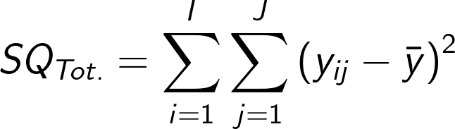

class: title-slide, center, middle
background-image: url(fig/slide-title/ufpa2.png), url(fig/slide-title/forest.png), url(fig/slide-title/img3.png)
background-position: 84% 90%, 95% 90%
background-size: 220px, 90px, cover

```{r setup, include=FALSE}
knitr::opts_chunk$set(
	error = FALSE,
	fig.align = "center",
	fig.showtext = TRUE,
	message = FALSE,
	warning = FALSE,
	cache = FALSE,
	collapse = TRUE,
	dpi = 600
)
```

```{r packages, include=FALSE}
# remotes::install_github("dill/emoGG")
library(ggplot2)
library(dplyr)
library(ggimage)
library(kableExtra)
library(readr)
```

```{r xaringan-logo, echo=FALSE}
library(xaringanExtra)
use_logo(
  image_url = "fig/slide-title/ufpa.png",
  position = css_position(top = ".8em", right = "-.5em"),
  width = "140px",
  height = "140px"
)

use_extra_styles(
  hover_code_line = TRUE,         #<<
  mute_unhighlighted_code = TRUE  #<<
)
xaringanExtra::use_editable(expires = 1)
#.can-edit[Você pode editar este título de slide]
#.can-edit.key-firstSlideTitle[Change this title and then reload the page]
use_clipboard()
```

```{r, load_refs, include=FALSE, cache=FALSE}
library(RefManageR)
BibOptions(check.entries = FALSE,
           bib.style = "authoryear",
           cite.style = "authoryear",
           style = "html",
           hyperlink = FALSE,
           dashed = FALSE)
(myBib <- ReadBib("./bib/ref.bib", check = FALSE))
```

```{r icon, echo=FALSE}
#remotes::install_github("mitchelloharawild/icons")
#remotes::install_github('emitanaka/anicon')
#library(icons)
#download_fontawesome()
#download_simple_icons()
```

```{r customDT, echo=F}
CustomDT <- function(data){
  data %>% DT::datatable(editable = 'cell', rownames = FALSE,
                         style = "default",
                         class = "display", width = '250px',
                         caption = '',
     options=list(pageLength = 8, dom = 'tip', autoWidth = F,
       initComplete = htmlwidgets::JS(
          "function(settings, json) {",
          paste0("$(this.api().table().container()).css({'font-size': '", "9pt", "'});"),
          "}")
       ) 
     )
}
```

```{r customkbl, echo=F}
Customkbl <- function(data){
  data %>%
    kbl() %>%
    kable_classic(full_width = F, html_font = "Cambria") %>% 
  kable_paper(bootstrap_options = "striped", full_width = F) %>% 
  kable_styling(bootstrap_options = "striped", font_size = 18, position = "center") %>% 
  row_spec(1:4, color = 'black', background = 'white') %>% 
  row_spec(0, color = 'white', background = 'black') %>% 
  column_spec(1, color = 'white', background = 'black')
}
```


<!-- title-slide -->
# Experimentação Florestal <br> (FL03034 - EF)

## Delineamento em Blocos <br> Casualizados `r anicon::faa("pagelines", animate="horizontal", colour="green")`

#### **Prof. Dr. Deivison Venicio Souza**
##### Universidade Federal do Pará (UFPA) 
##### Faculdade de Engenharia Florestal
##### E-mail: deivisonvs@ufpa.br
<br>
##### `r format(Sys.Date(),"%d/%B/%Y")`
##### Altamira, Pará

---
layout: true
<div class="my-header"></div>
<div class="my-footer"><span>Prof. Dr. Deivison Venicio Souza (E-mail: deivisonvs@ufpa.br)&emsp;&emsp;&emsp;&emsp;&emsp;Experimentação Florestal (FL03034 - EF) - Delineamento em Blocos Casualizados </div>

---

## Ementa da disciplina (FL03034 - EF)

.shadow3[
<br>
1 - Introdução à experimentação; 

2 - Princípios básicos da experimentação; 

3 - Fases da pesquisa experimental; 

4 - Delineamento inteiramente casualizado - DIC; 

.orange[5 - Delineamento em Blocos Casualizados - DBC];

6 - Delineamento em quadrado latino - DQL;

7 - Testes de comparação de médias; 

8 - Ensaios Fatoriais;

9 - Análise de correlação linear simples;

10 - Análise de regressão linear simples e múltipla; e

11 - Introdução à linguagem R para análise de experimentos.

]

---

## Objetivos
<br><br>
Ao final desta aula espera-se que o discente seja capaz de...

.font90[
* Conhecer e entender os princípios básicos de experimentos em DBC.
* Compreender o modelo estatístico de experimentos em DBC.
* Aprender a realizar a Análise de Variância (ANOVA) de experimentos em DBC, e entender seus pressupostos.
* Realizar análise de experimentos em DBC usando a linguagem de programação R.
]

---

## Conteúdo

.pull-left-4[
.font80[
**Parte 1 - Delineamento em Blocos Casualizados**

[1 - Delineamento experimental - Conceito](#de)

[2 - Principais delineamentos experimentais](#pde)

[3 - DBC - Conceito](#pde)

[4 - DBC - Principais características](#dicpc)

[5 - DBC - Vantagens e Desvantagens](#dicvl)

[6 - DBC - Análise de Variância](#dicanova)

]
]

.pull-right-4[
.pull-down[
.font80[
**Parte 2 - Estudo de caso de experimentos em DBC**

[1 - Competição de progênies (Pimentel-Gomes; Garcia, 2002)](#prog)

&nbsp;&nbsp;[1.1 - ANOVA para experimento em DBC - Fator único](#anvdic)

&nbsp;&nbsp;&nbsp;&nbsp;[1.1.1 - Graus de liberdade](#gl)

&nbsp;&nbsp;&nbsp;&nbsp;[1.1.2 - Somas de Quadrados](#sq)

&nbsp;&nbsp;&nbsp;&nbsp;[1.1.3 - Quadradados Médios](#qm)

&nbsp;&nbsp;&nbsp;&nbsp;[1.1.4 - Estatística F](#estF)

&nbsp;&nbsp;&nbsp;&nbsp;[1.1.5 - F crítico da distribuição F](#fcrit)

[2 - Anova no R](#anvR)


<!-- [3 - Pacote ExpDes.pt](#expdes) -->

]
]
]

---

layout: false
name: conc
class: inverse, top, right
background-image: url(fig/class3/arara.jpg)
background-size: cover

.font200[**.yellow[Parte 1] <br> .white[Delineamento em Blocos <br> Casualizados]**] 

.left[.footnote[.white[Créditos: Imagem de IvaCastro por Pixabay].]]

---
layout: true
<div class="my-header"></div>
<div class="my-footer"><span>Prof. Dr. Deivison Venicio Souza (E-mail: deivisonvs@ufpa.br)&emsp;&emsp;&emsp;&emsp;&emsp;Experimentação Florestal (FL03034 - EF) - Delineamento em Blocos Casualizados</div>

---

## Delineamento Experimental

--

<br><br>
.shadow1[
<br>
.center[**Conceito**]

É o modo como os tratamentos são designados às unidade (ou parcelas) experimentais (DIAS; BARROS, 2009).

(...) o modo de dispor as parcelas no ensaio (PIMENTEL-GOMES; GARCIA, 2009).
]

---

## Delineamento em Blocos Casualizados

<br>
### Unidade Experimental (ou Parcela)

--
.font90[
É a menor unidade que recebe o tratamento. Em experimentos de campo, normalmente são chamadas de parcelas experimentais. Uma UE pode ser formada por um indivíduo (ou grupo). (.green[Recomendação: 20 UEs])
<br><br>

**Experimento de campo**: parcela é uma área cujo tamanho depende, por exemplo, do porte e do espaçamento entre planta. 
Tamanhos: 200 e 250m² são bastante comuns.

**Casas de vegetação**: parcela pode ser: um vaso, tubetes, bandejas (5 a 10 sementes ou plantas)

**Laboratório**: parcela pode ser: placa de petri.
]


.pull-left-4[
```{r echo=FALSE, out.width='60%', fig.align='center', fig.cap='', dpi=600}
knitr::include_graphics("https://media2.giphy.com/media/mDBBU8K7Np2UQs9Dqy/giphy.gif")
```
]

.pull-right-4[
```{r echo=FALSE, out.width='60%', fig.align='center', fig.cap='', dpi=600}
knitr::include_graphics("https://media1.giphy.com/media/RCtKcMeeIlIFskmH7C/giphy-downsized.gif")
```
]

---

## Delineamento em Blocos Casualizados

<br>

### Tratamento

--
.font80[
É a condição (método, elemento, material) imposta à unidade experimental, cujo efeito deseja-se medir e comparar em um experimento. 
<br>
Somente o tratamento varia entre as UEs, as demais condições são mantidas constantes, exceto os fatores não-controláveis.
]

.pull-left-4[
```{r echo=FALSE, out.width='70%', fig.align='center', fig.cap='', dpi=600}
knitr::include_graphics("https://media.giphy.com/media/fjrLK07VbIcn7ZfX3f/giphy.gif")
```
<br><br><div style='font-size:50%'>(Available at [https://media.giphy.com](https://media.giphy.com), jul 19, 2021)</div>
]

--

.pull-right-4[
.font80[
**Experimentos de campo**

- Formas de preparo do solo
- Diferentes doses de adubação
- Diferentes espaçamentos

**Casa de vegetação**
- Diferentes tipos de substratos
- Diferentes níveis de sobreamento
- Diferentes tipos de recipientes
]
]

---

## Delineamento Experimental
<br>

Os principais delineamentos experimentais utilizados são:
<br><br>

.pull-left-3[
```{r, echo=FALSE, out.width='80%', fig.align='center', fig.cap='', dpi=600}
knitr::include_graphics('fig/class1/img-PD.png')
```
]

--

.pull-right-3[

.font90[
A homogeneidade (ou não) das condições experimentais (ambientais ou biológicas) direciona para a escolha do delinemento experimental mais adequado.

]
]

---

## Delineamento em Blocos Casualizados
<br>

### Considerações gerais

.pull-left-3[
.font90[
- É o tipo de delineamento experimental indicado quando existe uma .blue[causa (ou fonte de variação)] que deseja-se .blue[controlar] no experimento.
- Essas fontes de variações, em experimentos de campo, podem ser: .blue[Fertilidade do solo, gradiente de umidade], etc.
- É o delineamento mais usado nas ciências agrárias, especialmente em experimentos de campo.
]
]


---

## Delineamento em Blocos Casualizados
<br>

### Controle da fonte de variação adicional
<br>

.pull-left-9[
.font80[
**Mas, porque é importante controlar essa fonte de variação adicional?**

- A ideia principal é .blue[evidenciar os efeitos dos tratamentos] nos dados da variável resposta.
- Não controlar essa fonte de variação (adicional e reconhecida) pode .blue[mascarar as diferenças entre os tratamentos] e conduzir o pesquisador à conclusões equivocadas.
- Fazendo-se isso também o erro experimental diminui e a precisão do experimento aumenta.
]
]

--

.pull-down[
.pull-right-9[
.shadow3[
.font70[
.center[**Imagine a situação...**]
Um experimento de competição de progênies foi implantado em região com gradiente de fertilidade de solo com 6 tratamentos (progênies) e 4 blocos. Considere, por exemplo, que as parcelas experimentais que receberam a progênie P3 estejam todas situadas (ou sua maior parte) na região de maior fertilidade do solo. No final do experimento, obteve-se a média de DAP para as diferentes progênies e encontrou-se melhor resposta para progênie P3. Nessas condições, você estaria seguro para afirma que a progênie P3 é aquela com melhor desenvolvimento? Ou o melhor desenvolvimento da P3 poderia estar associado ao fato de que suas parcelas estavam na região de maior fertilidade do solo?
]
]
]
]

---

## Delineamento em Blocos Casualizados
<br>

### Controle Local (CL)
<br>

.pull-left-3[
.font80[
- É um princípio básico da experimentação.
- O CL é uma estratégia para .blue[diminuir o efeito da heterogeneidade] (da área ou material experimental) sobre os dados da variável resposta.
- Na prática, o CL consite na .blue[formação de grupos de parcelas o mais homogêneos possível] para o fator de controle.
- Estes grupos homogêneos são denominados de .blue[blocos].
- Os .blue[tratamentos são sorteados] às unidades experimentais (ou parcelas) .blue[dentro de cada bloco].
- Portanto, em DBC .blue[cada bloco] constitui uma .blue[repetição].
- Em campo, os blocos são alocados perpendiculares ao gradiente de heterogeneidade.
]
]

---

## Delineamento em Blocos Casualizados
<br>

### Princípios básicos

.font90[
O DBC utiliza-se dos 3 princípios básicos da experimentação.
]

```{r, echo=FALSE, out.width='55%', fig.align='center', fig.cap='', dpi=600}
knitr::include_graphics('fig/class1/PBE.png')
```

---

## Delineamento em Blocos Casualizados

.pull-left-5[
.font80[
### Croqui de experimento em DBC - Rossetti et al. (2017)
<br><br>

Croqui de um experimento em blocos casualizados, com 5 blocos
retangulares, 4 tratamentos e 4 plantas úteis por parcela quadrada, sem
bordadura entre parcelas e nem no contorno do experimento (pg. 40)

]
]

.pull-right-5[
```{r echo=FALSE, out.width='80%', fig.align='center', fig.cap='', dpi=600}

```
]

---

## Delineamento em Blocos Casualizados

.pull-left-5[
.font80[
### Croqui de experimento em DBC - Rossetti et al. (2017)
<br><br>

Croqui de um experimento em blocos casualizados com bordadura
de contorno, 5 blocos, 4 tratamentos, parcela quadrada de 4 plantas úteis, sem
bordadura entre elas, instalado em áreas antes utilizadas com adubação, com
herbicida, em pousio e recém-desmatada (pg. 53).

]
]

.pull-right-5[
```{r echo=FALSE, out.width='80%', fig.align='center', fig.cap='', dpi=600}

```
]

---

## Delineamento em Blocos Casualizados
<br>

### Principais características
<br>

```{r, echo=FALSE, out.width='70%', fig.align='center', fig.cap='', dpi=600}

```

---

## Delineamento em Blocos Casualizados
<br>

### Representação genérica de valores

.pull-left-9[
.font90[
Para um experimento em DBC com **I** tratamentos (i = 1, 2, 3..., I) e **J** Blocos (j = 1, 2, 3..., J), tem-se a seguinte representação genérica para os dados y<sub>ij</sub> da variável resposta:
]
<br>

```{r, echo=FALSE, out.width='80%', fig.align='center', fig.cap='', dpi=600}
knitr::include_graphics('fig/class5/DBC-Table.png')
```
]

--

.pull-right-9[
.font80[
y<sub>1.</sub>, y<sub>2.</sub>, y<sub>3.</sub>,..., y<sub>I.</sub> = Soma dos dados y<sub>ij</sub> da variável resposta y dentro do *i*-ésimo tratamento.
<br>

$\bar{y}_{1.}$, $\bar{y}_{2.}$, $\bar{y}_{3.}$,..., $\bar{y}_{I.}$ = Média aritmética dos dados y<sub>ij</sub> da variável resposta y dentro do *i*-ésimo tratamento.
<br><br>

$\bar{y}_{..}$ = Média geral

y<sub>..</sub> = Total geral
<br><br>

*I* = Número de tratamentos

*J* = Número de blocos
<br><br>

y<sub>ij</sub> = representa cada dado da variável resposta y do *i*-ésimo tratamento no *j*-ésimo bloco (com i=1, ..., I e j = 1, ..., J.)
]
]

---

## Delineamento em Blocos Casualizados
<br>

### Análise de Variância (ANOVA) - Conceito
<br>
.font90[
É uma técnica estatísticas que permite **decompor a variação total** de dados experimentais em **causas conhecidas e independentes** e **desconhecidas**.
]
<br><br>

--

.pull-right-5[
**Objetivo principal**:
.font80[
- Inferir se as médias da variável resposta y de três (ou mais) tratamentos são diferentes estatísticamente.
- No caso do DBC, existem .blue[3 causas de variação]: 1) Entre tratamentos; 2) Entre blocos; e 3) Erro experimental.
- A estatística F é usada para testar, estatisticamente, a igualdade entre as médias de tratamentos.
]
]

---

## Delineamento em Blocos Casualizados
<br>

### Análise de Variância - Perguntas
<br>

.pull-left-2[
.font90[
`r anicon::faa("hand-point-right", animate="horizontal")` O quanto da variação na variável resposta y (ou dependente) é devido aos efeitos dos **fatores não-controlados (ou variação do acaso**) - ou erro experimental?

`r anicon::faa("hand-point-right", animate="horizontal")` O quanto da variação na variável resposta y (ou dependente) é devido aos efeitos dos tratamentos aplicados às unidades experimentais (**fatores controlados**)?

`r anicon::faa("hand-point-right", animate="horizontal")` O quanto da variação na variável resposta y (ou dependente) do experimento é devido aos efeitos dos blocos (**fator de controle ou de restrição**)? 
]
]

.pull-right-1[
.shadow3[
.font90[
.center[**Efeito de blocos**]
Por exemplo, o quanto da variação na variável resposta y é devido aos efeitos dos distintos níveis de fertilidade nos diferentes blocos?
]
]
]

---

## Delineamento em Blocos Casualizados
<br>

### Fontes de Variação no DBC


---

## Delineamento Inteiramente Casualizado
<br>

### Análise de Variância - Quadro de experimentos em DIC
<br>

O quadro a seguir resume as estimativas geradas na ANOVA de experimentos em DIC.
<br><br>

```{r, echo=FALSE, out.width='65%', fig.align='center', fig.cap='', dpi=600}
knitr::include_graphics('fig/class4/DIC-ANOVA.png')
```

.pull-left-8[
.font70[
**SQ<sub>Trat.</sub>** = Soma de Quadrados de Tratamentos

**SQR** = Soma de Quadrados de Resíduos

**SQ<sub>Tot.</sub>** = Soma de Quadrados de Totais
]
]

.pull-left-8[
.font70[
**QMT** = Quadrado Médio de Tratamentos

**QMR** = Quadrado Médio de Resíduos
]
]

.pull-left-8[
.font70[
*I* = número de tratamentos

*J* = número de repetições
<br>

.orange[**Quadrado Médio = Variância**]
]
]

---

## Delineamento Inteiramente Casualizado
<br>

### Modelo Estatístico - DIC

Toda análise de variância pressupõe um modelo estatístico e a aceitação de algumas hipóteses básicas (PIMENTEL-GOMES, 2009).​
<br><br>

.pull-left-9[
$\Large Y_{ij} = m + t{_i} + e_{ij}$
<br><br>
.font90[
O modelo admite que o resultado obtido ao avaliar uma UE pode ser dividido em 3 partes: uma **constante**, o **efeito do tratamento** e a **variação não controlada** (STORCK et al., 2011).
]
]


.pull-right-9[
.font90[

$Y_{ij}$ = Valor observado da variável $y$ na unidade experimental que recebeu o *i*-ésimo tratamento (*i* = 1, 2, ..., I) na *j*-ésima repetição (*j* = 1, 2, ..., J).

$m$ = média geral, comum a todas as observações.

$t_{i}$ = É o efeito do tratamento *i*; e​

$e_{ij}$ = É a contribuição da variação não controlada referente à observação $Y_{ij}$.
]
]

---

## Delineamento Inteiramente Casualizado
<br>

### Quadro de Anova - Fórmulas

.pull-left-9[
- **Soma de Quadrados Total (SQ<sub>Tot.</sub>)**
<br><br>

```{r, echo=FALSE, out.width='75%', fig.align='center', fig.cap='', dpi=600}
knitr::include_graphics('fig/class4/SQTot.png')
```
<br>

```{r, echo=FALSE, out.width='55%', fig.align='center', fig.cap='', dpi=600}

```
<!--
$$
\Large
SQ_{Tot.} = \sum_{i=1}^{I}\sum_{j=1}^{J}Y_{ij}^2 - \frac{1}{I.J}\left ( \sum_{i=1}^{I}\sum_{j=1}^{J}Y_{ij} \right )^2
$$
-->

<!--
$$
SQ_{Tot.} = \sum_{i=1}^{I}\sum_{j=1}^{J}\left (y_{ij} - \bar{y}  \right )^2
$$
-->

]

.pull-right-9[
.font90[
*I* = número de tratamentos

*J* = número de repetições

$Y_{ij}$ = valor observado da variável $Y$ no *i*-ésimo tratamento da *j*-ésima repetição.
]
<br>

$$
\large
SQ_{Total} = SQ_{Trat.} + SQR
$$
<br>

.font80[
**O que significa?** (Nogueira, 2007)

- A $SQ_{Total}$ fornece a variação total dos dados da variável resposta no experimento.
]
]

---

## Delineamento Inteiramente Casualizado
<br>

### Quadro de Anova - Fórmulas

.pull-left-9[
- **Soma de Quadrados de Tratamentos (SQ<sub>Trat.</sub>)**
<br><br>

```{r, echo=FALSE, out.width='80%', fig.align='center', fig.cap='', dpi=600}
knitr::include_graphics('fig/class4/SQTrat.png')
```
<br>

.font80[
**O que significa?** (Nogueira, 2007)

- A SQ<sub>Trat.</sub> representa a variação entre tratamentos. Isto é, mede a variabilidade entre as médias dos tratamentos.
- Quanto menor a diferença entre as médias dos tratamentos menor será a SQ<sub>Trat.</sub>.
]

<!--
$$
SQ_{Trat.} = \frac{1}{J}\sum_{i=1}^{I}\left ( \sum_{j=1}^{J}Y_{ij} \right )^2 - \frac{1}{IJ}\left ( \sum_{i=1}^{I}\sum_{j=1}^{J}Y_{ij} \right )^2
$$
-->


]

.pull-right-9[

*I* = número de tratamentos

*J* = número de repetições

$Y_{ij}$ = valor observado da variável $Y$ no *i*-ésimo tratamento da *j*-ésima repetição.

]

---

## Delineamento Inteiramente Casualizado
<br>

### Quadro de Anova - Fórmulas
<br>
.pull-top[
**Fator em comum (C)**
<br>
.font90[
- As equações para o cálculo da $SQ_{Tot.}$ e $SQ_{Trat.}$ possuem uma expressão matemática em comum.
- Essa expressão é denominada **Fator em Comum**.
- Assim, as equações para cálculo da $SQ_{Tot.}$ e $SQ_{Trat.}$ podem ser expressas de forma simplificada.
- A letra "C" simboliza a expressão em comum.
]
]

.pull-down[
.pull-left-10[
```{r, echo=FALSE, out.width='65%', fig.align='center', fig.cap='', dpi=600}
knitr::include_graphics('fig/class4/SQTot-cor.png')
```

<!--
$$
SQ_{Tot.} = \sum_{i=1}^{I}\sum_{j=1}^{J}Y_{ij}^2 - {\color{Orange} \frac{1}{I.J}\left ( \sum_{i=1}^{I}\sum_{j=1}^{J}Y_{ij} \right )^2}
$$
-->

```{r, echo=FALSE, out.width='35%', fig.align='center', fig.cap='', dpi=600}
knitr::include_graphics('fig/class4/SQTot-fator.png')
```
]

.pull-right-10[
```{r, echo=FALSE, out.width='70%', fig.align='center', fig.cap='', dpi=600}

```

<!--
$$
SQ_{Trat.} = \frac{1}{J}\sum_{i=1}^{I}\left ( \sum_{j=1}^{J}Y_{ij} \right )^2 - {\color{Orange} \frac{1}{IJ}\left ( \sum_{i=1}^{I}\sum_{j=1}^{J}Y_{ij} \right )^2}
$$
-->

```{r, echo=FALSE, out.width='40%', fig.align='center', fig.cap='', dpi=600}
knitr::include_graphics('fig/class4/SQTrat-fator.png')
```
]
]

---

## Delineamento Inteiramente Casualizado
<br>

### Quadro de Anova - Fórmulas

- **Soma de Quadrados de Resíduos (SQR)** - (Ou erro experimental)

.pull-left-10[
.font90[
Sabe-se que:
<br><br>

$\large SQ_{Tot.} = SQ_{Trat.} + SQR$
<br><br>

Então,
<br><br>

$\large SQR = SQ_{Tot.} - SQ_{Trat.}$
]
]

--

.pull-right-10[
.font90[

$SQ_{Tot.}$ = Soma de Quadrados Totais

$SQ_{Trat.}$ = Soma de Quadrados de Tratamentos

$SQR$ = Soma de Quadrados de Resíduos (ou Erro)

<br><br>

.font80[
**O que significa?** (Nogueira, 2007)

- A SQR representa a variabilidade entre as repetições dentro de tratamentos. Isto é, mede a variabilidade dentro dos tratamentos.
]


]
]


---

## Delineamento Inteiramente Casualizado
<br>

### Quadro de Anova - Estatística F na ANOVA DIC

.font80[
- A **estatística F** é uma .blue[razão entre duas variâncias].
- A **estatística F** na ANOVA é baseada na razão entre .blue[Quadrados Médios].
- Quadrado médio é simplesmente uma estimativa da variância populacional.
- Na ANOVA de um fator em DIC a **estatística F** é a razão entre: $F = \dfrac{QM_{trat.}}{QMR}$
- A **estatística F** na ANOVA é usada para avaliar se a variância entre grupos (entre tratamentos) é maior do que a variância dos dados dentro dos grupos (dentro dos tratamentos).

]

<br>

.pull-right-5[
`r anicon::faa("hand-point-right", animate="horizontal")` **Lembre-se:**
.font80[
- Variância é uma medida (estimada ou verdadeira) da dispersão dos dados de uma variável em relação à sua média.
- Maiores valores indicam maior dispersão dos dados em relação à sua média.
]
]

---

## Delineamento Inteiramente Casualizado
<br>

### Quadro de Anova - Hipóteses estatísticas do teste F
<br>

.pull-left-10[
.font90[
**Hipótese de nulidade (H<sub>0</sub>):**
<br>

- Todos os possíveis contrastes, entre médias, são estatisticamente nulos.
- As médias dos tratamentos são estatisticamente todas iguais entre si.
]
]

.pull-left-10[
.font90[
**Hipótese de alternativa (H<sub>1</sub>):**
<br>

- Existe pelo menos um contraste, entre médias, estatisticamente diferente de zero.
- Pelo menos dois tratamentos são estatisticamente diferentes entre si.
]
]

---

## Delineamento Inteiramente Casualizado
<br>

### Quadro de Anova - Teste das hipóteses da estatística F
<br>

**1° Passo**: Elaborar as hipóteses de nulidade (H<sub>0</sub>) e alternativa (H<sub>1</sub>);

**2° Passo**: Calcular o valor da estatística F, usando os valores de Quadrados Médios da ANOVA;

**3° Passo**: Obter o valor crítico na tabela da distribuição F ( $F_{[(I-1); I (J-1)]}$; $\alpha$) para o nível de significância ( $\alpha$ ) fixado; e

**4° Passo**: Comparar o valor da estatística F-calculada com o valor F- tabelado. Em seguida, concluir quanto à rejeição ou não da hipótese de nulidade (H<sub>0</sub>).

---

## Delineamento Inteiramente Casualizado
<br>

### Quadro de Anova - Regras de decisão da estatística F
<br>


.pull-left-10[
.font90[
**Rejeição da hipótese de nulidade (H<sub>0</sub>)**

- Se o valor da .blue[estatística F] for **maior** do que o .blue[valor crítico na tabela da distribuição F], existem evidências para rejeitar hipótese de nulidade.
- Em outras palavras, existem indícios de que pelo menos uma das médias dos tratamentos é estatisticamente diferente das demais, ao nível de significância estabelecido.

$F-calculado > F-Crítico$

$Rejeita-se~~H_0$

]
]

.pull-right-10[
.font90[
**Não rejeição da hipótese de nulidade (H<sub>1</sub>)**

- Se o valor da estatística F for menor ou igual do que o valor do F-tabelado, não existe evidências para rejeitar hipótese de nulidade.
- Em outras palavras, existem indícios de que as médias dos tratamentos são estatisticamente todas iguais entre si, ao nível de significância estabelecido.
<br><br>

$F-calculado \leq F-tabelado$

$Não~~rejeita-se~~H_0$

]
]

---

## Delineamento Inteiramente Casualizado
<br>

### Quadro de Anova - Rejeição da hipótese H<sub>0</sub> da estatística F
<br>

.font90[
- Se o valor da Estatística F for maior do que o valor crítico da distribuição F têm-se a indicação de rejeição da hipótese de nulidade (H<sub>0</sub>).
- Isto é, é razoável admitir que existem evidências de que as médias dos tratamentos **não são todas estatísticamente iguais entre si**.
- Apesar disso, a estatística F não possibilita identificar quais tratamentos diferem significativamente entre si.
- Portanto, fica a pergunta: .blue[Quais tratamentos diferem, estatisticamente, em termos de suas médias?]
<br><br>

**A reposta para essa pergunta são oferecidas por pós-testes de comparações de médias.**

**Por exemplo, Teste de Tukey, Teste de Duncan, entre outros.**

]

---

## Delineamento Inteiramente Casualizado
<br>

### Quadro de Anova - Pressuposições da ANOVA
<br>

.pull-left-10[
.font90[
**1. Efeitos aditivos**

Os efeitos do modelo devem ser aditivos.

**2. Normalidade dos erros experimentais**

Os erros experimentais (ou resíduos) devem ser normalmente distribuídos.
]
]

.pull-left-10[
.font90[
**3. Independência dos erros experimentais**

Os erros experimentais (ou resíduos) devem ser todos independentes.

Esta suposição é, em geral, garantida por sorteio/casualização.

**4. Homocedasticidade de variâncias dos erros experimentais**

Os erros experimentais (ou resíduos) devem possuir homogeneidade de variância.

A importância reside na validação do teste F e testes de comparações de médias.
]
]

---

layout: false
name: prog
class: inverse, top, right
background-image: url(fig/class3/arara.jpg)
background-size: cover

.font200[**.yellow[Parte 2] <br> .white[Estudo de caso de <br> experimentos DIC]**] 

.left[.footnote[.white[Créditos: Imagem de IvaCastro por Pixabay].]]

---
layout: true
<div class="my-header"></div>
<div class="my-footer"><span>Prof. Dr. Deivison Venicio Souza (E-mail: deivisonvs@ufpa.br)&emsp;&emsp;&emsp;&emsp;&emsp;Experimentação Florestal (FL03034 - EF) - Delineamento Inteiramente Casualizado</div>

---
name: anvdic
## Delineamento Inteiramente Casualizado
<br>

### .font90[Estudo de Caso I - Competição de progênies (Pimentel-Gomes; Garcia, 2002)]
<br>

.font90[
Um experimento de competição de 10 progênies de *Eucalyptus saligna* foi conduzido sob o delineamento inteiramente casualizado (DIC), com 4 repetições. Os dados apresentados na tabela a seguir correspodem aos valores médios de diâmetro a 1,30m do solo, em centímetros, nas parcelas experimentais. Assim, pede-se:
<br><br>

a) Elaborar as hipóteses da estatística F da ANOVA.

b) Realizar a ANOVA do experimento em DIC.
]


---

## Delineamento Inteiramente Casualizado
<br>

### .font90[Estudo de Caso I - Competição de progênies (Pimentel-Gomes; Garcia, 2002)]
<br>

```{r tibble, echo=F, eval=T}
data <- readr::read_csv("data/DIC-Pimentel-Gomes-2002.csv")
data %>% Customkbl
```

---

## Delineamento Inteiramente Casualizado
<br>

.font80[
### Estudo de Caso I - Competição de progênies (Pimentel-Gomes; Garcia, 2002)
]

.font80[
- **Gráfico Dot Plot**: Ajuda a visualizar como os diâmetros variaram para cada Progenie.
]

```{r echo=F, eval=T, collapse=T, out.width="35%", fig.align='center', fig.cap='', dpi=600}

df <- data %>%
  tidyr::pivot_longer(
        cols = starts_with("P"),
        names_to = "Progenie",
        values_to = "Valor",
        names_transform = list(Progenie = as.factor),
        values_drop_na = TRUE
    ) %>%
  rename(Repeticao = `Rep./Prog.`) %>% 
  mutate(Progenie = forcats::fct_reorder(
    Progenie, 
    desc(Valor), 
    .fun='mean')
    )

df %>%
  ggplot(aes(x=Progenie, y=Valor, fill=Progenie)) + 
  geom_dotplot(binaxis='y', stackdir='center') +
  stat_summary(fun.y=mean, geom="point", shape=18,
                 size=6, color="red") +
  theme_bw(base_size = 18) +
  theme(panel.grid = element_blank(),
        legend.position="none"
        )
```

---

## Delineamento Inteiramente Casualizado
<br>

.font80[
### Estudo de Caso I - Competição de progênies (Pimentel-Gomes; Garcia, 2002)

- **Gráfico BoxPlot**: Fornece um indicativo da distribuição dos dados e medidas de posição.
]

```{r echo=F, eval=T, collapse=T, fig.align='center', fig.cap='', dpi=600, fig.width=1, fig.height=.6}

bp <- df %>%
  ggplot(aes(x=Progenie, y=Valor, color=Progenie)) +
  geom_boxplot() +
  stat_summary(fun.y=mean, geom="point", shape=4,
                 size=2, color="red") +
  theme_bw(base_size = 16) +
  theme(panel.grid = element_blank(),
        legend.position="none"
        )

plotly::ggplotly(bp)
```

---

## Delineamento Inteiramente Casualizado
<br>

### .font90[Estudo de Caso I - Competição de progênies (Pimentel-Gomes; Garcia, 2002)]
<br>

**Hipóteses da estatística F da ANOVA**
<br>

.pull-left-11[
.font90[
- Hipótese de nulidade (H<sub>0</sub>)
<br>

**Não existe diferença** significativa entre as **médias** de diâmetro a 1,30m do solo das 10 progênies de *Eucalyptus saligna*.
]
]

.pull-right-11[
.font90[
- Hipótese de alternativa (H<sub>1</sub>)
<br>

**Existe diferença** significativa entre as **médias** de diâmetro a 1,30m do solo das 10 progênies de *Eucalyptus saligna*.
]
]

---

## Delineamento Inteiramente Casualizado
<br>

### .font90[Estudo de Caso I - Competição de progênies (Pimentel-Gomes; Garcia, 2002)]
<br>

.font90[
**Retornemos ao quadro de dados do experimento!**

**Vamos inspecionar os valores observados de DAP para as diferentes progênies!**

Pode-se constatar que os valores observados para DAP não são idênticos entre progênies e dentro de progênies.
]
<br>

.pull-left-2[
```{r t, echo=F, eval=T}
data %>% Customkbl
```
]

.pull-right-1[
.font90[
- Quais são as possíveis causas que explicam as variações nos valores observados?
- Existe alguma progênie que apresentou maior desenvolvimento para a variável resposta (DAP, em cm)?
]
]

---

## Delineamento Inteiramente Casualizado
<br>

### .font90[Estudo de Caso I - Competição de progênies (Pimentel-Gomes; Garcia, 2002)]
<br>
.font90[

Do quadro de dados pode-se obter medidas como .blue[somatórios] e .blue[médias aritméticas] dos diâmetros para cada progênie.
]

```{r tb1, echo=F, eval=T}
library(dplyr)
data <- readr::read_csv("data/DIC-Pimentel-Gomes-2002.csv")

df1 <- data %>% 
  bind_rows(data %>%
            summarise_if(is.numeric, sum)) %>% 
  mutate(`Rep./Prog.` = ifelse(is.na(`Rep./Prog.`), "Total", `Rep./Prog.`)) %>% 
  mutate_if(is.numeric, round, 1)

df2 <- df1 %>% 
  bind_rows(df1[-5,]%>%
            summarise_if(is.numeric, mean)) %>% 
  mutate(`Rep./Prog.` = ifelse(is.na(`Rep./Prog.`), "Média", `Rep./Prog.`)) %>% 
  mutate_if(is.numeric, round, 1)

df2 %>% 
  Customkbl %>% 
  row_spec(5:6, color = 'white', background = 'orange')
```

---

## Delineamento Inteiramente Casualizado
<br>

### .font90[Estudo de Caso I - Competição de progênies (Pimentel-Gomes; Garcia, 2002)]
<br>

.font90[
- Existe alguma progênie que apresentou maior desenvolvimento para a variável resposta (DAP, em cm)?
- A resposta para esta pergunta será dada pela estatística F da ANOVA-DIC.
<br>

**Então, vamos construir o quadro da ANOVA.**
]
<br>

```{r, echo=FALSE, out.width='65%', fig.align='center', fig.cap='', dpi=600}
knitr::include_graphics('fig/class4/DIC-ANOVA.png')
```

---
name: gl
## Delineamento Inteiramente Casualizado
<br>

### .font90[Estudo de Caso I - Competição de progênies (Pimentel-Gomes; Garcia, 2002)]
<br>

**1º Passo**: determinar os valores de graus de liberdade de todas as fontes de variação do experimento.
<br><br>

```{r, echo=FALSE, out.width='85%', fig.align='center', fig.cap='', dpi=600}

```

---
name: sq
## Delineamento Inteiramente Casualizado
<br>

### .font90[Estudo de Caso I - Competição de progênies (Pimentel-Gomes; Garcia, 2002)]
<br>

**2º Passo**: Determinar as Somas de Quadrados.
<br><br>

.pull-left-10[
- **Soma de Quadrados Total (SQ<sub>Tot.</sub>)**
<br><br>

```{r, echo=FALSE, out.width='65%', fig.align='center', fig.cap='', dpi=600}
knitr::include_graphics('fig/class4/SQTot-cor.png')
```
<br>

.font80[
As equações de SQ<sub>Tot.</sub> e SQ<sub>Trat.</sub> possuem uma parte em comum denominada **Fator em Comum** (C). Inicialmente, é razoável calcular este fator.
]

]

.pull-right-10[
- **Soma de Quadrados de Tratamentos (SQ<sub>Trat.</sub>)**
<br><br>

```{r, echo=FALSE, out.width='70%', fig.align='center', fig.cap='', dpi=600}

```

- **Soma de Quadrados de Resíduos (SQR)**

.pull-right-5[
$\large SQR = SQ_{Tot.} - SQ_{Trat.}$
]

]

---

## Delineamento Inteiramente Casualizado
<br>

### .font90[Estudo de Caso I - Competição de progênies (Pimentel-Gomes; Garcia, 2002)]
<br>

**2º Passo**: Determinar as Somas de Quadrados - .blue[Fator em Comum]
<br><br>

.pull-left-9[
```{r tb2, echo=F, eval=T}
df1 %>% 
  Customkbl %>% 
  row_spec(5, color = 'white', background = 'orange')
```

$$
\begin{equation*}
\sum_{i=1}^{I}\sum_{j=1}^{J}Y_{ij} = 58,2 + 57,2 + 56,9 + ... + 35,1 = 496,5
\end{equation*}
$$

]

.pull-right-9[

```{r, echo=FALSE, out.width='50%', fig.align='center', fig.cap='', dpi=600}
knitr::include_graphics('fig/class4/Fator.png')
```
<br>

$$
C = \dfrac{\left( 496.5\right)^2}{10*4} = \dfrac{246.512,25}{40} = 6.162,81
$$

]

---

## Delineamento Inteiramente Casualizado
<br>

### .font90[Estudo de Caso I - Competição de progênies (Pimentel-Gomes; Garcia, 2002)]
<br>

**2º Passo**: Determinar as Somas de Quadrados - .blue[Soma de Quadrados Totais - SQ<sub>Tot.</sub>]
<br><br>

.pull-left-9[
```{r tb3, echo=F, eval=T}
data %>% 
  Customkbl
```

$$
\begin{equation*}
\sum_{i=1}^{I}\sum_{j=1}^{J}Y_{ij}^2 = 16^2 + 16,4^2 + 14,1^2 + ... + 9,2^2 = 6.401,35
\end{equation*}
$$
]

.pull-right-9[
```{r, echo=FALSE, out.width='95%', fig.align='center', fig.cap='', dpi=600}
knitr::include_graphics('fig/class4/SQTot-cor.png')
```

$$
SQ_{Tot.} = 6.401,35 - 6.162,81 = 238,54
$$

]

---

## Delineamento Inteiramente Casualizado
<br>

### .font90[Estudo de Caso I - Competição de progênies (Pimentel-Gomes; Garcia, 2002)]
<br>

**2º Passo**: Determinar as Somas de Quadrados - .blue[Soma de Quadrados de Tratamentos - SQ<sub>Trat.</sub>]
<br><br>

.pull-left-9[
```{r tb4, echo=F, eval=T}
df1 %>% 
  Customkbl %>% 
  row_spec(5, color = 'white', background = 'orange')
```

$$
\begin{equation*}
\small
\sum_{i=1}^{I}\left ( \sum_{j=1}^{J}Y_{ij} \right )^2 = 58,2^2 + 57,2^2 + 56,9^2 + ... + 35,1^2 = 25.295,17
\end{equation*}
$$
]


.pull-right-9[

```{r, echo=FALSE, out.width='95%', fig.align='center', fig.cap='', dpi=600}

```

$$
SQ_{trat.} = \dfrac{25.295,17}{4} - 6.162,81 = 160,98
$$

]

---


## Delineamento Inteiramente Casualizado
<br>

### .font90[Estudo de Caso I - Competição de progênies (Pimentel-Gomes; Garcia, 2002)]
<br>

**2º Passo**: Determinar as Somas de Quadrados - .blue[Soma de Quadrados de Resíduos - SQR]
<br><br>

$\large SQR = SQ_{Tot.} - SQ_{Trat.}$

$\large SQR = 238,54 - 160,98$

$\large SQR = 77,56$

---

## Delineamento Inteiramente Casualizado
<br>

### .font90[Estudo de Caso I - Competição de progênies (Pimentel-Gomes; Garcia, 2002)]
<br>

**2º Passo**: Determinar as Somas de Quadrados - .blue[Adicionar no quadro da ANOVA]
<br><br>

```{r, echo=FALSE, out.width='85%', fig.align='center', fig.cap='', dpi=600}

```

---
name: qm
## Delineamento Inteiramente Casualizado
<br>

### .font90[Estudo de Caso I - Competição de progênies (Pimentel-Gomes; Garcia, 2002)]
<br>

**3º Passo**: Determinar os Quadrados Médios - .blue[Tratamento e Resíduo]
<br><br>

.pull-left-9[
**Quadrado Médio de Tratamentos (Progênies) - Variância entre tratamentos**
<br><br>
$\normalsize QM_{Trat.} = \dfrac{SQ_{Trat.}}{I-1} = \dfrac{160,98}{10-1} = 17,89$
]

.pull-right-9[
**Quadrado Médio de Resíduos - Variância dentro de tratamentos**
<br><br>
$\normalsize QMR = \dfrac{SQR}{I(J-1)} = \dfrac{77,56}{10(4-1)} = 2,59$
]

---

## Delineamento Inteiramente Casualizado
<br>

### .font90[Estudo de Caso I - Competição de progênies (Pimentel-Gomes; Garcia, 2002)]
<br>

**3º Passo**: Determinar os Quadrados Médios - .blue[Adicionar no quadro da ANOVA]
<br><br>

```{r, echo=FALSE, out.width='85%', fig.align='center', fig.cap='', dpi=600}
knitr::include_graphics('fig/class4/ANOVA-QM.png')
```

---
name: estF
## Delineamento Inteiramente Casualizado
<br>

### .font90[Estudo de Caso I - Competição de progênies (Pimentel-Gomes; Garcia, 2002)]
<br>

**4º Passo**: Determinar a estatística F
<br><br>


$\normalsize F = \dfrac{QM_{Trat.}}{QMR} = \dfrac{17,89}{2,59} = 6,91$

---
name: fcrit
## Delineamento Inteiramente Casualizado
<br>
.font90[
### Estudo de Caso I - Competição de progênies (Pimentel-Gomes; Garcia, 2002)
<br>

**5º Passo**: Encontrar o valor crítico da distribuição F para o nível de significância $\alpha$
<br><br>

- O valor de F-crítico pode ser encontrado nas tabelas de distribuição F teóricas.
- Para isso, são necessárias 3 informações: 1) GL de tratamentos; 2) GL de resíduos; e 3) nível de significância $\alpha$.
- Os níveis de significância ( $\alpha$ ) mais usuais são: 0,01 (1%) e 0,05 (5%).
- Neste exemplo, admitir-se-á $\alpha = 0,01$ (ou 1%), conforme Pimentel-Gomes e Garcia (2002).
]

---

## Delineamento Inteiramente Casualizado
<br>

.font90[
### Estudo de Caso I - Competição de progênies (Pimentel-Gomes; Garcia, 2002)
<br>

**5º Passo**: Encontrar o valor crítico da distribuição F para o nível de significância $\alpha$
<br><br>

.pull-left-9[
.blue[**Vamos aprender a usar a tabela de distribuição F!**]
- Acesse o site: [F-Distribution-Tables-UCLA](http://socr.ucla.edu/Applets.dir/F_Table.html)
- O F-crítico para o experimento é: $F_{[9,~30;~0,01]} = 3,07$
<br><br>

**No R use a função qf() para encontrar o F-crítico**
```{r, echo=T, eval=T}
qf(0.01, 9, 30, lower.tail=FALSE)
```

]

.pull-right-9[
.blue[**Bônus: Explore mais aplicativos...**]
- [Distribuição-F-Prof-Bertolo](http://www.bertolo.pro.br/FinEst/Estatistica/DistribuicaoProbabilidades2/f/index.html)
- [Stat-Kingdom](https://www.statskingdom.com/180Anova1way.html)
- [Illinois-Department-of-Statistics](http://courses.atlas.illinois.edu/spring2016/STAT/STAT200/pf.html)
]
]

---

## Delineamento Inteiramente Casualizado
<br>

.font90[
### Estudo de Caso I - Competição de progênies (Pimentel-Gomes; Garcia, 2002)
<br>

**Finalmente, têm-se o quadro final da ANOVA de experimentos em DIC!**
<br><br>

```{r, echo=FALSE, out.width='70%', fig.align='center', fig.cap='', dpi=600}
knitr::include_graphics('fig/class4/ANOVA-Final.png')
```

]

---

## Delineamento Inteiramente Casualizado
<br>

.font90[
### Estudo de Caso I - Competição de progênies (Pimentel-Gomes; Garcia, 2002)
<br>

**Teste de Hipótese da ANOVA DIC - Conclusão**
<br>
]

--

.pull-top[
.pull-left-11[
.font80[
- Hipótese de nulidade (H<sub>0</sub>)
<br>

**Não existe diferença** significativa entre as **médias** de diâmetro a 1,30m do solo das 10 progênies de *Eucalyptus saligna*.
]
]

.pull-right-11[
.font80[
- Hipótese de alternativa (H<sub>1</sub>)
<br>

**Existe diferença** significativa entre as **médias** de diâmetro a 1,30m do solo das 10 progênies de *Eucalyptus saligna*.
]
]
]

--

.pull-down[
.pull-left-10[
<br><br>
$\large F_{Calculado}~>~F_{Crítico}~=~6,91~>~3,07$

**Conclusão**: .blue[**Rejeita-se H<sub>0</sub>**]
]

.pull-right-10[

.shadow3[
.center[**Interpretação**]

.font80[
- Como $\large F_{Calculado}~>~F_{Crítico}~(~6,91~>~3,07)$ rejeita-se a hipótese de nulidade (H<sub>0</sub>). Portanto, existem evidências de que as médias de pelo menos dois tratamentos (Progênies) diferem estatísticamente, ao nível de 5% de probabilidade.
]
]
]
]

---

## Delineamento Inteiramente Casualizado
<br>

.font90[
### Estudo de Caso I - Competição de progênies (Pimentel-Gomes; Garcia, 2002)
<br>

**O que fazer quando rejeita-se a hipótese de nulidade?**
<br>

- Deve-se realizar pós-testes de comparações múltiplas de médias.
- Os testes paramétricos mais famosos são: Tukey, Duncan, Dunnett, etc.
- Esses testes realizam comparações par-a-par entre as médias dos tratamentos.
]
<br><br>


.center[.blue[**Mas, isso é tema para as próximas aulas!**]]

---

## Delineamento Inteiramente Casualizado
<br>

.font90[
### Estudo de Caso I - Competição de progênies (Pimentel-Gomes; Garcia, 2002)
<br>

.pull-left-9[
**ANOVA fator único usando a linguagem R**
<br><br>

.blue[**1- Ordenar dados no formato longo**]
<br>

```{r echo=T, eval=F}
data <- readr::read_csv("data/DIC-Pimentel-Gomes-2002.csv")

data_pivot <- data %>%
  tidyr::pivot_longer(
        cols = starts_with("P"),
        names_to = "Progenie",
        values_to = "Valor",
        names_transform = list(Progenie = as.factor),
        values_drop_na = TRUE
    ) %>% 
  rename(Repeticao = `Rep./Prog.`) %>% 
  arrange(Progenie, Repeticao)
```


```{r dt, echo=F, eval=F}
data %>%
    tidyr::pivot_longer(
        cols = starts_with("P"),
        names_to = "Progenie",
        values_to = "Valor",
        names_transform = list(Progenie = as.factor),
        values_drop_na = TRUE
    ) %>% 
  rename(Repeticao = `Rep./Prog.`) %>% 
  arrange(Progenie, Repeticao) %>% 
  CustomDT
```

]

.pull-right-9[
```{r ref.label="dt", echo=FALSE, eval=TRUE, collapse=T}
```
]

]

---

## Delineamento Inteiramente Casualizado
<br>

.font90[
### Estudo de Caso I - Competição de progênies (Pimentel-Gomes; Garcia, 2002)
<br>

.pull-left-9[
**ANOVA fator único usando a linguagem R**
<br><br>

.blue[**2 - Realizar a ANOVA - Função aov()**]
<br>

```{r, echo=F,eval=TRUE}
data_pivot <- data %>%
  tidyr::pivot_longer(
        cols = starts_with("P"),
        names_to = "Progenie",
        values_to = "Valor",
        names_transform = list(Progenie = as.factor),
        values_drop_na = TRUE
    ) %>% 
  rename(Repeticao = `Rep./Prog.`) %>% 
  arrange(Progenie, Repeticao)
```

```{r aov2, echo=T, eval=T}
# Realizar a análise de variância
res.aov <- aov(Valor ~ Progenie, data = data_pivot)
```

```{r echo=T, eval=T}
# Resumo da análise de variância
summary(res.aov)
```
]
]

--

.pull-right-9[
.shadow3[
.font80[
.center[**Interpretação**]
- A saída da função aov() mostra o quadro da ANOVA-fator único. A coluna Pr(>F) é o p-valor da estatística F. Portanto, como o p-valor é menor que o nível de significância 0,05, existem
evidências de diferenças significativas entre as médias de DAP das progênies.
- Rejeita-se a hipótese de nulidade para $\alpha$ < 0,001 (altamente significativo).
- Deve-se realizar pós-testes de comparações de médias.
]
]
]

---

## Referências
<br><br>
DIAS, L. A. dos S.; BARROS, W. S. Biometria experimental. Viçosa, MG: Suprema, 2009. 408 p.
<br><br>
NOGUEIRA, M. C. S. Experimentação agronômica I: conceitos, planejamento e análise estatística. Piracicaba, 479 p. 2007.
<br><br>
PIMENTEL-GOMES, F.; GARCIA, C. H. Estatística aplicada a experimentos agronômicos e florestais: exposição com exemplos e orientações para uso de aplicativos. Piracicaba: FEALQ, 2002. 309 p.
<br><br>
ROSSETTI, A. G.; VIDAL NETO, F. D. C.; MELO, D.; SERRANO, L.; HAWERROTH, F.; TANIGUCHI, C., ... & BEZERRA, M. Orientações para instalação, condução e avaliação de experimentos de campo. Fortaleza: Embrapa Agroindústria Tropical, 2017. 85p.

<!--Slide XX -->
---
layout: false
class: inverse, top, right
background-image: url(fig/class1/imgC.jpg)
background-size: cover

.font300[
Obrigado!
]
<br><br><br><br><br><br>

**Email**: <a href="mailto:deivisonvs@ufpa.br">deivisonvs@ufpa.br</a>

**Github**: <a href="https://github.com/DeivisonSouza">@DeivisonSouza</a>

