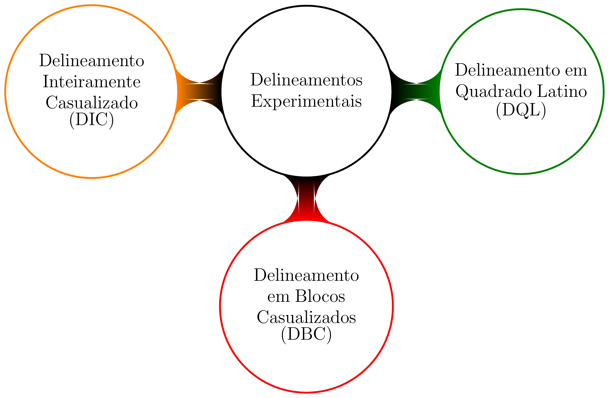
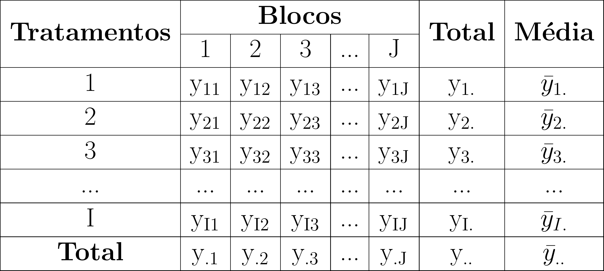

class: title-slide, center, middle
background-image: url(fig/slide-title/ufpa2.png), url(fig/slide-title/forest.png), url(fig/slide-title/img3.png)
background-position: 84% 90%, 95% 90%
background-size: 220px, 90px, cover

```{r setup, include=FALSE}
knitr::opts_chunk$set(
	error = FALSE,
	fig.align = "center",
	fig.showtext = TRUE,
	message = FALSE,
	warning = FALSE,
	cache = FALSE,
	collapse = TRUE,
	dpi = 600
)
```

```{r packages, include=FALSE}
# remotes::install_github("dill/emoGG")
library(ggplot2)
library(dplyr)
library(ggimage)
library(kableExtra)
library(readr)
```

```{r xaringan-logo, echo=FALSE}
library(xaringanExtra)
use_logo(
  image_url = "fig/slide-title/ufpa.png",
  position = css_position(top = ".8em", right = "-.5em"),
  width = "140px",
  height = "140px"
)

use_extra_styles(
  hover_code_line = TRUE,         #<<
  mute_unhighlighted_code = TRUE  #<<
)
xaringanExtra::use_editable(expires = 1)
#.can-edit[Você pode editar este título de slide]
#.can-edit.key-firstSlideTitle[Change this title and then reload the page]
use_clipboard()
```

```{r, load_refs, include=FALSE, cache=FALSE}
library(RefManageR)
BibOptions(check.entries = FALSE,
           bib.style = "authoryear",
           cite.style = "authoryear",
           style = "html",
           hyperlink = FALSE,
           dashed = FALSE)
(myBib <- ReadBib("./bib/ref.bib", check = FALSE))
```

```{r icon, echo=FALSE}
#remotes::install_github("mitchelloharawild/icons")
#remotes::install_github('emitanaka/anicon')
#library(icons)
#download_fontawesome()
#download_simple_icons()
```

```{r customDT, echo=F}
CustomDT <- function(data){
  data %>% DT::datatable(editable = 'cell', rownames = FALSE,
                         style = "default",
                         class = "display", width = '250px',
                         caption = '',
     options=list(pageLength = 8, dom = 'tip', autoWidth = F,
       initComplete = htmlwidgets::JS(
          "function(settings, json) {",
          paste0("$(this.api().table().container()).css({'font-size': '", "9pt", "'});"),
          "}")
       ) 
     )
}
```

```{r customkbl, echo=F}
Customkbl <- function(data){
  data %>%
    kbl() %>%
    kable_classic(full_width = F, html_font = "Cambria") %>% 
  kable_paper(bootstrap_options = "striped", full_width = F) %>% 
  kable_styling(bootstrap_options = "striped", font_size = 18, position = "center") %>% 
  row_spec(1:4, color = 'black', background = 'white') %>% 
  row_spec(0, color = 'white', background = 'black') %>% 
  column_spec(1, color = 'white', background = 'black')
}
```


<!-- title-slide -->
# Experimentação Florestal <br> (FL03034 - EF)

## Delineamento em <br> Quadrado Latino `r anicon::faa("pagelines", animate="horizontal", colour="green")`

#### **Prof. Dr. Deivison Venicio Souza**
##### Universidade Federal do Pará (UFPA) 
##### Faculdade de Engenharia Florestal
##### E-mail: deivisonvs@ufpa.br
<br>
##### `r format(Sys.Date(),"%d/%B/%Y")`
##### Altamira, Pará

---

layout: true
<div class="my-header"></div>
<div class="my-footer"><span>Prof. Dr. Deivison Venicio Souza (E-mail: deivisonvs@ufpa.br)&emsp;&emsp;&emsp;&emsp;&emsp; <div3>Experimentação Florestal (FL03034 - EF) </div3>/ <div2>Delineamento em Quadrado Latino</div2> </div>

---

## Ementa da disciplina (FL03034 - EF)

.shadow3[
<br>
1 - Introdução à experimentação; 

2 - Princípios básicos da experimentação; 

3 - Fases da pesquisa experimental; 

4 - Delineamento Inteiramente Casualizado - DIC; 

5 - Delineamento em Blocos Casualizados - DBC;

.orange[6 - Delineamento em Quadrado Latino - DQL];

7 - Testes de comparação de médias; 

8 - Ensaios Fatoriais;

9 - Análise de correlação linear simples;

10 - Análise de regressão linear simples e múltipla; e

11 - Introdução à linguagem R para análise de experimentos.

]

---

## Objetivos
<br><br>
Ao final desta aula espera-se que o discente seja capaz de...

.font90[
* Conhecer e entender os princípios básicos de experimentos em DQL.
* Compreender o modelo estatístico de experimentos em DQL.
* Aprender a realizar a Análise de Variância (ANOVA) de experimentos em DQL, e entender seus pressupostos.
* Realizar análise de experimentos em DQL usando a linguagem de programação R.
]

---

## Conteúdo

.pull-left-4[
.font80[
**Parte 1 - Delineamento em Quadrado Latino**

[1 - Delineamento experimental - Conceito](#de)

[2 - Fontes de variações adicionais](#fv)

[3 - Controle Local](#cl)

[4 - Princípios básicos](#pb)

[5 - Croqui de experimento em DQL](#croqui)

[6 - Casualização de tratamentos em DQL](#cas)

[7 - Principais características](#carac)

[8 - Representação genérica de tabela de dados](#tb)

[9 - Análise de Variância - ANOVA](#dbcanova)

[10 - Modelo Estatístico](#dbcmodelo)

[11 - Somas de Quadrados - Fórmulas](#sq)

[12 - Estatística F - Razão de variâncias](#testeF)

[13 - Hipóteses estatísticas do teste F](#hip)

[14 - Pressuposições da ANOVA](#press)

]
]

.pull-right-4[
.pull-down[
.font80[
**Parte 2 - Estudo de caso de experimentos em DQL**

[1 - Competição de procedências florestais <br> (Pimentel-Gomes; Garcia, 2002)](#proc)

&nbsp;&nbsp;[1.1 - ANOVA para experimento em DQL - Fator único](#anovadbc)

&nbsp;&nbsp;&nbsp;&nbsp;[1.1.1 - Graus de liberdade](#gl)

&nbsp;&nbsp;&nbsp;&nbsp;[1.1.2 - Somas de Quadrados](#sqex)

&nbsp;&nbsp;&nbsp;&nbsp;[1.1.3 - Quadradados Médios](#qm)

&nbsp;&nbsp;&nbsp;&nbsp;[1.1.4 - Estatística F](#estF)

&nbsp;&nbsp;&nbsp;&nbsp;[1.1.5 - F crítico da distribuição F](#fcrit)

[2 - Anova DBC no R](#anovaR)


<!-- [3 - Pacote ExpDes.pt](#expdes) -->

]
]
]

---

layout: false
name: conc
class: inverse, top, right
background-image: url(fig/class3/arara.jpg)
background-size: cover

.font200[**.yellow[Parte 1] <br> .white[Delineamento em <br> Quadrado Latino]**] 

.left[.footnote[.white[Créditos: Imagem de IvaCastro por Pixabay].]]

---

layout: true
<div class="my-header"></div>
<div class="my-footer"><span>Prof. Dr. Deivison Venicio Souza (E-mail: deivisonvs@ufpa.br)&emsp;&emsp;&emsp;&emsp;&emsp; <div3>Experimentação Florestal (FL03034 - EF) </div3>/ <div2>Delineamento em Quadrado Latino</div2> </div>

---
name: de
## Delineamento Experimental

--

<br><br>
.shadow1[
<br>
.center[**Conceito**]

É o modo como os tratamentos são designados às unidade (ou parcelas) experimentais (DIAS; BARROS, 2009).

(...) o modo de dispor as parcelas no ensaio (PIMENTEL-GOMES; GARCIA, 2009).
]

---

## Terminologias

<br>
### Unidade Experimental (ou Parcela)

--
.font90[
É a menor unidade que recebe o tratamento. Em experimentos de campo, normalmente são chamadas de parcelas experimentais. Uma UE pode ser formada por um indivíduo (ou grupo). (.green[Recomendação: 20 UEs])
<br><br>

**Experimento de campo**: parcela é uma área cujo tamanho depende, por exemplo, do porte e do espaçamento entre planta. 
Tamanhos: 200 e 250m² são bastante comuns.

**Casas de vegetação**: parcela pode ser: um vaso, tubetes, bandejas (5 a 10 sementes ou plantas)

**Laboratório**: parcela pode ser: placa de petri.
]


.pull-left-4[
```{r echo=FALSE, out.width='60%', fig.align='center', fig.cap='', dpi=600}
knitr::include_graphics("https://media2.giphy.com/media/mDBBU8K7Np2UQs9Dqy/giphy.gif")
```
]

.pull-right-4[
```{r echo=FALSE, out.width='60%', fig.align='center', fig.cap='', dpi=600}
knitr::include_graphics("https://media1.giphy.com/media/RCtKcMeeIlIFskmH7C/giphy-downsized.gif")
```
]

---

## Terminologias

<br>

### Tratamento

--
.font80[
É a condição (método, elemento, material) imposta à unidade experimental, cujo efeito deseja-se medir e comparar em um experimento. 
<br>
Somente o tratamento varia entre as UEs, as demais condições são mantidas constantes, exceto os fatores não-controláveis.
]

.pull-left-4[
```{r echo=FALSE, out.width='70%', fig.align='center', fig.cap='', dpi=600}
knitr::include_graphics("https://media.giphy.com/media/fjrLK07VbIcn7ZfX3f/giphy.gif")
```
<br><br><div style='font-size:50%'>(Available at [https://media.giphy.com](https://media.giphy.com), jul 19, 2021)</div>
]

--

.pull-right-4[
.font80[
**Experimentos de campo**

- Formas de preparo do solo
- Diferentes doses de adubação
- Diferentes espaçamentos

**Casa de vegetação**
- Diferentes tipos de substratos
- Diferentes níveis de sobreamento
- Diferentes tipos de recipientes
]
]

---
name: pde
## Delineamento Experimental
<br>

Os principais delineamentos experimentais utilizados são:
<br><br>

.pull-left-3[
```{r, echo=FALSE, out.width='80%', fig.align='center', fig.cap='', dpi=600}

```
]

--

.pull-right-3[

.font90[
A homogeneidade (ou não) das condições experimentais (ambientais ou biológicas) direciona para a escolha do delinemento experimental mais adequado.

]
]

---

## Delineamento em Quadrado Latino
<br>

### Considerações gerais

.pull-left-3[
.font90[
- É o tipo de delineamento experimental indicado quando existe duas .blue[causas (ou fontes de variações)] que deseja-se .blue[controlar] no experimento.
- Essas fontes de variações, em experimentos de campo, podem ser: .blue[Fertilidade do solo, gradiente de umidade, gradiente de irrigação], etc.
- Em experimentos de campo, o DQL é recomendado quando existe a necessidade de .blue[controlar a heterogeneidade em duas direções perpendiculares] (NOGUEIRA, 2007).
]
]

---
name: fv
## Delineamento em Quadrado Latino
<br>

### Controle das fontes de variações adicionais
<br>

**Mas, porque é importante controlar as fontes de variações adicionais?**

.pull-right-9[
 
]

--

.pull-left-9[
.font80[
- Fontes de variações adicionais (ou causas externas) têm efeito na variável resposta do experimento. 
- Portanto, não controlar as causas externas pode .blue[mascarar as diferenças entre os tratamentos] e conduzir o pesquisador à conclusões equivocadas.
- Assim, a ideia principal é .blue[evidenciar os efeitos dos tratamentos] nos dados da variável resposta.
- Fazendo-se isso, estima-se a variância de 2 causas externas ao ensaio e, por conseguinte, elimina-se essa variância do erro experimental.
]
]

---
name: cl
## Delineamento em Quadrado Latino
<br>

### Controle Local (CL)
<br>

.pull-left-9[
.font80[
- É um princípio básico da experimentação.
- O CL é uma estratégia para .blue[diminuir o efeito da heterogeneidade] (da área ou material experimental) sobre os dados da variável resposta.
- Em DQL, o CL é aplicado pela imposição de .blue[dois fatores de restrição] (ou controle) na casualização dos tratamentos, devido à presença de .blue[dois gradientes de heterogeneidade perpendiculares].
- Na prática, o CL consite na .blue[formação de grupos de parcelas o mais homogêneos possível] para os dois fatores de controle.
]
]

--

.pull-right-9[
.font80[
Portanto, a restrição na casualização dos tratamentos pode ser organizada por blocos da seguinte madeira:
<br><br>

**1) Blocos organizados no sentido horizontal (linhas)**; e 

**2) Blocos organizados nos sentido vertical (colunas)**.
]
]

---
name: pb
## Delineamento em Quadrado Latino
<br>

### Princípios básicos

.font90[
O DQL utiliza dos 3 princípios básicos da experimentação.
]

```{r, echo=FALSE, out.width='55%', fig.align='center', fig.cap='', dpi=600}
knitr::include_graphics('fig/class1/PBE.png')
```

---
name: croqui
## Delineamento em Quadrado Latino
<br>

### Esquema de um experimento em DQL com 5 tratamentos


.pull-left-4[
```{r echo=F, out.width='75%', fig.align='center', fig.cap='', dpi=600}
col <- rep(paste0("C", 1:5), times = 5)
lin <- rep(paste0("L", 1:5), each = 5)
trat <- c("D", "C", "E", "B", "A",
          "E", "D", "A", "C", "B",
          "A", "E", "B", "D", "C",
          "B", "A", "C", "E", "D",
          "C", "B", "D", "A", "E")
#val <- seq(1:25)
df <- data.frame(lin, col, trat)

(g1 <- df %>% ggplot(aes(col, lin, fill = "white")) +
  geom_tile(aes(color = "black"), size = 1, colour = "black") +
  scale_fill_identity() +
  labs(x = "\nGradiente de Umidade ---->",
       y = "Gradiente de Fertilidade ---->\n") +
  #scale_fill_gradient(low = "white", high = "red") + 
  geom_text(mapping = aes(label = sprintf("%s", trat)), 
            size = 8, fontface = "bold", colour = ifelse(trat == "A", "red", "black")) +
  ggthemes::theme_tufte()+
  #theme_minimal() +
  theme(axis.title = element_text(size = 24),
        axis.text = element_text(size = 18, color = "black"),
  	    axis.title.y = element_text(angle = 90),
        axis.ticks = element_blank(),
        legend.position = "none",
        plot.background = element_blank()) +
  coord_fixed()
)
```

]

--

.pull-right-4[
<br>
.font90[
A, B, C, D, E → Tratamentos

C1, C2, C3, C4, C5  → Blocos-colunas

L1, L2, L3, L4, L5 → Blocos-linhas
<br><br>

- Cada tratamento deve aparecer apenas uma vez na linha e na coluna.
- Tem-se 25 parcelas experimentais (N=I²), geradas pelo cruzamento de 5 linhas e 5 colunas.
- Cada parcela experimental pode ser constituída por um grupo de indivíduos (plantas).
]
]

---

## Delineamento em Quadrado Latino

.pull-left-5[
.font80[
### Croqui de experimento em DQL - Rossetti et al. (2017)
<br><br>

Croqui de um experimento em delineamento de quadrado latino 5x5 com bordadura de contorno e parcelas quadradas de 4 plantas úteis, sem bordadura entre elas. (pg. 62)

]
]

.pull-right-5[
```{r echo=FALSE, out.width='70%', fig.align='center', fig.cap='', dpi=600}
knitr::include_graphics("fig/class6/croqui1.png")
```
]

---
name: cas
## Delineamento em Quadrado Latino
<br>

### .font80[Casualização dos tratamentos às unidades experimentais (Nogueira, 2007)]
<br>

Uma forma de realizar a casualização de tratamentos em DQL é apresentada por Nogueira (2007).
<br><br>

Então, seja um experimento em DQL com cinco tratamentos (A, B, C, D e E), ter-se-ia:

- 5 linhas (5 blocos no sentido horizontal), cada bloco com 5 parcelas experimentais;
- 5 colunas (5 blocos no sentido vertical), cada bloco com 5 parcelas experimentais.

---

## Delineamento em Quadrado Latino
<br>

### .font80[Casualização dos tratamentos às unidades experimentais (Nogueira, 2007)]

**Vamos retornar ao croqui do experimento em DQL (5x5) apresentado anteriormente!**

.pull-left-4[
```{r echo=F, out.width='75%', fig.align='center', fig.cap='', dpi=600}
g1
```
]

--

.pull-right-4[
.font80[
- A aletorização dos tratamentos às parcelas experimentais foi realizada conforme estratégia apresentada por Nogueira, 2007.
<br><br>

.center[**Pergunta**]
- Como os tratamentos (A, B, C, D e E) foram aleatorizados às parcelas experimentais? 
- **Lembre-se**: Cada tratamento deve aparecer uma única vez na linha e na coluna.
]
]

---

## Delineamento em Quadrado Latino
<br>

### .font80[Casualização dos tratamentos às unidades experimentais (Nogueira, 2007)]
<br>

.font90[
**1º Passo**: Os tratamentos identificados pelas letras passam a ser identificados por níveis;

**2º Passo**: Sorteiam-se os tratamentos (A, B, C, D e E) às parcelas experimentais na 1ª linha (ou na 1ª coluna); e

**3º Passo**: Para as demais linhas (ou colunas) o procedimento é o seguinte:

-  Para a 2ª linha os tratamentos serão distribuídos às parcelas, de modo que, o tratamento que será aplicado, na primeira coluna, seja aquele que recebeu um incremento igual a 1 (um) sobre o tratamento que foi aplicado na 1ª coluna da 1ª linha.
]

---

## Delineamento em Quadrado Latino
<br>

### .font80[Casualização dos tratamentos às unidades experimentais (Nogueira, 2007)]
<br>

.pull-left-4[
.font90[
**1º Passo**: Os tratamentos identificados pelas letras passam a ser identificados por níveis;

- No exemplo, tem-se 5 tratamentos simbolizados por: .blue[A, B, C, D e E].
- Estes tratamentos serão identificados pelos níveis: .blue[1, 2, 3, 4, 5].
]
]

--

.pull-right-4[
.center[

**Tratamento simbolizados por níveis**
<br>

A → 1

B → 2

C → 3

D → 4

E → 5
]
]


---

<!-- ## Delineamento em Quadrado Latino -->

<!-- .pull-left-5[ -->
<!-- .font80[ -->
<!-- ### Uma aplicação -  Marty et al. (2019) -->
<!-- <br><br> -->

<!-- **Periódico**: Plos One -->

<!-- **Título**: Lowbush blueberry fruit yield and growth response to inorganic and organic N- fertilization when competing with two common weed species. -->

<!-- **Fonte**: [Marty et al. (2019)](https://journals.plos.org/plosone/article?id=10.1371/journal.pone.0226619) -->
<!-- ] -->
<!-- ] -->
<!-- <br><br> -->

<!-- .pull-right-5[ -->
<!-- ```{r echo=FALSE, out.width='80%', fig.align='center', fig.cap='', dpi=600} -->
<!--  -->
<!-- ``` -->
<!-- ] -->

<!-- --- -->
<!-- name: carac -->
<!-- ## Delineamento em Quadrado Latino -->
<!-- <br> -->

<!-- ### Principais características -->
<!-- <br> -->

<!-- ```{r, echo=FALSE, out.width='70%', fig.align='center', fig.cap='', dpi=600} -->
<!-- knitr::include_graphics('fig/class5/DBC-C.png') -->
<!-- ``` -->

<!-- --- -->
<!-- name: tb -->
<!-- ## Delineamento em Quadrado Latino -->
<!-- <br> -->

<!-- ### Representação genérica de tabela de dados -->

<!-- .pull-left-9[ -->
<!-- .font90[ -->
<!-- Para um experimento em DBC com **I** tratamentos (i = 1, 2, 3..., I) e **J** Blocos (j = 1, 2, 3..., J), tem-se a seguinte representação genérica para os dados y<sub>ij</sub> da variável resposta: -->
<!-- ] -->
<!-- <br> -->

<!-- ```{r, echo=FALSE, out.width='80%', fig.align='center', fig.cap='', dpi=600} -->
<!--  -->
<!-- ``` -->
<!-- ] -->

<!-- -- -->

<!-- .pull-right-9[ -->
<!-- .font80[ -->
<!-- y<sub>1.</sub>, y<sub>2.</sub>, y<sub>3.</sub>,..., y<sub>I.</sub> = Soma dos dados y<sub>ij</sub> da variável resposta y dentro do *i*-ésimo tratamento. -->
<!-- <br> -->

<!-- $\bar{y}_{1.}$, $\bar{y}_{2.}$, $\bar{y}_{3.}$,..., $\bar{y}_{I.}$ = Média aritmética dos dados y<sub>ij</sub> da variável resposta y dentro do *i*-ésimo tratamento. -->
<!-- <br><br> -->

<!-- $\bar{y}_{..}$ = Média geral -->

<!-- y<sub>..</sub> = Total geral -->
<!-- <br><br> -->

<!-- *I* = Número de tratamentos -->

<!-- *J* = Número de blocos -->
<!-- <br><br> -->

<!-- y<sub>ij</sub> = representa cada dado da variável resposta y do *i*-ésimo tratamento no *j*-ésimo bloco (com i=1, ..., I e j = 1, ..., J.) -->
<!-- ] -->
<!-- ] -->

<!-- --- -->
<!-- name: dbcanova -->
<!-- ## Delineamento em Quadrado Latino -->
<!-- <br> -->

<!-- ### Análise de Variância (ANOVA) - Conceito -->
<!-- <br> -->
<!-- .font90[ -->
<!-- É uma técnica estatísticas que permite **decompor a variação total** de dados experimentais em **causas conhecidas e independentes** e **desconhecidas**. -->
<!-- ] -->
<!-- <br><br> -->

<!-- -- -->

<!-- .pull-right-5[ -->
<!-- **Objetivo principal**: -->
<!-- .font80[ -->
<!-- - Inferir se as médias da variável resposta y de três (ou mais) tratamentos são diferentes estatísticamente. -->
<!-- - No caso do DBC, existem .blue[3 causas de variação]: 1) Entre tratamentos; 2) Entre blocos; e 3) Erro experimental. -->
<!-- - A estatística F é usada para testar, estatisticamente, a igualdade entre as médias de tratamentos. -->
<!-- ] -->
<!-- ] -->

<!-- --- -->

<!-- ## Delineamento em Quadrado Latino -->
<!-- <br> -->

<!-- ### Fontes de Variação no DBC -->
<!-- <br><br> -->

<!-- $$ -->
<!-- \normalsize -->
<!-- Variação~Total = \color{green}{Efeito~de~Tratamentos} + \color{blue}{Efeitos~de~Blocos} + \color{red}{Erro~Experimental} -->
<!-- $$ -->

<!-- --- -->

<!-- ## Delineamento em Quadrado Latino -->
<!-- <br> -->

<!-- ### Análise de Variância - Perguntas -->
<!-- <br> -->

<!-- .pull-left-2[ -->
<!-- .font90[ -->

<!-- `r anicon::faa("hand-point-right", animate="horizontal")` .blue[**Entre tratamentos**]: O quanto da variação na variável resposta y (ou dependente) é devido aos efeitos dos tratamentos aplicados às unidades experimentais (**fatores controlados**)? -->

<!-- `r anicon::faa("hand-point-right", animate="horizontal")` .blue[**Entre blocos**]: O quanto da variação na variável resposta y (ou dependente) do experimento é devido aos efeitos dos blocos (**fator de controle ou de restrição**)? -->

<!-- `r anicon::faa("hand-point-right", animate="horizontal")` .blue[**Erro experimental**]: O quanto da variação na variável resposta y (ou dependente) é devido aos efeitos dos **fatores não-controlados (ou variação do acaso**) - ou erro experimental? -->
<!-- ] -->
<!-- ] -->

<!-- .pull-right-1[ -->
<!-- .shadow3[ -->
<!-- .font90[ -->
<!-- .center[**Efeito de blocos**] -->
<!-- Por exemplo, o quanto da variação na variável resposta y é devido aos efeitos dos distintos níveis de fertilidade nos diferentes blocos? -->
<!-- ] -->
<!-- ] -->
<!-- ] -->

<!-- --- -->

<!-- ## Delineamento em Quadrado Latino -->
<!-- <br> -->

<!-- ### Análise de Variância - Quadro de experimentos em DBC -->
<!-- <br> -->

<!-- ```{r, echo=FALSE, out.width='65%', fig.align='center', fig.cap='', dpi=600} -->
<!--  -->
<!-- ``` -->

<!-- .pull-left-8[ -->
<!-- .font70[ -->
<!-- **SQ<sub>Trat.</sub>** = Soma de Quadrados de Tratamentos -->

<!-- **SQB** = Soma de Quadrados de Blocos -->

<!-- **SQR** = Soma de Quadrados de Resíduos -->

<!-- **SQ<sub>Tot.</sub>** = Soma de Quadrados de Totais -->
<!-- ] -->
<!-- ] -->

<!-- .pull-left-8[ -->
<!-- .font70[ -->
<!-- **QMT** = Quadrado Médio de Tratamentos -->

<!-- **QMR** = Quadrado Médio de Resíduos -->
<!-- ] -->
<!-- ] -->

<!-- .pull-left-8[ -->
<!-- .font70[ -->
<!-- $I$ = número de tratamentos -->

<!-- $J$ = número de repetições -->
<!-- <br> -->

<!-- $\alpha$ = nível de significância (0,01 ou 0,05). -->
<!-- ] -->
<!-- ] -->

<!-- --- -->
<!-- name: dbcmodelo -->
<!-- ## Delineamento em Quadrado Latino -->
<!-- <br> -->

<!-- ### Modelo Estatístico - DBC -->

<!-- Toda ANOVA pressupõe um modelo estatístico e a aceitação de algumas hipóteses básicas (PIMENTEL-GOMES, 2009).​O modelo estatístico associado ao DBC é: -->
<!-- <br><br> -->

<!-- .pull-left-9[ -->
<!-- .shadow3C[ -->
<!-- y<sub>ij</sub> $= m + t{_i} + b{_j} + e_{ij}$ -->
<!-- ] -->

<!-- <br> -->
<!-- .font90[ -->
<!-- Com i = 1, 2, ..., I e j = 1, 2, ..., J -->
<!-- ] -->

<!-- <br><br> -->
<!-- .font80[ -->
<!-- y<sub>ij</sub> = Valor observado da variável resposta y na unidade experimental (ou parcela) que recebeu o *i*-ésimo tratamento (*i* = 1, 2, ..., I) no *j*-ésimo bloco (*j* = 1, 2, ..., J). -->
<!-- ] -->
<!-- ] -->


<!-- .pull-right-9[ -->
<!-- .font80[ -->

<!-- $m$ = Uma constante. Representa a média geral. -->

<!-- $t_{i}$ = É o efeito do *i*-ésimo tratamento no valor y<sub>ij</sub> da variável resposta; -->

<!-- $b_{i}$ = É o efeito do *j*-ésimo bloco no valor y<sub>ij</sub> da variável resposta; e -->

<!-- $e_{ij}$ = É erro aleatório atribuído ao dado y<sub>ij</sub> da variável resposta. -->
<!-- ] -->
<!-- ] -->

<!-- --- -->
<!-- name: sq -->
<!-- ## Delineamento em Quadrado Latino -->
<!-- <br> -->

<!-- ### Soma de Quadrados - Fórmulas -->

<!-- .pull-left-9[ -->
<!-- - **Soma de Quadrados Total (SQ<sub>Tot.</sub>)** -->
<!-- <br><br> -->

<!-- ```{r, echo=FALSE, out.width='75%', fig.align='center', fig.cap='', dpi=600} -->
<!-- knitr::include_graphics('fig/class4/SQTot.png') -->
<!-- ``` -->
<!-- <br> -->

<!-- ```{r, echo=FALSE, out.width='55%', fig.align='center', fig.cap='', dpi=600} -->
<!-- knitr::include_graphics('fig/class4/SQTot2.png') -->
<!-- ``` -->
<!-- <!-- -->
<!-- $$ -->
<!-- \Large -->
<!-- SQ_{Tot.} = \sum_{i=1}^{I}\sum_{j=1}^{J}Y_{ij}^2 - \frac{1}{I.J}\left ( \sum_{i=1}^{I}\sum_{j=1}^{J}Y_{ij} \right )^2 -->
<!-- $$ -->
<!-- --> -->

<!-- <!-- -->
<!-- $$ -->
<!-- SQ_{Tot.} = \sum_{i=1}^{I}\sum_{j=1}^{J}\left (y_{ij} - \bar{y}  \right )^2 -->
<!-- $$ -->
<!-- --> -->

<!-- ] -->

<!-- .pull-right-9[ -->
<!-- .font80[ -->
<!-- $I$ = número de tratamentos -->

<!-- $J$ = número de blocos -->

<!-- y<sub>ij</sub> = Valor observado da variável resposta y na unidade experimental (ou parcela) que recebeu o *i*-ésimo tratamento (*i* = 1, 2, ..., I) no *j*-ésimo bloco (*j* = 1, 2, ..., J). -->
<!-- ] -->
<!-- <br> -->

<!-- .font80[ -->
<!-- **O que significa?** (Nogueira, 2007) -->

<!-- - A $SQ_{Total}$ fornece a variação total dos dados da variável resposta no experimento. -->
<!-- - Em outras palavras, mede o desvio de uma observação y<sub>ij</sub> em relação à média amostral geral, sem se importar com qual tratamento ou bloco essa observação pertence. -->
<!-- ] -->
<!-- ] -->

<!-- --- -->

<!-- ## Delineamento em Quadrado Latino -->
<!-- <br> -->

<!-- ### Soma de Quadrados - Fórmulas -->

<!-- .pull-left-9[ -->
<!-- - **Soma de Quadrados de Tratamentos (SQ<sub>Trat.</sub>)** -->
<!-- <br><br> -->

<!-- ```{r, echo=FALSE, out.width='80%', fig.align='center', fig.cap='', dpi=600} -->
<!-- knitr::include_graphics('fig/class4/SQTrat.png') -->
<!-- ``` -->
<!-- <br> -->

<!-- .font80[ -->
<!-- **O que significa?** (Nogueira, 2007) -->

<!-- - A SQ<sub>Trat.</sub> representa a variação entre tratamentos. Isto é, mede a variabilidade entre as médias dos tratamentos. -->
<!-- - Quanto menor a diferença entre as médias dos tratamentos menor será a SQ<sub>Trat.</sub>. -->
<!-- ] -->

<!-- <!-- -->
<!-- $$ -->
<!-- SQ_{Trat.} = \frac{1}{J}\sum_{i=1}^{I}\left ( \sum_{j=1}^{J}Y_{ij} \right )^2 - \frac{1}{IJ}\left ( \sum_{i=1}^{I}\sum_{j=1}^{J}Y_{ij} \right )^2 -->
<!-- $$ -->
<!-- --> -->

<!-- ] -->

<!-- .pull-right-9[ -->

<!-- .font80[ -->
<!-- $I$ = número de tratamentos -->

<!-- $J$ = número de blocos -->

<!-- y<sub>ij</sub> = Valor observado da variável resposta y na unidade experimental (ou parcela) que recebeu o *i*-ésimo tratamento (*i* = 1, 2, ..., I) no *j*-ésimo bloco (*j* = 1, 2, ..., J). -->
<!-- ] -->
<!-- ] -->

<!-- --- -->

<!-- ## Delineamento em Quadrado Latino -->
<!-- <br> -->

<!-- ### Soma de Quadrados - Fórmulas -->

<!-- .pull-left-9[ -->
<!-- - **Soma de Quadrados de Blocos (SQB)** -->
<!-- <br><br> -->

<!-- ```{r, echo=FALSE, out.width='80%', fig.align='center', fig.cap='', dpi=600} -->
<!--  -->
<!-- ``` -->
<!-- <br> -->

<!-- <!-- -->
<!-- $$ -->
<!-- SQB = \frac{1}{I}\sum_{j=1}^{J}\left ( \sum_{i=1}^{I}y_{ij} \right )^2 - \frac{1}{IJ}\left ( \sum_{i=1}^{I}\sum_{j=1}^{J}y_{ij} \right )^2 -->
<!-- $$ -->
<!-- --> -->

<!-- ] -->

<!-- .pull-right-9[ -->

<!-- .font80[ -->
<!-- $I$ = número de tratamentos -->

<!-- $J$ = número de blocos -->

<!-- y<sub>ij</sub> = Valor observado da variável resposta y na unidade experimental (ou parcela) que recebeu o *i*-ésimo tratamento (*i* = 1, 2, ..., I) no *j*-ésimo bloco (*j* = 1, 2, ..., J). -->
<!-- ] -->
<!-- ] -->

<!-- --- -->

<!-- ## Delineamento em Quadrado Latino -->
<!-- <br> -->

<!-- ### Soma de Quadrados - Fórmulas -->
<!-- <br> -->
<!-- .pull-top[ -->
<!-- .pull-left-4[ -->
<!-- **Fator em comum (C)** -->
<!-- <br> -->
<!-- .font90[ -->
<!-- - As equações $SQ_{Tot.}$, $SQ_{Trat.}$ e $SQB$ possuem uma expressão matemática em comum, denominada **Fator em Comum**. -->
<!-- - A existência desse fator facilita os cálculos matemáticos das SQs. -->
<!-- - É comum essas equações serem simplificadas pela letra "C" na parte em comum. -->
<!-- ] -->
<!-- ] -->
<!-- ] -->

<!-- .pull-left-10[ -->
<!-- ```{r, echo=FALSE, out.width='75%', fig.align='center', fig.cap='', dpi=600} -->
<!-- knitr::include_graphics('fig/class4/SQTot-cor.png') -->
<!-- ``` -->

<!-- <!-- -->
<!-- $$ -->
<!-- SQ_{Tot.} = \sum_{i=1}^{I}\sum_{j=1}^{J}Y_{ij}^2 - {\color{Orange} \frac{1}{I.J}\left ( \sum_{i=1}^{I}\sum_{j=1}^{J}Y_{ij} \right )^2} -->
<!-- $$ -->
<!-- --> -->

<!-- ```{r, echo=FALSE, out.width='80%', fig.align='center', fig.cap='', dpi=600} -->
<!-- knitr::include_graphics('fig/class4/SQTrat-cor.png') -->
<!-- ``` -->

<!-- <!-- -->
<!-- $$ -->
<!-- SQ_{Trat.} = \frac{1}{J}\sum_{i=1}^{I}\left ( \sum_{j=1}^{J}Y_{ij} \right )^2 - {\color{Orange} \frac{1}{IJ}\left ( \sum_{i=1}^{I}\sum_{j=1}^{J}Y_{ij} \right )^2} -->
<!-- $$ -->
<!-- --> -->

<!-- ```{r, echo=FALSE, out.width='80%', fig.align='center', fig.cap='', dpi=600} -->
<!-- knitr::include_graphics('fig/class5/SQB-cor.png') -->
<!-- ``` -->

<!-- <!-- -->
<!-- $$ -->
<!-- SQB = \frac{1}{I}\sum_{j=1}^{J}\left ( \sum_{i=1}^{I}y_{ij} \right )^2 - {\color{Orange} \frac{1}{IJ}\left ( \sum_{i=1}^{I}\sum_{j=1}^{J}y_{ij} \right )^2} -->
<!-- $$ -->
<!-- --> -->

<!-- ```{r, echo=FALSE, out.width='40%', fig.align='center', fig.cap='', dpi=600} -->
<!-- knitr::include_graphics('fig/class5/FC.png') -->
<!-- ``` -->

<!-- ] -->

<!-- --- -->

<!-- ## Delineamento em Quadrado Latino -->
<!-- <br> -->

<!-- ### Soma de Quadrados - Fórmulas -->

<!-- - **Soma de Quadrados de Resíduos (SQR)** - (Ou erro experimental) -->

<!-- .pull-left-10[ -->
<!-- .font90[ -->
<!-- Sabe-se que: -->
<!-- <br><br> -->

<!-- $\large SQ_{Tot.} = SQ_{Trat.} + SQB + SQR$ -->
<!-- <br><br> -->

<!-- Então, -->
<!-- <br><br> -->

<!-- $\large SQR = SQ_{Tot.} - (SQ_{Trat.} + SQB)$ -->
<!-- ] -->
<!-- ] -->

<!-- -- -->

<!-- .pull-right-10[ -->
<!-- .font90[ -->

<!-- $SQ_{Tot.}$ = Soma de Quadrados Totais -->

<!-- $SQ_{Trat.}$ = Soma de Quadrados de Tratamentos -->

<!-- $SQB$ = Soma de Quadrados de Blocos -->

<!-- $SQR$ = Soma de Quadrados de Resíduos (ou Erro) -->

<!-- ] -->
<!-- ] -->

<!-- --- -->
<!-- name: testeF -->
<!-- ## Delineamento em Quadrado Latino -->
<!-- <br> -->

<!-- ### Estatística F na ANOVA de DBC -->

<!-- .font80[ -->
<!-- - A **estatística F** é uma .blue[razão entre duas variâncias]. -->
<!-- - A **estatística F** na ANOVA é baseada na razão entre .blue[Quadrados Médios]. -->
<!-- - Quadrado médio é simplesmente uma estimativa da variância populacional. -->
<!-- - Na ANOVA de um fator em DBC a **estatística F** é a razão entre: $F = \dfrac{QM_{trat.}}{QMR}$ -->
<!-- - A **estatística F** na ANOVA é usada para avaliar se a variância entre grupos (entre tratamentos) é maior do que a variância dos dados dentro dos grupos (dentro dos tratamentos). -->

<!-- ] -->

<!-- <br> -->

<!-- .pull-right-5[ -->
<!-- `r anicon::faa("hand-point-right", animate="horizontal")` **Lembre-se:** -->
<!-- .font80[ -->
<!-- - Variância é uma medida (estimada ou verdadeira) da dispersão dos dados de uma variável em relação à sua média. -->
<!-- - Maiores valores indicam maior dispersão dos dados em relação à sua média. -->
<!-- ] -->
<!-- ] -->

<!-- --- -->
<!-- name: hip -->
<!-- ## Delineamento em Quadrado Latino -->
<!-- <br> -->

<!-- ### Hipóteses estatísticas do teste F -->
<!-- <br> -->

<!-- .pull-left-10[ -->
<!-- .font90[ -->
<!-- **Hipótese de nulidade (H<sub>0</sub>):** -->
<!-- <br> -->

<!-- - Todos os possíveis contrastes, entre médias, são estatisticamente nulos. -->
<!-- - As médias dos tratamentos são estatisticamente todas iguais entre si. -->
<!-- ] -->
<!-- ] -->

<!-- .pull-left-10[ -->
<!-- .font90[ -->
<!-- **Hipótese de alternativa (H<sub>1</sub>):** -->
<!-- <br> -->

<!-- - Existe pelo menos um contraste, entre médias, estatisticamente diferente de zero. -->
<!-- - Pelo menos dois tratamentos são estatisticamente diferentes entre si. -->
<!-- ] -->
<!-- ] -->

<!-- --- -->

<!-- ## Delineamento em Quadrado Latino -->
<!-- <br> -->

<!-- ### Teste da hipótese de nulidade (H<sub>0</sub>) da estatística F -->
<!-- <br> -->

<!-- **1° Passo**: Elaborar as hipóteses de nulidade (H<sub>0</sub>) e alternativa (H<sub>1</sub>); -->

<!-- **2° Passo**: Calcular o valor da estatística F, usando os valores de Quadrados Médios (QM<sub>trat.</sub> e QMR) da ANOVA; -->

<!-- **3° Passo**: Obter o valor crítico na tabela da distribuição F-Snedecor ( $F_{[\alpha;~(I-1);~(I-1)(J-1)]}$) para o nível de significância ( $\alpha$ ) fixado; e -->

<!-- **4° Passo**: Comparar o valor da estatística F com o valor F-Crítico. Em seguida, concluir quanto à rejeição ou não da hipótese de nulidade (H<sub>0</sub>). -->

<!-- --- -->

<!-- ## Delineamento em Quadrado Latino -->
<!-- <br> -->

<!-- ### Regras de decisão da estatística F -->
<!-- <br> -->

<!-- .pull-left-10[ -->
<!-- .font90[ -->
<!-- **Rejeição da hipótese de nulidade (H<sub>0</sub>)** -->

<!-- - Se o valor da .blue[estatística F] for **maior** do que o .blue[valor crítico na tabela da distribuição F-Snedecor], existem evidências para rejeitar H<sub>0</sub>. -->
<!-- - Em outras palavras, existem indícios de que pelo menos uma das médias dos tratamentos é estatisticamente diferente das demais, ao nível de significância fixado. -->

<!-- $F-calculado > F-Crítico$ -->

<!-- $Rejeita-se~~H_0$ -->

<!-- ] -->
<!-- ] -->

<!-- .pull-right-10[ -->
<!-- .font90[ -->
<!-- **Não rejeição da hipótese de nulidade** -->

<!-- - Se o valor da .blue[estatística F] for **menor ou igual** do que o valor do F-Crítico, não existe evidências para rejeitar H<sub>0</sub>. -->
<!-- - Em outras palavras, existem indícios de que as médias dos tratamentos são estatisticamente todas iguais entre si, ao nível de significância fixado. -->
<!-- <br><br> -->

<!-- $F-calculado \leq F-Crítico$ -->

<!-- $Não~~rejeita-se~~H_0$ -->

<!-- ] -->
<!-- ] -->

<!-- --- -->

<!-- ## Delineamento em Quadrado Latino -->
<!-- <br> -->

<!-- ### Rejeição da hipótese H<sub>0</sub> da estatística F -->
<!-- <br> -->

<!-- .font90[ -->
<!-- - Se o valor da Estatística F for maior do que o valor crítico da distribuição F-Snedecor têm-se a indicação de rejeição da hipótese de nulidade (H<sub>0</sub>). -->
<!-- - Isto é, é razoável admitir que existem evidências de que as médias dos tratamentos **não são todas estatísticamente iguais entre si**. -->
<!-- - Apesar disso, a estatística F não possibilita identificar quais tratamentos diferem significativamente entre si. -->
<!-- - Portanto, fica a pergunta: .blue[Quais tratamentos diferem, estatisticamente, em termos de suas médias?] -->
<!-- <br><br> -->

<!-- **A reposta para essa pergunta são oferecidas por pós-testes de comparações de médias.** -->

<!-- **Por exemplo, Teste de Tukey, Teste de Duncan, entre outros.** -->

<!-- ] -->

<!-- --- -->
<!-- name: press -->
<!-- ## Delineamento em Quadrado Latino -->
<!-- <br> -->

<!-- ### Pressuposições da ANOVA -->
<!-- <br> -->

<!-- .pull-left-10[ -->
<!-- .font90[ -->
<!-- **1. Efeitos aditivos** -->

<!-- Os efeitos do modelo devem ser aditivos. -->

<!-- **2. Normalidade dos erros experimentais** -->

<!-- Os erros experimentais (ou resíduos) devem ser normalmente distribuídos. -->
<!-- ] -->
<!-- ] -->

<!-- .pull-left-10[ -->
<!-- .font90[ -->
<!-- **3. Independência dos erros experimentais** -->

<!-- Os erros experimentais (ou resíduos) devem ser todos independentes. -->

<!-- Esta suposição é, em geral, garantida por sorteio/casualização. -->

<!-- **4. Homocedasticidade de variâncias dos erros experimentais** -->

<!-- Os erros experimentais (ou resíduos) devem possuir homogeneidade de variância. -->

<!-- A importância reside na validação do teste F e testes de comparações de médias. -->
<!-- ] -->
<!-- ] -->

<!-- --- -->

<!-- layout: false -->
<!-- name: proc -->
<!-- class: inverse, top, right -->
<!-- background-image: url(fig/class3/arara.jpg) -->
<!-- background-size: cover -->

<!-- .font200[**.yellow[Parte 2] <br> .white[Estudo de caso de <br> experimentos em DBC]**]  -->

<!-- .left[.footnote[.white[Créditos: Imagem de IvaCastro por Pixabay].]] -->

<!-- --- -->
<!-- layout: true -->
<!-- <div class="my-header"></div> -->
<!-- <div class="my-footer"><span>Prof. Dr. Deivison Venicio Souza (E-mail: deivisonvs@ufpa.br)&emsp;&emsp;&emsp;&emsp;&emsp;Experimentação Florestal (FL03034 - EF) - Delineamento em Quadrado Latino</div> -->

<!-- --- -->

<!-- ## Delineamento em Quadrado Latino -->
<!-- <br> -->

<!-- ### .font80[Estudo de Caso I - Competição de procedências florestais (Pimentel-Gomes; Garcia, 2002)] -->
<!-- <br> -->

<!-- .font90[ -->
<!-- Um experimento de competição de 7 procedências florestais de *Eucalyptus grandis* foi conduzido sob o Delineamento em Quadrado Latino (DBC), com 4 blocos. Os dados apresentados na tabela a seguir correspodem à produção de madeira, em m³/ha, nas parcelas experimentais. Assim, pede-se: -->
<!-- <br><br> -->

<!-- a) Elaborar as hipóteses da estatística F da ANOVA. -->

<!-- b) Realizar a ANOVA do experimento. -->
<!-- ] -->


<!-- --- -->

<!-- ## Delineamento em Quadrado Latino -->
<!-- <br> -->

<!-- ### .font80[Estudo de Caso I - Competição de procedências florestais (Pimentel-Gomes; Garcia, 2002)] -->
<!-- <br> -->

<!-- ```{r tibble, echo=F, eval=T} -->
<!-- data <- readr::read_csv("data/DBC-Pimentel-Gomes-2002.csv") -->
<!-- data %>% Customkbl -->
<!-- ``` -->

<!-- --- -->

<!-- ## Delineamento em Quadrado Latino -->
<!-- <br> -->

<!-- ### .font80[Estudo de Caso I - Competição de procedências florestais (Pimentel-Gomes; Garcia, 2002)] -->

<!-- .font80[ -->
<!-- - **Gráfico Dot Plot**: Ajuda a visualizar como os diâmetros variaram para cada Procedência. -->
<!-- ] -->

<!-- ```{r echo=F, eval=T, collapse=T, out.width="35%", fig.align='center', fig.cap='', dpi=600} -->

<!-- df <- data %>% -->
<!--   tidyr::pivot_longer( -->
<!--         cols = starts_with("P"), -->
<!--         names_to = "Procedencia", -->
<!--         values_to = "Valor", -->
<!--         names_transform = list(Procedencia = as.factor), -->
<!--         values_drop_na = TRUE -->
<!--     ) %>% -->
<!--   rename(Bloco = `Bloco/Procedencia`) %>%  -->
<!--   mutate(Procedencia = forcats::fct_reorder( -->
<!--     Procedencia,  -->
<!--     desc(Valor),  -->
<!--     .fun='mean') -->
<!--     ) -->

<!-- df %>% -->
<!--   ggplot(aes(x=Procedencia, y=Valor, fill=Procedencia)) +  -->
<!--   geom_dotplot(binaxis='y', stackdir='center') + -->
<!--   stat_summary(fun.y=mean, geom="point", shape=18, -->
<!--                  size=6, color="red") + -->
<!--   theme_bw(base_size = 18) + -->
<!--   theme(panel.grid = element_blank(), -->
<!--         legend.position="none" -->
<!--         ) -->
<!-- ``` -->

<!-- --- -->

<!-- ## Delineamento em Quadrado Latino -->
<!-- <br> -->

<!-- ### .font80[Estudo de Caso I - Competição de procedências florestais (Pimentel-Gomes; Garcia, 2002)] -->

<!-- .font80[ -->
<!-- - **Gráfico BoxPlot**: Fornece um indicativo da distribuição dos dados e medidas de posição. -->
<!-- ] -->

<!-- ```{r echo=F, eval=T, collapse=T, fig.align='center', fig.cap='', dpi=600, fig.width=1, fig.height=.6} -->

<!-- bp <- df %>% -->
<!--   ggplot(aes(x=Procedencia, y=Valor, color=Procedencia)) + -->
<!--   geom_boxplot() + -->
<!--   stat_summary(fun.y=mean, geom="point", shape=4, -->
<!--                  size=2, color="red") + -->
<!--   theme_bw(base_size = 16) + -->
<!--   theme(panel.grid = element_blank(), -->
<!--         legend.position="none" -->
<!--         ) -->

<!-- plotly::ggplotly(bp) -->
<!-- ``` -->

<!-- --- -->

<!-- ## Delineamento em Quadrado Latino -->
<!-- <br> -->

<!-- ### .font80[Estudo de Caso I - Competição de procedências florestais (Pimentel-Gomes; Garcia, 2002)] -->
<!-- <br> -->

<!-- **Hipóteses da estatística F da ANOVA** -->
<!-- <br> -->

<!-- .pull-left-11[ -->
<!-- .font90[ -->
<!-- - Hipótese de nulidade (H<sub>0</sub>) -->
<!-- <br> -->

<!-- **Não existe diferença** significativa entre as **médias** de produção de madeira, em m³/ha, das 7 procedências de *Eucalyptus grandis*. -->
<!-- ] -->
<!-- ] -->

<!-- .pull-right-11[ -->
<!-- .font90[ -->
<!-- - Hipótese de alternativa (H<sub>1</sub>) -->
<!-- <br> -->

<!-- **Existe diferença** significativa entre as **médias** de produção de madeira, em m³/ha, das 7 procedências de *Eucalyptus grandis*. -->
<!-- ] -->
<!-- ] -->

<!-- --- -->

<!-- ## Delineamento em Quadrado Latino -->
<!-- <br> -->

<!-- ### .font80[Estudo de Caso I - Competição de procedências florestais (Pimentel-Gomes; Garcia, 2002)] -->
<!-- <br> -->

<!-- .font90[ -->
<!-- **Retornemos ao quadro de dados do experimento!** -->

<!-- **Vamos inspecionar os valores observados de Volume de madeira para as diferentes procedências!** -->

<!-- Pode-se constatar que os valores observados para Volume não são idênticos entre procedências e dentro de procedências. -->
<!-- ] -->
<!-- <br> -->

<!-- .pull-left-2[ -->
<!-- ```{r t, echo=F, eval=T} -->
<!-- data %>% Customkbl -->
<!-- ``` -->
<!-- ] -->

<!-- .pull-right-1[ -->
<!-- .font90[ -->
<!-- - Quais são as possíveis causas que explicam as variações nos valores observados? -->
<!-- - Existe alguma procedência que apresentou maior produção volumétrica? -->
<!-- ] -->
<!-- ] -->

<!-- --- -->
<!-- name: anovadbc -->
<!-- ## Delineamento em Quadrado Latino -->
<!-- <br> -->

<!-- ### .font80[Estudo de Caso I - Competição de procedências florestais (Pimentel-Gomes; Garcia, 2002)] -->

<!-- .font80[ -->
<!-- Inicialmente, vamos calcular as .blue[somas de tratamentos e blocos], e também a .blue[média aritmética de tratamentos] da variável resposta (volume de madeira por unidade de área). -->
<!-- ] -->
<!-- <br> -->

<!-- -- -->

<!-- ```{r tb1, echo=F, eval=T} -->
<!-- library(dplyr) -->
<!-- data <- readr::read_csv("data/DBC-Pimentel-Gomes-2002.csv") -->

<!-- df0 <- data %>% janitor::adorn_totals(where = "col") -->

<!-- df1 <- df0 %>%  -->
<!--   bind_rows(df0 %>% -->
<!--             summarise_if(is.numeric, sum)) %>%  -->
<!--   mutate(`Bloco/Procedencia` = ifelse(is.na(`Bloco/Procedencia`), "Total", `Bloco/Procedencia`)) %>%  -->
<!--   mutate_if(is.numeric, round, 1) -->

<!-- df2 <- df1 %>%  -->
<!--   bind_rows(df1[-5,-9]%>% -->
<!--             summarise_if(is.numeric, mean)) %>%  -->
<!--   mutate(`Bloco/Procedencia` = ifelse(is.na(`Bloco/Procedencia`), "Média", `Bloco/Procedencia`)) %>% -->
<!--   mutate_if(is.numeric, round, 1) -->

<!-- df2 %>%  -->
<!--   Customkbl %>%  -->
<!--   row_spec(5, color = 'white', background = 'orange') %>%  -->
<!--   row_spec(6, color = 'white', background = 'blue') %>%  -->
<!--   column_spec(9, color = 'white', background =  -->
<!--                 case_when(is.na(df2$Total) ~ "white", -->
<!--                              df2$Total > 7000 ~ "red", -->
<!--                              df2$Total < 7000 ~ "green")) -->
<!-- ``` -->

<!-- --- -->

<!-- ## Delineamento em Quadrado Latino -->
<!-- <br> -->

<!-- ### .font80[Estudo de Caso I - Competição de procedências florestais (Pimentel-Gomes; Garcia, 2002)] -->

<!-- .font90[ -->
<!-- - Existe alguma procedência que apresentou maior produção volumétrica? -->
<!-- - A resposta para esta pergunta será dada pela estatística F da ANOVA-DBC. -->
<!-- ] -->

<!-- -- -->

<!-- **Então, vamos construir o quadro da ANOVA.** -->
<!-- <br><br> -->

<!-- ```{r, echo=FALSE, out.width='75%', fig.align='center', fig.cap='', dpi=600} -->
<!--  -->
<!-- ``` -->

<!-- --- -->
<!-- name: gl -->
<!-- ## Delineamento em Quadrado Latino -->
<!-- <br> -->

<!-- ### .font80[Estudo de Caso I - Competição de procedências florestais (Pimentel-Gomes; Garcia, 2002)] -->
<!-- <br> -->

<!-- **1º Passo**: determinar os valores de graus de liberdade de todas as fontes de variação do experimento. -->
<!-- <br><br> -->

<!-- ```{r, echo=FALSE, out.width='85%', fig.align='center', fig.cap='', dpi=600} -->
<!-- knitr::include_graphics('fig/class5/ANOVA-DBC-GL.png') -->
<!-- ``` -->

<!-- --- -->
<!-- name: sqex -->
<!-- ## Delineamento em Quadrado Latino -->
<!-- <br> -->

<!-- ### .font80[Estudo de Caso I - Competição de procedências florestais (Pimentel-Gomes; Garcia, 2002)] -->
<!-- <br> -->

<!-- **2º Passo**: Determinar as Somas de Quadrados. -->
<!-- <br> -->

<!-- .pull-top[ -->
<!-- .pull-left-4[ -->
<!-- **Fator em comum (C)** -->
<!-- <br> -->
<!-- .font80[ -->
<!-- - As equações $SQ_{Tot.}$, $SQ_{Trat.}$ e $SQB$ possuem uma expressão matemática em comum, denominada **Fator em Comum**. -->
<!-- - A existência desse fator facilita os cálculos matemáticos das SQs. -->
<!-- - É comum essas equações serem simplificadas pela letra "C" na parte em comum. -->
<!-- ] -->
<!-- ] -->
<!-- ] -->

<!-- .pull-left-10[ -->
<!-- ```{r, echo=FALSE, out.width='75%', fig.align='center', fig.cap='', dpi=600} -->
<!-- knitr::include_graphics('fig/class4/SQTot-cor.png') -->
<!-- ``` -->

<!-- ```{r, echo=FALSE, out.width='80%', fig.align='center', fig.cap='', dpi=600} -->
<!-- knitr::include_graphics('fig/class4/SQTrat-cor.png') -->
<!-- ``` -->

<!-- ```{r, echo=FALSE, out.width='80%', fig.align='center', fig.cap='', dpi=600} -->
<!-- knitr::include_graphics('fig/class5/SQB-cor.png') -->
<!-- ``` -->
<!-- <br> -->

<!-- ```{r, echo=FALSE, out.width='60%', fig.align='center', fig.cap='', dpi=600} -->
<!-- knitr::include_graphics('fig/class5/SQR.png') -->
<!-- ``` -->

<!-- ] -->

<!-- --- -->

<!-- ## Delineamento em Quadrado Latino -->
<!-- <br> -->

<!-- ### .font80[Estudo de Caso I - Competição de procedências florestais (Pimentel-Gomes; Garcia, 2002)] -->
<!-- <br> -->

<!-- **2º Passo**: Determinar as Somas de Quadrados - .blue[Fator em Comum] -->
<!-- <br> -->

<!-- .pull-left-9[ -->
<!-- ```{r tb2, echo=F, eval=T} -->
<!-- df2 %>%  -->
<!--   Customkbl %>%  -->
<!--   row_spec(5, color = 'white', background = 'orange') %>%  -->
<!--   row_spec(6, color = 'white', background = 'blue') %>%  -->
<!--   column_spec(9, color = 'white', background =  -->
<!--                 case_when(is.na(df2$Total) ~ "white", -->
<!--                              df2$Total > 7000 ~ "red", -->
<!--                              df2$Total < 7000 ~ "green")) -->
<!-- ``` -->

<!-- $$ -->
<!-- \begin{equation*} -->
<!-- \sum_{i=1}^{I}\sum_{j=1}^{J}Y_{ij} = 1.451 + 1.034 + ... + 1.276 = 7.709 -->
<!-- \end{equation*} -->
<!-- $$ -->

<!-- ] -->

<!-- .pull-right-9[ -->

<!-- ```{r, echo=FALSE, out.width='50%', fig.align='center', fig.cap='', dpi=600} -->
<!-- knitr::include_graphics('fig/class4/Fator.png') -->
<!-- ``` -->
<!-- <br> -->

<!-- $$ -->
<!-- C = \dfrac{\left( 7.709\right)^2}{7*4} = \dfrac{59.428.681}{28} = 2.122.452,892 -->
<!-- $$ -->

<!-- ] -->

<!-- --- -->

<!-- ## Delineamento em Quadrado Latino -->
<!-- <br> -->

<!-- ### .font80[Estudo de Caso I - Competição de procedências florestais (Pimentel-Gomes; Garcia, 2002)] -->
<!-- <br> -->

<!-- **2º Passo**: Determinar as Somas de Quadrados - .blue[Soma de Quadrados Totais - SQ<sub>Tot.</sub>] -->

<!-- .pull-left-9[ -->
<!-- ```{r tb3, echo=F, eval=T} -->
<!-- df2 %>%  -->
<!--   Customkbl %>%  -->
<!--   row_spec(5, color = 'white', background = 'orange') %>%  -->
<!--   row_spec(6, color = 'white', background = 'blue') %>%  -->
<!--   column_spec(9, color = 'white', background =  -->
<!--                 case_when(is.na(df2$Total) ~ "white", -->
<!--                              df2$Total > 7000 ~ "red", -->
<!--                              df2$Total < 7000 ~ "green")) -->
<!-- ``` -->

<!-- $$ -->
<!-- \begin{equation*} -->
<!-- \sum_{i=1}^{I}\sum_{j=1}^{J}Y_{ij}^2 = 358^2 + 380^2 + 353^2 + ... + 319^2 = 2.182.735 -->
<!-- \end{equation*} -->
<!-- $$ -->
<!-- ] -->

<!-- .pull-right-9[ -->
<!-- ```{r, echo=FALSE, out.width='95%', fig.align='center', fig.cap='', dpi=600} -->
<!-- knitr::include_graphics('fig/class4/SQTot-cor.png') -->
<!-- ``` -->
<!-- <br><br> -->

<!-- $$ -->
<!-- \begin{equation*} -->
<!-- SQ_{Tot.} = 2.182.735 - 2.122.452,892\\~\\ -->
<!-- SQ_{Tot.} = 60.282,108 -->
<!-- \end{equation*} -->
<!-- $$ -->
<!-- ] -->

<!-- --- -->

<!-- ## Delineamento em Quadrado Latino -->
<!-- <br> -->

<!-- ### .font80[Estudo de Caso I - Competição de procedências florestais (Pimentel-Gomes; Garcia, 2002)] -->
<!-- <br> -->

<!-- **2º Passo**: Determinar as Somas de Quadrados - .blue[Soma de Quadrados de Tratamentos - SQ<sub>Trat.</sub>] -->
<!-- <br> -->

<!-- .pull-left-9[ -->
<!-- ```{r tb4, echo=F, eval=T} -->
<!-- df2 %>%  -->
<!--   Customkbl %>%  -->
<!--   row_spec(5, color = 'white', background = 'orange') %>%  -->
<!--   row_spec(6, color = 'white', background = 'blue') %>%  -->
<!--   column_spec(9, color = 'white', background =  -->
<!--                 case_when(is.na(df2$Total) ~ "white", -->
<!--                              df2$Total > 7000 ~ "red", -->
<!--                              df2$Total < 7000 ~ "green")) -->
<!-- ``` -->

<!-- $$ -->
<!-- \begin{equation*} -->
<!-- \small -->
<!-- \sum_{i=1}^{I}\left ( \sum_{j=1}^{J}Y_{ij} \right )^2 = 1.451^2 + 1.034^2 + ... + 1.276^2 = 8.704.763 -->
<!-- \end{equation*} -->
<!-- $$ -->
<!-- ] -->


<!-- .pull-right-9[ -->

<!-- ```{r, echo=FALSE, out.width='95%', fig.align='center', fig.cap='', dpi=600} -->
<!-- knitr::include_graphics('fig/class4/SQTrat-cor.png') -->
<!-- ``` -->
<!-- <br><br> -->

<!-- $$ -->
<!-- \begin{equation*} -->
<!-- SQ_{trat.} = \dfrac{8.704.763}{4} - 2.122.452,892\\~\\ -->
<!-- SQ_{trat.} = 53.737,858 -->
<!-- \end{equation*} -->
<!-- $$ -->
<!-- ] -->

<!-- --- -->

<!-- ## Delineamento em Quadrado Latino -->
<!-- <br> -->

<!-- ### .font80[Estudo de Caso I - Competição de procedências florestais (Pimentel-Gomes; Garcia, 2002)] -->
<!-- <br> -->

<!-- **2º Passo**: Determinar as Somas de Quadrados - .blue[Soma de Quadrados de Blocos - SQB] -->
<!-- <br> -->

<!-- .pull-left-9[ -->
<!-- ```{r tbx, echo=F, eval=T} -->
<!-- df2 %>%  -->
<!--   Customkbl %>%  -->
<!--   row_spec(5, color = 'white', background = 'orange') %>%  -->
<!--   row_spec(6, color = 'white', background = 'blue') %>%  -->
<!--   column_spec(9, color = 'white', background =  -->
<!--                 case_when(is.na(df2$Total) ~ "white", -->
<!--                              df2$Total > 7000 ~ "red", -->
<!--                              df2$Total < 7000 ~ "green")) -->
<!-- ``` -->

<!-- $$ -->
<!-- \begin{equation*} -->
<!-- \small -->
<!-- \sum_{j=1}^{J}\left ( \sum_{i=1}^{I}Y_{ij} \right )^2 = 2.024^2 + 1.885^2 + 1.950^2 + 1.850^2 = 14.874.801 -->
<!-- \end{equation*} -->
<!-- $$ -->
<!-- ] -->


<!-- .pull-right-9[ -->

<!-- ```{r, echo=FALSE, out.width='95%', fig.align='center', fig.cap='', dpi=600} -->
<!-- knitr::include_graphics('fig/class5/SQB-cor.png') -->
<!-- ``` -->
<!-- <br><br> -->

<!-- $$ -->
<!-- \begin{equation*} -->
<!-- SQB = \dfrac{14.874.801}{7} - 2.122.452,892\\~\\ -->
<!-- SQB = 2.518,679 -->
<!-- \end{equation*} -->
<!-- $$ -->
<!-- ] -->

<!-- --- -->

<!-- ## Delineamento em Quadrado Latino -->
<!-- <br> -->

<!-- ### .font80[Estudo de Caso I - Competição de procedências florestais (Pimentel-Gomes; Garcia, 2002)] -->
<!-- <br> -->

<!-- **2º Passo**: Determinar as Somas de Quadrados - .blue[Soma de Quadrados de Resíduos - SQR] -->
<!-- <br><br> -->

<!-- $\large SQR = SQ_{Tot.} - (SQ_{Trat.} + SQB)$ -->

<!-- $\large SQR = 60.282,108 - (53.737,858 + 2.518,679)$ -->

<!-- $\large SQR = 4.025,571$ -->

<!-- --- -->

<!-- ## Delineamento em Quadrado Latino -->
<!-- <br> -->

<!-- ### .font80[Estudo de Caso I - Competição de procedências florestais (Pimentel-Gomes; Garcia, 2002)] -->
<!-- <br> -->

<!-- **2º Passo**: Determinar as Somas de Quadrados - .blue[Adicionar no quadro da ANOVA] -->
<!-- <br><br> -->

<!-- ```{r, echo=FALSE, out.width='85%', fig.align='center', fig.cap='', dpi=600} -->
<!--  -->
<!-- ``` -->

<!-- --- -->
<!-- name: qm -->
<!-- ## Delineamento em Quadrado Latino -->
<!-- <br> -->

<!-- ### .font80[Estudo de Caso I - Competição de procedências florestais (Pimentel-Gomes; Garcia, 2002)] -->
<!-- <br> -->

<!-- **3º Passo**: Determinar os Quadrados Médios - .blue[Tratamento e Resíduo] -->
<!-- <br><br> -->

<!-- .pull-left-14[ -->
<!-- .font80[ -->
<!-- **Quadrado Médio de Tratamentos (Procedências) - Variância entre tratamentos** -->
<!-- ] -->
<!-- <br> -->

<!-- $$ -->
<!-- \begin{equation*} -->
<!-- \small{ -->
<!-- QM_{Trat.} = \dfrac{SQ_{Trat.}}{I-1} = \dfrac{53.737,858}{7-1}\\~\\ -->
<!-- QM_{Trat.} = 8.956,309 -->
<!-- } -->
<!-- \end{equation*} -->
<!-- $$ -->
<!-- ] -->

<!-- .pull-left-14[ -->
<!-- .font80[ -->
<!-- **Quadrado Médio de Resíduos - Variância dentro de tratamentos** -->
<!-- ] -->
<!-- <br> -->

<!-- $$ -->
<!-- \begin{equation*} -->
<!-- \small{ -->
<!-- QMR = \dfrac{SQR}{(I-1)(J-1)} = \dfrac{4.025,571}{(7-1)(4-1)}\\~\\ -->
<!-- QMR = 223,643 -->
<!-- } -->
<!-- \end{equation*} -->
<!-- $$ -->
<!-- ] -->


<!-- .pull-right-14[ -->
<!-- .font80[ -->
<!-- **Quadrado Médio de Blocos - Variância entre blocos** -->
<!-- ] -->
<!-- <br> -->

<!-- $$ -->
<!-- \begin{equation*} -->
<!-- \small{ -->
<!-- QMB = \dfrac{SQB}{(J-1)} = \dfrac{2.518,679}{(4-1)}\\~\\ -->
<!-- QMB = 839,559 -->
<!-- } -->
<!-- \end{equation*} -->
<!-- $$ -->
<!-- ] -->

<!-- --- -->

<!-- ## Delineamento em Quadrado Latino -->
<!-- <br> -->

<!-- ### .font80[Estudo de Caso I - Competição de procedências florestais (Pimentel-Gomes; Garcia, 2002)] -->
<!-- <br> -->

<!-- **3º Passo**: Determinar os Quadrados Médios - .blue[Adicionar no quadro da ANOVA] -->
<!-- <br><br> -->

<!-- ```{r, echo=FALSE, out.width='95%', fig.align='center', fig.cap='', dpi=600} -->
<!-- knitr::include_graphics('fig/class5/ANOVA-DBC-QM.png') -->
<!-- ``` -->

<!-- --- -->
<!-- name: estF -->
<!-- ## Delineamento em Quadrado Latino -->
<!-- <br> -->

<!-- ### .font80[Estudo de Caso I - Competição de procedências florestais (Pimentel-Gomes; Garcia, 2002)] -->
<!-- <br> -->

<!-- **4º Passo**: Determinar a estatística F -->
<!-- <br><br> -->


<!-- $\normalsize F = \dfrac{QM_{Trat.}}{QMR} = \dfrac{8.956,309}{223,643} = 40,05$ -->

<!-- --- -->
<!-- name: fcrit -->
<!-- ## Delineamento em Quadrado Latino -->
<!-- <br> -->

<!-- ### .font80[Estudo de Caso I - Competição de procedências florestais (Pimentel-Gomes; Garcia, 2002)] -->
<!-- <br> -->


<!-- **5º Passo**: Encontrar o valor crítico da distribuição F para o nível de significância $\alpha$ -->
<!-- <br><br> -->

<!-- .font80[ -->
<!-- - O valor de F-crítico pode ser encontrado nas tabelas de distribuição F teóricas. -->
<!-- - Para isso, são necessárias 3 informações: 1) GL de tratamentos; 2) GL de resíduos; e 3) nível de significância $\alpha$. -->
<!-- - Os níveis de significância ( $\alpha$ ) mais usuais são: 0,01 (1%) e 0,05 (5%). -->
<!-- - Neste exemplo, admitir-se-á $\alpha = 0,05$ (ou 5%), conforme Pimentel-Gomes e Garcia (2002). -->
<!-- ] -->

<!-- --- -->

<!-- ## Delineamento em Quadrado Latino -->
<!-- <br> -->

<!-- ### .font80[Estudo de Caso I - Competição de procedências florestais (Pimentel-Gomes; Garcia, 2002)] -->
<!-- <br> -->

<!-- **5º Passo**: Encontrar o valor crítico da distribuição F para o nível de significância $\alpha$ -->
<!-- <br><br> -->

<!-- .pull-left-9[ -->
<!-- .blue[**Vamos aprender a usar a tabela de distribuição F!**] -->
<!-- - Acesse o site: [F-Distribution-Tables-UCLA](http://socr.ucla.edu/Applets.dir/F_Table.html) -->
<!-- - O F-crítico para o experimento é: $F_{[6,~18;~0,05]} = 2,661$ -->
<!-- <br> -->

<!-- .font80[**No R use a função qf() para encontrar o F-crítico**] -->
<!-- ```{r, echo=T, eval=T} -->
<!-- qf(0.05, 6, 18, lower.tail=FALSE) -->
<!-- ``` -->

<!-- ] -->

<!-- .pull-right-9[ -->
<!-- .font80[ -->
<!-- .blue[**Bônus: Explore mais aplicativos...**] -->
<!-- - [Distribuição-F-Prof-Bertolo](http://www.bertolo.pro.br/FinEst/Estatistica/DistribuicaoProbabilidades2/f/index.html) -->
<!-- - [Stat-Kingdom](https://www.statskingdom.com/180Anova1way.html) -->
<!-- - [Illinois-Department-of-Statistics](http://courses.atlas.illinois.edu/spring2016/STAT/STAT200/pf.html) -->
<!-- ] -->
<!-- ] -->

<!-- --- -->

<!-- ## Delineamento em Quadrado Latino -->
<!-- <br> -->

<!-- ### .font80[Estudo de Caso I - Competição de procedências florestais (Pimentel-Gomes; Garcia, 2002)] -->
<!-- <br> -->

<!-- .font80[ -->
<!-- **Finalmente, têm-se o quadro final da ANOVA de experimentos em DBC (Fator único)!** -->
<!-- <br><br> -->

<!-- ```{r, echo=FALSE, out.width='70%', fig.align='center', fig.cap='', dpi=600} -->
<!--  -->
<!-- ``` -->

<!-- ] -->

<!-- --- -->

<!-- ## Delineamento em Quadrado Latino -->
<!-- <br> -->

<!-- ### .font80[Estudo de Caso I - Competição de procedências florestais (Pimentel-Gomes; Garcia, 2002)] -->
<!-- <br> -->

<!-- **Hipóteses da estatística F da ANOVA - Conclusão** -->
<!-- <br> -->

<!-- .pull-left-11[ -->
<!-- .font80[ -->
<!-- - Hipótese de nulidade (H<sub>0</sub>) -->
<!-- <br> -->

<!-- **Não existe diferença** significativa entre as **médias** de produção de madeira, em m³/ha, das 7 procedências de *Eucalyptus grandis*. -->
<!-- ] -->
<!-- ] -->

<!-- .pull-right-11[ -->
<!-- .font80[ -->
<!-- - Hipótese alternativa (H<sub>1</sub>) -->
<!-- <br> -->

<!-- **Existe diferença** significativa entre as **médias** de produção de madeira, em m³/ha, das 7 procedências de *Eucalyptus grandis*. -->
<!-- ] -->
<!-- ] -->

<!-- -- -->

<!-- .pull-down[ -->
<!-- .pull-left-10[ -->
<!-- <br><br> -->
<!-- $\normalsize F_{Calculado}~>~F_{Crítico}~=~40,05~>~2,661$ -->

<!-- **Conclusão**: .blue[**Rejeita-se H<sub>0</sub>**] -->
<!-- ] -->

<!-- .pull-right-10[ -->

<!-- .shadow3[ -->
<!-- .center[**Interpretação**] -->

<!-- .font80[ -->
<!-- - Como $\normalsize F_{Calculado}~>~F_{Crítico}~(~40,05~>~2,661)$ rejeita-se a hipótese de nulidade (H<sub>0</sub>). Portanto, existem evidências de que as médias de pelo menos dois tratamentos (Procedências) diferem estatísticamente, ao nível de 5% de probabilidade. -->
<!-- ] -->
<!-- ] -->
<!-- ] -->
<!-- ] -->

<!-- --- -->

<!-- ## Delineamento em Quadrado Latino -->
<!-- <br> -->

<!-- ### .font80[Estudo de Caso I - Competição de procedências florestais (Pimentel-Gomes; Garcia, 2002)] -->
<!-- <br> -->

<!-- **O que fazer quando rejeita-se a hipótese de nulidade?** -->
<!-- <br> -->

<!-- - Deve-se realizar pós-testes de comparações múltiplas de médias. -->
<!-- - Os testes paramétricos mais famosos são: Tukey, Duncan, Dunnett, etc. -->
<!-- - Esses testes realizam comparações par-a-par entre as médias dos tratamentos. -->
<!-- ] -->
<!-- <br><br> -->


<!-- .center[.blue[**Mas, isso é tema para as próximas aulas!**]] -->

<!-- --- -->
<!-- name: anovaR -->
<!-- ## Delineamento em Quadrado Latino -->
<!-- <br> -->

<!-- ### .font80[Estudo de Caso I - Competição de procedências florestais (Pimentel-Gomes; Garcia, 2002)] -->
<!-- <br> -->

<!-- .pull-left-9[ -->
<!-- .font80[ -->
<!-- **ANOVA fator único usando a linguagem R** -->
<!-- <br> -->

<!-- .blue[**1- Ordenar dados no formato longo**] -->
<!-- <br> -->

<!-- ```{r echo=T, eval=F} -->
<!-- data <- readr::read_csv("data/DBC-Pimentel-Gomes-2002.csv") -->

<!-- data_pivot <- data %>% -->
<!--   tidyr::pivot_longer( -->
<!--         cols = starts_with("P"), -->
<!--         names_to = "Procedencia", -->
<!--         values_to = "Valor", -->
<!--         names_transform = list(Procedencia = as.factor), -->
<!--         values_drop_na = TRUE -->
<!--     ) %>%  -->
<!--   rename(Bloco = `Bloco/Procedencia`) %>%  -->
<!--   arrange(Procedencia, Bloco) -->
<!-- ``` -->


<!-- ```{r dt, echo=F, eval=F} -->
<!-- data %>% -->
<!--     tidyr::pivot_longer( -->
<!--         cols = starts_with("P"), -->
<!--         names_to = "Procedencia", -->
<!--         values_to = "Valor", -->
<!--         names_transform = list(Procedencia = as.factor), -->
<!--         values_drop_na = TRUE -->
<!--     ) %>%  -->
<!--   rename(Bloco = `Bloco/Procedencia`) %>%  -->
<!--   arrange(Procedencia, Bloco) %>%  -->
<!--   CustomDT -->
<!-- ``` -->
<!-- ] -->
<!-- ] -->

<!-- .pull-right-9[ -->
<!-- ```{r ref.label="dt", echo=FALSE, eval=TRUE, collapse=T} -->
<!-- ``` -->
<!-- ] -->

<!-- --- -->

<!-- ## Delineamento em Quadrado Latino -->
<!-- <br> -->

<!-- ### .font80[Estudo de Caso I - Competição de procedências florestais (Pimentel-Gomes; Garcia, 2002)] -->
<!-- <br> -->

<!-- .pull-left-9[ -->
<!-- .font80[ -->
<!-- **ANOVA fator único usando a linguagem R** -->
<!-- <br> -->

<!-- .blue[**2 - Realizar a ANOVA - Função aov()**] -->
<!-- <br> -->

<!-- ```{r, echo=F,eval=TRUE} -->
<!-- data_pivot <- data %>% -->
<!--   tidyr::pivot_longer( -->
<!--         cols = starts_with("P"), -->
<!--         names_to = "Procedencia", -->
<!--         values_to = "Valor", -->
<!--         names_transform = list(Procedencia = as.factor), -->
<!--         values_drop_na = TRUE -->
<!--     ) %>%  -->
<!--   rename(Bloco = `Bloco/Procedencia`) %>%  -->
<!--   arrange(Procedencia, Bloco) -->
<!-- ``` -->

<!-- ```{r aov2, echo=T, eval=T} -->
<!-- # Realizar a análise de variância -->
<!-- res.aov <- aov(Valor ~ Procedencia + Bloco, data = data_pivot) -->
<!-- ``` -->

<!-- ```{r echo=T, eval=T} -->
<!-- # Resumo da análise de variância -->
<!-- summary(res.aov) -->
<!-- ``` -->
<!-- ] -->
<!-- ] -->

<!-- -- -->

<!-- .pull-right-9[ -->
<!-- .shadow3[ -->
<!-- .font80[ -->
<!-- .center[**Interpretação**] -->
<!-- - A saída da função aov() mostra o quadro da ANOVA-fator único. A coluna Pr(>F) é o p-valor da estatística F. Portanto, existem -->
<!-- evidências de diferenças significativas entre as médias de produção volumétrica das procedências. -->
<!-- - A hipótese H<sub>0</sub> é rejeitada para $\alpha$ < 0,001 (altamente significativo). -->
<!-- - Deve-se realizar pós-testes de comparações de médias. -->
<!-- ] -->
<!-- ] -->
<!-- ] -->

<!-- --- -->

<!-- ## Referências -->
<!-- .font90[ -->
<!-- <br><br> -->
<!-- DIAS, L. A. dos S.; BARROS, W. S. Biometria experimental. Viçosa, MG: Suprema, 2009. 408 p. -->
<!-- <br><br> -->
<!-- NOGUEIRA, M. C. S. Experimentação agronômica I: conceitos, planejamento e análise estatística. Piracicaba, 479 p. 2007. -->
<!-- <br><br> -->
<!-- PIMENTEL-GOMES, F.; GARCIA, C. H. Estatística aplicada a experimentos agronômicos e florestais: exposição com exemplos e orientações para uso de aplicativos. Piracicaba: FEALQ, 2002. 309 p. -->
<!-- <br><br> -->
<!-- ROSSETTI, A. G.; VIDAL NETO, F. D. C.; MELO, D.; SERRANO, L.; HAWERROTH, F.; TANIGUCHI, C., ... & BEZERRA, M. Orientações para instalação, condução e avaliação de experimentos de campo. Fortaleza: Embrapa Agroindústria Tropical, 2017. 85p. -->
<!-- ] -->

<!-- <!--Slide XX --> -->
<!-- --- -->
<!-- layout: false -->
<!-- class: inverse, top, right -->
<!-- background-image: url(fig/class1/imgC.jpg) -->
<!-- background-size: cover -->

<!-- .font300[ -->
<!-- Obrigado! -->
<!-- ] -->
<!-- <br><br><br><br><br><br> -->

<!-- **Email**: <a href="mailto:deivisonvs@ufpa.br">deivisonvs@ufpa.br</a> -->

<!-- **Github**: <a href="https://github.com/DeivisonSouza">@DeivisonSouza</a> -->

